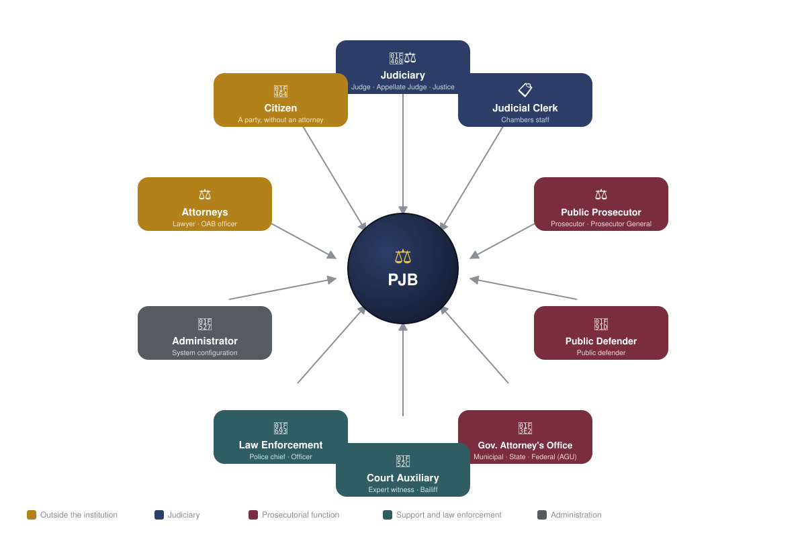
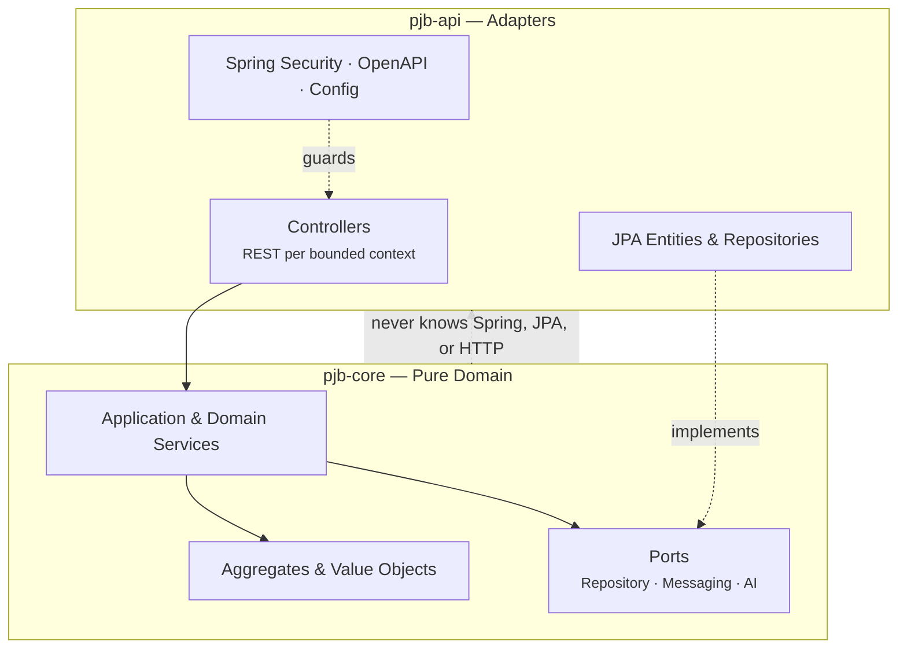

<div align="center">

# ⚖️ PJB — Brazilian Judicial Platform

### A next-generation electronic judicial system, designed to fully replace PJe, e-SAJ, eProc, Creta, and Projudi across every segment of the Brazilian justice system


**[🇬🇧 English (this file)](./README.en.md)** · **[🇧🇷 Português](./README.md)** · **[📓 Interactive Visual Guide](docs/product/INTERACTIVE_VISUAL_GUIDE.md)**

</div>

---

## Quick Navigation

**Quick Start**
- [About the Project](#about-the-project)
- [The Problem](#the-problem)
- [The Proposal](#the-proposal)
- [Glossary](#glossary)
- [Interactive Visual Guide](#interactive-visual-guide)
- [Prerequisites](#prerequisites)
- [Installation & Setup](#installation--setup)
- [Running the Application](#running-the-application)
- [Tests](#tests)
- [API Documentation](#api-documentation)

**Architecture & Domain**
- [Domain](#domain)
- [Architecture](#architecture)
- [Tech Stack](#tech-stack)
- [Functional Modules](#functional-modules)
- [Smart Accelerators](#smart-accelerators)
- [Procedural Types Covered](#procedural-types-covered)

**Infrastructure & Quality**
- [Security & Compliance](#security--compliance)
- [Concurrency and Async Execution](#concurrency-and-async-execution)
- [Scalability and Operational Resilience](#scalability-and-operational-resilience)
- [Database](#database)
- [Code Quality](#code-quality)
- [Observability](#observability)
- [National Replacement](#national-replacement)

**Contribution & Project**
- [Contributing](#contributing)
- [Safe Git Sync](#safe-git-sync)
- [Next Steps](#next-steps)
- [Author](#author)
- [License](#license)

[⬆ Back to top](#quick-navigation)

---

## About the Project

PJB is a total-replacement platform — not an incremental patch — for the electronic judicial systems currently running in Brazil. Five systems were built over decades by different entities, with no coordination of protocol, data model, or interface. Today, this fractured infrastructure supports more than **80 million active cases**, **91 courts**, and **approximately 30,000 judges**, alongside tens of millions of lawyers, litigants, and court staff — and none of those systems were designed to talk to each other.

PJB was built from scratch to solve this problem properly. It is not a wrapper around legacy systems. It is a deliberate break from that model: domain modeled from the Brazilian Civil Procedure Code (CPC/2015), labor reforms, and current criminal legislation; attribute-based access control with row-level security at the database; an immutable audit trail on every action; and Java 21 Virtual Threads to scale without the cost of managing manual thread pools.

[⬆ Back to top](#quick-navigation)

---

## The Problem

| System | Primary Court | Core Issue |
|--------|--------------|-----------|
| PJe | CNJ / most courts | Tight coupling between UI and domain; routes without contracts |
| e-SAJ | TJSP, TJBA, other state courts | Proprietary data model; no public API |
| eProc | TRF1, TRF4, state courts | Isolated jobs; fragile digital signatures |
| Creta | Labor Justice | Low observability; no support for new procedural types |
| Projudi | Smaller state courts | Critical technical debt; no migration path |

None of the five were designed for horizontal scalability, granular access auditing, or complete support for all procedural classes under the CPC/2015 and labor reforms. PJB does not attempt to rewrite them. It replaces the entire model.

[⬆ Back to top](#quick-navigation)

---

## The Proposal

PJB was designed from scratch around three non-negotiable commitments:

**1. Total traceability.** Every decision involving access, distribution, movement, or communication produces an auditable, immutable, and explainable trail. There is no action in the system that cannot be reconstructed — who did it, when, under what authority, and what the effect was.

**2. Testability as acceptance criteria.** No feature exists without verifiable behavior. The test suite is the system's executable contract — if the test passes, the behavior is guaranteed. A feature without a test is not a feature: it is intent.

**3. Security by construction.** ABAC, per-operation RLS, governed propagation of confidential context, and Step-up Gov.br are not layers added afterward. They are constraints that guide every architectural decision from the start — before the first endpoint, before the first migration, before the first line of domain code.

[⬆ Back to top](#quick-navigation)

---

## Glossary

> Legal and technical terms used from here on — useful if you don't come from a software engineering background.

| Term | Meaning |
|------|---------|
| **NPU** | Unique Process Number — CNJ standardized identifier (e.g., 0000001-00.2024.8.26.0001) |
| **Rito** | Mandatory procedural flow defined by law (ordinary, abbreviated, small claims, etc.) |
| **Autuação** | Act of formally registering the case in the system, with class, subject, and parties |
| **Distribuição** | Assignment of the case to a competent court or judge |
| **Movimentação** | Any act performed on the case (ruling, decision, judgment, certificate) |
| **GIGS** | Activity Group — a set of procedural tasks with a deadline and responsible party |
| **Sobrestamento** | Temporary suspension of the case awaiting a paradigm ruling |
| **BATNA** | Best Alternative to a Negotiated Agreement |
| **ABAC** | Attribute-Based Access Control |
| **RLS** | Row Level Security — security policy applied at the database level |
| **ADR** | Architecture Decision Record — formal record of an architectural decision |
| **ICP-Brasil** | Brazilian Public Key Infrastructure — digital signature standard |
| **Gov.br** | Federal authentication system with bronze, silver, and gold trust levels |
| **PDPJ** | Digital Platform of the Judiciary — national integration bus |
| **MNI** | National Interoperability Model — exchange protocol between judicial systems |
| **CNJ** | National Council of Justice — regulatory body that defines classes, subjects, and tables |
| **JEC** | Civil Small Claims Court |
| **JEF** | Federal Small Claims Court |
| **JEFP** | Public Treasury Small Claims Court |
| **BO** | Boletim de Ocorrência — Police Occurrence Report |
| **SBOM** | Software Bill of Materials — auditable dependency inventory |
| **CPF** | Brazilian individual taxpayer identification number |
| **CNPJ** | Brazilian corporate taxpayer identification number |

[⬆ Back to top](#quick-navigation)

---

## Interactive Visual Guide

Prefer to understand PJB through diagrams before touching any code? The **[📓 Interactive Visual Guide](docs/product/INTERACTIVE_VISUAL_GUIDE.md)** is where that lives — with real images and diagrams, not just text:

<div align="center">



*Preview: who enters PJB, and how — the full guide also breaks down what differs between a trial judge, an appellate judge, and a justice*

</div>

In the full guide you'll find:

- **who enters PJB and how each profile authenticates** — citizens, attorneys, the judiciary (with the trial judge × appellate judge × justice breakdown), the Public Prosecutor's Office, the Public Defender's Office, government attorneys, expert witnesses, and more;
- the step-by-step of how a lawsuit gets filed, from petition to case number;
- how the smart intake engine screens every petition before it becomes a case (and why it is **not** Laiane);
- the **judicial calculator** with a real worked input-and-output example — every item calculated, with the law behind it;
- the **settlement bench** with the full BATNA report — the amount in discussion, each side's cost, likelihood of appeal;
- **Laiane**, the project's legal artificial intelligence — what she does for each role, the safeguards that guarantee she never decides on her own, and the tribute behind her name.

This content lives deliberately outside this README — here the focus is technical documentation; there, the focus is understanding how the system behaves without reading Java.

[⬆ Back to top](#quick-navigation)

---

## Prerequisites

Before cloning and running the project, make sure you have the following installed:

| Tool | Minimum Version | Purpose |
|------|----------------|---------|
| **JDK** | 21 | Compilation and execution (Virtual Threads required) |
| **Maven** | 3.9+ | Multi-module build (`pjb-core` + `pjb-api`) |
| **Docker** | 24+ | PostgreSQL, Kafka, Redis, Elasticsearch via Compose |
| **Docker Compose** | v2 (plugin) | Local infrastructure orchestration |
| **Python** | 3.10+ | Structural guards in `scripts/` |

> **Recommended IDE:** IntelliJ IDEA 2024+ with the Checkstyle and SonarLint plugins active. The project uses Java 21 records, sealed classes, and pattern matching — older IDE versions may not recognize the full syntax.

[⬆ Back to top](#quick-navigation)

---

## Installation & Setup

### 1. Clone the Repository

```bash
git clone https://github.com/tiagorabelo0403/pjb-tcc.git
cd pjb-tcc
```

### 2. Configure Environment Variables

```bash
cp .env.example .env
```

Open `.env` and fill in the required variables:

| Variable | Description | Example |
|----------|-------------|---------|
| `PJB_PG_HOST` | PostgreSQL host | `localhost` |
| `PJB_PG_PORT` | PostgreSQL port | `5432` |
| `PJB_PG_PASSWORD` | Database password | `pgpassword` |
| `PJB_MASTER_KEY_BASE64` | Master encryption key (Base64, 32 bytes) | generated by script |
| `PJB_ANTHROPIC_API_KEY` | Anthropic API key for AI modules | `sk-ant-...` |
| `PJB_KAFKA_BOOTSTRAP` | Kafka broker address | `localhost:9092` |

> For demo environments, `.env.example` already contains working values that `demo.sh` / `demo.cmd` uses automatically.

### 3. Start Infrastructure

```bash
docker compose up -d
```

This starts PostgreSQL 17, Apache Kafka 3.8, Redis 7.4, and Elasticsearch 8.15. Flyway migrations (numbered up to V331) are applied automatically on the first backend connection.

### 4. Check Spring Profiles

The project uses separate Spring Boot profiles per environment. The base file is `application.yml`; each profile overrides only what changes:

| Profile | File | When to Use |
|---------|------|------------|
| `dev` | `application-dev.yml` | Local development with infrastructure in Docker |
| `local` | `application-local.yml` | Database and services running directly on the host |
| `docker` | `application-docker.yml` | Backend inside a Docker container |
| `prod` | `application-prod.yml` | Production — requires all environment variables |
| `k8s` | `application-k8s.yml` | Kubernetes |

For local development, the `dev` profile is recommended. It is activated automatically by `demo.sh` / `demo.cmd`. To activate manually:

```bash
# Via Maven
./mvnw spring-boot:run -pl pjb-api -Dspring-boot.run.profiles=dev

# Via environment variable
export SPRING_PROFILES_ACTIVE=dev
java -jar pjb-api/target/pjb-api.jar
```

### 5. Build

```bash
# Build the domain module
./mvnw install -pl pjb-core -DskipTests

# Build the API module (includes test class generation)
./mvnw test-compile -pl pjb-api
```

[⬆ Back to top](#quick-navigation)

---

## Running the Application

### Full Quickstart (Recommended)

The demo script does everything in sequence: copies `.env`, compiles, starts infrastructure, applies migrations, and waits for the backend to become healthy.

```bash
# Linux / macOS
bash demo.sh

# Windows
demo.cmd
```

### Run Backend Only (Infrastructure Already Running)

```bash
# Via Maven Wrapper (recommended for development)
./mvnw spring-boot:run -pl pjb-api

# Via packaged JAR
./mvnw package -pl pjb-api -DskipTests
java -jar pjb-api/target/pjb-api.jar
```

### Full Stack via Docker (Build + Infrastructure Together)

```bash
docker compose --profile app up -d --build
```

The `backend` service is in the `app` profile. Without it, Compose only starts the supporting infrastructure. If port `5432` is already in use locally, set `PJB_PG_PORT=5433` in `.env` — the backend in Docker continues accessing `postgres:5432` via the internal Compose network.

### JVM in a container — anti-`killed` (OOM) recipe

A miscalibrated Java container is the classic recipe for a silent `killed`: the JVM sees the host's RAM, allocates a heap that's too large, and the container kernel kills the process for exceeding the memory limit — no stack trace, no dump, just a silent exit. `pjb-runtime.sh` (the image's entrypoint) solves this automatically by computing JVM flags from the cgroup limits themselves:

- Detects the container's memory limit (`/sys/fs/cgroup/memory.max` on v2, `memory.limit_in_bytes` on v1) and CPU limit (`cpu.max` or `cpu.cfs_quota_us`) instead of trusting the host's view.
- Reserves native memory proportional to container size (34% for 512Mi–1Gi, 30% for 2Gi, 26% for 4Gi, 24% for ≥8Gi) — because metaspace + direct memory + code cache + native stacks are not heap and need room.
- `MaxRAMPercentage`, `InitialRAMPercentage`, `MaxMetaspaceSize`, `MaxDirectMemorySize`, `ReservedCodeCacheSize` scale by size band — nothing is hardcoded to a single profile.
- `-XX:+UseContainerSupport -XX:+ExitOnOutOfMemoryError -XX:+HeapDumpOnOutOfMemoryError` ensure any real OOM produces a dump and the container exits cleanly (not a zombie), with configurable `HeapDumpPath`.
- GC log and JFR are opt-in via env (`PJB_JVM_GC_LOG_ENABLED`, `PJB_JVM_JFR_ENABLED`) — zero cost when disabled.
- Three profiles via `PJB_JVM_PROFILE`: `balanced` (G1GC, default), `latency` (ZGC generational), `startup` (G1GC + dedup).

The decision table is locked by a dedicated Python guard (`scripts/pjb_runtime_memory_recipe_guard.py`) that executes the real bash functions in isolation with simulated limits (512Mi/1Gi/2Gi/4Gi/8Gi/16Gi) and fails if any value diverges — any change to the formula must be intentional.

### Available Endpoints

| Endpoint | Description |
|----------|-------------|
| `http://localhost:8080/livez` | Liveness check |
| `http://localhost:8080/demo/status` | Real-time statistics |
| `http://localhost:8080/swagger-ui/index.html` | Interactive API documentation |
| `http://localhost:8080/v3/api-docs` | OpenAPI 3.1 specification (JSON) |
| `http://localhost:8080/actuator/health` | Full health check |
| `http://localhost:8080/actuator/metrics` | Micrometer metrics |

With the `docker` profile, the system automatically seeds demo users and cases so data appears immediately.

**To stop:**
```bash
docker compose down
```

[⬆ Back to top](#quick-navigation)

---

## Tests

The project has two test levels with very different characteristics:

- **Unit tests (Surefire):** 4,989 tests with Mockito and in-memory H2. Fast, no Docker required.
- **Integration tests (Failsafe):** 306 tests against real PostgreSQL and Kafka via Testcontainers. Requires Docker. Slower.

### Run Unit Tests Only (fast)

```bash
./mvnw test -pl pjb-api
```

Expected time: **~14 min** on local hardware. Does not require Docker.

### Run the Full Suite Including Integration Tests (official gate)

```bash
./mvnw verify -pl pjb-api
```

This is the official project gate. It runs the 4,989 unit tests (Surefire) and then the 306 integration tests (Failsafe) against real PostgreSQL 17 and Kafka containers. Testcontainers handles container lifecycle automatically — no manual setup needed.

Expected time: **~50 min** on local hardware. Most of this time is the Spring context boot with Testcontainers and the IT tests that perform real HTTP requests against the running server. A full verify produces a complete diagnostic of every failure cluster in the suite — if you are investigating a problem, this is the number that matters, not the `test` output alone.

> **Why so slow?** Each IT class boots a full Spring context with a real PostgreSQL, applies the Flyway migrations, and executes requests the way an external client would. That gives full confidence that what passed in test will pass in production — but it costs time.

The Surefire/Failsafe `argLine` sets `-Dpjb.runtime.lifecycle.drain-quiet-period=10ms`. The graceful drain coordinator (`PjbRuntimeDrainCoordinator`) sleeps 20s by default on every Spring context close — correct in production, where there is real traffic to drain before shutdown, but pure waste in a test JVM. Without this override, a full `verify` run can exceed Surefire's own 30s fork-exit watchdog (`forkedProcessExitTimeoutInSeconds`) and force-kill the forked JVM at teardown, even with every test already green — a symptom that only shows up on long full-suite runs, never in an isolated class.

### If `test`/`verify` starts "dropping" for no apparent reason

If test runs start getting killed right at the start (or the build turns slow and flaky), the cause is almost always an **orphaned test JVM**: when a `mvnw` run is interrupted abruptly, the forked Surefire/Failsafe JVM (`-Xmx4g`) can survive with no parent process to reap it and pile up until it starves the machine's memory, killing subsequent runs. It is not a misconfigured JVM flag — it is a zombie process. A dedicated guard detects and clears it:

```bash
python scripts/reap_orphan_test_jvms.py         # list orphaned test JVMs (report-only)
python scripts/reap_orphan_test_jvms.py --kill  # terminate the orphans and free memory
```

Cross-platform (Windows/Linux/macOS), stdlib only. Report-only by default (exits non-zero if orphans are found — useful as a CI signal); `--kill` reaps them. It is not wired into the build automatically — run it when you notice instability, before a long run.

### Run a Specific Test with Full Stack Trace

```bash
./mvnw test -pl pjb-api -Dtest=TestClassName -DtrimStackTrace=false
```

### Current Metrics

| Metric | Phase | Value |
|--------|-------|-------|
| Total unit tests | Surefire | **4,989** |
| Unit test failures | Surefire | **0** |
| Skipped | Surefire | 5 |
| Unit test execution time | Surefire | **~14 min** |
| Total integration tests | Failsafe | **306** ¹ |
| Polo-composition-engine tests | Failsafe | **+10 green** (role by procedural type: ACUSACAO, RECLAMANTE, IMPETRANTE, SEGURADO…) |
| IT failures | Failsafe | **0** (0E + 0F) |
| Full verify execution time | Surefire + Failsafe | **~50 min** |

The integration suite went through a structural stabilization process: failures caused by incorrect environment variables, cross-test data contamination, and hardcoded IDs without seeding were eliminated down to zero. Two of those fixes exposed real production bugs, not just test issues: `AuditLedgerService` recorded audit events only in memory, without persisting to the repository the audit endpoints actually query; and root-proceeding resolution in `CaseContinuityOrchestratorService` used a mutable field during the case lifecycle, causing ambiguity between the root proceeding and its branches (e.g., judgment enforcement) after archiving.

The default `verify` (Failsafe) does not reach 13 test methods spread across 6 classes¹ that combine the `*Test.java` naming convention with `@Tag("integration")` — Surefire excludes these classes by tag and Failsafe does not recognize them by file pattern. All 13 have already been confirmed green individually via `-Dit.test=`, but stay outside the routine `verify` count.

The history of technical decisions, known technical debt, and closure criteria for each workstream is documented in [`docs/quality/DEBT_LOG.md`](./docs/quality/DEBT_LOG.md) and the [ADRs](./docs/adr/).

¹ `OabLegitimidadePeticionamentoTest`, `PjbFluxoJudicialCompletoE2ETest`, `DistribuicaoProcessoProtocoladoTest`, `ConsultaPublicaProcessoProtocoladoTest`, `ApiMarketplaceServicePoloMaterializacaoTest`, `ApiMarketplaceServiceCompletudeDocumentalTest`. Note: `-Dit.test=` only takes effect under the `integration-test`/`verify` goals — under the `test` goal it is silently ignored and Surefire runs the entire unit suite.

### Coverage Report (JaCoCo)

```bash
./mvnw test -pl pjb-api
# Report generated at:
# pjb-api/target/site/jacoco/index.html
```

[⬆ Back to top](#quick-navigation)

---

## API Documentation

PJB exposes complete interactive documentation via **Swagger UI**, available after starting the backend:

```
http://localhost:8080/swagger-ui/index.html
```

The OpenAPI 3.1 specification is available at:

```
http://localhost:8080/v3/api-docs
```

Versioned contracts are also documented statically in:

```
docs/openapi/
```

Every REST route is registered in the canonical bounded context registry. The `PjbOpenApiContractWeaknessDetectorTest` automatically validates that no route exists without a registered OpenAPI contract, no field uses `Map<String,Object>` without a typed schema, and all dates follow `format: date-time`.

[⬆ Back to top](#quick-navigation)

---

## Domain

### Actors

| Actor | Role in the System |
|-------|-------------------|
| **Judge** | Issues decisions, signs documents, manages their docket |
| **Court Clerk** | Performs clerical acts, issues certificates, moves cases |
| **Lawyer / Public Defender** | Files petitions, tracks deadlines, accesses records per confidentiality rules |
| **Prosecutor / Attorney General** | Acts on cases within their jurisdiction and instance |
| **Party / Litigant** | Accesses what the law allows, without identifying the judge |
| **Institutional Administrator** | Configures courts, jurisdictions, calendars, and access |
| **External System** | PJe, e-SAJ, eProc, MNI, PDPJ — integrated via canonical envelope |

### Core Domain Concepts

**Judicial case** is the root aggregate. It has an NPU (Unique Process Number), CNJ procedural class, subject, case value, procedural type, parties, representatives, and movements. Each case exists within a jurisdiction with defined subject-matter and territorial competence.

**Procedural type** defines the mandatory flow: which phases exist, which deadlines apply, which acts are possible in each phase. The catalog is sealed — no procedural type can be invented at runtime. This prevents the system from accepting invalid configurations.

**Distribution** is the act of assigning a case to a court. The distribution engine evaluates nature, competence, procedural type, district, unit workload, and court rules. Each distribution decision produces an auditable explanation with all evaluated criteria.

**Movement** is any act on the case: ruling, interlocutory decision, judgment, decree, certificate, order. Each movement has an author, timestamp, integrity hash, and link to the corresponding procedural act.

**Confidentiality** is a cross-cutting dimension. A confidential case restricts visibility down to the database record level via Row Level Security. Confidentiality propagation in asynchronous operations is governed — never leaked.

**Jurisdiction** is the structural unit of competence: a court, a chamber, a judicial section. It has degree, sphere, nature, subject-matter competence, and territorial scope. The jurisdiction hierarchy models all segments: federal, state, labor, electoral, military.

### Bounded Contexts

| Context | Responsibility |
|---------|---------------|
| `institucional` | Organizations, courts, assignments, competencies, affiliations, credentials |
| `processo` | Case, movements, parties, deadlines, distribution |
| `documentos` | Documents, dossier, chain of custody, signatures |
| `comunicacao` | Orders, certificates, electronic domicile, notifications |
| `seguranca` | ABAC, authentication, audit, confidentiality, Gov.br, ICP-Brasil |
| `criminal` | Occurrence reports, police investigations, institutional precincts, hierarchical police scope |
| `analytics` | Process mining, bottlenecks, Justice in Numbers reports |
| `ia` | Auditable legal AI, Memory Stores, Dreams, reflective synthesis |
| `integracao` | Canonical PDPJ/MNI envelope, PJe/e-SAJ/eProc normalizers |
| `advocacia` | Law firm, delegations, signature queues, workspace |
| `laiane` | Specialized legal assistance module via AI |

[⬆ Back to top](#quick-navigation)

---

## Architecture

### Module Structure

The project follows hexagonal architecture with strict separation between domain and infrastructure:

```
pjb/
├── pjb-core/                         pure domain — zero Spring dependency
│   └── src/main/java/
│       └── com/tcc/pjb/core/
│           ├── domain/               aggregates, entities, value objects
│           ├── service/              application services and domain services
│           ├── port/                 output interfaces (repository, messaging)
│           └── ia/                   legal AI ports
│
├── pjb-api/                          adapters — Spring Boot, JPA, HTTP
│   └── src/main/java/
│       └── com/tcc/pjb/backend/
│           ├── controller/           REST endpoints per bounded context
│           ├── model/entity/         JPA entities
│           ├── model/repository/     Spring Data repositories
│           ├── core/                 application and domain services
│           ├── configs/              Spring, Security, OpenAPI, DataSource
│           └── modules/              specialized modules (laiane, advocacia)
│
├── docs/
│   ├── adr/                          57 Architecture Decision Records
│   ├── database/                     schemas and RLS policies
│   ├── openapi/                      public API contracts
│   ├── security/                     LGPD and Gov.br policies
│   └── product/                      national replacement matrix
│
├── scripts/                          Python guards — continuous structural hygiene
├── config/                           Checkstyle and SpotBugs
└── infra/                            Kubernetes, gateway, infrastructure
```

### Layers and Dependencies



`pjb-core` has no knowledge of Spring, JPA, or HTTP — the dependency arrow always points inward, never the other way around. All injection is constructor-based, using `@Inject` (Jakarta). Repositories are port interfaces defined in `pjb-core`; their JPA implementations live in `pjb-api`.

### Applied Architectural Patterns

| Pattern | Where | Why |
|---------|-------|-----|
| Hexagonal (Ports & Adapters) | Global structure | Isolate domain from infrastructure |
| Aggregate Pattern (DDD) | `Processo`, `Jurisdicao`, `Usuario` | Domain invariants enforced at the aggregate boundary |
| Outbox Pattern | Post-commit effects | Zero event loss on transaction failure |
| Lightweight CQRS | Analytics and projections | Materialized reads without write-path pressure |
| Sealed Classes | `RitoProcessual`, `TipoJurisdicao` | Closed catalog; exhaustiveness checked at compile time |
| Virtual Threads (Java 21) | All async execution | High concurrency without manual pool sizing |
| Scoped Values (Java 21) | Confidentiality propagation | Confidential context never leaks across Virtual Threads |
| Structured Concurrency | Multi-type operations | Child failure cancels siblings; no resource leak |

[⬆ Back to top](#quick-navigation)

---

## Tech Stack

| Component | Technology |
|-----------|-----------|
| Language | Java 21 — Virtual Threads, Records, Sealed Interfaces, Pattern Matching |
| Framework | Spring Boot 3.5, Spring Framework 6 |
| Build | Maven multi-module (`pjb-core` + `pjb-api`) |
| Database | PostgreSQL 17 with Row Level Security per operation |
| Test Database | In-memory H2 + Testcontainers |
| Migrations | Flyway — numbered up to V331, with monthly partitioning on event tables |
| Persistence | JPA / Hibernate with `ddl-auto: validate` in production |
| Messaging | Apache Kafka 3.8 — judicial events and outbox |
| Workflow orchestration | Camunda 8 / Zeebe — BPMN applied to the filing workflow |
| Cache | Redis 7.4 |
| Search | Elasticsearch 8.15 |
| Security | Spring Security, ABAC, Gov.br, ICP-Brasil, Passkey/WebAuthn |
| Resilience | Resilience4j — Auditable Circuit Breaker, Bulkhead, Retry, Timeout |
| Contracts | Pact — Consumer-Driven Contract Testing |
| Legal AI | Anthropic Claude API — Memory Stores, Dreams, reflective synthesis |
| Observability | Micrometer, Spring Actuator, materialized Process Mining |
| Static Analysis | Qodana (JetBrains), JaCoCo, Checkstyle, SpotBugs, ArchUnit |
| Structural Guards | 7 Python scripts + ArchUnit integrated into CI |
| Containerization | Docker Compose (dev/test), Kubernetes (production) |

[⬆ Back to top](#quick-navigation)

---

## Functional Modules

The backend is organized into 15 functional modules. Click any module below to expand its details.

<details>
<summary><strong>1 — Institutional Governance</strong></summary>
<br>

Manages role, assignment, location, competence, and visibility of each actor in the case. The visibility matrix produces an auditable explanation for every access decision — who can see what, for what reason, with an immutable record.

Includes management of affiliations, institutional credentials, official source attestation, and formal delegations between units.
</details>

<details>
<summary><strong>2 — Procedural Engine and Intelligent Distribution</strong></summary>
<br>

Distributes cases by nature, competence, procedural type, and district. Supports single courts, small-town districts, itinerant Small Claims Courts, and any tribunal configuration. The explainable engine documents every criterion evaluated in the distribution decision — no distribution is a black box.

Territorial competence is a property of the procedural type (`CriterioTerritorial` maps CPC art. 47/48/53-II, CLT art. 651, and CPP art. 70) — a procedural type without a verified criterion returns an explicit absence; it never assumes the defendant's domicile by default. The `tb_jurisdicao_territorial` catalog resolves the municipality (by IBGE code) to the competent unit(s) via `CompetenciaTerritorialResolver`, with temporal-overlap exclusion guaranteed by the schema itself (a PostgreSQL `EXCLUDE` constraint, not application-level validation) and native support for municipalities with concurrent competence across courts — Belo Horizonte has 48 concurrent labor courts in a single catalog row, Fortaleza has 18, and Natal has 13.

Three Labor Justice regions were loaded with real data, extracted from an official TST PDF and cross-checked against the IBGE locality API — not as national coverage, but as a demonstration that the engine works end to end without a schema redesign between regions:

| Region | Municipalities | Units (courts) | Municipality-court pairs | Source |
|--------|-----------|-------------------|----------------------|-------|
| TRT7 — Ceará | 184 | 37 | 288 | `End07.pdf` |
| TRT3 — Minas Gerais | 847 | 155 | 1,498 | `End03.pdf` |
| TRT21 — Rio Grande do Norte | 129 | 20 | 411 | `End21.pdf` |
| **Total** | **1,160** | **212** | **2,197** | — |

Each load matched the municipality name from the PDF against the official IBGE list by 7-digit code and state — never by name alone. Cross-state homonyms are real and were proven, not hypothesized: São Gonçalo do Amarante (RN and CE) and Ouro Branco (RN and MG) resolve to different courts from the same name in dedicated tests — it is the IBGE code that guarantees correct resolution, not the name text. Spelling divergences between the PDF and the official registry (accents, hyphens, swapped "de/do/dos", and one popular name IBGE never formalized — Boa Saúde, registered since 1953 as Januário Cicco) were resolved by a single confirmed match against each state's full list, never by approximation; a name that did not match was left out and is documented.

`vigencia_inicio` uses a presumed date (the 1988 Constitution's promulgation) for continuity across all three regions — a decision kept even where the source document carried a real per-court installation date (the TRT3/MG case, with Belo Horizonte courts installed between 1941 and 2013), because the current schema only supports one `vigencia_inicio` per municipality row, not per individual court (`D-vigencia-trt7-e-futuras-regioes-presumida-nao-documentada`, `docs/quality/DEBT_LOG.md`). Two recurring inconsistencies in the TST's primary source were recorded as debt instead of being silently worked around: duplicate court codes between physically distinct units (3 pairs in MG, 3 pairs in RN, for different reasons in each region — `D-trt3-codigo-unidade-duplicado-fonte`) and municipalities with no documented court (6 in MG, likely delegated to the district's judge; 38 in RN covered by an Advanced Post with no formally assigned code — `D-trt3-municipios-sem-vara-competencia-delegada`, `D-trt21-posto-avancado-sem-codigo`).

Each of the three loads is locked by a permanent regression test against the source document — the municipality-to-court distribution is re-parsed independently of the script that generated the migration before it becomes an `assert`, so that a future migration change, or a migration from another region that accidentally corrupts data via a table-name mistake, gets caught rather than silently accepted.

**Court and district as real entities.** `Tribunal` and `Comarca` are proper JPA entities (`model/entity/competencia/`), no longer loose text — `UnidadeJudiciariaCompetencia`, `JurisdicaoTerritorial`, `Jurisdicao`, `Usuario`, `Processo`, `WorkItem`, `OrgaoJudiciario`, `PeritoSorteioAudit`, and `PeritoDisponibilidade` reference `Comarca` by foreign key. Since the `Comarca` catalog currently only covers the municipalities from the three Labor Justice regions loaded above (CE/MG/RN), each of these nine entities keeps `uf`/`comarca` as a real String column alongside the FK — no data is ever discarded for lack of catalog coverage: the FK resolves when the municipality is catalogued, and the text remains the source of truth everywhere else. `AssessorGabineteGuardRailService.territoryMatches()` compares by real identity (`Comarca.getId()`) when both sides resolve the FK, and falls back to normalized text comparison otherwise — eliminating, for already-catalogued municipalities, the bug class where a spelling divergence between an assessor's registration and a case's registration could produce a false positive or false negative territorial match. An architecture test (`OrganizacaoJudiciariaArchitectureTest`) locks in the pattern for any new entity that declares `uf`/`comarca` as a String without the matching `Comarca` FK in the same class; pre-existing entities in other domains that don't yet follow this pattern are listed in `docs/quality/DEBT_LOG.md` (`D-territorio-string-solta-entidades-legadas`).

**Procedural-type urgency engine.** `RitoUrgenciaPriorityPolicy` classifies every procedural type into one of three tiers on real legal grounds, never an arbitrary call: habeas corpus and Maria da Penha cases sit at maximum urgency (Constitution art. 5, LXVIII; Law 11.340/06 arts. 18 and 22), emergency relief and juvenile-offense proceedings under the ECA sit at high urgency (CPC art. 300; ECA art. 108), everything else at standard priority. The tier translates into `WorkItem` priority — the policy only escalates, never de-escalates a priority already set higher by another source — and into the same tags consumed by the clerk's-office queue (`SecretariatQueuePriorityPolicy`) and by the Public Prosecutor's Office and Public Defender's Office panels: one single engine feeds all four consumers, with no urgency signal computed differently per channel.
</details>

<details>
<summary><strong>3 — Constitutional Timeliness Engine</strong></summary>
<br>

Monitors constitutional deadlines by procedural type, calculates systemic bottlenecks, and suggests accelerators by area of law. It does not pressure individual judges — it identifies where the system is slow and why, using aggregated, anonymized data.
</details>

<details>
<summary><strong>4 — Internal Panel and Clerical Registry</strong></summary>
<br>

Intelligent queues with semantic prioritization, similarity groupings, batch signing with mandatory verification, and a SHA-256 hash per document. Every clerical act carries full traceability: who did it, when, with what result, and what state the case was in at the time.
</details>

<details>
<summary><strong>5 — Area-Specific Legal Accelerators</strong></summary>
<br>

Specialized workflows for civil, criminal, labor, electoral, family, enforcement, Small Claims Courts (civil, federal, and public-treasury), bankruptcy, and concentrated constitutionality review. Each area has a computable checklist, a risk diagnosis, and a suggested next act.
</details>

<details>
<summary><strong>6 — Smart Tags and Conciliation</strong></summary>
<br>

Semantic case markers drive automatic prioritization by urgency, complexity, and settlement probability. The conciliation module suggests settlements based on similar precedents, complete with a probability score, a calculated BATNA, and a proposal history.
</details>

<details>
<summary><strong>7 — Documents, Dossier, and Chain of Custody</strong></summary>
<br>

Each document has origin, operational state, integrity hash, and a verifiable chain of trust. The documentary dossier consolidates all artifacts of a case with complete traceability from creation to archiving.

**Qualified signature envelope** (`QualifiedDocumentSignatureEnvelopeService`):
- Computes three checks from the input certificate and the already-materialized envelope: `cadeiaCustodiaElegivel`, `assinaturaCompletaMaterializada`, `rubricaDataHoraLocalPresentes` — all three were hardcoded `true`, with no real verification, until they were fixed.
- `classificacaoContextualCoerente` compares the signer's role against the actual institutional segment in 12 of 14 callers (police clerks now recognized via `isSegurancaPublica()`); the 2 remaining callers still fall back to the permissive `true` default for lack of a mapping — a registered debt (`D-classificacao-contextual-default-permissivo`), not a silent regression.

**Document vocabulary** — canonical and sealed:
- `TipoDocumento` (~105 values) carries a `CategoriaDocumento` (`PECA_INAUGURAL`, `PECA_RECURSAL`, `DOC_INSTRUCAO`, `DOC_QUALIFICACAO`).
- A document-completeness gate by procedural type/class is being built on top of this vocabulary, replacing the attachment-count check with typed validation — design goal: a missing type is an explicit rejection, never a silent pass-through.

**HTTP boundary and typed channel:**
- The lawyer declares a `TipoDocumento` per attachment via `AnexoDeclarado { nomeArquivo, tipo }` in the filing multipart request.
- `SmartFileSplitter` validates the name ↔ declaration correlation (bidirectionally), with an explicit 400 in four cases: missing name, duplicate names, a file without a declaration, a declaration without a file.
- Declaring is optional — mandating it by procedural type is a decision for the completeness gate, not the boundary.
- `Attachment.tipoDocumento` propagates to the routing payload via `NationalProceduralProcessoEntityPayloadAssembler` (key `documentosTipados`), added only when at least one non-null type is present — an empty list never activates the channel for callers without a declaration.

**Party composition by procedural type** — filing does not force the civil mold onto every segment:
- The system reads the catalog by procedural type and materializes the correct role: `ACUSACAO`/`ACUSADO` in criminal cases, `RECLAMANTE`/`RECLAMADA` in labor cases, `IMPETRANTE`/`IMPETRADO` in writs of mandamus, `SEGURADO` in social-security cases (the INSS does not automatically become a party), `INVESTIGADO` in military inquiries.
- In habeas corpus, with no active/passive dichotomy, no party is created at all. Procedural types not yet covered keep a null composition until specified.
- `PoloProcessual` records the party's procedural domicile (`uf_domicilio`, `comarca_domicilio`, `municipio_domicilio`), kept separate from the routing territory (`tb_processo`).
- All four filing channels capture this domicile: REST and Laiane via `EstruturarRequest`, with the `enderecoReuDesconhecido` flag (same pattern as PJe); the marketplace via `MarketplaceProtocoloRequest`, same precedence rule; MNI via `MniXmlToProcessoAdapter.resolvePartes`, normalizing the state to a two-letter code and discarding invalid formats, never persisting raw garbage.
- County and municipality remain null only on the MNI channel, which has no equivalent schema element — a documented debt (`D-domicilio-parte-dois-canais-nao-populam`).
- A single engine (`PoloCompositionPolicy` + `PoloRoleMappingTable`) materializes the party across all four channels — no divergent path ever produces a generic label where the procedural type requires a specific role.

**Marketplace document completeness:**
- Of the three channels that create a case, only the marketplace did not check for required documents — it called `AjuizamentoService.ajuizar()` directly, bypassing the `CompletudeDocumentalPolicyService` that REST already used.
- When the check flags a pending item, the case is still created normally (system-to-system integration never blocks), but `connectorSubmissionStatus` records `PENDENTE_DOCUMENTACAO` and the response exposes `documentacaoCompleta`/`documentosFaltantes`.
- The hardcoded `COMUM_ORDINARIO` procedural type this channel carried was fixed alongside it, with `ProceduralCatalogSupport.tryResolveRito()` reading the payload. Full detail: `docs/quality/DEBT_LOG.md` (`D-marketplace-sem-completude-documental`).

**Per-actor persisted visual identity and resilient drafts:** the petition editor (a topic-by-topic blueprint that changes with the procedural type, with inline multimedia blocks and a visual-identity policy) already existed; what is new is the reusable letterhead profile — `PeticaoIdentidadeVisual` stores, per filing actor, a logo (in object storage, never a DB blob — same pattern as `tb_usuario_avatar`), display/institution name, free header and footer, and a color palette, applied automatically to every petition instead of being re-sent each session; `escopo`/`escopo_ref` columns already anticipate extending this to institutional identity (public defense by state, prosecution, attorney's offices, the judiciary, and expert witnesses) without touching the schema. Drafts gained resilient autosave: `PUT .../rascunhos/{id}/autosave` updates the draft in place (the last saved content survives a power or connection loss) and every real content change writes an immutable snapshot into `tb_peticao_draft_versao`, with hash-based dedup, retention of the last 30 versions, listing, and restore — all owner-isolated, with no one seeing another's draft.

**Governed rich-text formatting and anti-XSS sanitization:** the sealed `RichTextFormatCatalog` pins what the editor may offer — bold, italic, underline, strikethrough, headings, lists, tables, alignment, plus a curated set of fonts, sizes, and colors — modeled on the TipTap/ProseMirror JSON document (the MIT open-source editor adopted as the reference). Before saving/publishing, `RichTextDocumentSanitizer` validates the document against that catalog using Jackson alone (no new library): nodes, marks, and attributes outside the allowlist are removed, disallowed fonts/sizes/alignments are dropped, and link/image URLs with a dangerous scheme (`javascript:`, `data:`, `file:`) are blocked — the petition is seen by everyone in the case, so this is security, not cosmetics. The catalog is exposed in the editor blueprint (`richTextFormat`) and at `/api/v1/peticionamento/editor/formato`, so the toolbar offers exactly what is accepted. `.docx` export (Apache POI) and migrating the draft body from HTML to the validated JSON as the source of truth are recorded as next steps that depend on a dependency decision (`D-peticao-formato-docx-e-json-fonte`).

**Per-role institutional identity (judiciary, prosecution, public defense, attorney's offices):** `IdentidadeInstitucionalResolver` resolves, from the role (`TipoUsuario`) and the state, the correct office and nomenclature for each — "PODER JUDICIÁRIO / Tribunal de Justiça", "MINISTÉRIO PÚBLICO DO ESTADO DE {UF}", "DEFENSORIA PÚBLICA DA UNIÃO", "ADVOCACIA-GERAL DA UNIÃO" — without treating them alike: the coat of arms belongs to the **office**, not the individual, and the personal profile only adds text (name/chambers), never replacing the institutional letterhead. The **expert witness** is deliberately professional-individual (a report with no office coat of arms, carrying the correct council registration — CRM/CREA/CRC…), not institutional. Official coats of arms and colors are **never fabricated**: they come from the office's own **curation** (`/api/v1/peticionamento/identidade-visual/institucional/{escopoRef}`, admin-restricted) and, until they do, a **neutral default explicitly marked as replaceable** (`DEFAULT_PJB_SUBSTITUIVEL`) is used, never claimed as official. `usuario_id` became optional (V341) for the office profile, unique per `escopoRef`. Municipal attorney's offices **resolve down to the attorney's real municipality** (via county), not just the state. Curation is hardened in two layers by construction: the URL `escopoRef` is validated (format `A-Z0-9-` plus a known institutional family `PJ-/MP-/DP-/PROC-`) before it becomes an object-storage key — closing path traversal — and curation is gated at two independent points (`@PreAuthorize` `ROLE_ADMIN` at the HTTP boundary **and** an admin check in the service). Where the role can't determine the exact office without fabricating (which superior court a given minister sits on), the identity enters through that same official curation — a deliberate production decision, not a gap.

**A single typed contract for the frontend (`GET /api/v1/peticionamento/editor/bootstrap`):** one call returns, typed (records, no generic map), everything the editor needs to open for the current actor — the formatting catalog (`RichTextFormatoDto`), the already-resolved visual identity (`IdentidadeVisualEfetivaDto`, institutional + individual), and the draft (autosave/versions, retention, dedup) and media (logo limits, accepted types, validation/catalog URLs) endpoints and limits. Designed for typed-client generation — the frontend (TipTap) builds the editor from a single contract, without discovering endpoint by endpoint or hitting a typing gap.

<details>
<summary><strong>8 — Filing, Correction, and Metadata Quality</strong></summary>
<br>

Governed correction with a legal diff — every change goes through policy review, impact assessment, and explicit approval. The metadata-quality score detects missing classes, parties without documents, and incompatible procedural types before the case is allowed to advance.
</details>

<details>
<summary><strong>9 — Import and Normalization of External Cases</strong></summary>
<br>

Ingests cases from PJe, e-SAJ, eProc, Projudi, Creta, MNI, and PDPJ. Each external system has its own normalizer that standardizes the NPU, the CNJ procedural class, and the procedural type before persisting. Import conflicts are recorded with an auditable diff.

The MNI adapter (`intercomunicacao-2.2.2`, using the `polo`/`parte`/`pessoa` attributes from the CNJ's official schema) materializes the plaintiff and defendant of the imported case, including the full party record, through the same procedural-type composition engine used for direct filing — a case imported via MNI is no longer left without identified parties. The same adapter also extracts `movimento` (movement history, with the real date from the XML — never "now" at import time) and `documento` (binary content decoded from base64, re-ingested through the same validated confidentiality/storage/SHA-256-hash pipeline already used by the marketplace channel, never raw bytes written straight to the database). A document whose type cannot be resolved by keyword matching against the internal vocabulary (`TipoDocumento`, ~105 values with no generic fallback) is still kept with its content intact in a manual-classification queue — never classified blindly.

**Batch migration.** `MniMigrationBatchItem` (staging queue) and `MniBatchMigrationJobHandler` reuse the same `BackfillRun` framework already used for the client-canonicalization backfill: a resumable cursor, per-item transaction isolation (one malformed XML from a single case never brings down the rest of the batch or forces a full reprocess), and admin endpoints to enqueue/kick off/check status/list failures. The orchestrator does not remove the need for a real credential from the source court — `MniHttpClient` only supports sending (`enviarAutos`), with no active query against a remote MNI endpoint; pulling cases from a live PJe instance in production still depends on a query client that does not exist yet and on a credential issued by the source court, which is an operational dependency, not a code gap.
</details>

<details>
<summary><strong>10 — Court Orders, Certificates, and Resilient Communication</strong></summary>
<br>

Complete court-order management with return diagnostics and urgent-case prioritization. Automatic certificates with pending-item checklists and batch issuance. Electronic judicial domicile with exponential retry, a failure dashboard, and an auditable fallback path.
</details>

<details>
<summary><strong>11 — GIGS, Notes, Reminders, and Pending Items</strong></summary>
<br>

Procedural activities (GIGS) with governed execution, visibility controlled by confidentiality level and role, jurisdictional-act control, and automatic reminders for pending drafts. Notes and reminders follow a visibility policy based on role, assignment, and expiration deadline.
</details>

<details>
<summary><strong>12 — Auditable Legal AI</strong></summary>
<br>

AI operates as a support layer — it never replaces human decision-making. Every interaction passes through a pre-conscious framework that evaluates the area of law, doctrinal tradition, procedural risk, evidence provenance, and confidentiality classification before formulating any response.

**Memory Stores:** auditable document repositories that accumulate learning between sessions. Each write generates an immutable version with redact support for LGPD compliance. Confidential cases never have content sent to external services.

**Dreams:** asynchronous jobs that consolidate session transcripts, eliminate contradictions, and extract patterns by procedural type. They operate via outbox pattern with dedicated Virtual Threads and a configurable silence window.

**Process Completeness Gate:** verifies that the document package is complete before allowing the case to advance to the next phase. Validation has two layers: structural (configurable checklists per procedural type, with typed pending items and resolution deadlines) and semantic (OCR + VectorSearch detects the actual presence of required content in already-attached documents, not just the existence of the file). Pending items are notified via outbox with a traceable resolution cycle. The case does not advance while there is a completeness gap — and the clerk can override with a minimum auditable justification.

**Three-tier judicial decision advisory.** `advisoryMode` (`LaianeAdvisoryMode`) is derived from the same confidence signal the template engine already computes per case — never a user choice or an external setting: `SUGESTIVO` when a case pattern is recognized (settlement, withdrawal, acknowledgment of the claim, Maria da Penha protective order, health emergency relief) with no flagged fact gap, carrying a full draft order; `RESTRITIVO` when the same pattern is recognized but a relevant detail is missing from the case corpus (e.g., a settlement with no stated amount/deadline, a protective order with no described risk vector) — here the draft order is withheld (`dispositiveBase = null`), Laiane hands back only the checklist and legal grounds, forcing the judge to write the operative text; `BLOQUEADOR` when no case pattern is recognized at all — no draft order, assistance limited to the structuring checklist. In none of the three tiers do `reviewRequired`/`publicationLocked` stop being `true` — Laiane never decides or publishes, and that never varies by mode. The three mode names come from an earlier API doc that was never actually implemented (`D-advisory-modos-nao-implementados`); the real differentiation today reuses a confidence signal the service already computed and discarded, not a new heuristic invented for the occasion.
</details>

<details>
<summary><strong>13 — Reports and Analytics Without Punitive Rankings</strong></summary>
<br>

Bottleneck reports, average time per procedural type, rework rate, and conciliation rate, plus a *Justiça em Números* ("Justice in Numbers") export for the CNJ. No report identifies a judge by individual performance — the data exists to drive systemic improvement, never to pressure people.
</details>

<details>
<summary><strong>14 — PDPJ/MNI/API Integration Envelope</strong></summary>
<br>

A canonical `PjbIntegrationEventEnvelope` carrying a UUID, payload hash, routing key, and semantic version. Judicial events map to the canonical route `judicial.{system}.{type}.{procedural_type}`. Supports event emission and consumption with an at-least-once guarantee via the outbox pattern.
</details>

<details>
<summary><strong>15 — Criminal Module and Police Investigation</strong></summary>
<br>

The police precinct is modeled as a first-line institutional unit, with its own assignments, territorial competence, and shift schedule — not as a generic role, but as an entity with its own identity and hierarchy within the criminal bounded context.

Incident reports produce traceable investigations. Each report carries a classification, the parties involved, a document chain of custody, and an automatic link to the criminal case once formal charges are filed. The investigation follows the case from the police phase all the way through the judicial phase without any break in traceability.

Police-side scope is resolved by assignment, not by role. What a given officer sees and can act on is determined by the precinct they are assigned to. `DelegadoPainel` materializes exactly that restricted view, with no data exposure from any other unit. `WorkItemScopeGuard` enforces this restriction as a P0 control: any access to a work item outside the officer's assignment scope is blocked at the central guard, and ArchUnit verifies at build time that no code path can bypass it.

**Investigation intake with an automatic draft order.** When an investigation is forwarded to the judiciary, the system generates a draft reception order with the real procedure number and legal grounds (CPP art. 28, Law 13.964/2019) interpolated into the text — never a placeholder — leaving an explicit reserved space for the judge to complement or rewrite before signing; the draft is never published on its own. Registering the investigation blocks with an explicit message listing what's missing whenever the officer forgets the number, date, or signature, and requires the same ICP-Brasil digital-certificate challenge-response already used for certificate login — with no distinction between on-duty and regional precincts, or between civil and federal police.
</details>

[⬆ Back to top](#quick-navigation)

---

## Smart Accelerators

Ten services that cover gaps no Brazilian judicial system currently addresses systematically:

| # | Service | Capability |
|---|---------|-----------|
| 1 | `NulidadeProcessualRiskPolicy` | Preventive nullity diagnosis before any movement — checks notification, representation, confidentiality, deadline, and competence |
| 2 | `ProcessoParalisacaoDiagnosisService` | Identifies why a case is stalled: unacknowledged order, unsigned document, unassigned task, overdue pending item |
| 3 | `CivilSaneamentoChecklistService` | Computable settlement checklist: preliminary objections, disputed facts, evidence, burden of proof, summary judgment, and settlement probability |
| 4 | `SobrestamentoInteligenteService` | Automatically detects when the reason for suspension has ceased and notifies for resumption, without manual intervention |
| 5 | `ProcessoClusterSimilarityService` | Groups cases with the same party, claim, and procedural type — foundation for intelligent batch judgment and collective settlement |
| 6 | `PrecedenteAplicavelRadarService` | Flags repetitive precedents, suspended themes, or jurisprudential divergences before the decision — never decides, only informs |
| 7 | `ResponsavelWorkloadBalancer` | Suggests the responsible party by current workload and specialty with auditable justification — never imposes, always explains |
| 8 | `DomicilioJudicialResilienceService` | Exponential retry with backoff, persistent failure dashboard, and graceful fallback for electronic communication |
| 9 | `ArquivamentoPendenciaChecker` | Safety checklist for archiving: court fees, orders, deadlines, and documents — never archives automatically |
| 10 | `ProcessMiningMaterializedViewService` | Materialized tables updated in Virtual Threads — bottleneck by act, phase, procedural type, and asynchronous refresh integration |

### Vector store for legal RAG (pgvector)

`VectorSearchService` has three possible backends, selected by `pjb.ai.vector.mode`:

| Mode | When to use | Backend |
|------|-------------|---------|
| `disabled` (default) | No vector usage — returns empty result, no infra cost | None |
| `mock` | `dev`/`test` profiles — in-memory TF-IDF | No server |
| `pgvector` | Production — real semantic search | pgvector extension on the same Postgres |

`pgvector` mode reuses the Postgres already in Compose (image `pgvector/pgvector:pg17`, a drop-in replacement for `postgres:17` with the extension pre-compiled) — no dedicated vector database to maintain. Migration `V307__ai_vector_store_pgvector.sql` creates the `pjb_ai_vector_document` table with `embedding vector(1536)` (OpenAI's `text-embedding-3-small` dimension, already configured in `application-ai.yml`), an HNSW index with `vector_cosine_ops` (`m=16, ef_construction=64`), and a GIN index on `metadata jsonb` for filtering by arbitrary keys without a full scan.

The adapter (`VectorSearchServicePgVector`) uses the project's existing `EmbeddingService` — when the output vector's dimension differs from the column's, it is truncated/padded and renormalized, so swapping models does not break the schema. Filters in the `filtros` map become a `metadata @> ?::jsonb` clause; without filters, the WHERE is omitted. Score = `1 − cosine_distance` (same convention as the rest of the stack). A database failure returns a degraded result (`iaVersion=pgvector-error`) without throwing — the UI does not break because of vectors.

Coverage: `VectorSearchServicePgVectorTest` (8 tests with mocked `JdbcTemplate` — SQL, JSONB filter, score calculation, dimension truncation, default top-K, degraded-on-error). The migration was validated in isolation on the `pgvector/pgvector:pg17` image with `psql`: `CREATE EXTENSION`, all 4 indexes, insert, and query with `<=>` + `@>` all worked.

**Real ingest (not just search):** the same `pgvector` mode also swaps the `InMemoryCosineVectorIndex` (in-memory, LRU 20k, lost on every restart) for `PgVectorPersistentIndex` — a `VectorIndex` implementation that persists into the same `pjb_ai_vector_document` store. Wiring is `@ConditionalOnMissingBean(VectorIndex.class)` on the in-memory implementation and `@ConditionalOnProperty(mode=pgvector)` on the persistent one: without the flag, historical behavior stays untouched; with the flag, `SemanticPrecedentSearchService` gains real persistence, data shared across instances, and `bootstrapIfNeeded` (which already lazily populates the index from `PrecedenteRepository`) automatically becomes the ingest pipeline. Coverage: `PgVectorPersistentIndexTest` (8 unit, mocked `JdbcTemplate` — idempotent upsert with case-insensitive metadata normalization, `size()`, JSONB filter, dimension truncation) plus `PgVectorPersistentIndexIT` (4 IT, real Postgres via Testcontainers on the `pgvector/pgvector:pg17` image, migration V307 applied — proving `@ConditionalOnMissingBean` swaps the backend, that indexing 3 documents with orthogonal vectors produces the correct query ranking, that `metadata @> jsonb` really does filter, and that upsert with the same `doc_id` replaces the content instead of duplicating).

[⬆ Back to top](#quick-navigation)

---

## Procedural Types Covered

The `RitoProcessual` catalog is sealed. All procedural types below are first-class citizens — with their own validations, deadlines, and checklists:

**Civil:** ordinary procedure, summary procedure, monitorial, possessory, adverse possession, payment in court, class action, emergency relief, precautionary relief

**Family:** alimony, consensual and contested divorce, probate, inventory, adoption, guardianship, curatorship, paternity investigation, custody and visitation

**Criminal:** ordinary criminal procedure, summary, abbreviated, jury trial, habeas corpus, criminal enforcement, security measure

**Labor:** ordinary procedure, abbreviated, small-value track, enforcement of collective agreement, judgment enforcement, labor execution, workplace accident, labor mandamus, rescissory action, precautionary relief, collective bargaining dispute, inquiry for serious misconduct. Jus postulandi under CLT art. 791 is recognized in seven of these; excluded are the three covered by the express carve-out in TST Precedent 425 — rescissory action, mandamus, and precautionary relief — plus two on standing grounds: collective bargaining disputes, reserved to unions, and the serious-misconduct inquiry, filed by the employer against a tenured employee and never as worker self-representation.

**Electoral:** mandate challenge action, electoral appeal, electoral criminal action

**Constitutional:** individual and collective mandamus, habeas data, popular action, ADPF, ADI, ADC, concrete constitutionality review

**Enforcement:** extrajudicial title, judicial title, tax enforcement, provisional and final judgment enforcement, enforcement against the government

**Appeals:** appeal, interlocutory appeal, internal appeal, clarification motion, ordinary appeal, special appeal, extraordinary appeal

**Small Claims:** civil (JEC), federal (JEF), public treasury (JEFP) — with their own procedures and value limits. `RepresentacaoProcessualPolicyService` recognizes the party's jus postulandi in small-claims civil court (Lei 9.099/95, art. 9º) as its own instrument (`JUS_POSTULANDI_JUIZADO`), distinct from labor jus postulandi (CLT, art. 791) — a citizen self-filing in small-claims civil court is no longer instructed to attach a power of attorney they do not have. The recognition is not just informational: `RecursalValidacaoMinimaService` (the real appellate-admissibility gatekeeper, via `RecursoAdmissibilidadeService`) now accepts jus postulandi as appellate legitimacy under a narrow, appeal-type-specific allowlist — clarification motions in small-claims court and ordinary labor appeals remain self-representable, while the appeal to the Turma Recursal (Lei 9.099/95, art. 41, § 2º) and any appeal falling under TST jurisdiction (Súmula 425) still require an attorney, preserving the same gate that already protected the rest of the system. The same modeling was extended to the federal small-claims court, with its own instrument value (`JUS_POSTULANDI_JEF`) rather than reusing the state one: the basis is art. 10 of Lei 10.259/2001, which waives counsel without the ceiling that applies to the state court, and the federal appellate regime — Federal Appellate Panel and the uniformization incident of arts. 14 and 15 — has no state-level equivalent. Keeping a single value would force each consumer to redraw the distinction between the two legal bases; one value per basis concentrates the difference in the instrument catalog. The predicate deciding the regime covers `JUIZADO_ESPECIAL_FEDERAL` and `PREVIDENCIARIO_JEF`, the two procedures that actually run under Lei 10.259/2001, and does not reach social-security cases in ordinary federal court. The waiver of the power of attorney holds across both filing channels: beyond the Laiane checklist, `CompletudeDocumentalPolicyService` now receives the instrument resolved for the actor, so `PROCURACAO` drops out of the catalog's mandatory documents whenever the regime is jus postulandi — and only that document, with the employment record, proof of address, and every other requirement of the procedure still enforced. An irregular representation grants no waiver: the instrument comes back null and the power of attorney remains required. Fee exemption extends to the initial payment as well. `CustaIsencaoPorRitoPolicy` recognizes first-instance fee exemption for the state small-claims court (Lei 9.099/95, art. 54), the federal small-claims court (Lei 10.259/2001), and the public-treasury small-claims court (Lei 12.153/2009), and keeps the pre-existing rule for the child and adolescent branch now with its explicit ground in the ECA, art. 141, § 2. The appellate stage is left out by the policy's own design — the sole paragraph of art. 54 requires payment for the small-claims appeal, so the cost-type check runs before the procedure check. The `CustaJudicialService` engine, with barcode and PIX, remains disconnected from the filing channels — the policy sits ahead of the integration, correct when it comes, exempting or charging no one until it does.

**Specialized:** bankruptcy, judicial reorganization, precatory, military, extrajudicial, arbitration with court confirmation

[⬆ Back to top](#quick-navigation)

---

## Security & Compliance

The security model is driven by identity, role, assignment, organization, unit, instance, confidentiality, and an immutable auditable trail.

| Mechanism | What It Protects |
|-----------|-----------------|
| **ABAC** (Attribute-Based Access Control) | Every sensitive decision — with a trail of who authorized it, when, and why |
| **RLS** (Row Level Security in PostgreSQL) | Reading confidential cases — the database refuses the data before the ORM sees it |
| **Step-up Gov.br** | Acts requiring elevated authentication level (silver/gold) |
| **ICP-Brasil** | Qualified digital signatures for documents and judicial acts |
| **Passkey / WebAuthn** | Passwordless authentication for court staff and lawyers |
| **ICP-Brasil Certificate Login** | Full challenge-response flow: cryptographic nonce issued by server, user signs with their certificate, ICP-Brasil chain verification, subject DN identity extraction, institutional context resolution by assignment. Certificate session issued as a distinct type from password session — no mixing of assurance levels |
| **Scoped Values (Java 21)** | Confidential context propagation in Virtual Threads — no leakage |
| **AnthropicInputSanitizer** | Prompt injection prevention in AI interactions |
| **Materialized Audit Trail** | Every operation on confidential data — no content logged, only metadata |
| **Materialized AuthzTrail** | Every authorization decision produces an immutable record in `tb_authz_trail`, deduplicated by semantic key — compact hash of actor, resource, and effect. Identical entries collapse; the ledger is queryable by access pattern, not just time window |
| **ICP-Brasil Sanitization** | CPF and CNPJ removed from API responses, certificate cache, signature events, and ICP chain audit ledger. Where the identifier is needed for correlation, it is stored as a hashed reference — never in clear text |
| **BOLA Guard (WorkItemScopeGuard)** | Prevents any actor from accessing a work item from a different unit or assignment. Applied as a P0 control — ArchUnit guarantees at build time that no code path can bypass the guard |
| **Institutional link on process mesh** | `PjbAuthorizationInstitutionalMalhaAccessFacade` requires a real link to the process before exposing its institutional topology — active party role (Public Prosecutor's Office, Public Defender's Office, Attorney General's Office), a linked writ (bailiff), or an assigned `WorkItem` (judiciary, police chief). Without a proven link, access is denied by default; system administrators have an explicit bypass |
| **Rate Limiting** | Critical routes protected against abuse with per-period request limits. RFC 7807 standardized response. `createOficio` and communication endpoints have their own budget, separate from general traffic |
| **Security Event Logger** | Every relevant security event — authentication, denied authorization, step-up, attempted bypass — produces a structured log entry separate from the application log, independently auditable and free of operational noise |
| **Auditable Circuit Breaker** | Open/closed state of each circuit breaker is recorded with timestamp, cause, and failure count — the degradation history of an integration is traceable, not just the current state |
| **LGPD** | Confidential data never sent to external services; auditable redact by version |
| **Dual Approval** | Critical operations require confirmation from a second authorized actor |

### Secrets vault and the AES-GCM master key

All encryption of sensitive data at rest goes through `CryptoVaultService` (AES-GCM), which requires a Base64 master key of at least 32 bytes via `pjb.security.master-key` — the service fails to start with a clear `IllegalStateException` if it is missing.

**In production**, `application-prod.yml` already enforces `${PJB_MASTER_KEY_BASE64}` with no default: no env, no boot. **In dev/demo (compose)**, the previous default was a 32-byte block of zeros — a key valid in size and catastrophically insecure in value. Removed: `docker-compose.yml` now uses the compose `${PJB_MASTER_KEY_BASE64:?…}` syntax, which fails before the container starts if the variable is not defined in `.env`. To generate a local dev key:

```bash
openssl rand -base64 32
```

Paste the value into `.env` as `PJB_MASTER_KEY_BASE64=<value>`.

**Real rotation via HashiCorp Vault** is already wired through `VaultDbCredentialsProvider` (native HTTP integration against the Vault API, KV v2, `X-Vault-Token`, configurable timeout), activated by `pjb.db.credentials.rotation.enabled=true`. To exercise it locally, Compose exposes a `vault` service in its own profile (not started by default):

```bash
docker compose --profile vault up -d vault
bash scripts/vault_dev_bootstrap.sh        # enables KV v2 and writes test credentials
```

The script prints the 4 env vars the backend needs to pull credentials from Vault. The `vault` service in compose runs in dev-mode (no persistence, command `server -dev -dev-listen-address=0.0.0.0:8200`, token via `PJB_VAULT_DEV_ROOT_TOKEN`) — **for dev/demo only**. In production, point `VaultDbCredentialsProvider` at an externally-managed instance, using a real auth method (AppRole/Kubernetes/etc.), not a static root token.

[⬆ Back to top](#quick-navigation)

---

## Concurrency and Async Execution

All asynchronous execution passes mandatorily through `PjbExecutionOrchestrator`. Virtual Threads are centralized in `PjbVirtualThreadSpine` — no executor is created directly outside the central governance.

Confidential context is propagated via Scoped Values with bind/restore at every asynchronous execution boundary, preventing confidentiality from one case contaminating another in a different Virtual Thread.

Bounded concurrency via `PjbBoundedExecutorService` prevents connection pool explosion under peak loads. Structured Concurrency manages operations that depend on multiple procedural types in parallel — a child failure cancels the rest, without resource leaks.

Zero loose `CompletableFuture` in production code. ADR-0051 defines the unified execution model and is enforced by a Python guard and ArchUnit on every build.

[⬆ Back to top](#quick-navigation)

---

## Scalability and Operational Resilience

Not loading data unnecessarily into the JVM is treated as a project constraint, not a suggestion. The federal redistribution engine calculates load per jurisdiction entirely in the database: a single query with `GROUP BY jurisdicao_id` and two `SUM(CASE WHEN...)` expressions returns aggregated values directly. No `Processo` instance is constructed, no list is materialized, no Java accumulator accumulates what the PostgreSQL executor already knows how to calculate.

The `transactional_hotspot_guard` scans every `@Transactional` method in the module for heavy I/O inside the transaction. Of 51 findings individually reviewed, one was a real risk: `UsuarioService.listarTodosUsuarios` loaded the entire user table on every call, with no pagination, on the admin endpoint `GET /api/v1/usuarios` — fixed to return `Page<UsuarioResponse>` via `Pageable`, the same pattern already used by `JurisdicaoService.listarPaginado`. The other 50 were small reference tables, already-cached queries, already-paginated calls, or already the correct paginated-batch-plus-single-`saveAll` pattern — reviewed and annotated with `@PjbTransactionalBudget`, which documents the accepted budget instead of silencing the alert.

The `tb_outbox_event` table is partitioned monthly by `created_month`. Processed events are not deleted row-by-row — the entire partition is dropped via `DROP TABLE` when the month turns. The purge cost is O(1) regardless of volume. A court with one million events per month has exactly the same cleanup cost as one with a hundred.

The authorization trail (`tb_authz_trail`) materializes every access decision with a semantic key: compact hash of actor, resource, and decision — not a UUID. Identical repeated decisions collapse into the same entry — no silent duplication of records for the same (subject, object, effect) pair. The ledger remains queryable by access pattern, not just time window.

All 8 Kafka topics are declared explicitly via `NewTopic` beans in `PjbKafkaTopicConfig`, provisioned by Spring's `KafkaAdmin` at startup. The partition count is derived directly from `PjbKafkaScaleProperties.listenerConcurrency` (default 3) — the two values are mathematically impossible to drift apart because one reads from the other. With 1 partition, Kafka limits each group to 1 active consumer regardless of configured concurrency; with 3 partitions, each thread owns one partition and processes in true parallel. Any new environment — dev, staging, production — is correctly configured from first boot with no manual intervention. Log retention is explicitly set to 7 days with 512 MB segments.

Sensitive personal data — CPF and CNPJ — have been removed from every layer where they are not needed: ICP-Brasil API metadata responses, certificate cache, signature events, and ICP chain audit ledger entries. Where the identifier is needed for correlation, it is stored as a hashed reference, never in clear text.

Every `docker-compose*.yml` (base, HA, read-replica, n8n) has an explicit `mem_limit`/`cpus` per service, configurable via env (`PJB_<SERVICE>_MEM_LIMIT`/`_CPUS`, with a sane per-service default). Without a memory ceiling, `pjb-runtime.sh` calculates `-XX:MaxRAMPercentage` off the total RAM visible to the container instead of a real limit — a container stuck in retry (a dependency that never came up, for instance) can claim up to 72% of the entire Docker Desktop VM by itself, starving every other process of memory. `backend`/`backend-b` also switched from `restart: unless-stopped` to `on-failure:5`: a persistently broken external dependency should not produce an infinite, silent restart loop. `scripts/docker_zombie_container_guard.py` specifically detects this pattern (prolonged unhealthy state or a high restart count) for any container that slips past those two safety nets.

PostgreSQL's default `autovacuum_analyze_scale_factor` (10% of the table) is fine for a small table, but leaves the query planner working off stale statistics for far too long on a multi-million-row table after a bulk load — measured in a real environment: 266ms with stale statistics versus 0.18ms on the same query right after `ANALYZE`, the planner picking the wrong index because it estimated `rows=1` where actual cardinality was 60 thousand. `tb_processo`, `tb_movimentacao_processual`, and `tb_documento_processual` have had `autovacuum_analyze_scale_factor=0.02`/`autovacuum_analyze_threshold=200` since V337 — autovacuum triggers `ANALYZE` at 2% of change on these specific tables, not 10%, with no manual intervention required after a batch load.

[⬆ Back to top](#quick-navigation)

---

## Database

300 Flyway migrations (non-contiguous numbering from V0 to V338 — 39 sequence numbers have no corresponding file in the repository), applied in sequence, with `validateOnMigrate=true` and `outOfOrder=false`. The schema is always validated by Hibernate on startup — any drift between entity and database is detected before the first request.

Row Level Security active per operation for confidential data. Materialized tables with asynchronous refresh for analytics (ADR-0053). Outbox pattern for post-commit effects with no risk of event loss on transaction failure. The outbox table is partitioned monthly — entire partition purge via `DROP TABLE`, no row scanning.

```sql
-- Example RLS policy for confidential cases
CREATE POLICY processo_sigilo ON processo
    USING (sigilo = false OR current_setting('app.papel') IN ('JUIZ', 'PROMOTOR'));
```

### Application connection role (`pjb_app`)

The Postgres container's initial `POSTGRES_USER` (`pjb` by default) is created by the official image's `initdb` as a **superuser** — and a superuser ignores RLS, even with `FORCE ROW LEVEL SECURITY`. An active RLS policy (such as the one on `secretaria_institucional_item`, V316) protects nothing for real if the application connects as that user.

That's why `infra/docker/postgres/init/01-app-role.sh` creates, at container boot (`docker-entrypoint-initdb.d`), a second role — `pjb_app` — with `NOSUPERUSER NOBYPASSRLS NOCREATEDB NOCREATEROLE`, with the `GRANT`s Flyway needs to run every migration (including `CREATE EXTENSION` for trusted extensions). It's this role, not `pjb`, that `backend` uses to connect in `docker-compose.yml`, via the new environment variables:

| Variable | Role |
|----------|------|
| `PJB_DB_USER` / `PJB_DB_PASS` | Postgres' initial superuser (`pjb`/`pjb`) — only initializes the container, RLS does not apply to it |
| `PJB_DB_APP_USER` / `PJB_DB_APP_PASS` | Restricted role (`pjb_app`/`pjb_app_pass` by default) — this is what `backend`'s `SPRING_DATASOURCE_USERNAME`/`PASSWORD` actually connect with; this connection is what makes RLS matter |

**Known pending items, explicitly documented (not implemented in this round):**

- **Pre-existing volume**: `docker-entrypoint-initdb.d` scripts only run against an empty `PGDATA`. A dev volume that predates this hardening (e.g., an already-populated `pjb_pjb_pg_data`) never creates `pjb_app` on its own — the header of `infra/docker/postgres/init/01-app-role.sh` carries the equivalent SQL to run manually via `docker exec ... psql` against such a volume. That alone isn't enough if migrations `<= V313` already ran on that volume as the old superuser (`pjb`): `ALTER TABLE ... ALTER COLUMN ... TYPE` (the `V317` case) requires table ownership, not just a `GRANT` — the same script header carries the `ALTER TABLE ... OWNER TO pjb_app` statement (in a `DO` block iterating `pg_tables`) that transfers ownership of existing tables; **do not** resolve this by granting `pjb_app` membership in `pjb` (`GRANT pjb_app TO pjb`) — that reopens the RLS bypass the restricted role exists to close.
- **Volume that already applied the old `V317`**: anyone who ran the stack between the original introduction of `V317__fix_unidade_institucional_uf_type.sql` and this content fix will have the old checksum recorded in `flyway_schema_history` — Flyway refuses to reapply already-applied migrations with a divergent checksum (`validateOnMigrate=true`). A fresh volume doesn't hit this (which is how this round's boot re-verification tested it). On a volume that already had the old `V317`, run `flyway repair` (recomputes the recorded checksum against the file's current content) before the next boot, or discard the volume in a dev environment.
- **`docker-compose.read-replica.yml` and the routed-read path of `docker-compose.ha.yml`**: `PJB_DB_READ_USER`/`PASS` still point at the superuser `pjb`, not at `pjb_app`. That means **RLS protection is born disabled on the routed-read path** — not just a pending migration, a real and known protection gap. Queries that can be routed to the replica/HA node (e.g., `SecretariaInstitucionalFilaService.consultarFila`, `@Transactional(readOnly = true)`) remain protected today only by layers 1 and 2 (application check + Hibernate `@Filter`), not by layer 3 (RLS). See `.superpowers/sdd/2026-08-08-secretarias-institucionais/db-role-hardening-report.md` for the full investigation history.
- **`docker-compose.ha.yml`**: the `backend`/`backend-b` nodes in this topology use `pjb`/`pjb` explicitly (not `pjb_app`) because the topology's `pgbouncer` (`infra/docker/pgbouncer/entrypoint.sh`) only knows `pjb` in `userlist.txt` and always opens the real server-side Postgres connection as `pjb`, fixed — RLS would stay inert behind pgbouncer even after fixing client→pgbouncer authentication. An explicit, known state, not a silent break; migrating this topology to `pjb_app` end-to-end is future work.
- **Real production (k8s)**: `infra/k8s/base/secret.yaml`/`configmap.yaml` still carry the old credentials — the same restricted-role logic needs to be replicated there separately.

[⬆ Back to top](#quick-navigation)

---

## Code Quality

| Metric | Status |
|--------|--------|
| Unit tests (Surefire) | **4,989 · 0 failures · 0 errors** |
| Integration tests (Failsafe) | **306 · 0 known failures** (see note¹ in the Tests section about tests confirmed outside this count) |
| K8s manifests (Kustomize) | Schema-validated: `kubernetes-validate 1.36.0` (K8s 1.30, offline) |
| ADRs | 57 architectural decisions documented |
| Python Guards | 7 scripts active in CI |
| SBOM | CycloneDX generated on every build |
| Correlation ID | Mandatory on every request |

57 ADRs document each architectural decision with motivation, consequences, and alternatives considered. They must be read before altering any package structure, concurrency pattern, or security policy.

The pipeline automatically generates a CycloneDX SBOM on every build, maintaining an auditable inventory of all dependencies with version and license. The CI evidence gate rejects merges without full structural guard coverage. Correlation ID mandatory on every request — propagated via context and recorded in every log entry, enabling end-to-end tracing without an external aggregator.

### Kubernetes Manifest Validation

Manifests in `infra/k8s/` are schema-validated before every commit using `kubernetes-validate` with bundled schemas (no network dependency):

```bash
pip install kubernetes-validate pyyaml --break-system-packages
python infra/k8s_schema_validate.py
```

The script validates all core K8s resources across four main overlays (`base`, `prod`, `prod-sovereign-fapi-gateway`, `prod-sovereign-opa-ext-authz`). CRDs without bundled schemas (VPA, Gateway API, KEDA ScaledObject) are listed by name as skipped — equivalent to kubeconform's `-ignore-missing-schemas`.

> **Registered production debts:** CIDR-based egress is unworkable for AI destinations behind CDN (Anthropic/OpenAI/Google AI) — requires Cilium FQDN NetworkPolicy or an egress gateway. The `legalai/dreams` subsystem will not function in production without this layer. Real cluster secrets (Gateway TLS, database credentials) must be provisioned externally (cert-manager, ICP-Brasil, vault) — never versioned in the repository.

### Structural Guards

Run locally before any commit:

```bash
# Linux / macOS
python scripts/architecture_hygiene_guard.py
python scripts/constructor_injection_guard.py
python scripts/runtime_concurrency_guard.py

# Windows
python scripts\architecture_hygiene_guard.py
python scripts\constructor_injection_guard.py
python scripts\runtime_concurrency_guard.py
python scripts\transactional_hotspot_guard.py --fail-on-findings --fail-on-missing-budgets
python scripts\config_taxonomy_guard.py
```

| Guard | What It Verifies |
|-------|-----------------|
| `architecture_hygiene_guard` | Class names, packages, prohibited cross-dependencies |
| `constructor_injection_guard` | Zero `@Autowired` on fields — constructor injection only |
| `runtime_concurrency_guard` | Zero executor created outside `PjbVirtualThreadSpine` governance |
| `transactional_hotspot_guard` | Zero unreviewed heavy-I/O finding inside `@Transactional` — a reviewed hotspot requires `@PjbTransactionalBudget` |
| `config_taxonomy_guard` | Configuration properties within the defined taxonomy |
| `anti_mock_prod_guard` | Blocks if critical integration mocks are active in production: Gov.br, ICP-Brasil, Kafka, Elasticsearch, AI |
| `openapi_weakness_detector` | Detects `Map<String,Object>` without typed schema, fields without `format: date-time`, routes without registered OpenAPI contract |

[⬆ Back to top](#quick-navigation)

---

## Observability

```
GET /admin/governance/codebase-learning
GET /admin/governance/codebase-learning?refresh=true
GET /admin/governance/sanidade-aprendizado
GET /admin/governance/health-matrix
GET /actuator/health
GET /actuator/metrics
```

Exposes a live read of the structural state: core hotspots, internal core extraction trails, extraction blueprints, end-to-end critical flows, and coverage ratio per bounded context. The in-memory snapshot has a short TTL; use `refresh=true` to force a rescan without restarting the application.

[⬆ Back to top](#quick-navigation)

---

## Contributing

### Branch Strategy

| Branch | Purpose |
|--------|---------|
| `master` | Main branch — always stable, reflects production |
| `feature/feature-name` | New features |
| `fix/bug-description` | Bug fixes |
| `refactor/scope` | Refactoring without behavioral changes |
| `docs/scope` | Documentation updates |

### Commit Standards (Conventional Commits)

This project follows [Conventional Commits](https://www.conventionalcommits.org/en/v1.0.0/):

```
<type>(optional scope): lowercase description

Optional body explaining the "why", not the "what".
```

| Type | When to Use |
|------|-------------|
| `feat` | New feature |
| `fix` | Bug fix |
| `refactor` | Refactoring without external behavioral changes |
| `test` | Adding or fixing tests |
| `docs` | Documentation |
| `chore` | Build maintenance, CI, dependencies |
| `perf` | Performance improvement |

### Opening a Pull Request

1. Create a branch from `master` following the naming convention above
2. Run the Python guards and confirm they pass locally
3. Run the test suite and confirm 0 regressions: `./mvnw test -pl pjb-api`
4. Open the PR with a title following Conventional Commits
5. Describe what changed, why it changed, and which tests cover the change

### Non-Negotiable Rules

- Constructor injection in all production classes — zero `@Autowired` on fields
- `@Inject` (Jakarta) on constructors — never `@Autowired` Spring on fields
- No Lombok on critical layers — immutability via Java 21 Records
- No class with generic names (`Manager`, `Helper`, `Util`, `Processor`, `Handler`)
- No REST routes outside the canonical bounded context registry
- Zero redundant comments — expressive names document the code
- `@Transactional` only on ApplicationService, no external I/O inside the transaction
- No loose `CompletableFuture` — follow ADR-0051

### Regression Prohibitions

- No regression in confidentiality, auditing, RLS, or ABAC
- No regression in asynchronous context propagation
- No increase in the number of test failures
- No alteration of already-applied migrations (Flyway checksum)

### Minimum Acceptance Criteria

Compile + Python guards green + suite without regression + public contracts preserved.

[⬆ Back to top](#quick-navigation)

---

## Safe Git Sync

```powershell
.\scripts\git-sync-safe.ps1 "change description"
```

The local barrier inspects the diff before any commit and blocks API keys, passwords, JWT tokens, certificates, and any known secret pattern. Details in `docs/security/GIT_SAFE_SYNC.md`.

[⬆ Back to top](#quick-navigation)

---

## National Replacement

The replacement matrix compares PJB capabilities against PJe, e-SAJ, eProc, Creta, and Projudi by feature, bounded context, and justice segment. It prevents context duplication and directs deliveries to the correct packages.

```
docs/product/NATIONAL_JUDICIAL_SYSTEM_REPLACEMENT_MATRIX.md
docs/product/NATIONAL_JUDICIAL_SYSTEM_REPLACEMENT_INDEX.json
```

[⬆ Back to top](#quick-navigation)

---

## Author

<div align="center">


### Tiago Rabelo Saboia

Law — Centro Universitário Católica de Quixadá (Unicatólica), Brazil
Final Undergraduate Thesis (TCC) — 2026

📧 [Tiagorabelo.offc@gmail.com](mailto:Tiagorabelo.offc@gmail.com) · 🔗 [github.com/tiagorabelo0403](https://github.com/tiagorabelo0403) · 🎓 [unicatolicaquixada.edu.br](https://unicatolicaquixada.edu.br/)

</div>

[⬆ Back to top](#quick-navigation)

---

## License

This project is licensed under the [MIT License](./LICENSE).

```
MIT License — Copyright (c) 2025 Tiago Rabelo Saboia

Permission is hereby granted, free of charge, to any person obtaining a copy
of this software and associated documentation files (the "Software"), to deal
in the Software without restriction, including without limitation the rights
to use, copy, modify, merge, publish, distribute, sublicense, and/or sell
copies of the Software, and to permit persons to whom the Software is
furnished to do so, subject to the following conditions:

The above copyright notice and this permission notice shall be included in all
copies or substantial portions of the Software.
```

[⬆ Back to top](#quick-navigation)

---

## Next Steps

### Backend

The backend fully covers the bounded contexts described in this document — 15 functional modules, 57 ADRs, 5,295 tests (4,989 unit + 306 integration), and 300 applied migrations. The REST API is fully documented via OpenAPI 3.1 and Swagger UI, ready for consumption by any client.

### Frontend — Under Analysis and Planning

The presentation layer is in an architectural analysis and decision phase. The backend was built from the start with the assumption that frontend and backend would be fully separated — all communication happens via REST with versioned OpenAPI contracts, which gives complete freedom of choice on the client side.

The questions currently being evaluated before development begins:

**Rendering model:** Pure SPA (React, Vue, Angular) or SSR/SSG (Next.js, Nuxt) — the choice directly impacts SEO, load times on slow connections (common in smaller Brazilian courts), and session cache strategy.

**Interface profiles:** the system has actors with radically different workflows — judge, court clerk, lawyer, party, police chief, institutional administrator. The decision is between a single SPA with role-protected routes or separate interfaces per profile, each optimized for that specific actor's workflow.

**Client-side authentication:** the backend already implements Gov.br (bronze/silver/gold), ICP-Brasil with certificate challenge-response, Passkey/WebAuthn, and contextual step-up. The frontend will need to handle this diversity of authentication flows in a cohesive way — the choice of framework impacts how this is managed in application state.

**OpenAPI contract integration:** the `/v3/api-docs` contract is already available and stable. Automatic typed client generation (via OpenAPI Generator or similar) is being evaluated to eliminate the need to maintain duplicate DTOs between backend and frontend.

The final decision will be recorded in a dedicated ADR before any line of frontend code is written.
