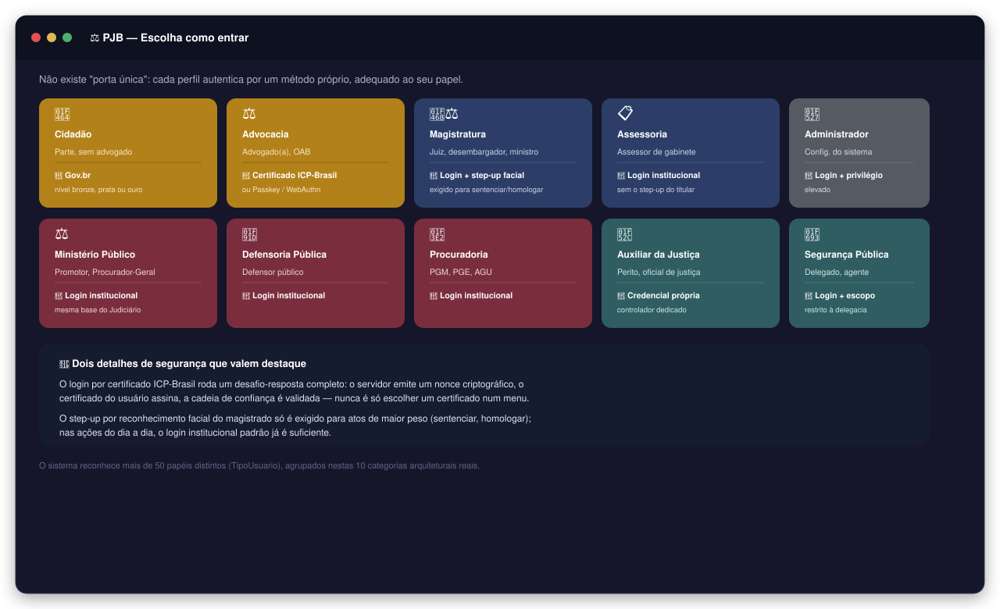
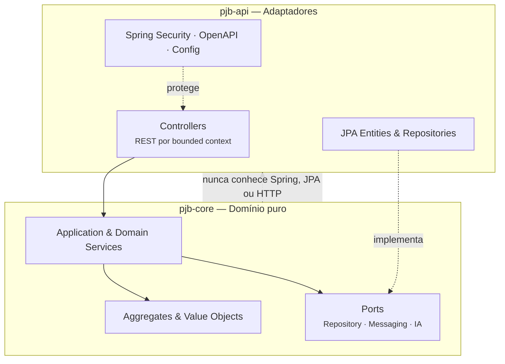

<div align="center">

# ⚖️ PJB — Plataforma Judicial Brasileira

### Sistema judicial eletrônico de nova geração, projetado para substituir integralmente PJe, e-SAJ, eProc, Creta e Projudi em todos os segmentos da Justiça brasileira


**[🇧🇷 Português (este arquivo)](./README.md)** · **[🇬🇧 English](./README.en.md)** · **[📓 Guia Visual Interativo](docs/product/GUIA_VISUAL_INTERATIVO.md)**

</div>

---

## Navegação rápida

**Início rápido**
- [Sobre o projeto](#sobre-o-projeto)
- [O problema](#o-problema)
- [A proposta](#a-proposta)
- [Glossário](#glossário)
- [Guia visual interativo](#guia-visual-interativo)
- [Pré-requisitos](#pré-requisitos)
- [Instalação e configuração](#instalação-e-configuração)
- [Como executar](#como-executar)
- [Testes](#testes)
- [Documentação da API](#documentação-da-api)

**Arquitetura e domínio**
- [Domínio](#domínio)
- [Arquitetura](#arquitetura)
- [Stack técnica](#stack-técnica)
- [Módulos funcionais](#módulos-funcionais)
- [Aceleradores inteligentes](#aceleradores-inteligentes)
- [Ritos processuais cobertos](#ritos-processuais-cobertos)

**Infraestrutura e qualidade**
- [Segurança e conformidade](#segurança-e-conformidade)
- [Concorrência e execução assíncrona](#concorrência-e-execução-assíncrona)
- [Escalabilidade e resiliência operacional](#escalabilidade-e-resiliência-operacional)
- [Banco de dados](#banco-de-dados)
- [Qualidade executável](#qualidade-executável)
- [Observabilidade](#observabilidade)
- [Substituição nacional](#substituição-nacional)

**Contribuição e projeto**
- [Contribuindo](#contribuindo)
- [Sincronização Git segura](#sincronização-git-segura)
- [Próximos passos](#próximos-passos)
- [Autor](#autor)
- [Licença](#licença)

[⬆ Voltar à navegação rápida](#navegação-rápida)

---

## Sobre o projeto

O PJB é uma plataforma de substituição total — não incremental — dos sistemas judiciais eletrônicos em uso no Brasil. Cinco sistemas foram construídos ao longo de décadas por entidades diferentes, sem nenhuma coordenação de protocolo, modelo de dados ou interface. O resultado é uma infraestrutura que hoje suporta mais de **80 milhões de processos ativos**, **91 tribunais** e **cerca de 30 mil magistrados**, mas que não foi projetada para escalar, auditar ou integrar com o rigor que a legislação e a sociedade passaram a exigir.

O PJB foi construído do zero com três compromissos inegociáveis: rastreabilidade total em cada ação do sistema, testabilidade como critério de aceite de qualquer funcionalidade e segurança por construção — ABAC, RLS e propagação governada de sigilo não são camadas adicionadas depois, são restrições que guiam cada decisão arquitetural.

[⬆ Voltar à navegação rápida](#navegação-rápida)

---

## O problema

| Sistema | Tribunal principal | Problema central |
|---------|-------------------|-----------------|
| PJe | CNJ / maioria dos tribunais | Acoplamento forte entre UI e domínio, rotas sem contrato |
| e-SAJ | TJSP, TJBA e outros estaduais | Modelo de dados proprietário, sem API pública |
| eProc | TRF1, TRF4 e estaduais | Jobs isolados, assinaturas frágeis |
| Creta | Justiça do Trabalho | Baixa observabilidade, sem suporte a novos ritos |
| Projudi | Tribunais estaduais menores | Débito técnico crítico, sem path de migração |

Nenhum dos cinco foi projetado com escalabilidade horizontal, auditoria de acesso granular ou suporte completo às classes processuais do CPC/2015 e das reformas trabalhistas. O PJB não é uma reescrita deles. É uma ruptura deliberada com esse modelo.

[⬆ Voltar à navegação rápida](#navegação-rápida)

---

## A proposta

O PJB foi projetado do zero com três compromissos inegociáveis:

**1. Rastreabilidade total.** Toda decisão de acesso, distribuição, movimentação e comunicação produz uma trilha auditável, imutável e explicável. Não existe ação no sistema que não possa ser reconstituída — quem fez, quando fez, com qual autoridade e qual foi o efeito.

**2. Testabilidade como critério de aceite.** Nenhuma funcionalidade existe sem comportamento verificável. A suíte de testes é o contrato executável do sistema — se o teste passa, o comportamento está garantido. Funcionalidade sem teste não é funcionalidade: é intenção.

**3. Segurança por construção.** ABAC, RLS por operação, propagação governada de contexto sigiloso e Step-up Gov.br não são camadas adicionadas depois. São restrições que guiam cada decisão arquitetural desde o início — antes do primeiro endpoint, antes da primeira migration, antes da primeira linha de código de domínio.

[⬆ Voltar à navegação rápida](#navegação-rápida)

---

## Glossário

> Termos jurídicos e técnicos usados a partir daqui — útil para quem não vem de engenharia de software.

| Termo | Significado |
|-------|-------------|
| **NPU** | Número Processo Único — identificador padronizado CNJ (ex: 0000001-00.2024.8.26.0001) |
| **Rito** | Fluxo processual obrigatório definido pela lei (ordinário, sumaríssimo, JEC, etc.) |
| **Autuação** | Ato de registrar formalmente o processo no sistema, com classe, assunto e partes |
| **Distribuição** | Atribuição do processo a uma vara ou juízo competente |
| **Movimentação** | Qualquer ato praticado sobre o processo (despacho, decisão, sentença, certidão) |
| **GIGS** | Grupo de Atividades — conjunto de tarefas processuais com prazo e responsável |
| **Sobrestamento** | Suspensão temporária do processo aguardando julgamento de paradigma |
| **BATNA** | Best Alternative to a Negotiated Agreement — análise de alternativa ao acordo |
| **ABAC** | Attribute-Based Access Control — controle de acesso por atributos do contexto |
| **RLS** | Row Level Security — política de segurança aplicada no nível do banco de dados |
| **ADR** | Architecture Decision Record — registro formal de decisão arquitetural |
| **ICP-Brasil** | Infraestrutura de Chaves Públicas Brasileira — padrão de assinatura digital |
| **Gov.br** | Sistema de autenticação federal com níveis de confiança bronze, prata e ouro |
| **PDPJ** | Plataforma Digital do Poder Judiciário — barramento de integração nacional |
| **MNI** | Modelo Nacional de Interoperabilidade — protocolo de troca entre sistemas judiciais |
| **CNJ** | Conselho Nacional de Justiça — órgão regulador que define classes, assuntos e tabelas |
| **JEC** | Juizado Especial Cível |
| **JEF** | Juizado Especial Federal |
| **JEFP** | Juizado Especial da Fazenda Pública |
| **BO** | Boletim de Ocorrência |
| **SBOM** | Software Bill of Materials — inventário auditável de dependências |
| **CPF** | Cadastro de Pessoa Física — identificador tributário individual brasileiro |
| **CNPJ** | Cadastro Nacional de Pessoa Jurídica — identificador tributário de empresas brasileiras |

[⬆ Voltar à navegação rápida](#navegação-rápida)

---

## Guia visual interativo

Prefere entender o PJB em diagramas antes de mexer em código? O **[📓 Guia Visual Interativo](docs/product/GUIA_VISUAL_INTERATIVO.md)** é onde isso vive — com imagens e diagramas reais, não só texto:

<div align="center">



*Prévia: quem entra no PJB e por onde — o guia completo detalha inclusive o que muda entre juiz, desembargador e ministro*

</div>

No guia completo você encontra:

- **quem entra no PJB e como cada perfil se autentica** — cidadão, advocacia, magistratura (com o detalhe de juiz × desembargador × ministro), Ministério Público, Defensoria, Procuradoria, perito, e mais;
- o passo a passo de como uma ação é ajuizada, da petição ao protocolo;
- como funciona a triagem inteligente que analisa cada petição antes de virar processo (e por que ela **não** é a Laiane);
- a **calculadora judicial** com exemplo real de entrada e saída — cada verba calculada, com a lei que a fundamenta;
- as **ferramentas por processo do advogado** — honorários de sucumbência, regularidade OAB, conflito de agenda em audiência, substabelecimento de procuração, custas consolidadas e produtividade do escritório;
- a **bancada de acordo** com o relatório BATNA completo — valor em discussão, custo de cada lado, probabilidade de recurso;
- **Laiane**, a inteligência artificial jurídica do projeto — o que ela faz para cada papel, as travas que garantem que ela nunca decide sozinha, e a homenagem por trás do nome.

Esse conteúdo fica deliberadamente fora deste README — aqui o foco é documentação técnica; lá, o foco é entender o comportamento do sistema sem precisar ler Java.

[⬆ Voltar à navegação rápida](#navegação-rápida)

---

## Pré-requisitos

Antes de clonar e rodar o projeto, certifique-se de ter instalado:

| Ferramenta | Versão mínima | Finalidade |
|------------|--------------|-----------|
| **JDK** | 21 | Compilação e execução (Virtual Threads obrigatórias) |
| **Maven** | 3.9+ | Build multi-module (`pjb-core` + `pjb-api`) |
| **Docker** | 24+ | PostgreSQL, Kafka, Redis, Elasticsearch via Compose |
| **Docker Compose** | v2 (plugin) | Orquestração da infraestrutura local |
| **Python** | 3.10+ | Guards estruturais em `scripts/` |

> **IDE recomendada:** IntelliJ IDEA 2024+ com os plugins Checkstyle e SonarLint ativos. O projeto usa records, sealed classes e pattern matching do Java 21 — versões anteriores da IDE não reconhecem toda a sintaxe.

[⬆ Voltar à navegação rápida](#navegação-rápida)

---

## Instalação e configuração

### 1. Clonar o repositório

```bash
git clone https://github.com/tiagorabelo0403/pjb-tcc.git
cd pjb-tcc
```

### 2. Configurar variáveis de ambiente

```bash
cp .env.example .env
```

Abra o `.env` e preencha as variáveis obrigatórias:

| Variável | Descrição | Exemplo |
|----------|-----------|---------|
| `PJB_PG_HOST` | Host do PostgreSQL | `localhost` |
| `PJB_PG_PORT` | Porta do PostgreSQL | `5432` |
| `PJB_PG_PASSWORD` | Senha do banco | `pgpassword` |
| `PJB_MASTER_KEY_BASE64` | Chave mestra de criptografia (Base64, 32 bytes) | gerada pelo script |
| `PJB_ANTHROPIC_API_KEY` | Chave da API Anthropic para módulos de IA | `sk-ant-...` |
| `PJB_KAFKA_BOOTSTRAP` | Endereço do broker Kafka | `localhost:9092` |

> Para ambientes de demonstração, o `.env.example` já contém valores funcionais que o `demo.sh` / `demo.cmd` usa automaticamente.

### 3. Subir a infraestrutura

```bash
docker compose up -d
```

Isso sobe PostgreSQL 17, Apache Kafka 3.8, Redis 7.4 e Elasticsearch 8.15. As migrations Flyway (numeração até V306) são aplicadas automaticamente na primeira conexão do backend.

### 4. Verificar os profiles Spring

O projeto usa profiles Spring Boot separados por ambiente. O arquivo base é `application.yml`; cada profile sobrescreve apenas o que muda:

| Profile | Arquivo | Quando usar |
|---------|---------|------------|
| `dev` | `application-dev.yml` | Desenvolvimento local com infraestrutura no Docker |
| `local` | `application-local.yml` | Banco e serviços rodando diretamente no host |
| `docker` | `application-docker.yml` | Backend dentro de container Docker |
| `prod` | `application-prod.yml` | Produção — exige todas as variáveis de ambiente |
| `k8s` | `application-k8s.yml` | Kubernetes |

Para rodar localmente, o profile `dev` é o recomendado. Ele é ativado automaticamente pelo `demo.sh` / `demo.cmd`. Para ativar manualmente:

```bash
# Via Maven
./mvnw spring-boot:run -pl pjb-api -Dspring-boot.run.profiles=dev

# Via variável de ambiente
export SPRING_PROFILES_ACTIVE=dev
java -jar pjb-api/target/pjb-api.jar
```

### 5. Compilar

```bash
# Compilar o módulo de domínio
./mvnw install -pl pjb-core -DskipTests

# Compilar o módulo de API (inclui geração de classes de teste)
./mvnw test-compile -pl pjb-api
```

[⬆ Voltar à navegação rápida](#navegação-rápida)

---

## Como executar

### Quickstart completo (recomendado)

O script de demonstração faz tudo em sequência: copia o `.env`, compila, sobe a infraestrutura, aplica as migrations e aguarda o backend ficar saudável.

```bash
# Linux / macOS
bash demo.sh

# Windows
demo.cmd
```

### Executar apenas o backend (infraestrutura já no ar)

```bash
# Via Maven Wrapper (recomendado em desenvolvimento)
./mvnw spring-boot:run -pl pjb-api

# Via JAR empacotado
./mvnw package -pl pjb-api -DskipTests
java -jar pjb-api/target/pjb-api.jar
```

### Backend completo via Docker (build + infra juntos)

```bash
docker compose --profile app up -d --build
```

O serviço `backend` está no profile `app`. Sem ele, o Compose sobe apenas a infraestrutura de suporte. Se a porta `5432` já estiver em uso localmente, defina `PJB_PG_PORT=5433` no `.env` — o backend em Docker continua acessando `postgres:5432` pela rede interna do Compose.

### JVM dentro de container — receita anti-`killed` (OOM)

Container Java mal calibrado é a receita clássica pra `killed` sem heap dump: a JVM enxerga a RAM da máquina hospedeira, aloca heap grande demais, e o kernel do container mata o processo por ultrapassar o limite de memória — sem stack trace, sem dump, só um exit silencioso. O `pjb-runtime.sh` (entrypoint da imagem) resolve isso automaticamente, calculando as flags da JVM a partir do próprio limite do cgroup:

- Detecta o limite de memória do container (`/sys/fs/cgroup/memory.max` em v2, `memory.limit_in_bytes` em v1) e o de CPU (`cpu.max` ou `cpu.cfs_quota_us`) sem depender do que o host reporta.
- Reserva memória nativa proporcional ao tamanho do container (34% para 512Mi–1Gi, 30% para 2Gi, 26% para 4Gi, 24% para ≥8Gi) — porque metaspace + direct memory + code cache + stacks nativas não são heap e precisam de espaço.
- `MaxRAMPercentage`, `InitialRAMPercentage`, `MaxMetaspaceSize`, `MaxDirectMemorySize`, `ReservedCodeCacheSize` escalam por faixa de tamanho — nada é hardcoded pra um perfil só.
- `-XX:+UseContainerSupport -XX:+ExitOnOutOfMemoryError -XX:+HeapDumpOnOutOfMemoryError` garantem que qualquer OOM real gere dump e o container saia limpo (não vira zumbi), com `HeapDumpPath` configurável.
- GC log e JFR opcionais por env (`PJB_JVM_GC_LOG_ENABLED`, `PJB_JVM_JFR_ENABLED`) — sem custo se desativados.
- Três perfis por env `PJB_JVM_PROFILE`: `balanced` (G1GC, default), `latency` (ZGC generational), `startup` (G1GC + dedup).

A tabela de decisão está travada por um guard Python dedicado (`scripts/pjb_runtime_memory_recipe_guard.py`) que executa as funções bash isoladas do script real com limites simulados (512Mi/1Gi/2Gi/4Gi/8Gi/16Gi) e falha se qualquer valor divergir — mudança na fórmula fica obrigada a ser consciente.

### Endpoints após subir

| Endpoint | Descrição |
|----------|-----------|
| `http://localhost:8080/livez` | Liveness check |
| `http://localhost:8080/demo/status` | Estatísticas em tempo real |
| `http://localhost:8080/swagger-ui/index.html` | Documentação interativa da API |
| `http://localhost:8080/v3/api-docs` | Especificação OpenAPI 3.1 (JSON) |
| `http://localhost:8080/actuator/health` | Health check completo |
| `http://localhost:8080/actuator/metrics` | Métricas Micrometer |

Com o profile `docker`, o sistema semeia automaticamente usuários e processos de demonstração.

**Para encerrar:**
```bash
docker compose down
```

[⬆ Voltar à navegação rápida](#navegação-rápida)

---

## Testes

O projeto tem dois níveis de teste com características bem diferentes:

- **Testes unitários (Surefire):** 4.484 testes com Mockito e H2 em memória. Rápidos, sem dependência de Docker.
- **Testes de integração (Failsafe):** 288 testes contra PostgreSQL e Kafka reais via Testcontainers. Exigem Docker. Demoram mais.

### Rodar apenas os testes unitários (rápido)

```bash
./mvnw test -pl pjb-api
```

Tempo esperado: **~15 min** em hardware local. Não precisa de Docker rodando.

### Rodar a suíte completa com integração (portão oficial)

```bash
./mvnw verify -pl pjb-api
```

Esse comando é o portão oficial do projeto. Ele roda os 4.484 unitários (Surefire) e depois os 288 testes de integração (Failsafe) contra containers reais de PostgreSQL 17 e Kafka. O Testcontainers sobe e derruba os containers automaticamente — não é preciso configurar nada manualmente.

Tempo esperado: **~50 min** em hardware local (a maior parte é o boot do Spring com Testcontainers e a execução dos ITs que fazem requisições HTTP reais contra o servidor). Um verify completo produz diagnóstico de todos os clusters de falha da suíte — se você está investigando um problema específico, esse é o número que importa, não o do `test`.

> **Por que tão demorado?** Cada classe de IT sobe um contexto Spring completo com PostgreSQL real, aplica as migrations Flyway e executa as requests HTTP como um cliente externo faria. Isso dá confiança total de que o que passou em teste vai passar em produção — mas tem um custo de tempo.

O `argLine` do Surefire/Failsafe fixa `-Dpjb.runtime.lifecycle.drain-quiet-period=10ms`. O coordenador de drenagem graciosa (`PjbRuntimeDrainCoordinator`) dorme 20s por padrão a cada fechamento de contexto Spring — correto em produção, onde existe tráfego real para drenar antes do shutdown, mas puro desperdício numa JVM de teste. Sem esse override, um `verify` completo pode estourar o watchdog de 30s do próprio Surefire (`forkedProcessExitTimeoutInSeconds`) e matar a JVM forkada à força no encerramento, mesmo com todos os testes já verdes — sintoma que só aparece em rodadas longas, nunca isolando uma classe.

### Se o `test`/`verify` começar a "cair" sem motivo aparente

Se rodadas de teste passarem a ser mortas logo no início (ou o build ficar lento e instável), quase sempre a causa é **JVM de teste órfã**: quando um `mvnw` é interrompido abruptamente, a JVM forkada do Surefire/Failsafe (`-Xmx4g`) pode sobreviver sem processo pai que a encerre e ir acumulando até sufocar a memória da máquina, matando os próximos runs. Não é flag de JVM mal configurada — é processo zumbi. Há um guard dedicado para detectar e limpar isso:

```bash
python scripts/reap_orphan_test_jvms.py         # lista as JVMs de teste órfãs (report-only)
python scripts/reap_orphan_test_jvms.py --kill  # encerra as órfãs e libera a memória
```

Multiplataforma (Windows/Linux/macOS), somente stdlib. Report-only por padrão (sai com código ≠ 0 se achar órfãs, útil como sinal em CI); `--kill` reapa. Não é amarrado ao build automaticamente — rode-o quando notar instabilidade, antes de uma rodada longa.

Se o Docker (não a JVM) ficar lento ou `verify` travar tentando subir os containers do Testcontainers, a causa mais comum é **container zumbi**: um container preso em `unhealthy` por horas/dias (tipicamente por um `docker-compose up` parcial, com uma dependência que nunca subiu) segura CPU/memória da VM do Docker Desktop indefinidamente, sem servir a nada. Guard dedicado:

```bash
python scripts/docker_zombie_container_guard.py         # lista containers zumbis (report-only)
python scripts/docker_zombie_container_guard.py --kill  # para e remove os zumbis
```

Marca como zumbi qualquer container `unhealthy` por mais de 30 minutos (configurável via `--unhealthy-threshold-minutes`) ou com 5+ restarts (via `--restart-count-threshold`). Sai silenciosamente com código 0 se o daemon Docker estiver indisponível — não é um guard de "Docker precisa estar rodando".

### Rodar um teste específico com stack trace completo

```bash
./mvnw test -pl pjb-api -Dtest=NomeDoTeste -DtrimStackTrace=false
```

### Métricas atuais

| Métrica | Fase | Valor |
|---------|------|-------|
| Total de testes unitários | Surefire | **4.528** |
| Falhas unitários | Surefire | **0** |
| Skipped | Surefire | 5 |
| Tempo unitários | Surefire | **~17 min** |
| Total de testes de integração | Failsafe | **295** ¹ |
| Testes do motor de composição de polos | Failsafe | **+10 verdes** (papel por rito: ACUSACAO, RECLAMANTE, IMPETRANTE, SEGURADO…) |
| Falhas IT | Failsafe | **0** (0E + 0F) |
| Tempo verify completo | Surefire + Failsafe | **~50 min** |

A suíte de integração passou por uma etapa de estabilização estrutural: falhas por variável de ambiente incorreta, contaminação de dados entre testes e IDs hardcoded sem seed foram eliminadas por completo. Duas dessas correções expuseram bugs reais de produção, não só de teste: `AuditLedgerService` gravava eventos de auditoria apenas em memória, sem persistir no repositório consultado pelos próprios endpoints de auditoria; e a resolução do processo raiz em `CaseContinuityOrchestratorService` usava um campo mutável durante o ciclo de vida do processo, gerando ambiguidade entre o processo raiz e seus desdobramentos (ex.: cumprimento de sentença) após arquivamento.

O `verify` padrão (Failsafe) não alcança 13 métodos de teste distribuídos em 6 classes¹ que combinam a convenção `*Test.java` com `@Tag("integration")` — o Surefire exclui essas classes por tag e o Failsafe não as reconhece pelo padrão de nome de arquivo. Todas as 13 já foram confirmadas verdes individualmente via `-Dit.test=`, mas ficam fora da contagem de rotina do `verify`.

`D-drain-coordinator-fork-exit-sem-guarda-regressao` tem um guard Python dedicado (`scripts/drain_quiet_period_argline_guard.py`) que falha se o `<argLine>` de Surefire ou Failsafe perder o override `drain-quiet-period` ou ele virar zero — o fix já existia, mas não tinha rede de segurança contra regressão; `PjbRuntimeDrainServiceTest` documenta o fallback silencioso de `sanitizeDuration()` (`Duration.ZERO`/negativo caem no default de produção) em 4 testes. `D-controllers-recursais-legados-sem-teste-dedicado` tem cobertura completa dos 4 controllers recursais legados (`AdvogadoCockpitController`, `DefensorPublicoPainelController`, `MinisterioPublicoPainelController`, `ProcuradoriaOperacionalController`) — pré-requisito documentado antes de qualquer remoção futura desses controllers: sucesso de todo endpoint, falha de validação (400) para todo DTO com constraint real, e uma classe IT nova por controller provando anônimo negado, role ilegítima negada (403) e cada role legítima do `@PreAuthorize` autorizada, contra Postgres real com Spring Security completo — 63 testes (39 unitários + 20 de integração), 0 falhas. As ITs expuseram dois achados reais sem impacto em produção, documentados em `DEBT_LOG.md`: três papéis (`OAB_PRESIDENTE_SECCIONAL`, `PROMOTOR_ELEITORAL`, `PROMOTOR_TRABALHISTA`) nunca chegam sozinhos em runtime porque `PjbGrantedAuthorityFactory` sempre concede um papel-base junto; e `DEFENSOR_DISTRITAL` é um literal morto no `@PreAuthorize` legado que não existe como valor de `TipoUsuario`.

`D-recursal-superficie-por-papel` fechou por completo: com o pré-requisito de teste já pronto, o endpoint `interporRecurso` (e o `@PostMapping` correspondente) foi removido dos 4 controllers legados — eles continuam existindo, com os demais endpoints intactos, só o recurso saiu de lá. As facades intermediárias correspondentes (`AdvogadoSurfaceFacadeService.interporRecurso`, `InstitutionalPainelSurfaceFacadeService.defensorInterporRecurso`/`.ministerioPublicoInterporRecurso`, `ProcuradoriaOperationalSurfaceFacadeService.interporRecurso`) foram removidas junto — a camada de serviço que `RecursalPeticionamentoPerfilRouter` chama diretamente ficou intacta. `AdvogadoRecursoRequest` e `RecursalLegacyDeprecationHeaders` foram deletados por não terem mais nenhum chamador. Uma política OPA de um overlay de produção (`prod-sovereign-opa-ext-authz`) estava desatualizada desde a etapa anterior desta frente — o `critical_paths` nunca cobria o endpoint unificado `/api/v1/recursal/`, só o legado `/api/v1/mp/recurso/` que estava sendo removido; corrigido, registrado em `D-recursal-opa-critical-path-nao-atualizado`. A coleção Postman perdeu a pasta de endpoints legados e o contrato estático `docs/openapi/public-api.yaml` perdeu os 4 blocos de path correspondentes. Duas varreduras adicionais de consumidores identificaram mais dependências quebradas: `RecursalWorkbenchSurfaceCatalog` e `InstitutionalWorkbenchProjectionService` montavam botões reais de "Interpor recurso" apontando pra uma URL que deixou de existir — corrigido. O achado mais relevante veio na sequência: `InstitutionalCriticalActionHttpGuardFilter`, o filtro Spring que aplica o gate documental institucional (`InstitutionalDocumentSecurityGateApplicationService`) a ~30 atos sensíveis reais (sentença, despacho, manifestação do MP, ofício, laudo, etc.), estava registrado antes da cadeia do Spring Security e nunca chegava a ser incorporado a ela — rodava, portanto, sem o contexto de autenticação já resolvido, o que interrompia com erro toda requisição institucional protegida que passasse por ali. A correção tem três camadas: o filtro passou a ser registrado via `http.addFilterAfter(..., AuthorizationFilter.class)` (roda depois da autenticação e autorização, com o usuário já resolvido — mesma convenção dos filtros de step-up); a fábrica do gate ficou null-safe (`getOrNull` em vez de `getRequired`); e o path recursal unificado foi religado ao filtro, restaurando a cobertura que o recursal havia perdido. Provado por 5 testes unitários novos do serviço de gate, teste do filtro para o path recursal, e uma IT com JWT real contra Postgres (`InstitutionalRecursalGateIT`) mais a `RecursalPeticionamentoControllerIT` (8/8) revalidada com o filtro já ativo. Duas outras classes (`PainelActionSurfaceCompositionService`/`PainelExecutionSurfaceCompositionService`, consumidas pelos painéis reais de MP/Defensoria) tinham 4 entradas apontando pra URLs que nunca existiram de verdade — corrigidas também. Detalhes completos em `DEBT_LOG.md` (`D-institutional-gate-filter-roda-antes-da-auth`).

Os 4.310 testes unitários passam numa rodada completa (`mvnw test -pl pjb-api`) — 0 falhas, 0 erros, sem regressão (inclui os 5 testes novos do serviço de gate documental e o teste do path recursal no filtro). Os 252 testes de integração somam o total anterior (250) mais os 2 da `InstitutionalRecursalGateIT`, cada IT confirmada verde individualmente (`-Dit.test=`); o número é soma verificada por execução individual, não estimativa.

Cobertura horizontal do `InstitutionalCriticalActionHttpGuardFilter`: a tabela `resolvePolicy` (30 rotas → `InstitutionalSensitiveAct` + `operationCode`) tem `InstitutionalCriticalActionHttpGuardFilterPolicyMappingTest` — 69 asserts parametrizados via `@MethodSource` que garantem, para cada uma das 30 policies: (a) `POST` na rota bate a `InstitutionalSensitiveAct` e o `operationCode` esperados, (b) `GET` na mesma rota não dispara o gate, (c) 7 rotas fora do escopo permanecem livres. Trava em compile-time o par (URL, ato sensível) — mudar uma linha sem atualizar o mapa quebra o teste no CI. Uma segunda IT ponta-a-ponta (`InstitutionalMagistraturaGateIT`) prova a ordem de filtro para uma família diferente da recursal — magistratura, controlador com `PathVariable` puro e `@PreAuthorize` de 11 roles, seed real de `Usuario` JUIZ_ESTADUAL + `TrustedDevice` para satisfazer o step-up de passkey (`MinisterStepUpFilter`), JWT via `jwt()`; a assertion apoia-se nos headers `X-PJB-Institutional-Gate-Operation=MAGISTRATURA_ATO_PROCESSUAL` e `X-PJB-Institutional-Gate-Allowed=true` — evidência direta de que o gate roda depois da auth, independente do que aconteça downstream. `InstitutionalRecursalGateIT` segue o mesmo padrão de asserção-por-header (removendo dependência latente de Redis local que a versão original de `status().isCreated()` mascarava: o `CapabilityRateLimiter` do controller recursal usa Redis e sem infra opcional retornava `RedisConnectionFailureException`, ortogonal à garantia real do teste — ordem de filtro).

`D-mni-litisconsorcio-primeira-pessoa`: `MniXmlToProcessoAdapter.resolvePartes` capturava apenas a primeira `<pessoa>` de cada `<polo>` (via `firstDescendant`), descartando silenciosamente partes em litisconsórcio. O adapter itera TODAS as `<pessoa>` de cada polo via `allDescendants` e retorna `MniAdapterResult(Processo, List<MniParteParsed>)` — a primeira pessoa de cada polo ainda popula os campos planos do `Processo` (backward compat para serviços que leem `parteAutoraNome`/`parteReuNome`); `MniRecepcaoService.materializarPolosIniciais` materializa TODAS as pessoas como `PoloProcessual`, usando o `TipoParte` rito-aware do `PoloCompositionPolicy` para as primeiras e replicando o mesmo `TipoParte` para as demais do mesmo polo (em TRABALHISTA_ORDINARIO, todos os coautores recebem RECLAMANTE, todos os corréus recebem RECLAMADA). A materialização preserva a ordem do documento — todas as partes de um polo antes de passar ao próximo, já que o XML MNI agrupa `<pessoa>` por bloco `<polo>` — provado no serviço com `containsExactly(ATIVO, ATIVO, PASSIVO, PASSIVO)`.

Três lacunas irmãs foram fechadas na dívida `D-mni-terceiro-pj-interesse-publico`: terceiro interessado (`polo="TC"/"TJ"`) caía no default binário e virava réu; pessoa jurídica não tinha `razaoSocial` populado; parte institucional via `<interessePublico>` (Fazenda Pública, INSS, União — sem `<pessoa>`) era invisível ao adapter. `MniParteParsed` ganhou o campo `tipoPessoa`; `mapMniPoloCode` mapeia `TC`/`TJ` → `TERCEIRO` e `FL` → `MINISTERIO_PUBLICO` com `TERCEIRO` como default seguro; `PoloProcessual` ganhou a coluna `razao_social` (migration V297) populada quando `tipoPessoa` é `juridica` ou `interesse_publico`.

Provado por 3 testes novos: no adapter, um de litisconsórcio (4 pessoas, 2 polos) e um dos 5 tipos de parte (física, jurídica, terceiro, interesse público, Ministério Público — `tipoPolo`/`nome`/`documento`/`tipoPessoa` de cada `MniParteParsed` validados); no serviço, litisconsórcio materializa 4 `incluir` com `TipoParte` rito-aware preservado. `PoloProcessualApplicationServiceTest` (15 testes, cobre o novo overload com `razaoSocial`) e `ApiMarketplaceServicePoloMaterializacaoTest` (4 testes, Testcontainers) passam verdes — zero cascata no caminho de aplicação de polo. `MotorComposicaoPolosAjuizamentoIT` (10 testes, `PoloCompositionPolicy` não tocado neste diff) segue validado por execução anterior, sem alteração de comportamento.

Total atualizado: 4.382 unitários (2 no adapter, 1 no serviço); 253 integração. Todas verdes em execução individual (`-Dit.test=` para as ITs, `-Dtest=` para o unit).

`D-jus-postulandi-recurso-tst` e `D-jus-postulandi-recurso-jef-turma-recursal` fecharam — mas não pela correção óbvia que os títulos sugerem. As duas dívidas descreviam o bloqueio de jus postulandi em recursos do TST e do JEF como acidental (o tipo recursal nem seria processável, não uma regra ativa lendo o tribunal de destino). O histórico do código (`git log -p`/`git show` no commit imediatamente anterior ao registro de cada dívida) mostra que a premissa estava errada pra metade dos casos: `AGRAVO_RECURSO_REVISTA` (TST) e `RECURSO_INOMINADO` (JEF) já tinham mapeamento processual havia meses e já eram barrados de verdade pela allowlist de jus postulandi — enforcement real da Súmula 425/TST e da analogia conservadora ao JEC, respectivamente —, só nunca tinham teste de regressão provando isso. Só `RECURSO_REVISTA` e `PEDIDO_UNIFORMIZACAO` são de fato bloqueio acidental por lacuna de mapeamento processual, que barra qualquer ator (advogado incluído), não só jus postulandi. 6 testes novos em `RecursalValidacaoMinimaServiceTest` (13/13 verde) provam essa distinção com pares cidadão/advogado para cada um dos quatro tipos recursais. A pergunta jurídica de fundo do JEF — o que a Lei 10.259/2001 realmente exige na fase recursal — segue deliberadamente em aberto: travar o comportamento atual por teste não é o mesmo que decidir se ele está certo, e essa decisão exige leitura de lei e jurisprudência da TNU.

O bounded context `custas` (motor de custas judiciais — GRU, PIX, isenção por rito) foi migrado da estrutura legada (`core/financeiro/custas`, `model/entity/financeiro`, `controller/admin`) para a estrutura completa de 5 camadas (`domain`/`application`/`infrastructure`/`web`/`api`), o segundo módulo do projeto a chegar nesse estado depois de `acordo`. `CustaJudicialService` injetava `CustaJudicialRepository`/`ProcessoRepository` diretamente — um padrão nunca testado contra as regras de layering do projeto porque, fora de `modules.*`, o `ModularMonolithArchitectureTest` (ArchUnit, escaneia todo o pacote `com.tcc.pjb.backend.modules`) não via essas classes. Assim que o código entrou em `modules.custas.application`, o teste passou a escaneá-lo e apontou 2 violações reais: acesso direto a repository a partir de application, e nome de `@Service` sem o sufixo `ApplicationService`. A correção seguiu o padrão hexagonal já usado por `acordo` — portas `CustaJudicialStorePort`/`ProcessoCustaPort` em `api/`, adapters em `infrastructure/`, `CustaIsencaoPorRitoPolicy` migrada pra `domain/` como classe pura (sem Spring, registrada via `@Bean` em `CustasConfiguration`) — sem mudar nenhuma regra de negócio. `CustasArchitectureTest` (novo, 5 regras espelhando `PrazosArchitectureTest`) e o `ModularMonolithArchitectureTest` do projeto inteiro (14 regras) passam verdes; os 33 testes unitários de `custas` mais os 2 do consumidor externo (`WorkflowTrabalhistaServiceTest`, que só importa `GruCodigoBarrasGenerator`/`GruResult`) passam verdes após a migração — mesmas asserções, mocks trocados de repository para port. O guard `scripts/modular_monolith_guard.py` fecha com 0 erros e 0 warnings novos atribuíveis a `custas` — o `baseline_issues=2` que aparece na saída é drift pré-existente em `advocacia`/`atendimento`, não relacionado a esta mudança. `CustaJudicialFlowIT` (249,1s) e `CustaJudicialRepositoryIT` (114,8s), as duas ITs de `custas` que dependem de Postgres real via Testcontainers, passam verdes com 0 falhas.

Um container `pjb-backend-1` órfão rodava havia 7 dias em loop de retry do Flyway (backoff exponencial em 120s) porque seu Postgres de dependência nunca tinha sido de fato iniciado, consumindo 8,45GB dos 11,6GB de memória alocados à VM do Docker Desktop — margem apertada para os containers que o Testcontainers precisa subir num `verify`. Removido, junto com o `pjb-postgres-replica-1` (também nunca iniciado). `docker system df`/`prune` liberou mais 23,7GB (22,17GB de build cache obsoleto, ~815MB de imagens dangling, ~760MB de volumes anônimos órfãos de execuções de teste interrompidas), sem tocar em nenhuma imagem nomeada nem nos 7 volumes nomeados dos stacks `pjb`/`pjb-clean`.

`HonorariosSucumbenciaCalculatorService` (cálculo de honorários de sucumbência por CPC art. 85 — percentual mínimo/máximo, faixa contra Fazenda Pública, percentual fixado pelo magistrado) existia pronto desde antes, mas sem nenhum chamador em todo o backend — seu `record HonorariosInput` também usava `UUID` como tipo do `processoId`, incompatível com o `Long` real de `Processo.id`, o que por si só teria bloqueado qualquer integração direta. Corrigido o tipo (sem impacto, zero chamador existente) e exposto em `POST /api/v1/advogado/cockpit/processos/{processoId}/honorarios/calcular`: `AdvogadoCockpitService.calcularHonorarios` resolve o processo, chama `PjbAuthorizationService.requireReadProcesso` (mesma checagem ABAC usada por `protocolizarPeticao`, cobre a legitimidade do advogado para aquele processo específico) e só então delega ao calculador. 3 testes unitários novos (`AdvogadoCockpitServiceHonorariosTest`) provam o cálculo, a negação de acesso propagada sem tocar a calculadora, e processo inexistente sem sequer consultar autorização.

Quando um magistrado profere despacho, `DespachoComunicacaoPosAtoService` já registrava a ciência processual formal (`CienciaProcessual`, prazo contado a partir da publicação no DJe) e publicava eventos `INTIMACAO_PROCESSUAL_CRIADA` na tabela de outbox — mas nenhum consumidor os lia: `OutboxDispatcher` não tinha rota dedicada para esse `eventType`, então caía no branch genérico (`OutboxGenericDispatchedEvent`), que só alimenta o read-model processual, sem nunca chegar em `NotificationService`. O advogado tinha o prazo contando oficialmente, sem qualquer aviso real (e-mail, push ou WhatsApp) — só ficaria sabendo se checasse o cockpit manualmente. `IntimacaoNotificacaoOutboxListener` (novo, `@EventListener` em `OutboxGenericDispatchedEvent`, mesmo padrão de `DiligenceInstitutionalMeshOutboxListener`) filtra por esse `eventType`, resolve usuário e processo a partir do payload já publicado e aciona `NotificationService.notifyUser` — reaproveita o motor multicanal existente (e-mail/push/WhatsApp/webhook, com preferência por usuário, anti-spam e histórico já prontos), sem tocar em nenhum dos 9 pontos do código que criam movimentações processuais. 3 testes unitários novos (`IntimacaoNotificacaoOutboxListenerTest`) provam o despacho para o canal certo, a ignorância silenciosa de eventos de outro tipo sem tocar nenhum repositório, e a ausência de notificação quando o usuário referenciado no payload não existe mais.

O módulo `custas` só tinha consulta por `custaId` — nenhum caminho listava as custas de um processo inteiro, e o único controller (`AdminCustasController`) é exclusivo de `ADMINISTRADOR`. O advogado não tinha nenhuma visão de custas, nem por processo nem agregada. `CustaJudicialStorePort` ganhou `findByProcessoId` (implementado em `CustaJudicialStoreAdapter` sobre `CustaJudicialRepository.findByProcessoIdOrderByCreatedAtDesc`, já existente e sem uso); `CustaJudicialApplicationService.listarPorProcesso`/`CustasApplicationService.listarPorProcesso` expõem a consulta respeitando a fronteira hexagonal (`CustasArchitectureTest` 5/5 e `ModularMonolithArchitectureTest` 14/14 seguem verdes). `GET /api/v1/advogado/cockpit/processos/{processoId}/custas` reaproveita a mesma checagem ABAC de honorários antes de consultar — o controller nunca toca `modules.custas.domain` diretamente, só o DTO `AdvogadoCustaItemResponse` já mapeado pelo service (regra `controllers_nao_acessam_domain_de_modulos`). 4 testes unitários novos: 3 em `AdvogadoCockpitServiceCustasTest` (listagem, negação de acesso sem consultar custas, processo inexistente sem consultar nada) e 1 em `CustaJudicialApplicationServiceConsultaTest` (ordenação do store preservada).

`PautaAudienciaService.designar`/`reagendar` gravavam a nova `Audiencia` direto no repositório sem checar sobreposição de horário na mesma vara — um advogado (ou a secretaria) podia marcar duas audiências para o mesmo juiz no mesmo horário sem qualquer aviso. `verificarConflitoAgenda` reaproveita `AudienciaRepository.findAgendaPorVara` (já existia, já filtra `CANCELADA`/`ENCERRADA`/`FRUSTRADA` no SQL) buscando a agenda do dia inteiro da vara e comparando sobreposição real de intervalo (`[dataHora, dataHora+duração)`), excluindo a própria audiência quando é um reagendamento. Lança `IllegalStateException` — mesma convenção já usada neste service para `cancelar`/`reagendar` sobre audiência encerrada. 3 testes unitários novos (`PautaAudienciaServiceConflitoAgendaTest`) provam a rejeição por sobreposição, a aceitação quando não há conflito, e a rejeição num reagendamento contra uma audiência diferente da que está sendo movida. `PautaAudienciaControllerIT` (6/6, mocka o service inteiro) revalidado sem regressão.

`OabValidationService` já existia, integrado a um client real de validação (`OabValidationClient`), mas só era usado como portão bloqueante (`requireAdvogadoAptoParaProtocolo`, lança exceção) antes de protocolar petição inicial — nunca como consulta informativa. O advogado não tinha como checar sua própria regularidade OAB fora do momento de bloqueio. `consultarRegularidade(Usuario)` (novo, extrai a lógica de parse+chamada ao client já usada pelo portão, sem duplicá-la) devolve o `OabValidationResult` (status/motivo/fonte/data) sem lançar nada. `GET /api/v1/advogado/cockpit/oab/regularidade` expõe isso no cockpit. 1 teste unitário novo (`AdvogadoCockpitServiceOabRegularidadeTest`); `OabValidationServiceTest` (5/5) revalidado sem regressão após o refactor de extração do método privado `validar`.

`/api/v1/jurisprudencia/search-contextual` já existia (`JurisprudenceContextualSearchService`, expande a busca com sinônimos por ramo/rito), mas exigia que o cliente soubesse e informasse manualmente `ramo`/`rito` — nenhum endpoint resolvia esses dois campos a partir de um `processoId` real, e nenhum `Advogado*Controller` chamava o serviço. `GET /api/v1/advogado/cockpit/processos/{processoId}/jurisprudencia` resolve `ramoDireito`/`rito` direto do `Processo` (mesma checagem ABAC de honorários/custas antes de consultar) e delega ao serviço existente sem alterá-lo. 3 testes unitários novos (`AdvogadoCockpitServiceJurisprudenciaTest`) provam a busca usando ramo/rito reais do processo, a negação de acesso sem chamar o motor de busca, e processo inexistente sem consultar nada.

`LaianeLawyerController` já cobria criação/listagem/revogação de procuração e habilitação de forma completa — reimplementar isso no cockpit do advogado seria duplicar uma central já pronta. O que faltava era substabelecimento: `LaianeProcuracao` não tinha nenhum conceito de origem/cadeia, então um advogado não conseguia repassar seus poderes a outro (com ou sem reserva). Migration `V308` adiciona `substabelecido_de_id` (self-FK) e `com_reserva_de_poderes` (boolean, default `false`) a `tb_laiane_procuracao`. `LaianeLawyerService.substabelecer` valida que a procuração de origem pertence ao advogado autenticado e está `ATIVA`, que o destinatário é advogado e é diferente do substabelecente, cria a nova procuração vinculada à origem via `substabelecidoDe` copiando `poderes`/`clienteId`/`processoId`, e — quando não há reserva de poderes — revoga a origem (mesma convenção de `revokeProcuracao`: seta `REVOGADA` e fecha `fimVigencia`). `POST /api/v1/laiane/lawyer/procuracoes/{id}/substabelecer` expõe isso; `mapProcuracao` no controller passou a incluir `substabelecidoDeId`/`comReservaDePoderes` na resposta. 7 testes unitários novos (`LaianeLawyerServiceSubstabelecimentoTest`) cobrem substabelecimento com e sem reserva, procuração de outro advogado, procuração já revogada, destinatário que não é advogado, autossubstabelecimento e procuração inexistente. `LaianeLawyerController` nunca teve nenhuma IT antes desta mudança — `LaianeLawyerSubstabelecimentoIT` (nova, 2/2, Postgres real via Testcontainers) prova a migration `V308` e o mapeamento JPA do self-FK aplicados de verdade: substabelecimento aceito revoga a origem, e substabelecimento de procuração de outro advogado recebe 403 pela cadeia real de segurança do Spring. `CapabilityRateLimiter` foi mockado nessa IT (`@MockBean`) porque depende de Redis, ausente da infra de Testcontainers — mesma causa raiz já documentada em `InstitutionalRecursalGateIT`, resolvida aqui isolando a dependência em vez de reformular a asserção, já que o status HTTP é exatamente o que este teste precisa provar.

Honorários (calculado sob demanda, sem estado persistido — a calculadora exige valor de condenação como input) e custas (persistidas, uma lista por processo) já existiam como endpoints separados no cockpit; combiná-los de verdade sem fabricar dado que não existe significa consolidar só o que é persistido. `GET /api/v1/advogado/cockpit/processos/{processoId}/financeiro` reaproveita `listarCustas` (mesma autorização, sem duplicar a checagem) e soma os totais pendente/pago do processo — algo que a lista plana de custas não oferecia antes. 2 testes unitários novos (`AdvogadoCockpitServicePainelFinanceiroTest`) provam a soma correta ignorando status desconhecido (ex.: `CANCELADA`) e o caso de processo sem nenhuma custa.

O cockpit só tinha ação em lote para ciência de intimação (`darCienciaEmLote`); pedir prorrogação de prazo exigia uma petição por processo, uma de cada vez. `prorrogarPrazoEmLote` reaproveita o mesmo `OfficeGovernedProcessOperationService.protocolizarPeticao` já usado pelo peticionamento individual (mesma assinatura qualificada, mesma fila de delegação — nenhuma lógica de protocolo nova) iterando sobre até 50 processos distintos, isolando falha por processo sem interromper o lote: cada chamada roda na própria transação porque o método do lote deliberadamente não é `@Transactional` — encapsular tudo numa transação só faria o Spring marcar `rollbackOnly` na exceção do primeiro processo que falhasse mesmo capturada, derrubando os que já tinham sido protocolados com sucesso. 3 testes unitários novos (`AdvogadoCockpitServiceProrrogacaoPrazoLoteTest`) provam o lote sem falhas, isolamento de uma falha sem interromper os demais, e deduplicação de processo repetido no mesmo lote.

`StatusProcesso` não tem nenhum campo de resultado (êxito/derrota) — só estados processuais (`ARQUIVADO`, `TRANSITO_EM_JULGADO`, `EM_ANDAMENTO`, etc.). Um relatório de produtividade que fabricasse taxa de êxito inventaria dado que não existe no schema. `GET /api/v1/advogado/cockpit/produtividade` usa só o que é real: consolida a carteira inteira do advogado (`findByAdvogadoCpf`, até 1000 processos) por status e por rito, conta ativos vs. encerrados (`ARQUIVADO`/`TRANSITO_EM_JULGADO`/`JULGADO`), e calcula duração média em dias dos processos encerrados a partir de `dataDistribuicao`→`dataUltimaMovimentacao` (com fallback para `dataCriacao` quando a distribuição não foi registrada) — `null` quando nenhum processo encerrado tem as duas datas. 2 testes unitários novos (`AdvogadoCockpitServiceProdutividadeTest`) provam a consolidação por status/rito com duração média calculada corretamente e o caso de carteira vazia sem dividir por zero.

Com o painel do advogado fechado, a próxima frente é o cartório. `PrazoController` só calculava (`PrazoInput`/`PrazoSnapshot` são entrada/saída puras, sem tocar banco) — o servidor não tinha nenhum painel real de prazos vencendo na própria vara. `CienciaProcessual` (registro formal de ciência processual, já criado por `DespachoComunicacaoPosAtoService` a cada despacho, com `dataExpiracao` calculada de verdade) tinha só consultas pontuais por processo/usuário, nenhuma agregada por vara. `CienciaProcessualRepository.findPendentesPorVaraAteData` (nova) busca as ciências pendentes de uma vara com vencimento até a janela pedida; `PrazoCartorioPainelService` classifica em vencidos/vencendo em 7 dias/vencendo em 15 dias (contagem cumulativa — um item vencido conta nos dois baldes, é mais urgente que qualquer um dos dois). `GET /api/v1/prazos/secretaria?vara=...&diasJanela=15` expõe isso. Decisão deliberada: não tentei realimentar `PrazoProcessualEngine` com dado real — seu `PrazoInput` também usa `UUID` pra `processoId` (mesma incompatibilidade já corrigida em `HonorariosSucumbenciaCalculatorService`) e exige `diasUteis`/`rito` que eu não tinha como derivar sem inventar regra de contagem; `CienciaProcessual.dataExpiracao` já é o prazo real computado no momento do despacho, então consultar direto é mais correto que recalcular. 2 testes unitários novos (`PrazoCartorioPainelServiceTest`) provam a classificação por faixa de urgência e o painel vazio quando a vara não tem prazo pendente.

Investigando a fila principal da secretaria, achei o motivo real de o cartório ainda depender de planilha: `SecretariatQueueItemDto` tem mais de 60 campos — código de fila, modo de conector, janela de reconciliação, desk de escalonamento — mas nenhum campo com classe processual, rito ou um resumo do caso. `SecretariatQueueItem` (a tabela que alimenta essa fila) é um modelo de leitura desnormalizado que nunca guardou esse dado; quem olhava a fila via só um `titulo` genérico e o `processoId`, e tinha que abrir o processo ou consultar planilha à parte pra saber do que se tratava. `toDto` agora recebe o `Processo` (buscado em lote por `findAllById` pra evitar N+1 — uma consulta por página, não por linha) e popula `numeroProcesso`, `classeProcessual`, `ritoProcessual` e `resumoProcesso` direto na resposta. O resumo usa `Processo.resumoIA` quando existe (já computado alhures, provavelmente pela Triagem Nacional) e cai para `classeProcessual — assunto` quando não há resumo de IA. 4 testes unitários novos (`SecretariatQueueQueryServiceResumoDoProcessoTest`) provam as três camadas do fallback e o caso sem nenhum dado disponível; `SecretariatQueueQueryServicePanelTest` (4/4) e o teste de arquitetura do pacote (`PjbSecretariatAndLifecyclePackageOrganizationArchTest`, 13/13) revalidados sem regressão.

"Certificar ato ordinatório" existia só como rótulo de string numa lista de atos do secretário (`InstitutionalOperationalDeskRoleActsAssembler`), sem nenhum serviço, controller ou entidade por trás. Investigando, achei que o mecanismo real já existia, só que incompleto e invisível: `CienciaProcessual.expirar(Instant)` (método de domínio pronto) já transita `PENDENTE` → `FICTA_CONFIRMADA` (ciência ficta, art. 231 CPC) e é chamado por `CienciaProcessualApplicationService.processarExpirados()`, mas só via `CienciaFictaScheduler` — um job agendado (6h, dias úteis, **desabilitado por padrão**, `matchIfMissing = false`), global pra todas as varas, e que nunca gera o texto da certidão — só muda o status silenciosamente, sem deixar rastro documental. `PrazoCartorioPainelService.certificarDecursoEmLote(vara)` (novo) reaproveita o mesmo método de domínio `expirar()` (não duplica a regra), mas de forma manual, sob demanda, escopada à vara do servidor, e devolvendo o texto de cada certidão gerada — o artefato que faltava. `POST /api/v1/prazos/secretaria/certidao-decurso-lote?vara=...` expõe isso. 2 testes unitários novos (`PrazoCartorioPainelServiceCertidaoDecursoTest`) provam a certificação em lote com texto de certidão real por processo, e o caso de vara sem nenhuma ciência vencida.

Investigando "emissão de mandado pelo secretário", achei que a peça central já existia madura do lado do juiz: `JuizOficialCumprimentoOrderService.ordenarCumprimento` gera o documento formal `TemplateDocumentoOficial.MANDADO` assinado e roteia pro oficial — mas isso é correto ficar restrito à magistratura, porque mandado de penhora, busca e apreensão etc. exigem determinação judicial explícita a cada ato. O que a secretaria tinha era só `expedicaoIntimacao`, que gera uma `INTIMACAO_FORMAL` (instrumento distinto), não um mandado de verdade. A única exceção legítima é a **citação**: uma vez admitida a petição inicial, expedir o mandado de citação é ato ordinatório da secretaria (CPC art. 203 §4º), sem precisar de nova ordem judicial a cada caso. `ServidorSecretariaOperacionalService.expedirMandadoCitacao` (novo) reaproveita a mesma infraestrutura do lado do juiz — `OfficialDocumentTemplateService` com o template `MANDADO` real, e `ForumOfficialReturnOperationalService.reativarPorExpedicaoAutomatica` pro mesmo roteamento ao oficial — mas escopado só a citação, sem abrir a porta pra secretaria emitir mandados que exigem determinação judicial. `POST /api/v1/secretariat/operacional/processos/{processoId}/mandado-citacao` expõe isso. 2 testes unitários novos (`ServidorSecretariaOperacionalServiceMandadoCitacaoTest`) provam a expedição completa (documento formal gerado, WorkItem roteado ao oficial com endereço e observação) e processo inexistente sem chamar nada.

`WorkItemRepository.radarByInboxAssignedUser` já existia — mas agrupa por servidor só o que está `PENDENTE`/`EM_EXECUCAO` (radar de carga, não de produtividade); nenhuma consulta agrupava o que cada servidor efetivamente **concluiu**. `findConcluidosPorInboxAposData` (novo) busca os `WorkItem` com `status=CONCLUIDO` de uma inbox numa janela de dias; `SecretariatProdutividadeService` agrega em Java por `assignedUser` — total concluído e duração média em horas (`updatedAt - createdAt`, mesma técnica de proxy de duração já usada no relatório de produtividade do advogado, sem precisar de campo novo) — e ordena por total decrescente, formando o ranking. `GET /api/v1/secretariat/queue/produtividade?inboxKey=...&diasJanela=30` expõe isso, reaproveitando `SecretariatInstitutionalVisibilityService.requireInboxAccess` (mesmo portão de autorização por inbox já usado por `agenda`/`governance`/`coverage`). 3 testes unitários novos (`SecretariatProdutividadeServiceTest`) provam o ranking com média correta por servidor, painel vazio sem divisão por zero, e item sem usuário atribuído sendo contado no total mas ignorado no ranking.

Investigando "prazo em dobro", achei um motor de prazo bem mais maduro do que o `PrazoProcessualEngine`/`CienciaProcessual` que eu vinha usando: `ProcessoPrazoApplicationService` (já wireado em `ProcessoSurfaceFacadeService` e nos serviços verticais por rito) calcula "marcos" de prazo reais por processo — principal, recursal, executório, institucional — com `prazoEmDobro` já resolvido por `RamoDireito` (Família, Infância/Juventude, Previdenciário). O que faltava era a certidão de tempestividade — o oposto da certidão de decurso que eu já tinha construído: certificar se um ato praticado numa data específica caiu dentro ou fora do prazo computado. `PrazoCartorioPainelService.certificarTempestividade` (novo) chama `ProcessoPrazoApplicationService.calcular(processoId, tipoPrazo)` (motor existente, não duplicado), compara a data de prática contra o vencimento do marco, e gera o texto da certidão citando o fundamento legal que o próprio motor já carrega. `POST /api/v1/prazos/secretaria/certidao-tempestividade` expõe isso. 3 testes unitários novos (`PrazoCartorioPainelServiceTempestividadeTest`) provam tempestividade, intempestividade, e processo inexistente sem chamar o motor de prazo.

"Integração de publicação no diário de justiça" parecia outro caso de outbox nunca consumido — `DespachoComunicacaoPosAtoService` publica `DJE_PUBLICACAO_SOLICITADA`, e ninguém consumia. Mas a peça real já existia inteira: `DjePublicacaoService` (586 linhas) com `executarLifecycle` publicando edições pendentes e notificando partes cujo prazo começou, `DjePublicacaoRepository` com as queries certas (`findByStatusAndDataPublicacaoLessThanEqual...`, `findByStatusAndPrazoComecaEmLessThanEqual...`) já prontas — e `AdminDjeController` já expondo 24 endpoints sobre isso. O problema não era a peça faltando, era o mesmo problema do `custas`: tudo `@PreAuthorize("hasAnyRole('ADMINISTRADOR','ADMIN')")`, e nenhum scheduler chamando o lifecycle automaticamente — em produção, as publicações ficariam paradas em `PENDENTE_ENVIO` até alguém com perfil admin lembrar de rodar manualmente. `SecretariatDjeController` (novo, `/api/v1/secretariat/dje`) expõe só o subconjunto que a secretaria precisa no dia a dia — rodar o lifecycle e consultar a publicação de um processo — reaproveitando `DjeApplicationService` sem tocar em `AdminDjeController` nem duplicar lógica. 3 testes novos (`SecretariatDjeControllerIT`, padrão MockMvc standalone já usado em `PautaAudienciaControllerIT`) provam a delegação com e sem parâmetros de data/lote.

Três dívidas de titularidade/domínio de cidadão fecharam juntas, todas achadas na mesma investigação anterior sem bloqueio jurídico ou de produto: `D-titularidade-cidadao-duplicada-dois-guards` — `PjbAuthorizationService.requireReadProcessoAsCidadaoParte` e `PersonalProcessAccessGuardService.requireCurrentUserAsParty` implementavam a mesma checagem de CPF (parte autora/ré/usuário do processo) em dois arquivos; unificada em `core.security.ProcessoPartyCpfLinkPolicy.vinculado(cpf, processo)`, com cada método preservando sua própria mensagem de erro e pré-condição. `D-peticionamento-controller-domain-lacuna-cidadao` — `PeticionamentoController.resolveDomain()` não reconhecia `CIDADAO` e recaía em `CapabilityRateLimitDomain.LAWYER` por omissão; ganhou branch explícito checando `ROLE_CIDADAO`, retornando `CITIZEN`. `D-cidadao-parte-guard-sem-teste-rejeicao` — o guard de titularidade não tinha teste dedicado provando rejeição real; `CidadaoInstanciasControllerCpfMismatchIT` (JWT real, Postgres real via Testcontainers) prova as duas direções — CIDADAO com CPF divergente recebe 403, CIDADAO com CPF da parte autora recebe 200. 2/2 verde.

`D-peticionamento-pessoal-teste-nao-cobre-timing-de-repositorio` fechou por teste unitário puro, não IT: a garantia de que `LaianePeticaoInicialDraftService.rejeitarProcessoIdParaPeticionantePessoal` bloqueia um peticionante pessoal antes de `resolveProcesso` tocar o repositório existia só por leitura de código. Uma primeira tentativa converteu o `processoRepository` compartilhado do IT existente para `@MockitoSpyBean` — quebrou o boot do `ApplicationContext` inteiro (28/28 erros), porque esse repositório é interceptado por AOP de RLS de sigilo e o CGLIB do Spring não consegue proxyar em cima do proxy que o Mockito já gerou para o spy. Revertido. `LaianePeticaoInicialDraftServiceTimingTest` constrói o service manualmente com os 14 colaboradores como mocks Mockito isolados, sem passar pelo Spring — `verifyNoInteractions(processoRepository)` depois da exceção prova a ordem real das chamadas. 1/1 verde em 3,8s.

Investigando "painel de arquivamento/desarquivamento", achei que as ações por processo já existiam maduras: `TransitoJulgadoArquivamentoController` já expõe `arquivar`/`desarquivar` corretamente restritos a `SERVIDOR`/`SERVIDOR_FORUM`/`JUIZ`/`MAGISTRADO`, e `PostArchiveAccessRequestController` já resolve pedido de acesso pontual a processo arquivado — nenhum dos dois é um caso de porta trancada errada, como custas e DJe foram. A lacuna real era outra: nenhum dos dois é uma lista — o servidor não tinha como ver, de uma vez, quais processos da própria vara já transitaram em julgado e ainda esperam arquivamento; tinha que checar processo por processo, ou voltar pra planilha. `ArquivamentoPainelService.candidatosPorVara` (novo) busca `Processo` com `StatusProcesso.TRANSITO_EM_JULGADO` filtrado por vara (`ProcessoRepository.findByVaraAndStatusProcesso`, paginado a 500 itens) e devolve `numeroProcesso`, `classeProcessual` e `dataUltimaMovimentacao` de cada candidato — o mesmo padrão de "resumo estruturado, não dado cru" das demais filas. `GET /api/v1/processo/transito-julgado/vara/candidatos-arquivamento` expõe isso, sem duplicar nem tocar as ações de arquivar/desarquivar existentes. 2 testes unitários novos (`ArquivamentoPainelServiceTest`) provam a listagem com candidatos reais e o painel vazio quando a vara não tem nenhum.

Investigando "distribuição/redistribuição de processos no nível da secretaria", achei que a peça central já é rica e está viva: `SecretariatOperationalRedistributionService.redistribuir` avalia carga, atrasos, throughput dos últimos 30 dias e afinidade de célula para sugerir e executar a redistribuição de um processo específico, exposta em `GET`/`POST /api/v1/secretariat/operacional/processos/{processoId}/redistribuicao` — não era o caso de porta trancada nem de peça inexistente. A lacuna real aparece quando um servidor inteiro fica indisponível (férias, licença, afastamento): hoje, redistribuir a mesa dele significa abrir esse endpoint processo por processo, exatamente o tipo de tarefa repetitiva que empurra o cartório de volta pra planilha. `SecretariatOperationalBulkReassignmentService.reatribuirCargaPorAfastamento` (novo) busca todos os work items ativos do servidor afastado (`WorkItemRepository.inboxByUser`, já existente) e reatribui cada um ao candidato do mesmo cargo com menor carga ativa no momento, preferindo colegas da mesma comarca e caindo para o cargo inteiro quando não há ninguém localmente — sem duplicar `SecretariatOperationalRedistributionService`, que resolve outro problema (melhor destino por processo, não esvaziamento de mesa por indisponibilidade). `POST /api/v1/secretariat/operacional/servidores/{servidorId}/reatribuir-carga` expõe isso, registrando o motivo da reatribuição na descrição de cada work item e reprojetando a fila (`SecretariatQueueProjectionService`). 3 testes unitários novos (`SecretariatOperationalBulkReassignmentServiceTest`) provam a reatribuição preferindo o candidato menos ocupado da mesma comarca, a ausência de candidato quando só existe um colega inativo, e o erro para servidor afastado inexistente.

Investigando "normalização de rotas da SecretariaEspecializadaController", achei uma divergência real, não cosmética: `SecretariaEspecializadaController` (20 endpoints — ramo, checklist, distribuição interna, redistribuição, gargalos, atos, SLA, matriz, handoff, malha, topologia, estabilidade, pauta de audiência) montava seu `@RequestMapping` com o literal `/api/v1/secretaria/especializada` (português), enquanto todo o resto da família `secretaria/operacional` usa a constante `OperationalApiRoutes.SECRETARIAT_OPERATIONAL_BASE`, derivada de `SECRETARIAT_BASE = /api/v1/secretariat` (inglês) — duas convenções de nome de recurso coexistindo na mesma superfície. O risco de mexer não era estético: esse literal aparecia hardcoded em outros 9 lugares, entre eles `InstitutionalCriticalActionHttpGuardFilter` (o mesmo filtro de segurança corrigido mais cedo nesta frente, na etapa do gate institucional) casando `/redistribuicao` contra esse prefixo para aplicar o gate documental institucional, e um teste dedicado de mapeamento de política de segurança. `OperationalApiRoutes.SECRETARIAT_ESPECIALIZADA_BASE` (nova constante, `/api/v1/secretariat/especializada`) substitui o literal no controller; os outros 9 pontos — o filtro de segurança, o teste de mapeamento, 5 serviços que geram links de painel/notificação apontando de volta pra esse controller (`SecretariatOperationalOrchestrationService`, `SecretariatOperationalHearingResourceService`, `SecretariatOperationalAttendanceService`, `RecursalOperationalAutomationService`, `MagistraturaJudicialProvidencePlanningSupport`), a coleção Postman e o contrato `docs/openapi/public-api.yaml` — foram atualizados juntos na mesma varredura, sem deixar nenhuma referência ao path antigo. `InstitutionalCriticalActionHttpGuardFilterPolicyMappingTest` (69/69), o teste de disciplina de superfície institucional e o teste de arquitetura de pacotes de secretaria/lifecycle (13/13) revalidados sem regressão após a mudança.

Com o painel do secretário fechado (9/10 itens; "malote digital" segue deliberadamente adiado por falta de base técnica real), a próxima frente é o painel do magistrado. Investigando, achei uma audiência de custódia inteira já pronta e correta — `AudienciaCustodiaService.concluirAudiencia` decide prisão preventiva ou liberdade provisória, consulta mandado ativo no BNMP, registra medida cautelar e já grava `magistradoId` a partir do usuário autenticado — mas só alcançável via `AdminCustodiaController`, restrito a `ADMINISTRADOR`/`ADMIN`; nenhum juiz consegue decidir a própria audiência de custódia pelo sistema. Pior: `AudienciaCustodiaRepository.findByStatusOrderByPrazoLimite24hAsc`, a query que ordena custódias pendentes pelo prazo constitucional de 24h (art. 310 CPP), nunca era chamada em lugar nenhum — sem essa query não existe painel algum de "quem está prestes a estourar o prazo". `JuizCustodiaController` (novo, `/api/v1/juiz/custodia`, papéis de magistratura) reexpõe as mesmas operações do controller admin através do mesmo `CustodiaApplicationService` — sem duplicar regra —, e `AudienciaCustodiaService.pendentes()` (novo, usa a query órfã) alimenta `GET /pendentes`, devolvendo cada custódia com uma flag `vencida` calculada contra o prazo real. Deliberadamente não adicionei essa rota ao `InstitutionalCriticalActionHttpGuardFilter`: ao contrário de despacho/sentença, concluir custódia não gera documento oficial via `OfficialDocumentTemplateService` — aplicar o gate documental aqui seria forçar uma peça de segurança pensada para outro tipo de ato. 3 testes unitários novos (`AudienciaCustodiaServicePendentesTest` com custódia vencida e dentro do prazo, mais a delegação em `CustodiaApplicationServiceTest`) provam o cálculo de vencimento e a ausência de custódias pendentes sem erro.

SISBAJUD (bloqueio judicial de valores, Res. CNJ 320/2020) e INFOJUD (consulta patrimonial via Receita Federal) tinham a mesma porta trancada errada: `SisbajudApplicationService.bloquear`/`InfojudApplicationService.consultar` já são autorizados explicitamente para magistratura por `PjbAuthorizationExternalSystemAccessPolicy.canRequestSisbajud`/`canRequestInfojud` — a ABAC até aparece no próprio contexto operacional do juiz (`MagistraturaOperationalContextService.operacional()` retorna essas duas flags como `true`) —, mas os únicos endpoints existentes, `AdminSisbajudController`/`AdminInfojudController`, são `@PreAuthorize("hasAnyRole('ADMINISTRADOR','ADMIN')")`: o Spring Security barra o juiz antes mesmo da checagem ABAC ser avaliada. `JuizSistemasExternosController` (novo, `/api/v1/juiz/sistemas-externos`) expõe o subconjunto que o magistrado de fato usa no dia a dia — solicitar bloqueio/consulta e checar o resultado — reaproveitando os dois `ApplicationService` existentes sem duplicar regra; os endpoints administrativos de diagnóstico (retry, health, consistency, owner, window, timeline) continuam exclusivos do admin, que é quem de fato investiga falha de integração. 4 testes de integração novos (`JuizSistemasExternosControllerIT`, padrão MockMvc standalone) provam a delegação de bloqueio SISBAJUD, consulta INFOJUD e a leitura de cada resultado.

Investigando "conclusão dos autos ao magistrado" — o prazo legal de 10 dias úteis para o processo ficar concluso aguardando decisão —, achei `ConclusaoProcessualApplicationService` inteiro (`concluir`, `devolver`, `pendentesDoMagistrado`, `processarExpiradas`) sem um único chamador em todo o código: nem controller, nem outro serviço, nem o próprio `ConclusaoExpiradaScheduler` — que existe, mas desabilitado por padrão (`pjb.jobs.conclusao-expirada.enabled`, `matchIfMissing = false`) e sem gatilho manual. `pendentesDoMagistrado(magistradoId)` já calcula o `StatusProcesso` certo por tipo de conclusão (`CONCLUSO_RELATOR` para voto/relatório em colegiado, `CONCLUSO_JUIZ` nos demais) — era exatamente o painel de prazo legal que faltava, só que invisível. `ConclusaoProcessualController` (novo, `/api/v1/processo/conclusao`) reexpõe as quatro operações sem duplicar regra: `concluir` fica restrito a `SERVIDOR`/`SERVIDOR_FORUM` (é a secretaria que conclui os autos e escolhe o magistrado destinatário, `FuncaoServidorApplicationService.temPermissaoEmQualquerUnidade` já valida a permissão), `devolver` e `GET /pendentes` ficam com o magistrado (o próprio serviço já impede devolução por quem não é o destinatário), e `processar-expiradas` fica aberto aos dois papéis como gatilho manual — sem alterar o `matchIfMissing=false` do scheduler, que segue uma decisão de produto separada. 4 testes de integração novos (`ConclusaoProcessualControllerIT`, padrão MockMvc standalone) provam as quatro delegações com o ator resolvido do usuário autenticado.

O magistrado que assina um despacho não tinha como saber se a publicação no DJe realmente aconteceu — `DespachoComunicacaoPosAtoService.publicarDje` cria a linha de `DjePublicacao` no momento da assinatura, mas `DjeApplicationService.processoPublication`, a consulta que mostra o status dessa publicação, só era alcançável via `SecretariatDjeController` (restrito à secretaria) ou `AdminDjeController` (restrito ao admin) — igual à lacuna já fechada para a secretaria (item anterior desta mesma frente), só que do lado de quem assina o ato. `SecretariatDjeController` tinha um único `@PreAuthorize` de classe cobrindo os dois endpoints; movido para nível de método, com `lifecycle/run` permanecendo restrito à secretaria (rodar o lote de publicação não é ato do magistrado) e `GET /processos/{processoId}/publicacao` passando a aceitar também `MAGISTRADO`/`JUIZ*` — sem duplicar controller, sem tocar `AdminDjeController`. 2 testes unitários novos (`SecretariatDjeControllerAccessTest`, por reflexão sobre a anotação) travam a diferença: `lifecycleRun` não pode ganhar papel de magistratura por engano numa alteração futura, `publicacaoDoProcesso` precisa aceitá-la.

Investigando "produtividade do magistrado" (sentenças/decisões proferidas, tempo médio), achei que a base de dados estava incompleta antes mesmo de eu construir o painel: `JuizGabineteDecisionalService.assinarDespacho` registrava `MovimentacaoProcessual` com `ator(usuario)` — o juiz que praticou o ato —, mas `proferirSentenca` e `proferirDecisaoInterlocutoria` nunca chamavam esse mesmo registro; cada uma só criava um `WorkItem` com `assignedRole(SERVIDOR_FORUM)` e nenhum `assignedUser`, porque esse `WorkItem` representa o encaminhamento à secretaria para publicação, não a autoria do juiz. Resultado: um painel de produtividade construído em cima do `WorkItemRepository` (a mesma técnica usada para secretário e advogado) contaria despacho, mas nunca sentença nem decisão interlocutória — produtividade incompleta por construção, não por falta de dado real. Generalizei `registrarMovimentacaoDespacho` em `registrarMovimentacaoAto` (mesmo método, sem duplicar) e passei a chamá-lo também em `proferirSentenca`/`proferirDecisaoInterlocutoria`, cada uma com sua própria descrição de ato — pré-requisito arquitetural antes do painel, não cosmético. `JuizProdutividadeService.painel` (novo) busca as movimentações do magistrado numa janela de dias (`MovimentacaoProcessualRepository.findByAtor_IdAndDataMovimentacaoAfterOrderByDataMovimentacaoDesc`, nova query), classifica cada uma por tipo a partir do prefixo de descrição que os três pontos de escrita já controlam de forma estável, e calcula o intervalo médio entre atos consecutivos como proxy de ritmo de trabalho — mesma lógica de proxy de duração já usada no restante do sistema, adaptada para pontos no tempo em vez de intervalos com início/fim. `GET /api/v1/juiz/produtividade?diasJanela=30` expõe isso. 5 testes novos (3 unitários em `JuizProdutividadeServiceTest` provando classificação por tipo, cálculo de intervalo com múltiplos atos e ausência de intervalo com menos de dois; 2 de integração em `JuizProdutividadeControllerIT` provando a delegação com janela padrão e customizada) — mais a garantia indireta de que despacho/sentença/decisão continuam funcionando sem regressão, já que `registrarMovimentacaoAto` preserva exatamente o comportamento anterior do despacho.

Último item desta frente do magistrado: homologação de acordo trabalhista (CLT art. 831, CPC art. 487 III — resolução de mérito por ato exclusivamente judicial). `TrabalhistaApplicationService.homologarAcordo` já existia completo, mas só alcançável via `AdminTrabalhistaController` (ADMIN-only) — mesmo padrão de porta trancada de SISBAJUD/INFOJUD/custódia, só que num controller diferente. Já existia `TrabalhistaController` (`/api/v1/trabalhista`) aberto a magistratura para DEJT readiness, execução fast-track e checklist de verbas rescisórias — o lugar certo para a homologação, sem criar mais um controller para o mesmo domínio. `POST /api/v1/trabalhista/processos/{processoId}/homologar-acordo` (novo, restrito a `MAGISTRADO`/`JUIZ`/`JUIZ_TRABALHISTA`) expõe isso, reaproveitando o `ApplicationService` sem tocar `AdminTrabalhistaController`. 1 teste de integração novo (`TrabalhistaControllerHomologacaoIT`, padrão MockMvc standalone) prova a delegação.

Com isso fecham os 7 itens reais encontrados para o painel do magistrado — a investigação inicial buscou 10 ideias, mas parou em 7 por decisão deliberada: nenhuma API foi inventada para completar a contagem. Um oitavo candidato (juiz substituto/impedimento-suspeição) foi investigado e descartado por não ter nenhum fundamento técnico no código — só monitoramento da própria migração PJe→PJB por tribunal, sem relação com substituição de magistrado.

Com o painel do magistrado fechado, a próxima frente é o oficial de justiça — e essa investigação achou o papel mais maduro dos três: mandados, cumprimento/frustração, avaliação de penhora, ciente de intimação com step-up, ofícios completos (emissão, resposta, catálogo, execução, ack de canal e cartório, reconciliação, retentativa), rota do dia com telemetria e geofencing, localizador de pessoas, certidões automáticas e encerramento soberano já estão todos wireados de ponta a ponta. Mesmo assim, duas peças jurídicas inteiras — completas, testáveis, HSM-assinadas — não tinham nenhum controller: `CitacaoHoraCertaEngine` (citação por hora certa, CPC arts. 252-254 — após duas tentativas frustradas com evidência de que o destinatário mora no local, o oficial agenda e executa a citação por hora certa, com presunção legal de ciência) e `RecusaRecebimentoService` (recusa de recebimento, CPC art. 251 — quando o destinatário está presente mas se recusa a receber o ato, a citação se efetiva mesmo assim). As duas exigem geofence real (`GeofencePresencaOficialService`), evidência mínima antes de aceitar o registro, geram certidão assinada por HSM e disparam prazo/revelia automaticamente — nada incompleto, só invisível pra fora do serviço. `OficialJusticaCitacaoEspecialController` (novo, `/api/v1/oficial-justica/citacao-especial`) expõe as duas famílias de operação, reaproveitando os `Engine`/`Service` existentes sem duplicar nenhuma regra de negócio: `oficialId` sempre resolvido do usuário autenticado, nunca aceito do cliente. 5 testes de integração novos (`OficialJusticaCitacaoEspecialControllerIT`, padrão MockMvc standalone) provam a delegação de tentativa, execução e consulta de hora certa, e o registro/consulta de recusa de recebimento.

Último item do oficial de justiça: painel de produtividade agregada. `DiligenceOperationalAnalyticsService` já calcula contagens de 30 dias por operador (`operatorEncerramentos`, `operatorCheckpoints`, `operatorCertidoes` etc.), mas só dentro de `GET /mandados/{mandadoId}/analytics-operacionais` — que exige um `diligenceReference` específico já conhecido; não dá pra perguntar "como estou indo este mês" sem escolher um mandado arbitrário primeiro, e esse endpoint não quebra os encerramentos por resultado. `DiligenciaOperadorEncerramento` já grava `outcome` (`CUMPRIMENTO_POSITIVO`/`CUMPRIMENTO_FRUSTRADO`/`DILIGENCIA_PARCIAL`) por registro — o dado pra uma taxa de sucesso real já existe, só nunca foi agregado sem depender de um mandado. `DiligenciaOperadorEncerramentoRepository.findByOperatorUserIdAndCanalAndCreatedAtAfterOrderByCreatedAtDesc` (nova query) busca os encerramentos do oficial numa janela de dias; `OficialJusticaProdutividadeService.painel` agrupa por outcome, calcula taxa de sucesso e intervalo médio entre encerramentos consecutivos — mesmo padrão de proxy de ritmo já usado no painel do magistrado, adaptado pro oficial. `GET /api/v1/oficial-justica/produtividade?diasJanela=30` expõe isso.

Com isso fecham os 3 itens reais encontrados para o oficial de justiça — o papel mais maduro dos três investigados nesta frente (secretário, magistrado, oficial): mandados, cumprimento/frustração, avaliação de penhora, ofícios completos, rota do dia, localizador de pessoas, certidões automáticas e encerramento soberano já estavam todos wireados; só duas peças jurídicas órfãs (hora certa, recusa de recebimento) e um painel agregado faltavam.

Última grande frente antes do cidadão: "outros" — Ministério Público, Defensoria Pública e Procuradoria. Investigando, achei que manifestação/parecer/requisição de diligência do MP, defesa/HC/AJG/vulnerabilidade da Defensoria e contestação/parecer/execução fiscal/precatório-RPV da Procuradoria já estão todos wireados, sem porta trancada — a limpeza recursal já feita nesta mesma frente (4 controllers legados, `D-recursal-superficie-por-papel`) já tinha resolvido a duplicação mais óbvia. Mas achei `CuradorEspecialAutomaticoService` (`core/comunicacao/judicial/CuradorEspecialAutomaticoService.java`) — motor completo de curatela especial (CPC art. 72: réu em lugar incerto, incapaz sem representante, preso sem defensor, citado por hora certa, revel sem representante, com prazos de 2 a 15 dias por tipo) — rodando só automaticamente, via `@EventListener onEditalPublicado` e um scheduler sempre ligado (`monitorarPrazosNomeacao`), sem nenhum controller. A Súmula 196/STJ atribui a curatela especial à Defensoria Pública como padrão institucional, mas nem a Defensoria nem o juízo (que formalmente nomeia, já que `nomear` recebe `juizId`) tinham como listar necessidades pendentes, ver uma nomeação ou confirmar o curador — só log de auditoria e um webhook pensado pra integrador externo. Descartei `CuradorAusentesPainelController` como já-resolvido: ele existe, mas é outro instituto (curadoria de bens de ausentes), confirmado por leitura — não toca esse serviço. `CuradoriaEspecialController` (novo, `/api/v1/processo/curadoria-especial`) expõe `consultarNecessidade`/`consultarNomeacao` para Defensoria e magistratura (visibilidade compartilhada, já que os dois precisam acompanhar o prazo) e `nomear` restrito à magistratura (ato judicial de fato, preserva a assinatura real do serviço), sem tocar a automação existente. 3 testes de integração novos (`CuradoriaEspecialControllerIT`, padrão MockMvc standalone) provam as duas consultas e a nomeação.

Investigando o painel de inquéritos do MP, achei uma degradação silenciosa: `MinisterioPublicoPainelService.listarInqueritosEmAcompanhamento` filtra a inbox híbrida do promotor por título contendo "INQUERITO"/"INVESTIGACAO"/"PIC"/"PROCEDIMENTO INVESTIGATORIO" — um heurístico sobre `WorkItem` genérico —, enquanto `InqueritoPolicialDigitalService.listarMeus` já existe, já é autorizado direto pro `MEMBRO_MINISTERIO_PUBLICO` (via `InqueritoPolicialDigitalController`), e devolve o inquérito real: natureza do fato, resumo, investigados, indícios, diligências pendentes, prazo de conclusão, autoridade responsável. O promotor já tinha acesso à peça rica — só o painel de acompanhamento nunca a usava, mostrando uma versão pobre do mesmo dado quando a versão completa já estava um clique adiante. `listarInqueritosEmAcompanhamento` agora compõe primeiro os inquéritos digitais reais (`origem: INQUERITO_DIGITAL`) e só complementa com itens da inbox operacional cujo processo ainda não tem inquérito digital vinculado (`origem: PAINEL_OPERACIONAL`) — sem duplicar o mesmo processo nas duas fontes, sem tocar `InqueritoPolicialDigitalController` nem o motor de inquérito. 2 testes unitários novos (`MinisterioPublicoPainelServiceInqueritosTest`) provam a deduplicação por processo e o caso em que só existe inquérito digital, sem item de painel correspondente.

Último item de "outros": painéis de produtividade para Ministério Público, Defensoria e Procuradoria — mesma lacuna já fechada para magistrado e oficial de justiça, só que triplicada. Investigando os pontos de escrita das três instituições (`MinisterioPublicoPainelService.registrarManifestacao`/`.registrarParecer`, `DefensorPublicoPainelService.registrarPeticao`/`.registrarRequerimentoGratuidade`, `DefensoriaPublicaOperacionalService.apresentarDefesa`/`.impetrarHabeasCorpus`/`.solicitarAssistenciaJudiciariaGratuita`, `ProcuradoriaOperacionalService.apresentarContestatacao`/`.emitirParecer`), achei o mesmo problema de raiz do magistrado: nenhum desses 8 métodos grava `MovimentacaoProcessual.ator` — a maioria só publica um evento efêmero de UI (`commons.publishUserHistory`) ou cria um `WorkItem` sem `assignedUser`, sem deixar nenhum rastro consultável de quem praticou o ato. `ajuizarExecucaoFiscal` (Procuradoria) ficou de fora de propósito: não recebe `processoId` — é o próprio ato de criar um processo novo, sem `Processo` existente pra vincular a movimentação. Em vez de repetir o método privado que criei pro magistrado em cada um dos 4 serviços, extraí `MovimentacaoProcessualRegistrar` (novo, `service/institutional/movimentacao/`) — um componente compartilhado com a mesma lógica, correto agora ser reutilizado porque 8 pontos de escrita reais o usam imediatamente, não é abstração especulativa. `InstitutionalProdutividadeService` (novo, também compartilhado) calcula o painel — total, breakdown por tipo classificado pelo prefixo de descrição que cada um dos 8 pontos já controla, e intervalo médio entre atos — a partir da mesma query `MovimentacaoProcessualRepository.findByAtor_IdAndDataMovimentacaoAfterOrderByDataMovimentacaoDesc` já usada pelo painel do magistrado. Três controllers finos (`MinisterioPublicoProdutividadeController`, `DefensorProdutividadeController`, `ProcuradoriaProdutividadeController`) expõem `GET /produtividade?diasJanela=30` cada um no próprio namespace, delegando pro mesmo serviço com o `atorId` resolvido do usuário autenticado. 10 testes novos (`MovimentacaoProcessualRegistrarTest`, `InstitutionalProdutividadeServiceTest`, e 2 testes de integração por controller) provam o registro de movimentação, a classificação por instituição e a delegação de cada painel.

Com isso fecham os 5 itens reais encontrados para "outros" (Ministério Público, Defensoria, Procuradoria) — a investigação buscou 10, parou em 5 por decisão deliberada, mesma disciplina do magistrado e do oficial de justiça: nenhuma API inventada pra completar a contagem. Restam dois papéis do plano original de 60 ideias: cidadão, e o item adiado do secretário (malote digital), este último só se surgir fundamento técnico real.

Último papel do plano: cidadão. É a superfície mais madura das seis investigadas nesta frente — 19 controllers próprios, painel/pendências já agregando prazo/audiência/julgamento/comunicação por CPF, ciência de intimação já aberta, acesso à Laiane para peticionamento já funcionando. Mesmo assim, achei `JusticaGratuidaVerificadorService.avaliar` — motor de auto-avaliação de gratuidade/AJG (CPC art. 99 §3º/art. 100, teto de 5 salários mínimos via `SalarioMinimoNacionalService.valorVigente()`, já corrigido nesta mesma leva de trabalho pelo `D-salario-minimo-hardcoded-em-gratuidade`) — sem nenhum consumidor em `main`, confirmado por grep: só a própria classe e seu teste unitário a mencionavam. É um cálculo puro e sem efeito colateral (sem persistência, sem consulta a processo real), seguro pra expor direto ao cidadão como ferramenta de orientação antes de decidir se declara hipossuficiência. `CidadaoGratuidadeController` (novo, `/api/v1/cidadao/gratuidade`) expõe `POST /avaliacao` delegando ao motor existente sem duplicar a regra do teto. 1 teste de integração novo (`CidadaoGratuidadeControllerIT`, padrão MockMvc standalone, com o serviço real instanciado sobre um `SalarioMinimoNacionalService` mockado) prova a delegação e o cálculo do teto real.

Segundo item do cidadão: pedido de assistência judiciária gratuita para quem exerce jus postulandi (JEC/JEF, Lei 9.099/95 art. 9º e Lei 10.259/2001 art. 10, já validados nesta mesma frente) e não tem defensor pra pedir em seu nome. `DefensoriaPublicaOperacionalService.solicitarAssistenciaJudiciariaGratuita` já existia completo — cria o `WorkItem` roteado com SLA de 48h e já registra `MovimentacaoProcessual.ator` —, mas o gate interno exige `ROLE_DEFENSOR_PUBLICO`/`ROLE_DEFENSOR_PUBLICO_FEDERAL`; um cidadão autorrepresentado não tem como acionar o próprio fluxo. Extraí a construção do `WorkItem` e o registro de movimentação pra um método privado (`criarSolicitacaoAjg`) e adicionei `solicitarAssistenciaJudiciariaGratuitaComoParte`, que troca o gate de papel institucional por verificação de titularidade real: só aceita `CIDADAO` cujo CPF bate com o do processo (`ProcessoPartyCpfLinkPolicy.vinculado`, o mesmo motor unificado que já fecha esse tipo de checagem em outro ponto do sistema). `POST /api/v1/cidadao/gratuidade/processos/{processoId}/solicitar-ajg` (no mesmo `CidadaoGratuidadeController` do item anterior) expõe isso, sem duplicar a lógica de roteamento nem a de movimentação. O teste unitário novo escreveu `workItemRepository.save()` como mock puro e expôs uma fragilidade real, embora pré-existente: o código lia `ajgItem.getId()` sem capturar o retorno de `save()`, contando implicitamente com a mutação in-place que o Hibernate faz em produção — corrigido para capturar o retorno (`ajgItem = workItemRepository.save(ajgItem)`), mais robusto e sem mudar nenhum comportamento real. 4 testes novos (3 unitários em `DefensoriaPublicaOperacionalServiceAjgComoParteTest` provando aceite do titular, rejeição de quem não é parte e rejeição de quem não é cidadão; 1 de integração a mais em `CidadaoGratuidadeControllerIT`) provam o fluxo de ponta a ponta.

Último item do cidadão, e último de toda essa frente de seis papéis: o próprio acuse de recebimento e a confirmação de leitura de uma citação/intimação — ato do cidadão, já acessível via `CitacaoIntimacaoController` (`isAuthenticated()`), com efeito jurídico real (inicia prazo de resposta e monitoramento de revelia). `CitacaoIntimacaoEngine.processarAcuseRecebimento`/`.processarConfirmacaoLeitura` só gravavam audit ledger e notificação efêmera de portal — sem `MovimentacaoProcessual.ator`, a mesma lacuna já fechada nesta mesma leva para despacho/sentença/decisão do magistrado e para os 8 pontos de escrita de MP/Defensoria/Procuradoria. Reaproveitei o `MovimentacaoProcessualRegistrar` (já compartilhado, agora com um quinto consumidor) num novo método privado `registrarMovimentacaoAcuse`, null-safe em duas frentes — sem processo vinculado ou sem usuário autenticado no contexto da chamada, simplesmente não registra, sem quebrar o fluxo principal. 3 testes unitários novos (`CitacaoIntimacaoEngineAcuseTest`, com todos os 17 colaboradores do motor mockados) provam o registro com ator autenticado nos dois métodos e a ausência de registro sem usuário.

Com isso fecham os 3 itens reais encontrados para o cidadão — a investigação buscou 10, parou em 3 por decisão deliberada, mesma disciplina de todos os papéis institucionais desta frente. E com isso fecha também o plano original dos seis papéis (advogado, secretário, magistrado, oficial de justiça, outros — MP/Defensoria/Procuradoria —, cidadão): 37 features reais entregues (10 advogado + 9 secretário + 7 magistrado + 3 oficial de justiça + 5 outros + 3 cidadão), cada uma partindo de investigação de código existente, nenhuma API inventada, um item deliberadamente adiado (malote digital do secretário, por falta de fundamento técnico real).

Depois de fechar os seis papéis, revisitei o único item deliberadamente adiado — "malote digital" do secretário — para checar se o fundamento técnico real que faltava tinha surgido. Achei: `service/secretariat/ingest` (`ProcessoExternoCargaService`/`ProcessoExternoImportacaoService`/`ProcessoExternoOrigemResolver`/`ProcessoExternalNormalizationService`) já modela o fluxo inteiro — lote de itens declarados vindos de sistema externo (`SistemaProcessualOrigem`: PJe, PJe 2.x, e-SAJ, eProc, Projudi, Creta, MNI, PDPJ), resolução de origem por texto declarado/formato de envelope, normalização de NPU/classe/rito, e triagem em `IMPORTADO`/`COM_DIVERGENCIA`/`REJEITADO` — só que sem nenhum controller, confirmado por grep: só o próprio teste unitário (`ProcessoExternoCargaServiceTest`) o usava. Isso é literalmente "triagem/malote digital como fluxo próprio". `SecretariatMaloteDigitalController` (novo, `/api/v1/secretariat/malote/processar`, restrito às roles de secretaria) expõe `processarLote` sem duplicar nenhuma regra, seguindo o mesmo padrão leve do `SecretariatDjeController` (construtor único, delegação 1:1). 3 testes novos (`SecretariatMaloteDigitalControllerIT` provando a delegação via MockMvc standalone, `SecretariatMaloteDigitalControllerAccessTest` travando a role por reflexão sobre `@PreAuthorize`) fecham o item — o plano original dos seis papéis chega a 38 features reais entregues, zero itens adiados restantes.

Nova frente: segurança reforçada de magistrado (certificado ICP-Brasil A3, passkey vinculada ao TPM com biometria obrigatória, geo-bloqueio, trava por inatividade, exceção de viagem auditada). A primeira peça dessa frente é a fundação de que a exceção de viagem depende: um canal de suporte geral — investigação confirmou que não existia nada parecido (`Ticket`/`Chamado`/`SAC`/`Ouvidoria`) em lugar nenhum do código, greenfield real. `SupportTicket` (novo, `modules/suporte`) modela o chamado técnico aberto a qualquer usuário cadastrado — cidadão, advogado, servidor, magistrado, todos — atendido por um papel novo e enxuto, `SUPORTE_TECNICO`, sem os poderes de `ADMINISTRADOR`. A costura com a Parte 2 (fechada logo abaixo) é só um evento de domínio (`SupportTicketResolvedEvent`, publicado via `ApplicationEventPublisher` na resolução de um chamado) — `SupportTicket` não conhece `JudgeTravelException` nem nada do domínio de segurança do magistrado; quem ouve o evento decide o que fazer, mantendo os dois módulos desacoplados. `WorkspaceController.me()` (superfície universal já usada por todo usuário logado, independente de papel) ganhou `openTicketsCount` e a quick action "Abrir chamado de suporte", ao lado do `inboxCount` que já existia. 17 testes novos (12 unitários, 5 de integração via Testcontainers/MockMvc standalone) provam a máquina de estados completa (abrir → assumir → resolver/fechar/cancelar), a publicação do evento com os dados da exceção de viagem, a autorização por papel (fila restrita a suporte/admin, abertura livre a qualquer autenticado) e a integração com o workspace universal.

Parte 2 da frente de segurança do magistrado — endurecimento do login. Investigando o que já existia, achei uma pilha de step-up rica mas com um buraco central: `MinisterStepUpFilter`/`FaceStepUpController.issue()` emitia um "token facial" válido por 3h só porque o usuário estava autenticado — o backend nunca recebeu nem verificou nenhuma biometria real, era segurança-teatro. Varredura de efeito cascata achou mais dois consumidores reais desse mesmo mecanismo falso além do previsto: `DesembargadorPlenarioService.validarStepUp` (liberava voto em plenário) e a listagem de step-ups sugeridos do `RecursalIaPlannerService`. Os três foram corrigidos — não só desligados: `MinisterStepUpFilter` removido por inteiro (ficou redundante com o `passkeyRequirementEnforcer` que o `DecisionStepUpFilter` já chama), `DesembargadorPlenarioService` migrado para o mesmo enforcer, `/face/issue` virou `410 Gone`. Quatro classes inteiras (`FaceReauthTokenService`, `FaceReauthTokenPayload`, `FaceStepUpIssueResponse`, `MinisterStepUpFilter`) deletadas em vez de deixadas como dead code.

O substituto real: `CertificadoAuthFacadeService` passou a exigir certificado ICP-Brasil A3/A4 (reaproveitando `IcpBrasilCertProfile.certType()`, já extraído pelo validador existente — sem parsing de extensão ASN.1 nova) para `isMagistratura()`. `WebAuthnService` força `authenticatorAttachment(PLATFORM)` e `userVerification(REQUIRED)` no cadastro e em todo login/step-up de magistratura, rejeitando attestation fora de `{tpm, apple}` — TPM-binding e biometria real numa peça só, sem instalar nada, porque é recurso nativo do Windows Hello/Touch ID. `PasskeyRequirementEnforcer.exigirParaMagistratura` parou de aceitar "qualquer passkey cadastrada alguma vez" e passou a exigir essa combinação forte — varredura achou 4 fixtures de teste que criavam dispositivo fraco para usuário de magistratura, todas corrigidas, incluindo um teste que antes provava exatamente o comportamento antigo (reescrito para provar o oposto). `MagistradoAtivacaoService` resolve o problema de bootstrapping real — um juiz novo não tem passkey nem certificado ainda, então não existe sessão pra travar atrás de `isAuthenticated()`: o próprio código OTP de e-mail (`SecurityChallengeService`, já existente) é a credencial inicial, emitindo a primeira `PasskeySession` no sucesso. `MagistraturaIdleLockFilter` tranca a sessão após 10 min sem atividade, reaproveitando o `PJB_STRONG_AUTH_SESSION_ID` que o `PasskeyAuthenticationFilter` já deixa no request — re-toque na passkey destrava, sem repetir certificado. `MagistraturaGeofencePolicyService` bloqueia acesso fora do Brasil, fora da UF de lotação ou via VPN/datacenter conhecido (MaxMind GeoLite2, gratuito, self-hosted, sem chamada de rede em runtime), com a mesma política de indisponibilidade-falha-aberta-fora-de-prod já usada pelo `CertificadoAuthPolicy`. `JudgeTravelException` fecha o laço com a Parte 1 só por evento de domínio (`SupportTicketResolvedEvent`) — aprovar um chamado de exceção de viagem libera a UF automaticamente, sem acoplar os dois módulos. Nenhum painel de localização existe para ninguém além de auditoria sigilosa — é controle antifraude, não rastreamento. 31 testes novos, todos os 5 IT reais contra Postgres revalidados a cada etapa (nenhuma regressão em nenhum papel não-magistratura).

Depois de fechar a segurança do magistrado, resolvi que promotor e defensor público (Ministério Público e Defensoria) não podiam ficar de fora — as duas carreiras têm garantias constitucionais análogas à magistratura (CF art. 127 e 134), e a matriz de identidade do sistema (ADR-0060) já reconhecia isso pela metade: promotor estava em AAL2, um nível abaixo do juiz, e defensor nem aparecia na tabela. Resolvido criando um único predicado novo, `TipoUsuario.requiresHardwareAuthAssurance()`, que substitui `isMagistratura()` nos 5 pontos reais do código que aplicam o endurecimento — certificado A3/A4 obrigatório, passkey vinculada ao TPM/biometria, trava por inatividade de 10 minutos e geo-bloqueio de UF/país/VPN passam a valer também para MEMBRO_MINISTERIO_PUBLICO e DEFENSOR_PUBLICO, sem duplicar nenhuma lógica e sem tocar nos outros ~82 usos de `isMagistratura()` que são comportamento de domínio, não segurança de sessão. Uma varredura de efeito cascata dentro do próprio `WebAuthnService` achou 4 checagens reais de sessão, não as 2 previstas no escopo inicial — `startEnrollment`, `finishEnrollment`, `startPasskeyLogin` e `startStepUp` —, as 4 corrigidas juntas na mesma rodada. A categoria de exceção de viagem também foi renomeada (`EXCECAO_VIAGEM_MAGISTRATURA` → `EXCECAO_VIAGEM_CARREIRA_JURIDICA`) pra refletir o escopo ampliado — sem migration de dado, porque o recurso é novo nesta mesma frente de trabalho. Procuradoria (PGM/PGE/AGU) ficou de fora por decisão explícita: nem toda carreira essencial à Justiça precisa do mesmo nível de garantia que magistratura, MP e Defensoria têm por força constitucional. 18 testes novos ou estendidos, cobrindo os 5 mecanismos de segurança para promotor e defensor especificamente — mais 30 testes pré-existentes de magistratura, cidadão e chamados de suporte revalidados sem nenhuma asserção alterada.

Antes de dar essa fatia por fechada, rodei uma revisão de branch inteira — e ela achou coisa real. A mais grave: `InstitutionalRecursalGateIT` materializava um promotor de verdade no banco e afirmava que ele não podia tomar 403, mas com o endurecimento novo ele tomaria, porque não tinha passkey forte cadastrada — corrigido semeando o mesmo fixture de `TrustedDevice` que o teste irmão de magistratura já usava. Mais 8 achados menores (teste tautológico no WebAuthnService, falta de trava contra a Procuradoria voltar a entrar no predicado sem querer, contagem de teste errada no próprio README, mensagens de erro e rótulo de auditoria ainda dizendo só "Magistratura", chip de categoria desalinhado no SVG, cobertura assimétrica entre promotor e defensor) foram todos corrigidos na mesma rodada. Ao revisar o resultado, preferi ir além de só documentar o que sobrou: achei que o endurecimento novo criava um deadlock real — um promotor ou defensor sem passkey cadastrada não conseguia nem chegar no próprio endpoint de cadastro de passkey, porque o mesmo gate que exige a passkey forte bloqueava a rota que serve pra criar essa passkey. Corrigido excluindo `/enroll/options` e `/enroll/finish` do gate via `shouldNotFilter`. No caminho, achei também que `PjbControllerPreAuthorizeCoverageTest` já vinha falhando antes desta fatia — `MagistradoAtivacaoController` nunca declarou `@PreAuthorize` explícito, mesmo sendo, por natureza, um endpoint de pré-autenticação (confirma código OTP antes de existir sessão) — corrigido com `@PreAuthorize("permitAll()")`, o mesmo padrão já usado em `CertificadoAuthController`. E decidi que o geo-bloqueio por UF devia ficar mais rígido: hoje, se `Usuario.uf` não estiver cadastrado, `MagistraturaGeofencePolicyService` bloqueia em vez de liberar silenciosamente — fail-closed deliberado, porque a matriz do ADR-0060 agora promete esse controle pras 3 carreiras, e cadastro incompleto não devia significar proteção mais fraca. 26 testes novos ou estendidos ao todo nesta fatia (contando a rodada de revisão), mais os 3 testes de integração reais (`InstitutionalRecursalGateIT`, `InstitutionalMagistraturaGateIT`) revalidados contra Postgres via Testcontainers depois de cada rodada de correção.

O histórico de decisões técnicas, dívidas conhecidas e critérios de fechamento de cada frente de trabalho está documentado em [`docs/quality/DEBT_LOG.md`](./docs/quality/DEBT_LOG.md) e nos [ADRs](./docs/adr/).

¹ `OabLegitimidadePeticionamentoTest`, `PjbFluxoJudicialCompletoE2ETest`, `DistribuicaoProcessoProtocoladoTest`, `ConsultaPublicaProcessoProtocoladoTest`, `ApiMarketplaceServicePoloMaterializacaoTest`, `ApiMarketplaceServiceCompletudeDocumentalTest`. Atenção: `-Dit.test=` só tem efeito sob os goals `integration-test`/`verify` — sob o goal `test` ele é ignorado silenciosamente e o Surefire roda a suíte unitária inteira.

### Relatório de cobertura (JaCoCo)

```bash
./mvnw test -pl pjb-api
# Relatório gerado em:
# pjb-api/target/site/jacoco/index.html
```

[⬆ Voltar à navegação rápida](#navegação-rápida)

---

## Documentação da API

O PJB expõe documentação interativa completa via **Swagger UI**, disponível após subir o backend:

```
http://localhost:8080/swagger-ui/index.html
```

A especificação OpenAPI 3.1 está disponível em:

```
http://localhost:8080/v3/api-docs
```

Os contratos versionados também estão documentados estaticamente em:

```
docs/openapi/
```

Toda rota REST é registrada no registry canônico de bounded contexts. O `PjbOpenApiContractWeaknessDetectorTest` valida automaticamente que nenhuma rota existe sem contrato OpenAPI registrado, que nenhum campo usa `Map<String,Object>` sem schema tipado e que datas seguem `format: date-time`.

[⬆ Voltar à navegação rápida](#navegação-rápida)

---

## Domínio

### Atores

| Ator | Papel no sistema |
|------|-----------------|
| **Magistrado** | Profere decisões, assina documentos, gerencia sua pauta |
| **Servidor / Escrevente** | Realiza atos de secretaria, emite certidões, movimenta processos |
| **Advogado / Defensor** | Peticiona, acompanha prazos, acessa autos conforme sigilo |
| **Promotor / Procurador** | Atua nos processos de sua lotação e instância |
| **Parte / Jurisdicionado** | Acessa o que a lei lhe permite, sem identificação de magistrado |
| **Administrador institucional** | Configura varas, competências, calendários e acessos |
| **Sistema externo** | PJe, e-SAJ, eProc, MNI, PDPJ — integrados via envelope canônico |

### Conceitos centrais do domínio

**Processo judicial** é o aggregate raiz. Tem NPU (Número Processo Único), classe processual CNJ, assunto, valor da causa, rito, partes, representantes e movimentações. Cada processo existe dentro de uma jurisdição com competência material e territorial definida.

**Rito processual** define o fluxo obrigatório: quais fases existem, quais prazos se aplicam, quais atos são possíveis em cada fase. O catálogo é selado — nenhum rito pode ser inventado em runtime. Isso impede que o sistema aceite configurações inválidas.

**Distribuição** é o ato de atribuir um processo a uma vara. O motor de distribuição avalia natureza, competência, rito, comarca, carga da unidade e regras do tribunal. Cada decisão produz uma explicação auditável com todos os critérios avaliados.

**Movimentação** é qualquer ato sobre o processo: despacho, decisão interlocutória, sentença, acórdão, certidão, mandado. Cada movimentação tem autor, timestamp, hash de integridade e vínculo com o ato processual correspondente.

**Sigilo** é uma dimensão transversal. Um processo sigiloso restringe visibilidade até o nível de registro no banco de dados, via Row Level Security. A propagação de sigilo em operações assíncronas é governada — nunca vazada.

**Jurisdição** é a unidade estrutural de competência: uma vara, uma câmara, uma seção judiciária. Tem grau, esfera, natureza, competência material e territorial. A hierarquia de jurisdições modela todos os segmentos: federal, estadual, trabalhista, eleitoral, militar.

### Bounded contexts

| Context | Responsabilidade |
|---------|-----------------|
| `institucional` | Órgãos, varas, lotações, competências, afiliações, credenciais |
| `processo` | Processo, movimentações, partes, prazos, distribuição |
| `documentos` | Documentos, dossiê, cadeia de custódia, assinaturas |
| `comunicacao` | Mandados, certidões, domicílio eletrônico, intimações |
| `seguranca` | ABAC, autenticação, auditoria, sigilo, Gov.br, ICP-Brasil |
| `criminal` | Boletins de ocorrência, inquéritos policiais, delegacias institucionais, escopo policial hierárquico por lotação |
| `analytics` | Process mining, gargalos, Justiça em Números, relatórios |
| `ia` | IA jurídica auditável, Memory Stores, Dreams, síntese reflexiva |
| `integracao` | Envelope canônico PDPJ/MNI, normalizadores PJe/e-SAJ/eProc |
| `advocacia` | Escritório, delegações, filas de assinatura, workspace |
| `laiane` | Módulo especializado de assistência jurídica via IA |

[⬆ Voltar à navegação rápida](#navegação-rápida)

---

## Arquitetura

### Estrutura de módulos

O projeto segue arquitetura hexagonal com separação estrita entre domínio e infraestrutura:

```
pjb/
├── pjb-core/                         domínio puro — zero dependência de Spring
│   └── src/main/java/
│       └── com/tcc/pjb/core/
│           ├── domain/               aggregates, entities, value objects
│           ├── service/              application services e domain services
│           ├── port/                 interfaces de saída (repository, messaging)
│           └── ia/                   ports de IA jurídica
│
├── pjb-api/                          adaptadores — Spring Boot, JPA, HTTP
│   └── src/main/java/
│       └── com/tcc/pjb/backend/
│           ├── controller/           REST endpoints por bounded context
│           ├── model/entity/         entidades JPA
│           ├── model/repository/     Spring Data repositories
│           ├── core/                 serviços de aplicação e domínio
│           ├── configs/              Spring, Security, OpenAPI, DataSource
│           └── modules/              módulos especializados (laiane, advocacia)
│
├── docs/
│   ├── adr/                          57 Architecture Decision Records
│   ├── database/                     esquemas e políticas RLS
│   ├── openapi/                      contratos de API pública
│   ├── security/                     políticas LGPD e Gov.br
│   └── product/                      matriz de substituição nacional
│
├── scripts/                          guards Python — higiene estrutural contínua
├── config/                           Checkstyle e SpotBugs
└── infra/                            Kubernetes, gateway, infraestrutura
```

### Camadas e dependências



`pjb-core` não conhece Spring, JPA nem HTTP — a seta de dependência aponta sempre de fora para dentro, nunca o inverso. Toda injeção é por construtor com `@Inject` (Jakarta). Repositories são interfaces de porta em `pjb-core`; as implementações JPA ficam em `pjb-api`.

### Padrões arquiteturais aplicados

| Padrão | Onde | Por quê |
|--------|------|---------|
| Hexagonal (Ports & Adapters) | Estrutura global | Isolar domínio de infraestrutura |
| Aggregate Pattern (DDD) | `Processo`, `Jurisdicao`, `Usuario` | Invariantes de domínio garantidas |
| Outbox Pattern | Efeitos pós-commit | Zero perda de evento em falha de commit |
| CQRS leve | Analytics e projeções | Leituras materializadas sem pressão no write path |
| Sealed classes | `RitoProcessual`, `TipoJurisdicao` | Catálogo fechado, exaustividade em compile-time |
| Virtual Threads (Java 21) | Toda execução assíncrona | Alta concorrência sem pool sizing manual |
| Scoped Values (Java 21) | Propagação de sigilo | Contexto sigiloso não vaza entre Virtual Threads |
| Structured Concurrency | Operações multi-rito | Falha de um filho cancela os demais, sem leak |

[⬆ Voltar à navegação rápida](#navegação-rápida)

---

## Stack técnica

| Componente | Tecnologia |
|------------|-----------|
| Linguagem | Java 21 — Virtual Threads, Records, Sealed Interfaces, Pattern Matching |
| Framework | Spring Boot 3.5, Spring Framework 6 |
| Build | Maven multi-module (`pjb-core` + `pjb-api`) |
| Banco | PostgreSQL 17 com Row Level Security por operação |
| Banco de testes | H2 em memória + Testcontainers |
| Migrations | Flyway — numeração até V306, com particionamento mensal em tabelas de evento |
| Persistência | JPA / Hibernate com `ddl-auto: validate` em produção |
| Mensageria | Apache Kafka 3.8 — eventos judiciais e outbox |
| Orquestração de workflow | Camunda 8 / Zeebe — BPMN aplicado ao fluxo de ajuizamento |
| Cache | Redis 7.4 |
| Busca | Elasticsearch 8.15 |
| Segurança | Spring Security, ABAC, Gov.br, ICP-Brasil, Passkey/WebAuthn |
| Resiliência | Resilience4j — Circuit Breaker auditável, Bulkhead, Retry, Timeout |
| Contratos | Pact — Consumer-Driven Contract Testing |
| IA Jurídica | Anthropic Claude API — Memory Stores, Dreams, síntese reflexiva |
| Observabilidade | Micrometer, Spring Actuator, Process Mining materializado |
| Análise estática | Qodana (JetBrains), JaCoCo, Checkstyle, SpotBugs, ArchUnit |
| Guards estruturais | 7 scripts Python + ArchUnit integrados ao CI |
| Containerização | Docker Compose (dev/test), Kubernetes (produção) |

[⬆ Voltar à navegação rápida](#navegação-rápida)

---

## Módulos funcionais

O backend está organizado em 15 módulos funcionais. Clique em qualquer um para expandir os detalhes.

<details>
<summary><strong>1 — Governança institucional</strong></summary>
<br>

Gerencia papel, lotação, localização, competência e visibilidade de cada ator no processo. A matriz de visibilidade produz uma explicação auditável para cada decisão de acesso — quem pode ver o quê, por qual motivo, com registro imutável.

Inclui gestão de afiliações, credenciais institucionais, atestação de fonte oficial e delegações formais entre unidades.
</details>

<details>
<summary><strong>2 — Motor de rito e distribuição inteligente</strong></summary>
<br>

Distribui processos por natureza, competência, rito e comarca. Suporta vara única, comarca do interior, JEC itinerante e qualquer configuração de tribunal. O engine explainável documenta cada critério avaliado na decisão de distribuição — nenhuma distribuição é uma caixa-preta.

O critério de competência territorial é propriedade do rito (`CriterioTerritorial` mapeia CPC art. 47/48/53-II, CLT art. 651 e CPP art. 70) — rito sem critério verificado devolve ausência explícita, nunca presume o domicílio do réu por padrão. O catálogo `tb_jurisdicao_territorial` resolve o município (por código IBGE) na(s) unidade(s) competente(s) via `CompetenciaTerritorialResolver`, com exclusão de sobreposição temporal garantida pelo próprio schema (constraint `EXCLUDE` do PostgreSQL, não validação de aplicação) e suporte nativo a município com competência concorrente entre varas — Belo Horizonte tem 48 varas trabalhistas concorrentes numa única linha de catálogo, Fortaleza 18, Natal 13.

Três regiões da Justiça do Trabalho foram carregadas com dado real, extraído de PDF oficial do TST e cruzado contra a API de localidades do IBGE — não como cobertura nacional, como demonstração de que o motor funciona de ponta a ponta sem redesenho de schema entre regiões:

| Região | Municípios | Unidades (varas) | Pares município-vara | Fonte |
|--------|-----------|-------------------|----------------------|-------|
| TRT7 — Ceará | 184 | 37 | 288 | `End07.pdf` |
| TRT3 — Minas Gerais | 847 | 155 | 1.498 | `End03.pdf` |
| TRT21 — Rio Grande do Norte | 129 | 20 | 411 | `End21.pdf` |
| **Total** | **1.160** | **212** | **2.197** | — |

Cada carga cruzou o nome do município do PDF contra a lista oficial do IBGE por código de 7 dígitos e UF — nunca por nome isolado. Homônimos entre estados existem de verdade e foram provados, não hipotetizados: São Gonçalo do Amarante (RN e CE) e Ouro Branco (RN e MG) resolvem para tribunais diferentes a partir do mesmo nome em testes dedicados — é o código IBGE que garante a resolução correta, não o texto do nome. Divergências de grafia entre o PDF e o cadastro oficial (acento, hífen, "de/do/dos" trocado, e um caso de nome popular que o IBGE nunca formalizou — Boa Saúde, cadastrada desde 1953 como Januário Cicco) foram resolvidas por correspondência única confirmada contra a lista completa de cada estado, nunca por aproximação; nome que não bateu ficou de fora e está documentado.

`vigencia_inicio` usa uma data presumida (promulgação da CF/88) por continuidade nas três regiões — decisão mantida mesmo quando o documento-fonte trazia data de instalação real por vara (caso do TRT3/MG, com varas de Belo Horizonte instaladas entre 1941 e 2013), porque o schema atual só suporta um `vigencia_inicio` por linha de município, não por vara individual (`D-vigencia-trt7-e-futuras-regioes-presumida-nao-documentada`, `docs/quality/DEBT_LOG.md`). Duas inconsistências recorrentes na fonte primária do TST ficaram registradas como dívida em vez de contornadas silenciosamente: código de vara duplicado entre unidades fisicamente distintas (3 pares no MG, 3 pares no RN, por causas diferentes em cada região — `D-trt3-codigo-unidade-duplicado-fonte`) e municípios sem nenhuma vara documentada (6 no MG por provável competência delegada ao juiz de direito da comarca, 38 no RN cobertos por um Posto Avançado sem código formal atribuído — `D-trt3-municipios-sem-vara-competencia-delegada`, `D-trt21-posto-avancado-sem-codigo`).

Cada uma das três cargas é travada por teste de regressão permanente contra o documento-fonte — a distribuição de varas por município é reparseada de forma independente do script que gerou a migration antes de virar `assert`, para que uma alteração futura na migration ou uma migration de outra região que corrompa dado por acidente de nome de tabela seja detectada, não silenciosamente aceita.
</details>

<details>
<summary><strong>3 — Motor de celeridade constitucional</strong></summary>
<br>

Monitora prazos constitucionais por rito, calcula gargalos sistêmicos e sugere aceleradores por área do direito. Não pressiona magistrados individualmente — identifica onde o sistema está lento e por quê, com dados agregados e anônimos.
</details>

<details>
<summary><strong>4 — Painel interno e secretaria cartorária</strong></summary>
<br>

Filas inteligentes com priorização semântica, agrupadores por similaridade, lote de assinatura com conferência obrigatória e hash SHA-256 por documento. Cada ato de secretaria tem rastreabilidade de quem fez, quando, com qual resultado e em qual estado o processo se encontrava.
</details>

<details>
<summary><strong>5 — Aceleradores por área do direito</strong></summary>
<br>

Fluxos especializados para cível, criminal, trabalhista, eleitoral, família, execução, Juizados Especiais (cível, federal e da Fazenda Pública), precatório, falimentar e controle concentrado de constitucionalidade. Cada área tem checklist computável, diagnóstico de risco e sugestão de próximo ato.
</details>

<details>
<summary><strong>6 — Chips inteligentes e conciliação</strong></summary>
<br>

Marcadores semânticos de processo para priorização automática por urgência, complexidade e probabilidade de acordo. O módulo de conciliação sugere acordos baseados em precedentes semelhantes, com score de probabilidade, BATNA calculado e histórico de propostas.
</details>

<details>
<summary><strong>7 — Documentos, dossiê e cadeia de custódia</strong></summary>
<br>

Cada documento tem origem, estado operacional, hash de integridade e cadeia de confiança verificável. O dossiê documental consolida todos os artefatos de um processo com rastreabilidade completa desde a criação até o arquivamento.

**Envelope de assinatura qualificada** (`QualifiedDocumentSignatureEnvelopeService`):
- Calcula três verificações a partir do certificado de entrada e do envelope já materializado: `cadeiaCustodiaElegivel`, `assinaturaCompletaMaterializada`, `rubricaDataHoraLocalPresentes` — as três eram `true` fixo, sem verificação real, até serem corrigidas.
- `classificacaoContextualCoerente` compara o papel de quem assina contra o segmento institucional real em 12 dos 14 chamadores (escrivão de polícia já reconhecido via `isSegurancaPublica()`); os 2 restantes caem no `true` de default por falta de mapeamento — dívida registrada (`D-classificacao-contextual-default-permissivo`), não regressão silenciosa.

**Vocabulário documental** — canônico e selado:
- `TipoDocumento` (~105 valores) carrega uma `CategoriaDocumento` (`PECA_INAUGURAL`, `PECA_RECURSAL`, `DOC_INSTRUCAO`, `DOC_QUALIFICACAO`).
- Um gate de completude documental por rito/classe está sendo construído sobre esse vocabulário, substituindo a contagem de anexos por validação tipada — meta de design: ausência de tipo é rejeição explícita, nunca passagem silenciosa.

**Borda HTTP e canal tipado:**
- O advogado declara `TipoDocumento` por anexo via `AnexoDeclarado { nomeArquivo, tipo }` no multipart de ajuizamento.
- `SmartFileSplitter` valida a correlação nome ↔ declaração (bidirecional), com 400 explícito em quatro casos: nome ausente, nomes duplicados, arquivo sem declaração, declaração sem arquivo.
- Declarar é opcional — a obrigatoriedade por rito é decisão do gate de completude, não da borda.
- `Attachment.tipoDocumento` propaga até o payload de routing via `NationalProceduralProcessoEntityPayloadAssembler` (chave `documentosTipados`), só adicionada quando há pelo menos um tipo não-nulo — lista vazia nunca ativa o canal em callers sem declaração.

**Composição de partes por rito** — o ajuizamento não impõe o molde cível a todos os segmentos:
- O sistema lê o catálogo por rito e materializa o papel correto: `ACUSACAO`/`ACUSADO` no penal, `RECLAMANTE`/`RECLAMADA` no trabalhista, `IMPETRANTE`/`IMPETRADO` no mandado de segurança, `SEGURADO` no previdenciário (INSS não vira polo automático), `INVESTIGADO` no IPM militar.
- No habeas corpus, sem dicotomia ativo/passivo, nenhum polo é criado. Ritos não cobertos mantêm composição nula até especificação.
- `PoloProcessual` registra domicílio da parte (`uf_domicilio`, `comarca_domicilio`, `municipio_domicilio`), separado do território de roteamento (`tb_processo`).
- Os quatro canais de entrada capturam esse domicílio: REST e Laiane via `EstruturarRequest`, com a flag `enderecoReuDesconhecido` (mesmo padrão do PJe); marketplace via `MarketplaceProtocoloRequest`, mesma regra de precedência; MNI via `MniXmlToProcessoAdapter.resolvePartes`, normalizando UF para sigla de 2 letras e descartando formato inválido, nunca gravando dado cru.
- Comarca e município seguem nulos apenas no canal MNI, que não tem elemento equivalente no schema — dívida documentada (`D-domicilio-parte-dois-canais-nao-populam`).
- Um único motor (`PoloCompositionPolicy` + `PoloRoleMappingTable`) materializa o polo nos quatro canais — nenhum caminho divergente produz rótulo genérico onde o rito exige papel específico.

**Completude documental no marketplace:**
- Dos três canais que criam processo, só o marketplace não verificava documento obrigatório — chamava `AjuizamentoService.ajuizar()` direto, sem o `CompletudeDocumentalPolicyService` que o REST já usa.
- Quando a checagem acusa pendência, o processo é criado normalmente (integração sistema-a-sistema não trava), mas `connectorSubmissionStatus` grava `PENDENTE_DOCUMENTACAO` e a resposta expõe `documentacaoCompleta`/`documentosFaltantes`.
- O rito hardcoded em `COMUM_ORDINARIO` que esse canal carregava foi corrigido junto, com `ProceduralCatalogSupport.tryResolveRito()` lendo o payload. Detalhe completo: `docs/quality/DEBT_LOG.md` (`D-marketplace-sem-completude-documental`).
</details>

<details>
<summary><strong>8 — Autuação, retificação e qualidade de metadados</strong></summary>
<br>

Retificação governada com diff jurídico — cada alteração passa por política, avaliação de impacto e aprovação explícita. Score de qualidade de metadados detecta classes ausentes, partes sem documento e rito incompatível antes que o processo avance para a fase seguinte.
</details>

<details>
<summary><strong>9 — Importação e normalização de processos externos</strong></summary>
<br>

Ingesta processos de PJe, e-SAJ, eProc, Projudi, Creta, MNI e PDPJ. Cada sistema externo tem normalizador específico que padroniza NPU, classe processual CNJ e rito antes de persistir. Conflitos de importação são registrados com diff auditável.

O adapter MNI (`intercomunicacao-2.2.2`, atributos `polo`/`parte`/`pessoa` do schema oficial do CNJ) materializa autor e réu do processo importado, incluindo o polo processual pelo mesmo motor de composição por rito usado no ajuizamento direto — processo importado via MNI não fica mais sem partes identificadas.
</details>

<details>
<summary><strong>10 — Mandados, certidões e comunicação resiliente</strong></summary>
<br>

Gestão completa de mandados com diagnóstico de devolução e priorização de urgentes. Certidões automáticas com checklist de pendências e emissão em lote. Domicílio eletrônico judicial com retry exponencial, painel de falhas e fallback auditável.
</details>

<details>
<summary><strong>11 — GIGS, notas, lembretes e pendências</strong></summary>
<br>

Atividades processuais (GIGS) com execução governada, visibilidade controlada por sigilo e papel, controle de atos jurisdicionais e lembrete automático de minuta pendente. Notas e lembretes com política de visibilidade por papel, lotação e prazo de expiração.
</details>

<details>
<summary><strong>12 — IA jurídica auditável</strong></summary>
<br>

A IA opera como camada de suporte — nunca substitui decisão humana. Toda interação passa por uma moldura pré-consciente que avalia ramo do direito, tradição doutrinária, risco procedimental, proveniência de evidência e classificação de sigilo antes de formular qualquer resposta.

**Memory Stores:** repositórios de documentos auditáveis que acumulam aprendizado entre sessões. Cada escrita gera versão imutável com suporte a redact para conformidade LGPD. Processos sigilosos jamais têm conteúdo enviado a serviços externos.

**Dreams:** jobs assíncronos que consolidam transcrições de sessão, eliminam contradições e extraem padrões por rito processual. Operam via outbox pattern com Virtual Threads dedicadas e janela de silêncio configurável.

**Gate de completude processual:** verifica se o pacote documental está completo antes de permitir que o processo avance de fase. A validação tem duas camadas: estrutural (checklists configuráveis por rito, com pendências tipificadas e prazo de resolução) e semântica (OCR + VectorSearch detecta a presença efetiva de conteúdo exigido em documentos já anexados, não apenas a existência do arquivo). Pendências são notificadas via outbox com ciclo de resolução rastreável. O processo não avança enquanto houver lacuna de completude — e a secretaria pode fazer override com justificativa mínima auditável.

**Consultoria de decisão judicial:** `advisoryMode` sempre retorna `ADVISORY_DRAFT_ONLY` — a Laiane produz apenas minuta assistida, nunca decide. `reviewRequired` e `publicationLocked` são sempre `true`: toda consultoria exige revisão humana integral antes de publicação, sem exceção por template ou caso. Não é comportamento condicional, é política de segurança deliberada — os três modos de consultoria (`SUGESTIVO`, `RESTRITIVO`, `BLOQUEADOR`) documentados numa versão anterior da API nunca chegaram a ser implementados, e a diferenciação de níveis de consultoria fica registrada como decisão de produto em aberto (`D-advisory-modos-nao-implementados`), não como funcionalidade pendente de bug fix.
</details>

<details>
<summary><strong>13 — Relatórios e analytics sem ranking punitivo</strong></summary>
<br>

Relatórios de gargalo, tempo médio por rito, taxa de retrabalho e taxa de conciliação. Exportação Justiça em Números para o CNJ. Nenhum relatório identifica magistrado por desempenho individual — os dados servem à melhoria sistêmica, não à pressão sobre pessoas.
</details>

<details>
<summary><strong>14 — Envelope de integração PDPJ/MNI/API</strong></summary>
<br>

Envelope canônico `PjbIntegrationEventEnvelope` com UUID, hash de payload, routing key e versão semântica. Mapeamento de eventos judiciais para rota canônica `judicial.{sistema}.{tipo}.{rito}`. Suporta emissão e consumo de eventos com garantia de at-least-once via outbox.
</details>

<details>
<summary><strong>15 — Módulo criminal e investigação policial</strong></summary>
<br>

A delegacia é modelada como unidade institucional de primeira linha, com lotação, competência territorial e grade de plantão — não como um papel genérico, mas como uma entidade com identidade e hierarquia própria dentro do bounded context criminal.

Boletins de ocorrência produzem inquéritos rastreáveis. Cada BO tem tipificação, envolvidos, cadeia de custódia de documentos e vínculo automático ao processo penal quando há autuação. O inquérito acompanha o processo desde a fase policial até a fase judicial, sem quebra de rastreabilidade.

O escopo policial é resolvido por lotação, não por papel. O que um delegado enxerga e movimenta é determinado pela delegacia onde está lotado. O DelegadoPainel materializa exatamente essa visão restrita — sem exposição de dados de outra unidade. O `WorkItemScopeGuard` aplica essa restrição como P0: qualquer acesso a item de trabalho fora do escopo de lotação é bloqueado no guard central, e o ArchUnit garante em tempo de build que não existe caminho de código que consiga contorná-lo.
</details>

[⬆ Voltar à navegação rápida](#navegação-rápida)

---

## Aceleradores inteligentes

Dez serviços que cobrem lacunas que nenhum sistema judicial brasileiro resolve de forma sistemática:

| # | Serviço | Capacidade |
|---|---------|-----------|
| 1 | `NulidadeProcessualRiskPolicy` | Diagnóstico preventivo de nulidade antes de qualquer movimentação — verifica intimação, representação, sigilo, prazo e competência |
| 2 | `ProcessoParalisacaoDiagnosisService` | Identifica por que um processo está parado: expediente sem ciência, documento sem assinatura, tarefa sem responsável, pendência vencida |
| 3 | `CivilSaneamentoChecklistService` | Checklist computável de saneamento: preliminares, pontos controvertidos, provas, ônus, julgamento antecipado e probabilidade de acordo |
| 4 | `SobrestamentoInteligenteService` | Detecta automaticamente quando o motivo de sobrestamento cessou e notifica para dessobrestamento, sem intervenção manual |
| 5 | `ProcessoClusterSimilarityService` | Agrupa processos com mesma parte, pedido e rito — base para julgamento em lote inteligente e acordo coletivo |
| 6 | `PrecedenteAplicavelRadarService` | Sinaliza precedente repetitivo, tema suspenso ou divergência jurisprudencial antes da decisão — nunca decide, apenas informa |
| 7 | `ResponsavelWorkloadBalancer` | Sugere responsável por carga atual e especialidade com justificativa auditável — nunca impõe, sempre explica |
| 8 | `DomicilioJudicialResilienceService` | Retry com backoff exponencial, painel de falhas persistente e fallback gracioso para comunicação eletrônica |
| 9 | `ArquivamentoPendenciaChecker` | Checklist de segurança para arquivamento: custas, expedientes, prazos e documentos — nunca arquiva automaticamente |
| 10 | `ProcessMiningMaterializedViewService` | Tabelas materializadas atualizadas em Virtual Threads — gargalo por ato, fase, rito e integração com refresh assíncrono |

### Vector store para RAG jurídico (pgvector)

O `VectorSearchService` tem três backends possíveis, escolhidos por `pjb.ai.vector.mode`:

| Modo | Quando usar | Backend |
|------|-------------|---------|
| `disabled` (default) | Sem uso de vetor — retorna resultado vazio sem custo de infra | Nenhum |
| `mock` | Perfis `dev`/`test` — TF-IDF em memória | Sem servidor |
| `pgvector` | Produção — busca semântica real | Extensão pgvector no próprio Postgres |

O modo `pgvector` reusa o Postgres já existente no compose (imagem `pgvector/pgvector:pg17`, drop-in do `postgres:17` com a extensão pré-compilada) — nenhum banco vetorial dedicado precisa ser mantido. A migration `V307__ai_vector_store_pgvector.sql` cria a tabela `pjb_ai_vector_document` com `embedding vector(1536)` (dimensão de `text-embedding-3-small` da OpenAI, já configurada em `application-ai.yml`), índice HNSW com `vector_cosine_ops` (`m=16, ef_construction=64`) e índice GIN sobre `metadata jsonb` para filtro por chaves arbitrárias sem full scan.

O adapter (`VectorSearchServicePgVector`) usa o `EmbeddingService` existente do projeto — quando o vetor de saída tem dimensão diferente da coluna, ele é truncado/pad + renormalizado, então trocar de modelo não quebra o schema. Filtros do mapa `filtros` viram cláusula `metadata @> ?::jsonb`; sem filtros, o WHERE é omitido. Score = `1 − cosine_distance` (mesma convenção do resto da stack). Falha do banco retorna resultado degradado (`iaVersion=pgvector-error`) sem lançar exceção — a UI não quebra por causa de vetor.

Cobertura: `VectorSearchServicePgVectorTest` (8 testes, `JdbcTemplate` mockado — SQL, filtro JSONB, cálculo de score, truncamento de dimensão, top-K default, degradação em erro). Migration validada isoladamente na imagem `pgvector/pgvector:pg17` com `psql`: `CREATE EXTENSION`, os 4 índices, insert e query com `<=>` + `@>` funcionaram.

**Ingest real (não só busca):** o mesmo modo `pgvector` também substitui o `InMemoryCosineVectorIndex` (in-memory, LRU 20k, perdido a cada restart) pelo `PgVectorPersistentIndex` — implementação de `VectorIndex` que persiste no mesmo store `pjb_ai_vector_document`. O wiring é por `@ConditionalOnMissingBean(VectorIndex.class)` no in-memory e `@ConditionalOnProperty(mode=pgvector)` no persistente: sem a flag, comportamento histórico intacto; com a flag, `SemanticPrecedentSearchService` ganha persistência real, dados compartilhados entre instâncias, e o `bootstrapIfNeeded` (que já popula o índice lazy a partir do `PrecedenteRepository`) automaticamente vira ingest pipeline. Cobertura: `PgVectorPersistentIndexTest` (8 unit, `JdbcTemplate` mockado — upsert idempotente com normalização case-insensitive de metadata, `size()`, filtro JSONB, truncamento de dimensão) + `PgVectorPersistentIndexIT` (4 IT, Postgres real via Testcontainers na imagem `pgvector/pgvector:pg17`, migration V307 aplicada — prova que `@ConditionalOnMissingBean` substitui o backend, que indexar 3 documentos com vetores ortogonais produz ranking correto na query, que filtro `metadata @> jsonb` de verdade filtra, e que upsert com o mesmo `doc_id` substitui o conteúdo em vez de duplicar).

[⬆ Voltar à navegação rápida](#navegação-rápida)

---

## Ritos processuais cobertos

O catálogo `RitoProcessual` é selado (sealed). Todos os ritos abaixo são tratados como primeiro cidadão — com validações, prazos e checklists próprios:

**Cível:** procedimento comum ordinário, sumário, monitória, possessória, usucapião, consignação em pagamento, ação civil pública, tutela de urgência antecedente, cautelar antecedente

**Família:** alimentos, divórcio consensual e litigioso, inventário judicial, arrolamento, adoção, tutela, curatela, investigação de paternidade, guarda e regime de visitas

**Criminal:** procedimento penal comum, sumário, sumaríssimo, júri popular, habeas corpus, execução penal, medida de segurança

**Trabalhista:** rito ordinário, sumaríssimo, sumário de alçada, ação de cumprimento, cumprimento de sentença, execução trabalhista, acidente de trabalho, mandado de segurança trabalhista, ação rescisória, tutela cautelar, dissídio coletivo, inquérito para apuração de falta grave. O jus postulandi do art. 791 da CLT é reconhecido em sete desses ritos; ficam de fora os três alcançados pela exclusão expressa da Súmula 425 do TST — ação rescisória, mandado de segurança e tutela cautelar — e mais dois por incompatibilidade de legitimidade: dissídio coletivo, privativo de entidade sindical, e inquérito para apuração de falta grave, ajuizado pelo empregador contra empregado estável, nunca em autorrepresentação do trabalhador.

**Eleitoral:** ação de impugnação de mandato, recurso eleitoral, ação penal eleitoral

**Constitucional:** mandado de segurança individual e coletivo, habeas data, ação popular, ADPF, ADI, ADC, ADIN, controle concreto de constitucionalidade

**Execução:** título extrajudicial, título judicial, execução fiscal, cumprimento de sentença provisório e definitivo, execução contra a Fazenda Pública

**Recursal:** apelação, agravo de instrumento, agravo regimental, embargos de declaração, recurso ordinário, recurso especial, recurso extraordinário

**Juizados Especiais:** cível (JEC), federal (JEF), da Fazenda Pública (JEFP) — com rito próprio e limites de valor. `RepresentacaoProcessualPolicyService` reconhece o jus postulandi da parte no JEC (Lei 9.099/95, art. 9º) como instrumento próprio (`JUS_POSTULANDI_JUIZADO`), distinto do jus postulandi trabalhista (CLT, art. 791) — cidadão que peticiona pessoalmente no Juizado Especial Cível não é mais instruído a juntar procuração de advogado que não possui. O reconhecimento não fica só no checklist informativo: `RecursalValidacaoMinimaService` (gatekeeper real de admissibilidade recursal, via `RecursoAdmissibilidadeService`) passa a aceitar jus postulandi como legitimidade recursal em hipótese restrita por espécie de recurso — embargos de declaração no JEC e recurso ordinário na Justiça do Trabalho seguem autorrepresentáveis, mas recurso inominado à Turma Recursal (Lei 9.099/95, art. 41, § 2º) e qualquer recurso de competência do TST (Súmula 425) continuam exigindo advogado, preservando o mesmo gate que já protegia o restante do sistema. A mesma modelagem foi estendida ao Juizado Especial Federal, com valor de instrumento próprio (`JUS_POSTULANDI_JEF`) em vez de reaproveitar o do juizado estadual: o fundamento é o art. 10 da Lei 10.259/2001, que dispensa advogado sem o teto de alçada aplicável ao JEC, e o regime recursal federal — Turma Recursal Federal e incidente de uniformização dos arts. 14 e 15 — não tem equivalente no microssistema estadual. Manter um único valor obrigaria a distinguir os dois fundamentos dentro de cada consumidor; um valor por fundamento concentra a diferença no catálogo de instrumentos. O predicado que decide o regime cobre `JUIZADO_ESPECIAL_FEDERAL` e `PREVIDENCIARIO_JEF`, os dois ritos que efetivamente tramitam sob a Lei 10.259/2001, e não alcança o previdenciário de Justiça Federal comum. A dispensa de procuração vale nos dois canais de ajuizamento: além do checklist do Laiane, `CompletudeDocumentalPolicyService` passou a receber o instrumento resolvido para o ator, de modo que `PROCURACAO` sai dos documentos obrigatórios do catálogo quando o regime é de jus postulandi — e apenas ela, com CTPS, comprovante de endereço e os demais requisitos do rito seguindo exigíveis. Representação resolvida como irregular não gera dispensa: o instrumento volta nulo e a procuração continua sendo cobrada. A dispensa alcança também o preparo inicial. `CustaIsencaoPorRitoPolicy` reconhece isenção de custas em primeiro grau para JEC (Lei 9.099/95, art. 54), JEF (Lei 10.259/2001) e JEFP (Lei 12.153/2009), e mantém a regra pré-existente do ramo `INFANCIA_JUVENTUDE` agora com fundamento explícito no art. 141, § 2º do ECA. Fase recursal fica de fora por decisão da própria política — o parágrafo único do art. 54 exige preparo do recurso inominado, então a checagem do tipo de custa acontece antes do rito. O motor `CustaJudicialService`, com GRU e PIX, segue desconectado dos canais de ajuizamento — a política vive à frente da integração, correta quando ela vier, sem cobrar ou isentar ninguém enquanto não vier.

**Especializados:** falimentar, recuperação judicial, precatório, militar, extrajudicial, arbitragem com homologação

[⬆ Voltar à navegação rápida](#navegação-rápida)

---

## Segurança e conformidade

O modelo de segurança é orientado por identidade, papel, lotação, órgão, unidade, instância, sigilo e trilha auditável imutável.

| Mecanismo | O que protege |
|-----------|--------------|
| **ABAC** (Attribute-Based Access Control) | Toda decisão sensível — com trilha de quem autorizou, quando e por quê |
| **RLS** (Row Level Security no PostgreSQL) | Leitura de processos sigilosos — o banco recusa o dado antes do ORM |
| **Step-up Gov.br** | Atos que exigem nível de autenticação elevado (prata/ouro) |
| **ICP-Brasil** | Assinatura digital qualificada de documentos e atos jurisdicionais |
| **Passkey / WebAuthn** | Autenticação sem senha para servidores e advogados |
| **Login por certificado ICP-Brasil** | Fluxo desafio-resposta completo: nonce criptográfico emitido pelo servidor, assinatura pelo certificado do usuário, verificação da cadeia ICP-Brasil, extração de identidade do subject DN e resolução de contexto institucional por lotação. A sessão de certificado é emitida como tipo distinto da sessão de senha — sem mistura de níveis de garantia |
| **Scoped Values (Java 21)** | Propagação de contexto sigiloso em Virtual Threads — sem vazamento |
| **AnthropicInputSanitizer** | Prevenção de prompt injection nas interações com IA |
| **Auditoria materializada** | Toda operação sobre dado sigiloso — sem log de conteúdo, só metadado |
| **AuthzTrail materializado** | Toda decisão de autorização produz registro imutável em `tb_authz_trail`, deduplicado por chave semântica — hash compacto de ator, recurso e efeito. Entradas idênticas colapsam; o ledger é consultável por padrão de acesso, não apenas por janela de tempo |
| **Sanitização ICP-Brasil** | CPF e CNPJ removidos de respostas de API, cache de certificados, eventos de assinatura e entradas do audit ledger ICP. Onde a correlação é necessária, o identificador é hasheado — jamais em claro |
| **BOLA guard (WorkItemScopeGuard)** | Impede que qualquer ator acesse item de trabalho de unidade ou lotação diferente da sua. Aplicado como controle P0 — ArchUnit garante em tempo de build que não existe caminho de código capaz de bypassar o guard |
| **Rate limiting** | Rotas críticas protegidas contra abuso com limite de requisições por período. Resposta padronizada RFC 7807. `createOficio` e endpoints de comunicação têm orçamento próprio, separado do tráfego geral |
| **Security event logger** | Todo evento de segurança relevante — autenticação, autorização negada, step-up, bypass tentado — produz entrada em log estruturado separado do log de aplicação, auditável de forma independente e sem mistura com ruído operacional |
| **Circuit breaker auditável** | Estado de abertura/fechamento de cada circuit breaker é registrado com timestamp, causa e contagem de falhas — a história de degradação de uma integração é rastreável, não apenas o estado atual |
| **LGPD** | Dados sigilosos nunca enviados a serviços externos; redact auditável por versão |
| **Dual approval** | Operações críticas exigem confirmação de segundo ator autorizado |

### Cofre de segredos e a chave mestra AES-GCM

Toda criptografia de dado sensível em repouso passa pelo `CryptoVaultService` (AES-GCM), que exige uma chave mestra Base64 de pelo menos 32 bytes via `pjb.security.master-key` — falha explícita na subida se ausente, com mensagem clara em `IllegalStateException`.

**Em produção**, `application-prod.yml` já força `${PJB_MASTER_KEY_BASE64}` sem default: sem env, o serviço não sobe. **Em dev/demo (compose)**, o default anterior era um bloco de 32 zeros — chave válida em tamanho e catastroficamente insegura em valor. Removido: agora o `docker-compose.yml` usa a sintaxe `${PJB_MASTER_KEY_BASE64:?…}` do compose, que falha antes do container subir se a variável não estiver definida no `.env`. Para gerar uma chave dev local:

```bash
openssl rand -base64 32
```

Cole o valor no `.env` como `PJB_MASTER_KEY_BASE64=<valor>`.

**Rotação real via HashiCorp Vault** já está wired via `VaultDbCredentialsProvider` (integração HTTP nativa contra a Vault API, KV v2, `X-Vault-Token`, timeout configurável), ativada por `pjb.db.credentials.rotation.enabled=true`. Para exercitar localmente, o compose expõe um serviço `vault` em profile próprio (não sobe por padrão):

```bash
docker compose --profile vault up -d vault
bash scripts/vault_dev_bootstrap.sh        # habilita KV v2 e grava credenciais de teste
```

O script imprime as 4 envs que o backend precisa pra puxar credenciais do Vault. O serviço `vault` no compose roda em dev-mode (sem persistência, comando `server -dev -dev-listen-address=0.0.0.0:8200`, token via `PJB_VAULT_DEV_ROOT_TOKEN`) — **exclusivamente para dev/demo**. Em produção, apontar `VaultDbCredentialsProvider` para uma instância gerenciada externamente, com auth method próprio (AppRole/Kubernetes/etc.), não com root token estático.

[⬆ Voltar à navegação rápida](#navegação-rápida)

---

## Concorrência e execução assíncrona

Toda execução assíncrona passa obrigatoriamente pelo `PjbExecutionOrchestrator`. Virtual Threads são centralizadas em `PjbVirtualThreadSpine` — nenhum executor é criado diretamente fora da governança central.

Contexto sigiloso é propagado via Scoped Values com bind/restore em toda fronteira de execução assíncrona, impedindo que sigilo de um processo contamine outro em Virtual Thread diferente.

Bounded concurrency via `PjbBoundedExecutorService` previne explosão de conexões de banco em cargas de pico. Structured Concurrency gerencia operações que dependem de múltiplos ritos em paralelo — a falha de um filho cancela os demais, sem leak de recursos.

Zero `CompletableFuture` solto no código de produção. O ADR-0051 define o modelo unificado de execução e é aplicado por guard Python e ArchUnit a cada build.

`SalarioMinimoNacionalSyncScheduler` (sincronização diária com a série 1619 do Banco Central) segue desligado por default (`pjb.sync.salario-minimo.enabled`, ausente em todos os profiles) — mesma convenção de `IbgeSyncService`, decisão operacional registrada no commit que introduziu o scheduler, não esquecimento. `SalarioMinimoStalenessWatchdogService` roda independente dessa flag e alerta se o valor servido ficar defasado do ano corrente além do limiar configurado, sem depender da sincronização automática estar ativa.

[⬆ Voltar à navegação rápida](#navegação-rápida)

---

## Escalabilidade e resiliência operacional

Não carregar dados desnecessariamente no JVM é tratado como restrição de projeto, não sugestão. O motor de redistribuição federativa calcula carga por jurisdição inteiramente no banco: uma única query com `GROUP BY jurisdicao_id` e dois `SUM(CASE WHEN...)` retorna os valores agregados diretamente. Nenhuma instância de `Processo` é construída, nenhuma lista é materializada, nenhum acumulador Java acumula o que o executor do PostgreSQL já sabe calcular.

O guard `transactional_hotspot_guard` varre todo `@Transactional` do módulo em busca de I/O pesado dentro da transação. De 51 achados revisados individualmente, um era risco real: `UsuarioService.listarTodosUsuarios` carregava a tabela inteira de usuários por chamada, sem paginação, no endpoint administrativo `GET /api/v1/usuarios` — corrigido para `Page<UsuarioResponse>` via `Pageable`, mesmo padrão já usado em `JurisdicaoService.listarPaginado`. Os outros 50 eram tabela de referência pequena, consulta já em cache, já paginada, ou já o padrão correto de lote paginado com `saveAll` único — revisados e anotados com `@PjbTransactionalBudget`, que documenta o orçamento aceito em vez de silenciar o alerta.

A tabela `tb_outbox_event` é particionada mensalmente por `created_month`. Eventos processados não são deletados em linha — a partição inteira é descartada via `DROP TABLE` quando o mês vira. O custo de expurgo é O(1) independente do volume. Um tribunal com um milhão de eventos por mês tem exatamente o mesmo custo de limpeza que um com cem.

A trilha de autorização (`tb_authz_trail`) materializa toda decisão de acesso com uma chave semântica: hash compacto de ator, recurso e decisão, não UUID. Decisões idênticas repetidas colapsam na mesma entrada — sem duplicação silenciosa de registros para o mesmo par (sujeito, objeto, efeito). O ledger permanece consultável por padrão de acesso, não apenas por janela temporal.

Os 8 tópicos Kafka são declarados explicitamente via beans `NewTopic` em `PjbKafkaTopicConfig`, criados pelo `KafkaAdmin` do Spring no startup. O número de partições é derivado diretamente de `PjbKafkaScaleProperties.listenerConcurrency` (padrão 3) — os dois são matematicamente impossíveis de ficar fora de sincronia porque um lê do outro. Com 1 partição, o Kafka limita a 1 consumer ativo por grupo independente da concorrência configurada; com 3 partições, cada thread recebe uma partição e opera em paralelo real. Qualquer ambiente novo — dev, staging, produção — nasce configurado corretamente sem intervenção manual. Retenção explícita em 7 dias com segmentos de 512 MB.

Dados pessoais sensíveis — CPF e CNPJ — foram removidos de todas as camadas onde não precisam estar: resposta de API de metadados ICP-Brasil, cache de certificados, eventos de assinatura e entradas do audit ledger de cadeia ICP. Onde o identificador é necessário para correlação, é armazenado como referência hasheada, nunca em claro.

Todo `docker-compose*.yml` (base, HA, read-replica, n8n) tem `mem_limit`/`cpus` explícito por serviço, configurável via env (`PJB_<SERVICO>_MEM_LIMIT`/`_CPUS`, default sensato por serviço). Sem teto de memória, `pjb-runtime.sh` calcula `-XX:MaxRAMPercentage` sobre a RAM total visível ao container em vez de sobre um limite real — um container preso em retry (dependência que nunca subiu, por exemplo) reivindica até 72% da VM inteira do Docker Desktop sozinho, sem nenhum outro processo conseguir memória. `backend`/`backend-b` também trocaram `restart: unless-stopped` por `on-failure:5`: dependência externa persistentemente quebrada não deve produzir reinício infinito e silencioso. `scripts/docker_zombie_container_guard.py` detecta esse padrão especificamente (unhealthy prolongado ou contagem alta de restarts) para qualquer container que escape dessas duas redes de segurança.

[⬆ Voltar à navegação rápida](#navegação-rápida)

---

## Banco de dados

269 migrations Flyway (numeração não contígua até V306 — 38 números da sequência não correspondem a arquivo existente no repositório), aplicadas em sequência, com `validateOnMigrate=true` e `outOfOrder=false`. O schema é sempre validado pelo Hibernate no startup — qualquer drift entre entidade e banco é detectado antes da primeira requisição.

Row Level Security ativo por operação para dados sigilosos. Tabelas materializadas com refresh assíncrono para analytics (ADR-0053). Outbox pattern para efeitos pós-commit sem risco de perda de evento em falha de transação. A tabela de outbox é particionada mensalmente — expurgo de partições inteiras via `DROP TABLE`, sem varredura de linha.

```sql
-- Exemplo de política RLS para processos sigilosos
CREATE POLICY processo_sigilo ON processo
    USING (sigilo = false OR current_setting('app.papel') IN ('JUIZ', 'PROMOTOR'));
```

[⬆ Voltar à navegação rápida](#navegação-rápida)

---

## Qualidade executável

| Métrica | Estado |
|---------|--------|
| Testes unitários (Surefire) | **4.484 · 0 falhas · 0 erros** |
| Testes de integração (Failsafe) | **288 · 0 falhas conhecidas** (ver nota¹ na seção Testes sobre testes confirmados fora desta contagem) |
| Manifestos K8s (Kustomize) | Schema-validados: `kubernetes-validate 1.36.0` (K8s 1.30, offline) |
| ADRs | 57 decisões arquiteturais documentadas |
| Guards Python | 7 scripts ativos em CI |
| SBOM | CycloneDX gerado a cada build |
| Correlation ID | Obrigatório em toda requisição |

57 ADRs documentam cada decisão arquitetural com motivação, consequências e alternativas consideradas. Devem ser lidos antes de alterar qualquer estrutura de pacote, padrão de concorrência ou política de segurança.

O pipeline gera automaticamente um SBOM CycloneDX a cada build, mantendo inventário auditável de todas as dependências com versão e licença. O evidence gate de CI rejeita merges sem cobertura de guarda estrutural completa. Correlation ID obrigatório em toda requisição — propagado via contexto e registrado em cada entrada de log, permitindo rastreamento ponta a ponta sem agregador externo.

### Validação de manifestos Kubernetes

Os manifestos em `infra/k8s/` são validados por schema antes de qualquer commit usando `kubernetes-validate` com schemas embarcados (sem dependência de rede):

```bash
pip install kubernetes-validate pyyaml --break-system-packages
python infra/k8s_schema_validate.py
```

O script valida estrutura de todos os recursos K8s core nos quatro overlays principais (`base`, `prod`, `prod-sovereign-fapi-gateway`, `prod-sovereign-opa-ext-authz`). CRDs sem schema embarcado (VPA, Gateway API, KEDA ScaledObject) são listados nominalmente como pulados — equivalente ao `-ignore-missing-schemas` do kubeconform.

> **Dívidas de produção registradas:** egress por CIDR estático é inviável para destinos de IA atrás de CDN (Anthropic/OpenAI/Google AI) — exige Cilium FQDN NetworkPolicy ou egress-gateway. O subsistema `legalai/dreams` não funciona em produção sem essa camada. Secrets reais do cluster (TLS do Gateway, credenciais do banco) devem ser provisionados externamente (cert-manager, ICP-Brasil, vault) — nunca versionados no repositório.

### Guards estruturais

Executáveis localmente antes de qualquer commit:

```powershell
# Windows
python scripts\architecture_hygiene_guard.py
python scripts\constructor_injection_guard.py
python scripts\runtime_concurrency_guard.py
python scripts\transactional_hotspot_guard.py --fail-on-findings --fail-on-missing-budgets
python scripts\config_taxonomy_guard.py
```

```bash
# Linux / macOS
python scripts/architecture_hygiene_guard.py
python scripts/constructor_injection_guard.py
python scripts/runtime_concurrency_guard.py
```

| Guard | O que verifica |
|-------|---------------|
| `architecture_hygiene_guard` | Nomes de classe, pacotes, dependências cruzadas proibidas |
| `constructor_injection_guard` | Zero `@Autowired` em fields — apenas injeção por construtor |
| `runtime_concurrency_guard` | Zero executor criado fora da governança `PjbVirtualThreadSpine` |
| `transactional_hotspot_guard` | Zero achado de I/O pesado sem revisão dentro de `@Transactional` — hotspot revisado exige `@PjbTransactionalBudget` |
| `config_taxonomy_guard` | Propriedades de configuração dentro da taxonomia definida |
| `anti_mock_prod_guard` | Bloqueia se mocks de integração crítica estiverem ativos em produção: Gov.br, ICP-Brasil, Kafka, Elasticsearch, IA |
| `openapi_weakness_detector` | Detecta `Map<String,Object>` sem schema tipado, campos sem `format: date-time` e rotas sem contrato OpenAPI registrado |

[⬆ Voltar à navegação rápida](#navegação-rápida)

---

## Observabilidade

```
GET /admin/governance/codebase-learning
GET /admin/governance/codebase-learning?refresh=true
GET /admin/governance/sanidade-aprendizado
GET /admin/governance/health-matrix
GET /actuator/health
GET /actuator/metrics
```

Expõe leitura viva do estado estrutural: hotspots do core, trilhas internas de extração do core, blueprints de extração, fluxos críticos ponta a ponta e razão de cobertura por bounded context. O snapshot em memória tem TTL curto; use `refresh=true` para forçar revarredura sem reiniciar a aplicação.

`GET /actuator/prometheus` também expõe `pjb.salario_minimo.ano_referencia_atual` e `pjb.salario_minimo.fallback_idade_dias` — gauges que permitem alertar sobre o motor de salário mínimo ficando desatualizado sem precisar ativar a sincronização automática com o Banco Central (ver seção de Concorrência).

[⬆ Voltar à navegação rápida](#navegação-rápida)

---

## Contribuindo

### Estratégia de branches

| Branch | Finalidade |
|--------|-----------|
| `master` | Branch principal — sempre estável, reflete produção |
| `feature/nome-da-feature` | Novas funcionalidades |
| `fix/descricao-do-bug` | Correções de bug |
| `refactor/escopo` | Refatorações sem mudança de comportamento |
| `docs/escopo` | Atualizações de documentação |

### Padrão de commits (Conventional Commits)

Este projeto adota [Conventional Commits](https://www.conventionalcommits.org/pt-br/v1.0.0/):

```
<tipo>(escopo opcional): descrição em minúsculas

Corpo opcional explicando o "por quê", não o "o quê".
```

| Tipo | Quando usar |
|------|-------------|
| `feat` | Nova funcionalidade |
| `fix` | Correção de bug |
| `refactor` | Refatoração sem mudança de comportamento externo |
| `test` | Adição ou correção de testes |
| `docs` | Documentação |
| `chore` | Manutenção de build, CI, dependências |
| `perf` | Melhoria de performance |

### Abrindo um Pull Request

1. Crie uma branch a partir de `master` com o padrão acima
2. Rode os guards Python e confirme que passam localmente
3. Rode a suíte de testes e confirme 0 regressões: `./mvnw test -pl pjb-api`
4. Abra o PR com título seguindo Conventional Commits
5. Descreva o que mudou, por que mudou e quais testes cobrem a mudança

### Regras invioláveis

- Constructor injection em todas as classes de produção — zero `@Autowired` em fields
- `@Inject` (Jakarta) nos construtores — nunca `@Autowired` Spring em campos
- Sem Lombok em camadas críticas — imutabilidade via Records Java 21
- Sem classe com nome genérico (`Manager`, `Helper`, `Util`, `Processor`, `Handler`)
- Sem rotas REST fora do registry canônico de bounded contexts
- Zero comentários redundantes — nomes expressivos documentam o código
- `@Transactional` apenas em ApplicationService, sem I/O externo dentro da transação
- Sem `CompletableFuture` solto — seguir ADR-0051

### Proibições de regressão

- Sem regressão em sigilo, auditoria, RLS ou ABAC
- Sem regressão em propagação de contexto assíncrono
- Sem aumento no número de falhas na suíte de testes
- Sem alteração de migration já aplicada (checksum Flyway)

### Critério mínimo de aceite

Compilar + guards Python verdes + suíte sem regressão + contratos públicos preservados.

[⬆ Voltar à navegação rápida](#navegação-rápida)

---

## Sincronização Git segura

```powershell
.\scripts\git-sync-safe.ps1 "descrição da mudança"
```

A barreira local inspeciona o diff antes de qualquer commit e bloqueia chaves de API, senhas, tokens JWT, certificados e qualquer padrão de segredo conhecido. Detalhes em `docs/security/GIT_SAFE_SYNC.md`.

[⬆ Voltar à navegação rápida](#navegação-rápida)

---

## Substituição nacional

A matriz de substituição compara capacidades do PJB frente a PJe, e-SAJ, eProc, Creta e Projudi por funcionalidade, bounded context e segmento de Justiça. Previne duplicação de contextos e direciona entregas para os pacotes corretos.

```
docs/product/NATIONAL_JUDICIAL_SYSTEM_REPLACEMENT_MATRIX.md
docs/product/NATIONAL_JUDICIAL_SYSTEM_REPLACEMENT_INDEX.json
```

[⬆ Voltar à navegação rápida](#navegação-rápida)

---

## Autor

<div align="center">


### Tiago Rabelo Saboia

Direito — Centro Universitário Católica de Quixadá (Unicatólica)
Trabalho de Conclusão de Curso — 2026

📧 [Tiagorabelo.offc@gmail.com](mailto:Tiagorabelo.offc@gmail.com) · 🔗 [github.com/tiagorabelo0403](https://github.com/tiagorabelo0403) · 🎓 [unicatolicaquixada.edu.br](https://unicatolicaquixada.edu.br/)

</div>

[⬆ Voltar à navegação rápida](#navegação-rápida)

---

## Licença

Este projeto está licenciado sob a [MIT License](./LICENSE).

```
MIT License — Copyright (c) 2025 Tiago Rabelo Saboia

Permission is hereby granted, free of charge, to any person obtaining a copy
of this software and associated documentation files (the "Software"), to deal
in the Software without restriction, including without limitation the rights
to use, copy, modify, merge, publish, distribute, sublicense, and/or sell
copies of the Software, and to permit persons to whom the Software is
furnished to do so, subject to the following conditions:

The above copyright notice and this permission notice shall be included in all
copies or substantial portions of the Software.
```

[⬆ Voltar à navegação rápida](#navegação-rápida)

---

## Próximos passos

### Backend

O backend cobre integralmente os bounded contexts descritos neste documento — 15 módulos funcionais, 57 ADRs, 4.484 testes e 271 migrations aplicadas. A API REST está completamente documentada via OpenAPI 3.1 e Swagger UI, pronta para consumo por qualquer cliente.

### Frontend — em análise e planejamento

A camada de apresentação está em fase de análise e decisão arquitetural. O backend foi construído desde o início com a separação de frontend e backend como premissa — toda a comunicação acontece via REST com contratos OpenAPI versionados, o que dá liberdade total de escolha de tecnologia no lado do cliente.

As questões que estão sendo avaliadas antes de iniciar o desenvolvimento:

**Modelo de renderização:** SPA puro (React, Vue, Angular) ou SSR/SSG (Next.js, Nuxt) — a escolha impacta diretamente o SEO, o tempo de carregamento em conexões lentas (frequentes nos tribunais do interior) e a estratégia de cache de sessão.

**Perfis de interface:** o sistema tem atores com fluxos radicalmente diferentes — magistrado, servidor de secretaria, advogado, parte, delegado, administrador institucional. A decisão é entre uma SPA única com rotas protegidas por papel ou interfaces separadas por perfil, cada uma otimizada para o fluxo daquele ator específico.

**Autenticação no cliente:** o backend já implementa Gov.br (bronze/prata/ouro), ICP-Brasil com desafio-resposta por certificado, Passkey/WebAuthn e step-up contextual. O frontend precisará lidar com essa diversidade de flows de autenticação de forma coesa — a escolha de framework impacta como isso será gerenciado no estado da aplicação.

**Integração com o contrato OpenAPI:** o contrato `/v3/api-docs` já está disponível e estável. A geração automática de cliente tipado (via OpenAPI Generator ou similar) está sendo avaliada para eliminar a necessidade de manter DTOs duplicados entre backend e frontend.

A decisão final será registrada em um ADR dedicado antes de qualquer linha de código de frontend ser escrita.
