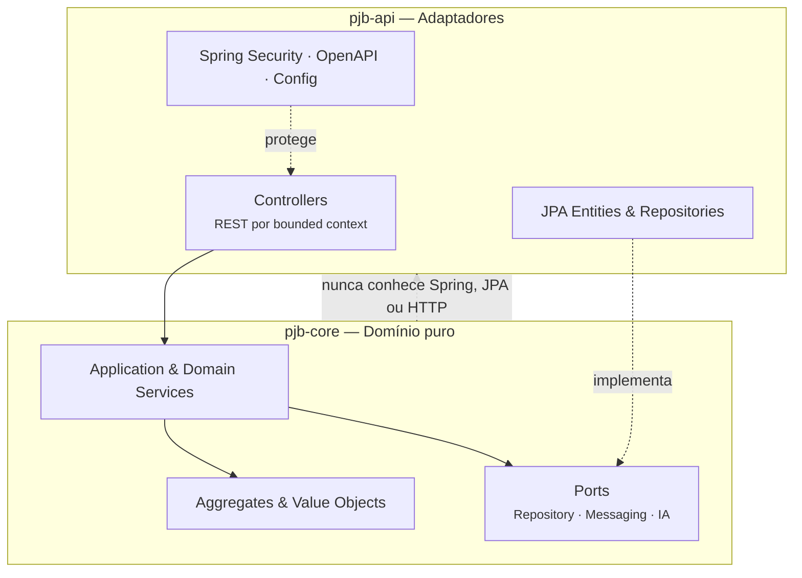

<div align="center">

# ⚖️ PJB — Plataforma Judicial Brasileira

### Sistema judicial eletrônico de nova geração, projetado para substituir integralmente PJe, e-SAJ, eProc, Creta e Projudi em todos os segmentos da Justiça brasileira


**[🇧🇷 Português (este arquivo)](./README.md)** · **[🇬🇧 English](./README.en.md)** · **[📓 Guia Visual Interativo](docs/product/GUIA_VISUAL_INTERATIVO.md)**

</div>

---

## Navegação rápida

**Início rápido**
- [Sobre o projeto](#sobre-o-projeto)
- [O problema](#o-problema)
- [A proposta](#a-proposta)
- [Glossário](#glossário)
- [Guia visual interativo](#guia-visual-interativo)
- [Pré-requisitos](#pré-requisitos)
- [Instalação e configuração](#instalação-e-configuração)
- [Como executar](#como-executar)
- [Testes](#testes)
- [Documentação da API](#documentação-da-api)

**Arquitetura e domínio**
- [Domínio](#domínio)
- [Arquitetura](#arquitetura)
- [Stack técnica](#stack-técnica)
- [Módulos funcionais](#módulos-funcionais)
- [Aceleradores inteligentes](#aceleradores-inteligentes)
- [Ritos processuais cobertos](#ritos-processuais-cobertos)

**Infraestrutura e qualidade**
- [Segurança e conformidade](#segurança-e-conformidade)
- [Concorrência e execução assíncrona](#concorrência-e-execução-assíncrona)
- [Escalabilidade e resiliência operacional](#escalabilidade-e-resiliência-operacional)
- [Banco de dados](#banco-de-dados)
- [Qualidade executável](#qualidade-executável)
- [Observabilidade](#observabilidade)
- [Substituição nacional](#substituição-nacional)

**Contribuição e projeto**
- [Contribuindo](#contribuindo)
- [Sincronização Git segura](#sincronização-git-segura)
- [Próximos passos](#próximos-passos)
- [Autor](#autor)
- [Licença](#licença)

[⬆ Voltar à navegação rápida](#navegação-rápida)

---

## Sobre o projeto

O PJB é uma plataforma de substituição total — não incremental — dos sistemas judiciais eletrônicos em uso no Brasil. Cinco sistemas foram construídos ao longo de décadas por entidades diferentes, sem nenhuma coordenação de protocolo, modelo de dados ou interface. O resultado é uma infraestrutura que hoje suporta mais de **80 milhões de processos ativos**, **91 tribunais** e **cerca de 30 mil magistrados**, mas que não foi projetada para escalar, auditar ou integrar com o rigor que a legislação e a sociedade passaram a exigir.

O PJB foi construído do zero com três compromissos inegociáveis: rastreabilidade total em cada ação do sistema, testabilidade como critério de aceite de qualquer funcionalidade e segurança por construção — ABAC, RLS e propagação governada de sigilo não são camadas adicionadas depois, são restrições que guiam cada decisão arquitetural.

[⬆ Voltar à navegação rápida](#navegação-rápida)

---

## O problema

| Sistema | Tribunal principal | Problema central |
|---------|-------------------|-----------------|
| PJe | CNJ / maioria dos tribunais | Acoplamento forte entre UI e domínio, rotas sem contrato |
| e-SAJ | TJSP, TJBA e outros estaduais | Modelo de dados proprietário, sem API pública |
| eProc | TRF1, TRF4 e estaduais | Jobs isolados, assinaturas frágeis |
| Creta | Justiça do Trabalho | Baixa observabilidade, sem suporte a novos ritos |
| Projudi | Tribunais estaduais menores | Débito técnico crítico, sem path de migração |

Nenhum dos cinco foi projetado com escalabilidade horizontal, auditoria de acesso granular ou suporte completo às classes processuais do CPC/2015 e das reformas trabalhistas. O PJB não é uma reescrita deles. É uma ruptura deliberada com esse modelo.

[⬆ Voltar à navegação rápida](#navegação-rápida)

---

## A proposta

O PJB foi projetado do zero com três compromissos inegociáveis:

**1. Rastreabilidade total.** Toda decisão de acesso, distribuição, movimentação e comunicação produz uma trilha auditável, imutável e explicável. Não existe ação no sistema que não possa ser reconstituída — quem fez, quando fez, com qual autoridade e qual foi o efeito.

**2. Testabilidade como critério de aceite.** Nenhuma funcionalidade existe sem comportamento verificável. A suíte de testes é o contrato executável do sistema — se o teste passa, o comportamento está garantido. Funcionalidade sem teste não é funcionalidade: é intenção.

**3. Segurança por construção.** ABAC, RLS por operação, propagação governada de contexto sigiloso e Step-up Gov.br não são camadas adicionadas depois. São restrições que guiam cada decisão arquitetural desde o início — antes do primeiro endpoint, antes da primeira migration, antes da primeira linha de código de domínio.

[⬆ Voltar à navegação rápida](#navegação-rápida)

---

## Glossário

> Termos jurídicos e técnicos usados a partir daqui — útil para quem não vem de engenharia de software.

| Termo | Significado |
|-------|-------------|
| **NPU** | Número Processo Único — identificador padronizado CNJ (ex: 0000001-00.2024.8.26.0001) |
| **Rito** | Fluxo processual obrigatório definido pela lei (ordinário, sumaríssimo, JEC, etc.) |
| **Autuação** | Ato de registrar formalmente o processo no sistema, com classe, assunto e partes |
| **Distribuição** | Atribuição do processo a uma vara ou juízo competente |
| **Movimentação** | Qualquer ato praticado sobre o processo (despacho, decisão, sentença, certidão) |
| **GIGS** | Grupo de Atividades — conjunto de tarefas processuais com prazo e responsável |
| **Sobrestamento** | Suspensão temporária do processo aguardando julgamento de paradigma |
| **BATNA** | Best Alternative to a Negotiated Agreement — análise de alternativa ao acordo |
| **ABAC** | Attribute-Based Access Control — controle de acesso por atributos do contexto |
| **RLS** | Row Level Security — política de segurança aplicada no nível do banco de dados |
| **ADR** | Architecture Decision Record — registro formal de decisão arquitetural |
| **ICP-Brasil** | Infraestrutura de Chaves Públicas Brasileira — padrão de assinatura digital |
| **Gov.br** | Sistema de autenticação federal com níveis de confiança bronze, prata e ouro |
| **PDPJ** | Plataforma Digital do Poder Judiciário — barramento de integração nacional |
| **MNI** | Modelo Nacional de Interoperabilidade — protocolo de troca entre sistemas judiciais |
| **CNJ** | Conselho Nacional de Justiça — órgão regulador que define classes, assuntos e tabelas |
| **JEC** | Juizado Especial Cível |
| **JEF** | Juizado Especial Federal |
| **JEFP** | Juizado Especial da Fazenda Pública |
| **BO** | Boletim de Ocorrência |
| **SBOM** | Software Bill of Materials — inventário auditável de dependências |
| **CPF** | Cadastro de Pessoa Física — identificador tributário individual brasileiro |
| **CNPJ** | Cadastro Nacional de Pessoa Jurídica — identificador tributário de empresas brasileiras |

[⬆ Voltar à navegação rápida](#navegação-rápida)

---

## Guia visual interativo

Prefere entender o PJB em diagramas antes de mexer em código? O **[📓 Guia Visual Interativo](docs/product/GUIA_VISUAL_INTERATIVO.md)** é onde isso vive — com imagens e diagramas reais, não só texto:

<div align="center">


*Prévia: quem entra no PJB e por onde — o guia completo detalha inclusive o que muda entre juiz, desembargador e ministro*

</div>

No guia completo você encontra:

- **quem entra no PJB e como cada perfil se autentica** — cidadão, advocacia, magistratura (com o detalhe de juiz × desembargador × ministro), Ministério Público, Defensoria, Procuradoria, perito, e mais;
- o passo a passo de como uma ação é ajuizada, da petição ao protocolo;
- como funciona a triagem inteligente que analisa cada petição antes de virar processo (e por que ela **não** é a Laiane);
- a **calculadora judicial** com exemplo real de entrada e saída — cada verba calculada, com a lei que a fundamenta;
- as **ferramentas por processo do advogado** — honorários de sucumbência, regularidade OAB, conflito de agenda em audiência, substabelecimento de procuração, custas consolidadas e produtividade do escritório;
- a **bancada de acordo** com o relatório BATNA completo — valor em discussão, custo de cada lado, probabilidade de recurso;
- **Laiane**, a inteligência artificial jurídica do projeto — o que ela faz para cada papel, as travas que garantem que ela nunca decide sozinha, e a homenagem por trás do nome.

Esse conteúdo fica deliberadamente fora deste README — aqui o foco é documentação técnica; lá, o foco é entender o comportamento do sistema sem precisar ler Java.

[⬆ Voltar à navegação rápida](#navegação-rápida)

---

## Pré-requisitos

Antes de clonar e rodar o projeto, certifique-se de ter instalado:

| Ferramenta | Versão mínima | Finalidade |
|------------|--------------|-----------|
| **JDK** | 21 | Compilação e execução (Virtual Threads obrigatórias) |
| **Maven** | 3.9+ | Build multi-module (`pjb-core` + `pjb-api`) |
| **Docker** | 24+ | PostgreSQL, Kafka, Redis, Elasticsearch via Compose |
| **Docker Compose** | v2 (plugin) | Orquestração da infraestrutura local |
| **Python** | 3.10+ | Guards estruturais em `scripts/` |

> **IDE recomendada:** IntelliJ IDEA 2024+ com os plugins Checkstyle e SonarLint ativos. O projeto usa records, sealed classes e pattern matching do Java 21 — versões anteriores da IDE não reconhecem toda a sintaxe.

[⬆ Voltar à navegação rápida](#navegação-rápida)

---

## Instalação e configuração

### 1. Clonar o repositório

```bash
git clone https://github.com/tiagorabelo0403/pjb-tcc.git
cd pjb-tcc
```

### 2. Configurar variáveis de ambiente

```bash
cp .env.example .env
```

Abra o `.env` e preencha as variáveis obrigatórias:

| Variável | Descrição | Exemplo |
|----------|-----------|---------|
| `PJB_PG_HOST` | Host do PostgreSQL | `localhost` |
| `PJB_PG_PORT` | Porta do PostgreSQL | `5432` |
| `PJB_PG_PASSWORD` | Senha do banco | `pgpassword` |
| `PJB_MASTER_KEY_BASE64` | Chave mestra de criptografia (Base64, 32 bytes) | gerada pelo script |
| `PJB_ANTHROPIC_API_KEY` | Chave da API Anthropic para módulos de IA | `sk-ant-...` |
| `PJB_KAFKA_BOOTSTRAP` | Endereço do broker Kafka | `localhost:9092` |

> Para ambientes de demonstração, o `.env.example` já contém valores funcionais que o `demo.sh` / `demo.cmd` usa automaticamente.

### 3. Subir a infraestrutura

```bash
docker compose up -d
```

Isso sobe PostgreSQL 17, Apache Kafka 3.8, Redis 7.4 e Elasticsearch 8.15. As migrations Flyway (numeração até V331) são aplicadas automaticamente na primeira conexão do backend.

### 4. Verificar os profiles Spring

O projeto usa profiles Spring Boot separados por ambiente. O arquivo base é `application.yml`; cada profile sobrescreve apenas o que muda:

| Profile | Arquivo | Quando usar |
|---------|---------|------------|
| `dev` | `application-dev.yml` | Desenvolvimento local com infraestrutura no Docker |
| `local` | `application-local.yml` | Banco e serviços rodando diretamente no host |
| `docker` | `application-docker.yml` | Backend dentro de container Docker |
| `prod` | `application-prod.yml` | Produção — exige todas as variáveis de ambiente |
| `k8s` | `application-k8s.yml` | Kubernetes |

Para rodar localmente, o profile `dev` é o recomendado. Ele é ativado automaticamente pelo `demo.sh` / `demo.cmd`. Para ativar manualmente:

```bash
# Via Maven
./mvnw spring-boot:run -pl pjb-api -Dspring-boot.run.profiles=dev

# Via variável de ambiente
export SPRING_PROFILES_ACTIVE=dev
java -jar pjb-api/target/pjb-api.jar
```

### 5. Compilar

```bash
# Compilar o módulo de domínio
./mvnw install -pl pjb-core -DskipTests

# Compilar o módulo de API (inclui geração de classes de teste)
./mvnw test-compile -pl pjb-api
```

[⬆ Voltar à navegação rápida](#navegação-rápida)

---

## Como executar

### Quickstart completo (recomendado)

O script de demonstração faz tudo em sequência: copia o `.env`, compila, sobe a infraestrutura, aplica as migrations e aguarda o backend ficar saudável.

```bash
# Linux / macOS
bash demo.sh

# Windows
demo.cmd
```

### Executar apenas o backend (infraestrutura já no ar)

```bash
# Via Maven Wrapper (recomendado em desenvolvimento)
./mvnw spring-boot:run -pl pjb-api

# Via JAR empacotado
./mvnw package -pl pjb-api -DskipTests
java -jar pjb-api/target/pjb-api.jar
```

### Backend completo via Docker (build + infra juntos)

```bash
docker compose --profile app up -d --build
```

O serviço `backend` está no profile `app`. Sem ele, o Compose sobe apenas a infraestrutura de suporte. Se a porta `5432` já estiver em uso localmente, defina `PJB_PG_PORT=5433` no `.env` — o backend em Docker continua acessando `postgres:5432` pela rede interna do Compose.

### JVM dentro de container — receita anti-`killed` (OOM)

Container Java mal calibrado é a receita clássica pra `killed` sem heap dump: a JVM enxerga a RAM da máquina hospedeira, aloca heap grande demais, e o kernel do container mata o processo por ultrapassar o limite de memória — sem stack trace, sem dump, só um exit silencioso. O `pjb-runtime.sh` (entrypoint da imagem) resolve isso automaticamente, calculando as flags da JVM a partir do próprio limite do cgroup:

- Detecta o limite de memória do container (`/sys/fs/cgroup/memory.max` em v2, `memory.limit_in_bytes` em v1) e o de CPU (`cpu.max` ou `cpu.cfs_quota_us`) sem depender do que o host reporta.
- Reserva memória nativa proporcional ao tamanho do container (34% para 512Mi–1Gi, 30% para 2Gi, 26% para 4Gi, 24% para ≥8Gi) — porque metaspace + direct memory + code cache + stacks nativas não são heap e precisam de espaço.
- `MaxRAMPercentage`, `InitialRAMPercentage`, `MaxMetaspaceSize`, `MaxDirectMemorySize`, `ReservedCodeCacheSize` escalam por faixa de tamanho — nada é hardcoded pra um perfil só.
- `-XX:+UseContainerSupport -XX:+ExitOnOutOfMemoryError -XX:+HeapDumpOnOutOfMemoryError` garantem que qualquer OOM real gere dump e o container saia limpo (não vira zumbi), com `HeapDumpPath` configurável.
- GC log e JFR opcionais por env (`PJB_JVM_GC_LOG_ENABLED`, `PJB_JVM_JFR_ENABLED`) — sem custo se desativados.
- Três perfis por env `PJB_JVM_PROFILE`: `balanced` (G1GC, default), `latency` (ZGC generational), `startup` (G1GC + dedup).

A tabela de decisão está travada por um guard Python dedicado (`scripts/pjb_runtime_memory_recipe_guard.py`) que executa as funções bash isoladas do script real com limites simulados (512Mi/1Gi/2Gi/4Gi/8Gi/16Gi) e falha se qualquer valor divergir — mudança na fórmula fica obrigada a ser consciente.

### Endpoints após subir

| Endpoint | Descrição |
|----------|-----------|
| `http://localhost:8080/livez` | Liveness check |
| `http://localhost:8080/demo/status` | Estatísticas em tempo real |
| `http://localhost:8080/swagger-ui/index.html` | Documentação interativa da API |
| `http://localhost:8080/v3/api-docs` | Especificação OpenAPI 3.1 (JSON) |
| `http://localhost:8080/actuator/health` | Health check completo |
| `http://localhost:8080/actuator/metrics` | Métricas Micrometer |

Com o profile `docker`, o sistema semeia automaticamente usuários e processos de demonstração.

**Para encerrar:**
```bash
docker compose down
```

[⬆ Voltar à navegação rápida](#navegação-rápida)

---

## Testes

O projeto tem dois níveis de teste com características bem diferentes:

- **Testes unitários (Surefire):** 5.001 testes com Mockito e H2 em memória. Rápidos, sem dependência de Docker.
- **Testes de integração (Failsafe):** 306 testes contra PostgreSQL e Kafka reais via Testcontainers. Exigem Docker. Demoram mais.

### Rodar apenas os testes unitários (rápido)

```bash
./mvnw test -pl pjb-api
```

Tempo esperado: **~14 min** em hardware local. Não precisa de Docker rodando.

### Rodar a suíte completa com integração (portão oficial)

```bash
./mvnw verify -pl pjb-api
```

Esse comando é o portão oficial do projeto. Ele roda os 5.001 unitários (Surefire) e depois os 306 testes de integração (Failsafe) contra containers reais de PostgreSQL 17 e Kafka. O Testcontainers sobe e derruba os containers automaticamente — não é preciso configurar nada manualmente.

Tempo esperado: **~50 min** em hardware local (a maior parte é o boot do Spring com Testcontainers e a execução dos ITs que fazem requisições HTTP reais contra o servidor). Um verify completo produz diagnóstico de todos os clusters de falha da suíte — se você está investigando um problema específico, esse é o número que importa, não o do `test`.

> **Por que tão demorado?** Cada classe de IT sobe um contexto Spring completo com PostgreSQL real, aplica as migrations Flyway e executa as requests HTTP como um cliente externo faria. Isso dá confiança total de que o que passou em teste vai passar em produção — mas tem um custo de tempo.

O `argLine` do Surefire/Failsafe fixa `-Dpjb.runtime.lifecycle.drain-quiet-period=10ms`. O coordenador de drenagem graciosa (`PjbRuntimeDrainCoordinator`) dorme 20s por padrão a cada fechamento de contexto Spring — correto em produção, onde existe tráfego real para drenar antes do shutdown, mas puro desperdício numa JVM de teste. Sem esse override, um `verify` completo pode estourar o watchdog de 30s do próprio Surefire (`forkedProcessExitTimeoutInSeconds`) e matar a JVM forkada à força no encerramento, mesmo com todos os testes já verdes — sintoma que só aparece em rodadas longas, nunca isolando uma classe.

### Se o `test`/`verify` começar a "cair" sem motivo aparente

Se rodadas de teste passarem a ser mortas logo no início (ou o build ficar lento e instável), quase sempre a causa é **JVM de teste órfã**: quando um `mvnw` é interrompido abruptamente, a JVM forkada do Surefire/Failsafe (`-Xmx4g`) pode sobreviver sem processo pai que a encerre e ir acumulando até sufocar a memória da máquina, matando os próximos runs. Não é flag de JVM mal configurada — é processo zumbi. Há um guard dedicado para detectar e limpar isso:

```bash
python scripts/reap_orphan_test_jvms.py         # lista as JVMs de teste órfãs (report-only)
python scripts/reap_orphan_test_jvms.py --kill  # encerra as órfãs e libera a memória
```

Multiplataforma (Windows/Linux/macOS), somente stdlib. Report-only por padrão (sai com código ≠ 0 se achar órfãs, útil como sinal em CI); `--kill` reapa. Não é amarrado ao build automaticamente — rode-o quando notar instabilidade, antes de uma rodada longa.

Se o Docker (não a JVM) ficar lento ou `verify` travar tentando subir os containers do Testcontainers, a causa mais comum é **container zumbi**: um container preso em `unhealthy` por horas/dias (tipicamente por um `docker-compose up` parcial, com uma dependência que nunca subiu) segura CPU/memória da VM do Docker Desktop indefinidamente, sem servir a nada. Guard dedicado:

```bash
python scripts/docker_zombie_container_guard.py         # lista containers zumbis (report-only)
python scripts/docker_zombie_container_guard.py --kill  # para e remove os zumbis
```

Marca como zumbi qualquer container `unhealthy` por mais de 30 minutos (configurável via `--unhealthy-threshold-minutes`) ou com 5+ restarts (via `--restart-count-threshold`). Sai silenciosamente com código 0 se o daemon Docker estiver indisponível — não é um guard de "Docker precisa estar rodando".

### Rodar um teste específico com stack trace completo

```bash
./mvnw test -pl pjb-api -Dtest=NomeDoTeste -DtrimStackTrace=false
```

### Métricas atuais

| Métrica | Fase | Valor |
|---------|------|-------|
| Total de testes unitários | Surefire | **5.001** |
| Falhas unitários | Surefire | **0** |
| Skipped | Surefire | 5 |
| Tempo unitários | Surefire | **~14 min** |
| Total de testes de integração | Failsafe | **306** ¹ |
| Testes do motor de composição de polos | Failsafe | **+10 verdes** (papel por rito: ACUSACAO, RECLAMANTE, IMPETRANTE, SEGURADO…) |
| Falhas IT | Failsafe | **0** (0E + 0F) |
| Tempo verify completo | Surefire + Failsafe | **~50 min** |

A suíte de integração passou por uma etapa de estabilização estrutural: falhas por variável de ambiente incorreta, contaminação de dados entre testes e IDs hardcoded sem seed foram eliminadas por completo.

O `verify` padrão (Failsafe) não alcança 13 métodos de teste distribuídos em 6 classes¹ que combinam a convenção `*Test.java` com `@Tag("integration")` — o Surefire exclui essas classes por tag e o Failsafe não as reconhece pelo padrão de nome de arquivo. Todas as 13 já foram confirmadas verdes individualmente via `-Dit.test=`, mas ficam fora da contagem de rotina do `verify`.

O histórico de decisões técnicas, dívidas conhecidas e critérios de fechamento de cada frente de trabalho está documentado em [`docs/quality/DEBT_LOG.md`](./docs/quality/DEBT_LOG.md) e nos [ADRs](./docs/adr/).

¹ `OabLegitimidadePeticionamentoTest`, `PjbFluxoJudicialCompletoE2ETest`, `DistribuicaoProcessoProtocoladoTest`, `ConsultaPublicaProcessoProtocoladoTest`, `ApiMarketplaceServicePoloMaterializacaoTest`, `ApiMarketplaceServiceCompletudeDocumentalTest`. Atenção: `-Dit.test=` só tem efeito sob os goals `integration-test`/`verify` — sob o goal `test` ele é ignorado silenciosamente e o Surefire roda a suíte unitária inteira.

### Relatório de cobertura (JaCoCo)

```bash
./mvnw test -pl pjb-api
# Relatório gerado em:
# pjb-api/target/site/jacoco/index.html
```

[⬆ Voltar à navegação rápida](#navegação-rápida)

---

## Documentação da API

O PJB expõe documentação interativa completa via **Swagger UI**, disponível após subir o backend:

```
http://localhost:8080/swagger-ui/index.html
```

A especificação OpenAPI 3.1 está disponível em:

```
http://localhost:8080/v3/api-docs
```

Os contratos versionados também estão documentados estaticamente em:

```
docs/openapi/
```

Toda rota REST é registrada no registry canônico de bounded contexts. O `PjbOpenApiContractWeaknessDetectorTest` valida automaticamente que nenhuma rota existe sem contrato OpenAPI registrado, que nenhum campo usa `Map<String,Object>` sem schema tipado e que datas seguem `format: date-time`.

[⬆ Voltar à navegação rápida](#navegação-rápida)

---

## Domínio

### Atores

| Ator | Papel no sistema |
|------|-----------------|
| **Magistrado** | Profere decisões, assina documentos, gerencia sua pauta |
| **Servidor / Escrevente** | Realiza atos de secretaria, emite certidões, movimenta processos |
| **Advogado / Defensor** | Peticiona, acompanha prazos, acessa autos conforme sigilo |
| **Promotor / Procurador** | Atua nos processos de sua lotação e instância |
| **Parte / Jurisdicionado** | Acessa o que a lei lhe permite, sem identificação de magistrado |
| **Administrador institucional** | Configura varas, competências, calendários e acessos |
| **Sistema externo** | PJe, e-SAJ, eProc, MNI, PDPJ — integrados via envelope canônico |

### Conceitos centrais do domínio

**Processo judicial** é o aggregate raiz. Tem NPU (Número Processo Único), classe processual CNJ, assunto, valor da causa, rito, partes, representantes e movimentações. Cada processo existe dentro de uma jurisdição com competência material e territorial definida.

**Rito processual** define o fluxo obrigatório: quais fases existem, quais prazos se aplicam, quais atos são possíveis em cada fase. O catálogo é selado — nenhum rito pode ser inventado em runtime. Isso impede que o sistema aceite configurações inválidas.

**Distribuição** é o ato de atribuir um processo a uma vara. O motor de distribuição avalia natureza, competência, rito, comarca, carga da unidade e regras do tribunal. Cada decisão produz uma explicação auditável com todos os critérios avaliados.

**Movimentação** é qualquer ato sobre o processo: despacho, decisão interlocutória, sentença, acórdão, certidão, mandado. Cada movimentação tem autor, timestamp, hash de integridade e vínculo com o ato processual correspondente.

**Sigilo** é uma dimensão transversal. Um processo sigiloso restringe visibilidade até o nível de registro no banco de dados, via Row Level Security. A propagação de sigilo em operações assíncronas é governada — nunca vazada.

**Jurisdição** é a unidade estrutural de competência: uma vara, uma câmara, uma seção judiciária. Tem grau, esfera, natureza, competência material e territorial. A hierarquia de jurisdições modela todos os segmentos: federal, estadual, trabalhista, eleitoral, militar.

### Bounded contexts

| Context | Responsabilidade |
|---------|-----------------|
| `institucional` | Órgãos, varas, lotações, competências, afiliações, credenciais |
| `processo` | Processo, movimentações, partes, prazos, distribuição |
| `documentos` | Documentos, dossiê, cadeia de custódia, assinaturas |
| `comunicacao` | Mandados, certidões, domicílio eletrônico, intimações |
| `seguranca` | ABAC, autenticação, auditoria, sigilo, Gov.br, ICP-Brasil |
| `criminal` | Boletins de ocorrência, inquéritos policiais, delegacias institucionais, escopo policial hierárquico por lotação |
| `analytics` | Process mining, gargalos, Justiça em Números, relatórios |
| `ia` | IA jurídica auditável, Memory Stores, Dreams, síntese reflexiva |
| `integracao` | Envelope canônico PDPJ/MNI, normalizadores PJe/e-SAJ/eProc |
| `advocacia` | Escritório, delegações, filas de assinatura, workspace |
| `laiane` | Módulo especializado de assistência jurídica via IA |

[⬆ Voltar à navegação rápida](#navegação-rápida)

---

## Arquitetura

### Estrutura de módulos

O projeto segue arquitetura hexagonal com separação estrita entre domínio e infraestrutura:

```
pjb/
├── pjb-core/                         domínio puro — zero dependência de Spring
│   └── src/main/java/
│       └── com/tcc/pjb/core/
│           ├── domain/               aggregates, entities, value objects
│           ├── service/              application services e domain services
│           ├── port/                 interfaces de saída (repository, messaging)
│           └── ia/                   ports de IA jurídica
│
├── pjb-api/                          adaptadores — Spring Boot, JPA, HTTP
│   └── src/main/java/
│       └── com/tcc/pjb/backend/
│           ├── controller/           REST endpoints por bounded context
│           ├── model/entity/         entidades JPA
│           ├── model/repository/     Spring Data repositories
│           ├── core/                 serviços de aplicação e domínio
│           ├── configs/              Spring, Security, OpenAPI, DataSource
│           └── modules/              módulos especializados (laiane, advocacia)
│
├── docs/
│   ├── adr/                          57 Architecture Decision Records
│   ├── database/                     esquemas e políticas RLS
│   ├── openapi/                      contratos de API pública
│   ├── security/                     políticas LGPD e Gov.br
│   └── product/                      matriz de substituição nacional
│
├── scripts/                          guards Python — higiene estrutural contínua
├── config/                           Checkstyle e SpotBugs
└── infra/                            Kubernetes, gateway, infraestrutura
```

### Camadas e dependências



`pjb-core` não conhece Spring, JPA nem HTTP — a seta de dependência aponta sempre de fora para dentro, nunca o inverso. Toda injeção é por construtor com `@Inject` (Jakarta). Repositories são interfaces de porta em `pjb-core`; as implementações JPA ficam em `pjb-api`.

### Padrões arquiteturais aplicados

| Padrão | Onde | Por quê |
|--------|------|---------|
| Hexagonal (Ports & Adapters) | Estrutura global | Isolar domínio de infraestrutura |
| Aggregate Pattern (DDD) | `Processo`, `Jurisdicao`, `Usuario` | Invariantes de domínio garantidas |
| Outbox Pattern | Efeitos pós-commit | Zero perda de evento em falha de commit |
| CQRS leve | Analytics e projeções | Leituras materializadas sem pressão no write path |
| Sealed classes | `RitoProcessual`, `TipoJurisdicao` | Catálogo fechado, exaustividade em compile-time |
| Virtual Threads (Java 21) | Toda execução assíncrona | Alta concorrência sem pool sizing manual |
| Scoped Values (Java 21) | Propagação de sigilo | Contexto sigiloso não vaza entre Virtual Threads |
| Structured Concurrency | Operações multi-rito | Falha de um filho cancela os demais, sem leak |

[⬆ Voltar à navegação rápida](#navegação-rápida)

---

## Stack técnica

| Componente | Tecnologia |
|------------|-----------|
| Linguagem | Java 21 — Virtual Threads, Records, Sealed Interfaces, Pattern Matching |
| Framework | Spring Boot 3.5, Spring Framework 6 |
| Build | Maven multi-module (`pjb-core` + `pjb-api`) |
| Banco | PostgreSQL 17 com Row Level Security por operação |
| Banco de testes | H2 em memória + Testcontainers |
| Migrations | Flyway — numeração até V331, com particionamento mensal em tabelas de evento |
| Persistência | JPA / Hibernate com `ddl-auto: validate` em produção |
| Mensageria | Apache Kafka 3.8 — eventos judiciais e outbox |
| Orquestração de workflow | Camunda 8 / Zeebe — BPMN aplicado ao fluxo de ajuizamento |
| Cache | Redis 7.4 |
| Busca | Elasticsearch 8.15 |
| Segurança | Spring Security, ABAC, Gov.br, ICP-Brasil, Passkey/WebAuthn |
| Resiliência | Resilience4j — Circuit Breaker auditável, Bulkhead, Retry, Timeout |
| Contratos | Pact — Consumer-Driven Contract Testing |
| IA Jurídica | Anthropic Claude API — Memory Stores, Dreams, síntese reflexiva |
| Observabilidade | Micrometer, Spring Actuator, Process Mining materializado |
| Análise estática | Qodana (JetBrains), JaCoCo, Checkstyle, SpotBugs, ArchUnit |
| Guards estruturais | 7 scripts Python + ArchUnit integrados ao CI |
| Containerização | Docker Compose (dev/test), Kubernetes (produção) |

[⬆ Voltar à navegação rápida](#navegação-rápida)

---

## Módulos funcionais

O backend está organizado em 15 módulos funcionais. Clique em qualquer um para expandir os detalhes.

<details>
<summary><strong>1 — Governança institucional</strong></summary>
<br>

Gerencia papel, lotação, localização, competência e visibilidade de cada ator no processo. A matriz de visibilidade produz uma explicação auditável para cada decisão de acesso — quem pode ver o quê, por qual motivo, com registro imutável.

Inclui gestão de afiliações, credenciais institucionais, atestação de fonte oficial e delegações formais entre unidades.
</details>

<details>
<summary><strong>2 — Motor de rito e distribuição inteligente</strong></summary>
<br>

Distribui processos por natureza, competência, rito e comarca. Suporta vara única, comarca do interior, JEC itinerante e qualquer configuração de tribunal. O engine explainável documenta cada critério avaliado na decisão de distribuição — nenhuma distribuição é uma caixa-preta.

O critério de competência territorial é propriedade do rito (`CriterioTerritorial` mapeia CPC art. 47/48/53-II, CLT art. 651 e CPP art. 70) — rito sem critério verificado devolve ausência explícita, nunca presume o domicílio do réu por padrão. O catálogo `tb_jurisdicao_territorial` resolve o município (por código IBGE) na(s) unidade(s) competente(s) via `CompetenciaTerritorialResolver`, com exclusão de sobreposição temporal garantida pelo próprio schema (constraint `EXCLUDE` do PostgreSQL, não validação de aplicação) e suporte nativo a município com competência concorrente entre varas — Belo Horizonte tem 48 varas trabalhistas concorrentes numa única linha de catálogo, Fortaleza 18, Natal 13.

Três regiões da Justiça do Trabalho foram carregadas com dado real, extraído de PDF oficial do TST e cruzado contra a API de localidades do IBGE — não como cobertura nacional, como demonstração de que o motor funciona de ponta a ponta sem redesenho de schema entre regiões:

| Região | Municípios | Unidades (varas) | Pares município-vara | Fonte |
|--------|-----------|-------------------|----------------------|-------|
| TRT7 — Ceará | 184 | 37 | 288 | `End07.pdf` |
| TRT3 — Minas Gerais | 847 | 155 | 1.498 | `End03.pdf` |
| TRT21 — Rio Grande do Norte | 129 | 20 | 411 | `End21.pdf` |
| **Total** | **1.160** | **212** | **2.197** | — |

Cada carga cruzou o nome do município do PDF contra a lista oficial do IBGE por código de 7 dígitos e UF — nunca por nome isolado. Homônimos entre estados existem de verdade e foram provados, não hipotetizados: São Gonçalo do Amarante (RN e CE) e Ouro Branco (RN e MG) resolvem para tribunais diferentes a partir do mesmo nome em testes dedicados — é o código IBGE que garante a resolução correta, não o texto do nome. Divergências de grafia entre o PDF e o cadastro oficial (acento, hífen, "de/do/dos" trocado, e um caso de nome popular que o IBGE nunca formalizou — Boa Saúde, cadastrada desde 1953 como Januário Cicco) foram resolvidas por correspondência única confirmada contra a lista completa de cada estado, nunca por aproximação; nome que não bateu ficou de fora e está documentado.

`vigencia_inicio` usa uma data presumida (promulgação da CF/88) por continuidade nas três regiões — decisão mantida mesmo quando o documento-fonte trazia data de instalação real por vara (caso do TRT3/MG, com varas de Belo Horizonte instaladas entre 1941 e 2013), porque o schema atual só suporta um `vigencia_inicio` por linha de município, não por vara individual (`D-vigencia-trt7-e-futuras-regioes-presumida-nao-documentada`, `docs/quality/DEBT_LOG.md`). Duas inconsistências recorrentes na fonte primária do TST ficaram registradas como dívida em vez de contornadas silenciosamente: código de vara duplicado entre unidades fisicamente distintas (3 pares no MG, 3 pares no RN, por causas diferentes em cada região — `D-trt3-codigo-unidade-duplicado-fonte`) e municípios sem nenhuma vara documentada (6 no MG por provável competência delegada ao juiz de direito da comarca, 38 no RN cobertos por um Posto Avançado sem código formal atribuído — `D-trt3-municipios-sem-vara-competencia-delegada`, `D-trt21-posto-avancado-sem-codigo`).

Cada uma das três cargas é travada por teste de regressão permanente contra o documento-fonte — a distribuição de varas por município é reparseada de forma independente do script que gerou a migration antes de virar `assert`, para que uma alteração futura na migration ou uma migration de outra região que corrompa dado por acidente de nome de tabela seja detectada, não silenciosamente aceita.

**Tribunal e Comarca como entidade real.** `Tribunal` e `Comarca` são entidades JPA próprias (`model/entity/competencia/`), não mais texto solto — `UnidadeJudiciariaCompetencia`, `JurisdicaoTerritorial`, `Jurisdicao`, `Usuario`, `Processo`, `WorkItem`, `OrgaoJudiciario`, `PeritoSorteioAudit` e `PeritoDisponibilidade` referenciam `Comarca` por FK. Como o catálogo de `Comarca` hoje só cobre os municípios das três regiões trabalhistas carregadas acima (CE/MG/RN), cada uma dessas nove entidades mantém `uf`/`comarca` como coluna String real ao lado da FK — nunca dado descartado por falta de cobertura de catálogo, a FK resolve quando o município está catalogado e o texto continua sendo a fonte de verdade nos demais. `AssessorGabineteGuardRailService.territoryMatches()` compara por identidade real (`Comarca.getId()`) quando as duas pontas resolvem a FK, e cai na comparação textual normalizada nos demais casos — elimina, para os municípios já catalogados, a classe de bug em que grafia divergente entre o cadastro do assessor e o do processo produzia falso positivo ou falso negativo de correspondência territorial. Um teste de arquitetura (`OrganizacaoJudiciariaArchitectureTest`) trava qualquer entidade nova que declare `uf`/`comarca` como String sem a FK `Comarca` correspondente na mesma classe; entidades pré-existentes em outros domínios que ainda não seguem esse padrão estão listadas em `docs/quality/DEBT_LOG.md` (`D-territorio-string-solta-entidades-legadas`).

**Motor de urgência por rito.** `RitoUrgenciaPriorityPolicy` classifica cada rito em três níveis com fundamento legal real, não arbitrário: habeas corpus e Lei Maria da Penha em urgência máxima (CF art. 5º, LXVIII; Lei 11.340/06 arts. 18 e 22), tutela de urgência e ato infracional do ECA em urgência alta (CPC art. 300; ECA art. 108), os demais ritos em prioridade padrão. O nível se traduz em prioridade de `WorkItem` — a política só escalona, nunca de-escalona uma prioridade já mais urgente atribuída por outra origem — e nas mesmas tags consumidas pela fila de secretaria (`SecretariatQueuePriorityPolicy`) e pelos painéis do Ministério Público e da Defensoria Pública: um único motor alimenta os quatro pontos de consumo, sem sinal de urgência calculado de forma divergente em cada canal.
</details>

<details>
<summary><strong>3 — Motor de celeridade constitucional</strong></summary>
<br>

Monitora prazos constitucionais por rito, calcula gargalos sistêmicos e sugere aceleradores por área do direito. Não pressiona magistrados individualmente — identifica onde o sistema está lento e por quê, com dados agregados e anônimos.
</details>

<details>
<summary><strong>4 — Painel interno e secretaria cartorária</strong></summary>
<br>

Filas inteligentes com priorização semântica, agrupadores por similaridade, lote de assinatura com conferência obrigatória e hash SHA-256 por documento. Cada ato de secretaria tem rastreabilidade de quem fez, quando, com qual resultado e em qual estado o processo se encontrava.
</details>

<details>
<summary><strong>5 — Aceleradores por área do direito</strong></summary>
<br>

Fluxos especializados para cível, criminal, trabalhista, eleitoral, família, execução, Juizados Especiais (cível, federal e da Fazenda Pública), precatório, falimentar e controle concentrado de constitucionalidade. Cada área tem checklist computável, diagnóstico de risco e sugestão de próximo ato.
</details>

<details>
<summary><strong>6 — Chips inteligentes e conciliação</strong></summary>
<br>

Marcadores semânticos de processo para priorização automática por urgência, complexidade e probabilidade de acordo. O módulo de conciliação sugere acordos baseados em precedentes semelhantes, com score de probabilidade, BATNA calculado e histórico de propostas.
</details>

<details>
<summary><strong>7 — Documentos, dossiê e cadeia de custódia</strong></summary>
<br>

Cada documento tem origem, estado operacional, hash de integridade e cadeia de confiança verificável. O dossiê documental consolida todos os artefatos de um processo com rastreabilidade completa desde a criação até o arquivamento.

**Envelope de assinatura qualificada** (`QualifiedDocumentSignatureEnvelopeService`):
- Calcula três verificações a partir do certificado de entrada e do envelope já materializado: `cadeiaCustodiaElegivel`, `assinaturaCompletaMaterializada`, `rubricaDataHoraLocalPresentes` — as três eram `true` fixo, sem verificação real, até serem corrigidas.
- `classificacaoContextualCoerente` compara o papel de quem assina contra o segmento institucional real em 12 dos 14 chamadores (escrivão de polícia já reconhecido via `isSegurancaPublica()`); os 2 restantes caem no `true` de default por falta de mapeamento — dívida registrada (`D-classificacao-contextual-default-permissivo`), não regressão silenciosa.

**Vocabulário documental** — canônico e selado:
- `TipoDocumento` (~105 valores) carrega uma `CategoriaDocumento` (`PECA_INAUGURAL`, `PECA_RECURSAL`, `DOC_INSTRUCAO`, `DOC_QUALIFICACAO`).
- Um gate de completude documental por rito/classe está sendo construído sobre esse vocabulário, substituindo a contagem de anexos por validação tipada — meta de design: ausência de tipo é rejeição explícita, nunca passagem silenciosa.

**Borda HTTP e canal tipado:**
- O advogado declara `TipoDocumento` por anexo via `AnexoDeclarado { nomeArquivo, tipo }` no multipart de ajuizamento.
- `SmartFileSplitter` valida a correlação nome ↔ declaração (bidirecional), com 400 explícito em quatro casos: nome ausente, nomes duplicados, arquivo sem declaração, declaração sem arquivo.
- Declarar é opcional — a obrigatoriedade por rito é decisão do gate de completude, não da borda.
- `Attachment.tipoDocumento` propaga até o payload de routing via `NationalProceduralProcessoEntityPayloadAssembler` (chave `documentosTipados`), só adicionada quando há pelo menos um tipo não-nulo — lista vazia nunca ativa o canal em callers sem declaração.

**Composição de partes por rito** — o ajuizamento não impõe o molde cível a todos os segmentos:
- O sistema lê o catálogo por rito e materializa o papel correto: `ACUSACAO`/`ACUSADO` no penal, `RECLAMANTE`/`RECLAMADA` no trabalhista, `IMPETRANTE`/`IMPETRADO` no mandado de segurança, `SEGURADO` no previdenciário (INSS não vira polo automático), `INVESTIGADO` no IPM militar.
- No habeas corpus, sem dicotomia ativo/passivo, nenhum polo é criado. Ritos não cobertos mantêm composição nula até especificação.
- `PoloProcessual` registra domicílio da parte (`uf_domicilio`, `comarca_domicilio`, `municipio_domicilio`), separado do território de roteamento (`tb_processo`).
- Os quatro canais de entrada capturam esse domicílio: REST e Laiane via `EstruturarRequest`, com a flag `enderecoReuDesconhecido` (mesmo padrão do PJe); marketplace via `MarketplaceProtocoloRequest`, mesma regra de precedência; MNI via `MniXmlToProcessoAdapter.resolvePartes`, normalizando UF para sigla de 2 letras e descartando formato inválido, nunca gravando dado cru.
- Comarca e município seguem nulos apenas no canal MNI, que não tem elemento equivalente no schema — dívida documentada (`D-domicilio-parte-dois-canais-nao-populam`).
- Um único motor (`PoloCompositionPolicy` + `PoloRoleMappingTable`) materializa o polo nos quatro canais — nenhum caminho divergente produz rótulo genérico onde o rito exige papel específico.

**Completude documental no marketplace:**
- Dos três canais que criam processo, só o marketplace não verificava documento obrigatório — chamava `AjuizamentoService.ajuizar()` direto, sem o `CompletudeDocumentalPolicyService` que o REST já usa.
- Quando a checagem acusa pendência, o processo é criado normalmente (integração sistema-a-sistema não trava), mas `connectorSubmissionStatus` grava `PENDENTE_DOCUMENTACAO` e a resposta expõe `documentacaoCompleta`/`documentosFaltantes`.
- O rito hardcoded em `COMUM_ORDINARIO` que esse canal carregava foi corrigido junto, com `ProceduralCatalogSupport.tryResolveRito()` lendo o payload. Detalhe completo: `docs/quality/DEBT_LOG.md` (`D-marketplace-sem-completude-documental`).

**Identidade visual persistida por ator e rascunho resiliente:** o editor de peça (blueprint por tópicos que muda conforme o rito, com blocos multimídia inline e política de identidade visual) já existia; o que passou a existir é o perfil de papel timbrado reutilizável — `PeticaoIdentidadeVisual` guarda, por ator peticionante, logo (em object storage, nunca blob no banco — mesmo padrão de `tb_usuario_avatar`), nome/instituição, cabeçalho e rodapé livres e paleta de cores, aplicados sozinhos em toda peça em vez de reenviados a cada sessão; colunas `escopo`/`escopo_ref` já preveem estender a identidade institucional (defensoria por estado, MP, procuradorias, magistratura e perito) sem tocar o schema. O rascunho ganhou autosave resiliente: `PUT .../rascunhos/{id}/autosave` atualiza o rascunho no lugar (não perde o último conteúdo salvo mesmo com queda de energia ou conexão) e cada mudança real de conteúdo grava um snapshot imutável em `tb_peticao_draft_versao`, com dedup por hash, retenção das últimas 30 versões, listagem e restauração — tudo isolado por dono, ninguém vê rascunho alheio. Entre listar (só metadados) e restaurar (destrutivo — sobrescreve o rascunho ativo) faltava um meio-termo: `GET .../versoes/{versaoSeq}` mostra o conteúdo de uma versão anterior sem tocar o rascunho ativo, re-sanitizando e re-renderizando o `conteudo_json` daquela versão a cada leitura (nunca confia cegamente no HTML já armazenado no snapshot) — mesmo padrão de segurança da leitura da peça publicada.

**Formatação rica governada e sanitização anti-XSS:** o catálogo selado `RichTextFormatCatalog` fixa o que o editor pode oferecer — negrito, itálico, sublinhado, tachado, títulos, listas, tabela, alinhamento, além de um conjunto curado de fontes, tamanhos e cores — modelado sobre o documento JSON do TipTap/ProseMirror (o editor open-source MIT adotado como referência). Antes de salvar/publicar, `RichTextDocumentSanitizer` valida o documento contra esse catálogo usando só Jackson (nenhuma biblioteca nova): nós, marcas e atributos fora da allowlist são removidos, fontes/tamanhos/alinhamentos não permitidos são descartados e URLs de link/imagem com esquema perigoso (`javascript:`, `data:`, `file:`) são bloqueadas — a peça é vista por todos no processo, então isso é segurança, não cosmético. O catálogo é exposto no blueprint do editor (`richTextFormat`) e em `/api/v1/peticionamento/editor/formato`, para o toolbar oferecer exatamente o que é aceito. O export `.docx` (Word/LibreOffice) está entregue **sem dependência externa** — `DocxExportService` monta o WordprocessingML e empacota com a própria JDK (nenhum Apache POI no build), sempre a partir do documento já sanitizado, em `POST /api/v1/peticionamento/editor/exportar/docx` (negrito/itálico/sublinhado/fonte/tamanho/cor, títulos, listas, citação, tabela e alinhamento; o timbre do ator entra no topo automaticamente). O JSON validado passou a ser a **fonte de verdade** do conteúdo do rascunho (V342, coluna `conteudo_json` no rascunho e no snapshot de versão): no autosave, quando o editor envia o documento, ele é **sanitizado no servidor** e vira o conteúdo autoritativo, e a `minuta_inicial` (HTML) passa a ser **projeção derivada e segura**, renderizada do JSON sanitizado por `RichTextHtmlRenderer` — o HTML que o cliente mandaria é descartado. Assim o que persiste, o que é publicado e o que é exportado em `.docx` derivam todos do mesmo JSON validado, fechando o ciclo de segurança de ponta a ponta (retrocompatível: sem documento JSON, o fluxo HTML legado é preservado). A leitura da peça publicada fecha o par escrever→ler: `GET /api/v1/processos/{processoId}/peticao-inicial/leitura` renderiza o mesmo JSON sanitizado como HTML seguro para quem lê a peça no processo — juiz, servidor, parte, público autorizado — gateado pelo mesmo ABAC/sigilo do download de documento (`requireReadProcessoAtSecrecy`); sem `conteudo_json`, a minuta legada é escapada como texto puro, nunca reinterpretada como marcação. No protocolo, a peça também é materializada como `DocumentoProcessual` de verdade — `PeticaoInicialPdfExportService` renderiza PDF real (Apache PDFBox, já dependência do projeto; mesma técnica hand-rolled de `RecursalPdfExportService`) a partir do texto extraído do JSON sanitizado (`RichTextPlainTextExtractor`), com `tipoDocumento=PETICAO_INICIAL` e sigilo herdado do processo. Isso a torna visível, sem código novo, no painel de leitura documental e no download autenticado — que já listam qualquer documento do processo.

**Identidade institucional por cargo (magistratura, MP, defensoria, procuradorias):** `IdentidadeInstitucionalResolver` resolve, a partir do cargo (`TipoUsuario`) e da UF, o órgão e a nomenclatura corretos de cada ofício — "PODER JUDICIÁRIO / Tribunal de Justiça", "MINISTÉRIO PÚBLICO DO ESTADO DE {UF}", "DEFENSORIA PÚBLICA DA UNIÃO", "ADVOCACIA-GERAL DA UNIÃO" — sem tratar todos igual: o brasão é do **órgão**, não do indivíduo, e o perfil pessoal só acrescenta texto (nome/gabinete), nunca substitui o timbre institucional. O **perito** é deliberadamente profissional-individual (laudo sem brasão de órgão, com o registro do conselho certo — CRM/CREA/CRC…), não institucional. Brasão e cores **oficiais nunca são fabricados**: vêm da **curadoria** do próprio órgão (`/api/v1/peticionamento/identidade-visual/institucional/{escopoRef}`, restrito a administrador) e, enquanto não vierem, usa-se um default **neutro explicitamente marcado como substituível** (`DEFAULT_PJB_SUBSTITUIVEL`), jamais alegado como oficial. `usuario_id` passou a ser opcional (V341) para o perfil do órgão, único por `escopoRef`. A procuradoria **municipal desce ao município real** do procurador (via comarca), não só à UF. Duas camadas de segurança na curadoria, por construção: o `escopoRef` da URL é blindado (formato `A-Z0-9-` + família institucional conhecida `PJ-/MP-/DP-/PROC-`) antes de virar chave de object storage — fecha travessia de caminho — e a curadoria é gateada em dois pontos independentes (`@PreAuthorize` `ROLE_ADMIN` na borda HTTP **e** verificação de admin no serviço). Onde o cargo não permite deduzir o órgão exato sem inventar (qual tribunal superior de um ministro), a identidade entra pela mesma curadoria oficial — decisão de produção deliberada, não lacuna.

**Contrato único para o frontend (`GET /api/v1/peticionamento/editor/bootstrap`):** uma chamada devolve, tipada (records, sem mapa genérico), tudo que o editor precisa para abrir para o ator atual — o catálogo de formatação (`RichTextFormatoDto`), a identidade visual já resolvida (`IdentidadeVisualEfetivaDto`, institucional + individual), e os endpoints/limites de rascunho (autosave/versões, retenção, dedup) e de mídia (limites de logo, tipos aceitos, URLs de validação/catálogo). Pensado para geração de client tipado — o frontend (TipTap) monta o editor a partir de um só contrato, sem descobrir endpoint por endpoint nem lacuna de tipagem.

<details>
<summary><strong>8 — Autuação, retificação e qualidade de metadados</strong></summary>
<br>

Retificação governada com diff jurídico — cada alteração passa por política, avaliação de impacto e aprovação explícita. Score de qualidade de metadados detecta classes ausentes, partes sem documento e rito incompatível antes que o processo avance para a fase seguinte.
</details>

<details>
<summary><strong>9 — Importação e normalização de processos externos</strong></summary>
<br>

Ingesta processos de PJe, e-SAJ, eProc, Projudi, Creta, MNI e PDPJ. Cada sistema externo tem normalizador específico que padroniza NPU, classe processual CNJ e rito antes de persistir. Conflitos de importação são registrados com diff auditável.

O adapter MNI (`intercomunicacao-2.2.2`, atributos `polo`/`parte`/`pessoa` do schema oficial do CNJ) materializa autor e réu do processo importado, incluindo o polo processual pelo mesmo motor de composição por rito usado no ajuizamento direto — processo importado via MNI não fica mais sem partes identificadas. O mesmo adapter também extrai `movimento` (histórico de movimentação, com a data real do XML — nunca "agora" no momento da importação) e `documento` (conteúdo binário decodificado de base64, reingerido pela mesma pipeline validada de sigilo/storage/hash SHA-256 já usada no canal marketplace, não gravação de bytes crus). Documento cujo tipo não é reconhecido por casamento de palavra-chave contra o vocabulário interno (`TipoDocumento`, ~105 valores sem fallback genérico) é retido com conteúdo íntegro numa fila de classificação manual — nunca classificado às cegas.

**Migração em lote.** `MniMigrationBatchItem` (fila de staging) e `MniBatchMigrationJobHandler` reaproveitam o mesmo framework `BackfillRun` já usado no backfill de canonicalização de clientes: cursor resumível, isolamento de transação por item (um XML malformado de um caso não derruba os demais nem exige reprocessar o lote inteiro) e endpoints administrativos de enfileirar/kickoff/status/falhas. O orquestrador não elimina a necessidade de credencial real do tribunal de origem — `MniHttpClient` só oferece envio (`enviarAutos`), sem consulta ativa a um MNI remoto; buscar processos de um PJe real em produção ainda depende de um client de consulta que não existe hoje e de credencial emitida pelo tribunal de origem, o que é uma dependência operacional, não uma lacuna de código.
</details>

<details>
<summary><strong>10 — Mandados, certidões e comunicação resiliente</strong></summary>
<br>

Gestão completa de mandados com diagnóstico de devolução e priorização de urgentes. Certidões automáticas com checklist de pendências e emissão em lote. Domicílio eletrônico judicial com retry exponencial, painel de falhas e fallback auditável.
</details>

<details>
<summary><strong>11 — GIGS, notas, lembretes e pendências</strong></summary>
<br>

Atividades processuais (GIGS) com execução governada, visibilidade controlada por sigilo e papel, controle de atos jurisdicionais e lembrete automático de minuta pendente. Notas e lembretes com política de visibilidade por papel, lotação e prazo de expiração.
</details>

<details>
<summary><strong>12 — IA jurídica auditável</strong></summary>
<br>

A IA opera como camada de suporte — nunca substitui decisão humana. Toda interação passa por uma moldura pré-consciente que avalia ramo do direito, tradição doutrinária, risco procedimental, proveniência de evidência e classificação de sigilo antes de formular qualquer resposta.

**Memory Stores:** repositórios de documentos auditáveis que acumulam aprendizado entre sessões. Cada escrita gera versão imutável com suporte a redact para conformidade LGPD. Processos sigilosos jamais têm conteúdo enviado a serviços externos.

**Dreams:** jobs assíncronos que consolidam transcrições de sessão, eliminam contradições e extraem padrões por rito processual. Operam via outbox pattern com Virtual Threads dedicadas e janela de silêncio configurável.

**Gate de completude processual:** verifica se o pacote documental está completo antes de permitir que o processo avance de fase. A validação tem duas camadas: estrutural (checklists configuráveis por rito, com pendências tipificadas e prazo de resolução) e semântica (OCR + VectorSearch detecta a presença efetiva de conteúdo exigido em documentos já anexados, não apenas a existência do arquivo). Pendências são notificadas via outbox com ciclo de resolução rastreável. O processo não avança enquanto houver lacuna de completude — e a secretaria pode fazer override com justificativa mínima auditável.

**Consultoria de decisão judicial em três níveis.** `advisoryMode` (`LaianeAdvisoryMode`) é derivado do próprio sinal de confiança que o motor de template já calcula por caso — nunca uma escolha do usuário nem uma configuração externa: `SUGESTIVO` quando um padrão de caso é reconhecido (acordo, desistência, reconhecimento da procedência, medida protetiva Maria da Penha, tutela de urgência em saúde) sem pendência de fato identificada, com minuta de dispositivo completa; `RESTRITIVO` quando o mesmo padrão é reconhecido mas falta um detalhe relevante no corpus do caso (ex.: acordo sem valor/prazo informado, medida protetiva sem vetor de risco descrito) — aqui a minuta de dispositivo é retida (`dispositiveBase = null`), a Laiane entrega só checklist e fundamentos, forçando o magistrado a redigir o texto operativo; `BLOQUEADOR` quando nenhum padrão de caso é reconhecido — sem minuta de dispositivo, assistência limitada ao checklist estruturante. Em nenhum dos três níveis `reviewRequired`/`publicationLocked` deixam de ser `true`: a Laiane nunca decide nem publica, isso não varia por modo. Os nomes dos três modos vêm de uma documentação de API anterior que nunca chegou a ser implementada (`D-advisory-modos-nao-implementados`); a diferenciação real hoje reaproveita um sinal de confiança que o serviço já computava e descartava, não uma heurística nova inventada para a ocasião.
</details>

<details>
<summary><strong>13 — Relatórios e analytics sem ranking punitivo</strong></summary>
<br>

Relatórios de gargalo, tempo médio por rito, taxa de retrabalho e taxa de conciliação. Exportação Justiça em Números para o CNJ. Nenhum relatório identifica magistrado por desempenho individual — os dados servem à melhoria sistêmica, não à pressão sobre pessoas.
</details>

<details>
<summary><strong>14 — Envelope de integração PDPJ/MNI/API</strong></summary>
<br>

Envelope canônico `PjbIntegrationEventEnvelope` com UUID, hash de payload, routing key e versão semântica. Mapeamento de eventos judiciais para rota canônica `judicial.{sistema}.{tipo}.{rito}`. Suporta emissão e consumo de eventos com garantia de at-least-once via outbox.
</details>

<details>
<summary><strong>15 — Módulo criminal e investigação policial</strong></summary>
<br>

A delegacia é modelada como unidade institucional de primeira linha, com lotação, competência territorial e grade de plantão — não como um papel genérico, mas como uma entidade com identidade e hierarquia própria dentro do bounded context criminal.

Boletins de ocorrência produzem inquéritos rastreáveis. Cada BO tem tipificação, envolvidos, cadeia de custódia de documentos e vínculo automático ao processo penal quando há autuação. O inquérito acompanha o processo desde a fase policial até a fase judicial, sem quebra de rastreabilidade.

O escopo policial é resolvido por lotação, não por papel. O que um delegado enxerga e movimenta é determinado pela delegacia onde está lotado. O DelegadoPainel materializa exatamente essa visão restrita — sem exposição de dados de outra unidade. O `WorkItemScopeGuard` aplica essa restrição como P0: qualquer acesso a item de trabalho fora do escopo de lotação é bloqueado no guard central, e o ArchUnit garante em tempo de build que não existe caminho de código que consiga contorná-lo.

**Recebimento de inquérito com minuta automática.** Ao encaminhar um inquérito ao Judiciário, o sistema gera uma minuta de despacho de recebimento com número de procedimento e fundamentação real (CPP art. 28, Lei 13.964/2019) interpolados no texto — nunca um placeholder — deixando espaço reservado explícito para o magistrado complementar ou reescrever antes de assinar; a minuta nunca é publicada sozinha. O registro do inquérito bloqueia com mensagem explícita listando o que falta quando o delegado esquece número, data ou assinatura, e exige o mesmo desafio-resposta por certificado digital ICP-Brasil usado no login por certificado — sem distinção entre delegacia de plantão e regional, nem entre polícia civil e federal.
</details>

[⬆ Voltar à navegação rápida](#navegação-rápida)

---

## Aceleradores inteligentes

Dez serviços que cobrem lacunas que nenhum sistema judicial brasileiro resolve de forma sistemática:

| # | Serviço | Capacidade |
|---|---------|-----------|
| 1 | `NulidadeProcessualRiskPolicy` | Diagnóstico preventivo de nulidade antes de qualquer movimentação — verifica intimação, representação, sigilo, prazo e competência |
| 2 | `ProcessoParalisacaoDiagnosisService` | Identifica por que um processo está parado: expediente sem ciência, documento sem assinatura, tarefa sem responsável, pendência vencida |
| 3 | `CivilSaneamentoChecklistService` | Checklist computável de saneamento: preliminares, pontos controvertidos, provas, ônus, julgamento antecipado e probabilidade de acordo |
| 4 | `SobrestamentoInteligenteService` | Detecta automaticamente quando o motivo de sobrestamento cessou e notifica para dessobrestamento, sem intervenção manual |
| 5 | `ProcessoClusterSimilarityService` | Agrupa processos com mesma parte, pedido e rito — base para julgamento em lote inteligente e acordo coletivo |
| 6 | `PrecedenteAplicavelRadarService` | Sinaliza precedente repetitivo, tema suspenso ou divergência jurisprudencial antes da decisão — nunca decide, apenas informa |
| 7 | `ResponsavelWorkloadBalancer` | Sugere responsável por carga atual e especialidade com justificativa auditável — nunca impõe, sempre explica |
| 8 | `DomicilioJudicialResilienceService` | Retry com backoff exponencial, painel de falhas persistente e fallback gracioso para comunicação eletrônica |
| 9 | `ArquivamentoPendenciaChecker` | Checklist de segurança para arquivamento: custas, expedientes, prazos e documentos — nunca arquiva automaticamente |
| 10 | `ProcessMiningMaterializedViewService` | Tabelas materializadas atualizadas em Virtual Threads — gargalo por ato, fase, rito e integração com refresh assíncrono |

### Vector store para RAG jurídico (pgvector)

O `VectorSearchService` tem três backends possíveis, escolhidos por `pjb.ai.vector.mode`:

| Modo | Quando usar | Backend |
|------|-------------|---------|
| `disabled` (default) | Sem uso de vetor — retorna resultado vazio sem custo de infra | Nenhum |
| `mock` | Perfis `dev`/`test` — TF-IDF em memória | Sem servidor |
| `pgvector` | Produção — busca semântica real | Extensão pgvector no próprio Postgres |

O modo `pgvector` reusa o Postgres já existente no compose (imagem `pgvector/pgvector:pg17`, drop-in do `postgres:17` com a extensão pré-compilada) — nenhum banco vetorial dedicado precisa ser mantido. A migration `V307__ai_vector_store_pgvector.sql` cria a tabela `pjb_ai_vector_document` com `embedding vector(1536)` (dimensão de `text-embedding-3-small` da OpenAI, já configurada em `application-ai.yml`), índice HNSW com `vector_cosine_ops` (`m=16, ef_construction=64`) e índice GIN sobre `metadata jsonb` para filtro por chaves arbitrárias sem full scan.

O adapter (`VectorSearchServicePgVector`) usa o `EmbeddingService` existente do projeto — quando o vetor de saída tem dimensão diferente da coluna, ele é truncado/pad + renormalizado, então trocar de modelo não quebra o schema. Filtros do mapa `filtros` viram cláusula `metadata @> ?::jsonb`; sem filtros, o WHERE é omitido. Score = `1 − cosine_distance` (mesma convenção do resto da stack). Falha do banco retorna resultado degradado (`iaVersion=pgvector-error`) sem lançar exceção — a UI não quebra por causa de vetor.

Cobertura: `VectorSearchServicePgVectorTest` (8 testes, `JdbcTemplate` mockado — SQL, filtro JSONB, cálculo de score, truncamento de dimensão, top-K default, degradação em erro). Migration validada isoladamente na imagem `pgvector/pgvector:pg17` com `psql`: `CREATE EXTENSION`, os 4 índices, insert e query com `<=>` + `@>` funcionaram.

**Ingest real (não só busca):** o mesmo modo `pgvector` também substitui o `InMemoryCosineVectorIndex` (in-memory, LRU 20k, perdido a cada restart) pelo `PgVectorPersistentIndex` — implementação de `VectorIndex` que persiste no mesmo store `pjb_ai_vector_document`. O wiring é por `@ConditionalOnMissingBean(VectorIndex.class)` no in-memory e `@ConditionalOnProperty(mode=pgvector)` no persistente: sem a flag, comportamento histórico intacto; com a flag, `SemanticPrecedentSearchService` ganha persistência real, dados compartilhados entre instâncias, e o `bootstrapIfNeeded` (que já popula o índice lazy a partir do `PrecedenteRepository`) automaticamente vira ingest pipeline. Cobertura: `PgVectorPersistentIndexTest` (8 unit, `JdbcTemplate` mockado — upsert idempotente com normalização case-insensitive de metadata, `size()`, filtro JSONB, truncamento de dimensão) + `PgVectorPersistentIndexIT` (4 IT, Postgres real via Testcontainers na imagem `pgvector/pgvector:pg17`, migration V307 aplicada — prova que `@ConditionalOnMissingBean` substitui o backend, que indexar 3 documentos com vetores ortogonais produz ranking correto na query, que filtro `metadata @> jsonb` de verdade filtra, e que upsert com o mesmo `doc_id` substitui o conteúdo em vez de duplicar).

[⬆ Voltar à navegação rápida](#navegação-rápida)

---

## Ritos processuais cobertos

O catálogo `RitoProcessual` é selado (sealed). Todos os ritos abaixo são tratados como primeiro cidadão — com validações, prazos e checklists próprios:

**Cível:** procedimento comum ordinário, sumário, monitória, possessória, usucapião, consignação em pagamento, ação civil pública, tutela de urgência antecedente, cautelar antecedente

**Família:** alimentos, divórcio consensual e litigioso, inventário judicial, arrolamento, adoção, tutela, curatela, investigação de paternidade, guarda e regime de visitas

**Criminal:** procedimento penal comum, sumário, sumaríssimo, júri popular, habeas corpus, execução penal, medida de segurança

**Trabalhista:** rito ordinário, sumaríssimo, sumário de alçada, ação de cumprimento, cumprimento de sentença, execução trabalhista, acidente de trabalho, mandado de segurança trabalhista, ação rescisória, tutela cautelar, dissídio coletivo, inquérito para apuração de falta grave. O jus postulandi do art. 791 da CLT é reconhecido em sete desses ritos; ficam de fora os três alcançados pela exclusão expressa da Súmula 425 do TST — ação rescisória, mandado de segurança e tutela cautelar — e mais dois por incompatibilidade de legitimidade: dissídio coletivo, privativo de entidade sindical, e inquérito para apuração de falta grave, ajuizado pelo empregador contra empregado estável, nunca em autorrepresentação do trabalhador.

**Eleitoral:** ação de impugnação de mandato, recurso eleitoral, ação penal eleitoral

**Constitucional:** mandado de segurança individual e coletivo, habeas data, ação popular, ADPF, ADI, ADC, ADIN, controle concreto de constitucionalidade

**Execução:** título extrajudicial, título judicial, execução fiscal, cumprimento de sentença provisório e definitivo, execução contra a Fazenda Pública

**Recursal:** apelação, agravo de instrumento, agravo regimental, embargos de declaração, recurso ordinário, recurso especial, recurso extraordinário

**Juizados Especiais:** cível (JEC), federal (JEF), da Fazenda Pública (JEFP) — com rito próprio e limites de valor. `RepresentacaoProcessualPolicyService` reconhece o jus postulandi da parte no JEC (Lei 9.099/95, art. 9º) como instrumento próprio (`JUS_POSTULANDI_JUIZADO`), distinto do jus postulandi trabalhista (CLT, art. 791) — cidadão que peticiona pessoalmente no Juizado Especial Cível não é mais instruído a juntar procuração de advogado que não possui. O reconhecimento não fica só no checklist informativo: `RecursalValidacaoMinimaService` (gatekeeper real de admissibilidade recursal, via `RecursoAdmissibilidadeService`) passa a aceitar jus postulandi como legitimidade recursal em hipótese restrita por espécie de recurso — embargos de declaração no JEC e recurso ordinário na Justiça do Trabalho seguem autorrepresentáveis, mas recurso inominado à Turma Recursal (Lei 9.099/95, art. 41, § 2º) e qualquer recurso de competência do TST (Súmula 425) continuam exigindo advogado, preservando o mesmo gate que já protegia o restante do sistema. A mesma modelagem foi estendida ao Juizado Especial Federal, com valor de instrumento próprio (`JUS_POSTULANDI_JEF`) em vez de reaproveitar o do juizado estadual: o fundamento é o art. 10 da Lei 10.259/2001, que dispensa advogado sem o teto de alçada aplicável ao JEC, e o regime recursal federal — Turma Recursal Federal e incidente de uniformização dos arts. 14 e 15 — não tem equivalente no microssistema estadual. Manter um único valor obrigaria a distinguir os dois fundamentos dentro de cada consumidor; um valor por fundamento concentra a diferença no catálogo de instrumentos. O predicado que decide o regime cobre `JUIZADO_ESPECIAL_FEDERAL` e `PREVIDENCIARIO_JEF`, os dois ritos que efetivamente tramitam sob a Lei 10.259/2001, e não alcança o previdenciário de Justiça Federal comum. A dispensa de procuração vale nos dois canais de ajuizamento: além do checklist do Laiane, `CompletudeDocumentalPolicyService` passou a receber o instrumento resolvido para o ator, de modo que `PROCURACAO` sai dos documentos obrigatórios do catálogo quando o regime é de jus postulandi — e apenas ela, com CTPS, comprovante de endereço e os demais requisitos do rito seguindo exigíveis. Representação resolvida como irregular não gera dispensa: o instrumento volta nulo e a procuração continua sendo cobrada. A dispensa alcança também o preparo inicial. `CustaIsencaoPorRitoPolicy` reconhece isenção de custas em primeiro grau para JEC (Lei 9.099/95, art. 54), JEF (Lei 10.259/2001) e JEFP (Lei 12.153/2009), e mantém a regra pré-existente do ramo `INFANCIA_JUVENTUDE` agora com fundamento explícito no art. 141, § 2º do ECA. Fase recursal fica de fora por decisão da própria política — o parágrafo único do art. 54 exige preparo do recurso inominado, então a checagem do tipo de custa acontece antes do rito. O motor `CustaJudicialService`, com GRU e PIX, segue desconectado dos canais de ajuizamento — a política vive à frente da integração, correta quando ela vier, sem cobrar ou isentar ninguém enquanto não vier.

**Especializados:** falimentar, recuperação judicial, precatório, militar, extrajudicial, arbitragem com homologação

[⬆ Voltar à navegação rápida](#navegação-rápida)

---

## Segurança e conformidade

O modelo de segurança é orientado por identidade, papel, lotação, órgão, unidade, instância, sigilo e trilha auditável imutável.

| Mecanismo | O que protege |
|-----------|--------------|
| **ABAC** (Attribute-Based Access Control) | Toda decisão sensível — com trilha de quem autorizou, quando e por quê |
| **RLS** (Row Level Security no PostgreSQL) | Leitura de processos sigilosos — o banco recusa o dado antes do ORM |
| **Step-up Gov.br** | Atos que exigem nível de autenticação elevado (prata/ouro) |
| **ICP-Brasil** | Assinatura digital qualificada de documentos e atos jurisdicionais |
| **Passkey / WebAuthn** | Autenticação sem senha para servidores e advogados |
| **Login por certificado ICP-Brasil** | Fluxo desafio-resposta completo: nonce criptográfico emitido pelo servidor, assinatura pelo certificado do usuário, verificação da cadeia ICP-Brasil, extração de identidade do subject DN e resolução de contexto institucional por lotação. A sessão de certificado é emitida como tipo distinto da sessão de senha — sem mistura de níveis de garantia |
| **Scoped Values (Java 21)** | Propagação de contexto sigiloso em Virtual Threads — sem vazamento |
| **AnthropicInputSanitizer** | Prevenção de prompt injection nas interações com IA |
| **Auditoria materializada** | Toda operação sobre dado sigiloso — sem log de conteúdo, só metadado |
| **AuthzTrail materializado** | Toda decisão de autorização produz registro imutável em `tb_authz_trail`, deduplicado por chave semântica — hash compacto de ator, recurso e efeito. Entradas idênticas colapsam; o ledger é consultável por padrão de acesso, não apenas por janela de tempo |
| **Sanitização ICP-Brasil** | CPF e CNPJ removidos de respostas de API, cache de certificados, eventos de assinatura e entradas do audit ledger ICP. Onde a correlação é necessária, o identificador é hasheado — jamais em claro |
| **BOLA guard (WorkItemScopeGuard)** | Impede que qualquer ator acesse item de trabalho de unidade ou lotação diferente da sua. Aplicado como controle P0 — ArchUnit garante em tempo de build que não existe caminho de código capaz de bypassar o guard |
| **Vínculo institucional na malha do processo** | `PjbAuthorizationInstitutionalMalhaAccessFacade` exige vínculo real com o processo antes de expor sua topologia institucional — polo ativo (Ministério Público, Defensoria, Procuradoria), mandado vinculado (Oficial de Justiça) ou `WorkItem` atribuído (magistratura, delegado). Sem vínculo comprovado, o acesso é negado por padrão; administrador do sistema tem bypass explícito |
| **Rate limiting** | Rotas críticas protegidas contra abuso com limite de requisições por período. Resposta padronizada RFC 7807. `createOficio` e endpoints de comunicação têm orçamento próprio, separado do tráfego geral |
| **Security event logger** | Todo evento de segurança relevante — autenticação, autorização negada, step-up, bypass tentado — produz entrada em log estruturado separado do log de aplicação, auditável de forma independente e sem mistura com ruído operacional |
| **Circuit breaker auditável** | Estado de abertura/fechamento de cada circuit breaker é registrado com timestamp, causa e contagem de falhas — a história de degradação de uma integração é rastreável, não apenas o estado atual |
| **LGPD** | Dados sigilosos nunca enviados a serviços externos; redact auditável por versão |
| **Dual approval** | Operações críticas exigem confirmação de segundo ator autorizado |
| **Criptografia de PII em repouso** | `Usuario.cpf`/`email` (identidade de login) e `Cliente.cpf`/`email` (módulo advocacia) cifrados via `SensitiveDataConverter`/`CryptoVaultService` — nunca em texto puro no banco |

### Cofre de segredos e a chave mestra AES-GCM

Toda criptografia de dado sensível em repouso passa pelo `CryptoVaultService` (AES-GCM), que exige uma chave mestra Base64 de pelo menos 32 bytes via `pjb.security.master-key` — falha explícita na subida se ausente, com mensagem clara em `IllegalStateException`.

**Em produção**, `application-prod.yml` já força `${PJB_MASTER_KEY_BASE64}` sem default: sem env, o serviço não sobe. **Em dev/demo (compose)**, o default anterior era um bloco de 32 zeros — chave válida em tamanho e catastroficamente insegura em valor. Removido: agora o `docker-compose.yml` usa a sintaxe `${PJB_MASTER_KEY_BASE64:?…}` do compose, que falha antes do container subir se a variável não estiver definida no `.env`. Para gerar uma chave dev local:

```bash
openssl rand -base64 32
```

Cole o valor no `.env` como `PJB_MASTER_KEY_BASE64=<valor>`.

**Rotação real via HashiCorp Vault** já está wired via `VaultDbCredentialsProvider` (integração HTTP nativa contra a Vault API, KV v2, `X-Vault-Token`, timeout configurável), ativada por `pjb.db.credentials.rotation.enabled=true`. Para exercitar localmente, o compose expõe um serviço `vault` em profile próprio (não sobe por padrão):

```bash
docker compose --profile vault up -d vault
bash scripts/vault_dev_bootstrap.sh        # habilita KV v2 e grava credenciais de teste
```

O script imprime as 4 envs que o backend precisa pra puxar credenciais do Vault. O serviço `vault` no compose roda em dev-mode (sem persistência, comando `server -dev -dev-listen-address=0.0.0.0:8200`, token via `PJB_VAULT_DEV_ROOT_TOKEN`) — **exclusivamente para dev/demo**. Em produção, apontar `VaultDbCredentialsProvider` para uma instância gerenciada externamente, com auth method próprio (AppRole/Kubernetes/etc.), não com root token estático.

### Índice cego para busca em coluna criptografada

`cpf`/`email` de `Usuario` são cifrados (AES-GCM, IV aleatório — o mesmo valor nunca produz o mesmo texto cifrado duas vezes), o que por definição os torna incomparáveis num `WHERE`. A busca por igualdade que login, validação de OAB e o cruzamento de parte com processo sempre precisaram continua funcionando através de um índice cego: `cpf_hash`/`email_hash` (HMAC-SHA256 com a mesma chave mestra, via `CryptoVaultService.hmacHex` + `UsuarioBlindIndexService`) — determinístico, permite `WHERE cpf_hash = ?`, mas não reversível para o CPF original. Deliberadamente **não** é SHA-256 simples: CPF tem checksum e só ~10⁹ valores válidos, um hash sem chave seria reversível por uma tabela pré-computada.

Nenhum dos mais de 30 pontos do código que chamam `usuarioRepository.findByCpf(cpf)`/`findByEmail(email)` mudou — a assinatura e o comportamento visível são os mesmos; por baixo, `UsuarioRepositoryImpl` busca pelo hash. O mesmo vale para o cruzamento de parte processual: `ProcessoRepository.findAllByPartesCpf` casa o CPF informado com `Usuario.cpfHash`, mantendo `Processo.parteAutoraCpf`/`parteReuCpf` em texto puro (dado da parte no processo, escopo diferente do dado de conta do usuário). `nome` fica fora desta cifragem: `MembroEquipeRepository` faz busca parcial (`LIKE`) direto nele, que hash não suporta.

[⬆ Voltar à navegação rápida](#navegação-rápida)

---

## Concorrência e execução assíncrona

Toda execução assíncrona passa obrigatoriamente pelo `PjbExecutionOrchestrator`. Virtual Threads são centralizadas em `PjbVirtualThreadSpine` — nenhum executor é criado diretamente fora da governança central.

Contexto sigiloso é propagado via Scoped Values com bind/restore em toda fronteira de execução assíncrona, impedindo que sigilo de um processo contamine outro em Virtual Thread diferente.

Bounded concurrency via `PjbBoundedExecutorService` previne explosão de conexões de banco em cargas de pico. Structured Concurrency gerencia operações que dependem de múltiplos ritos em paralelo — a falha de um filho cancela os demais, sem leak de recursos.

Zero `CompletableFuture` solto no código de produção. O ADR-0051 define o modelo unificado de execução e é aplicado por guard Python e ArchUnit a cada build.

`SalarioMinimoNacionalSyncScheduler` (sincronização diária com a série 1619 do Banco Central) segue desligado por default (`pjb.sync.salario-minimo.enabled`, ausente em todos os profiles) — mesma convenção de `IbgeSyncService`, decisão operacional registrada no commit que introduziu o scheduler, não esquecimento. `SalarioMinimoStalenessWatchdogService` roda independente dessa flag e alerta se o valor servido ficar defasado do ano corrente além do limiar configurado, sem depender da sincronização automática estar ativa.

[⬆ Voltar à navegação rápida](#navegação-rápida)

---

## Escalabilidade e resiliência operacional

Não carregar dados desnecessariamente no JVM é tratado como restrição de projeto, não sugestão. O motor de redistribuição federativa calcula carga por jurisdição inteiramente no banco: uma única query com `GROUP BY jurisdicao_id` e dois `SUM(CASE WHEN...)` retorna os valores agregados diretamente. Nenhuma instância de `Processo` é construída, nenhuma lista é materializada, nenhum acumulador Java acumula o que o executor do PostgreSQL já sabe calcular.

O guard `transactional_hotspot_guard` varre todo `@Transactional` do módulo em busca de I/O pesado dentro da transação. De 51 achados revisados individualmente, um era risco real: `UsuarioService.listarTodosUsuarios` carregava a tabela inteira de usuários por chamada, sem paginação, no endpoint administrativo `GET /api/v1/usuarios` — corrigido para `Page<UsuarioResponse>` via `Pageable`, mesmo padrão já usado em `JurisdicaoService.listarPaginado`. Os outros 50 eram tabela de referência pequena, consulta já em cache, já paginada, ou já o padrão correto de lote paginado com `saveAll` único — revisados e anotados com `@PjbTransactionalBudget`, que documenta o orçamento aceito em vez de silenciar o alerta.

A tabela `tb_outbox_event` é particionada mensalmente por `created_month`. Eventos processados não são deletados em linha — a partição inteira é descartada via `DROP TABLE` quando o mês vira. O custo de expurgo é O(1) independente do volume. Um tribunal com um milhão de eventos por mês tem exatamente o mesmo custo de limpeza que um com cem.

A trilha de autorização (`tb_authz_trail`) materializa toda decisão de acesso com uma chave semântica: hash compacto de ator, recurso e decisão, não UUID. Decisões idênticas repetidas colapsam na mesma entrada — sem duplicação silenciosa de registros para o mesmo par (sujeito, objeto, efeito). O ledger permanece consultável por padrão de acesso, não apenas por janela temporal.

Os 8 tópicos Kafka são declarados explicitamente via beans `NewTopic` em `PjbKafkaTopicConfig`, criados pelo `KafkaAdmin` do Spring no startup. O número de partições é derivado diretamente de `PjbKafkaScaleProperties.listenerConcurrency` (padrão 3) — os dois são matematicamente impossíveis de ficar fora de sincronia porque um lê do outro. Com 1 partição, o Kafka limita a 1 consumer ativo por grupo independente da concorrência configurada; com 3 partições, cada thread recebe uma partição e opera em paralelo real. Qualquer ambiente novo — dev, staging, produção — nasce configurado corretamente sem intervenção manual. Retenção explícita em 7 dias com segmentos de 512 MB.

Dados pessoais sensíveis — CPF e CNPJ — foram removidos de todas as camadas onde não precisam estar: resposta de API de metadados ICP-Brasil, cache de certificados, eventos de assinatura e entradas do audit ledger de cadeia ICP. Onde o identificador é necessário para correlação, é armazenado como referência hasheada, nunca em claro.

Todo `docker-compose*.yml` (base, HA, read-replica, n8n) tem `mem_limit`/`cpus` explícito por serviço, configurável via env (`PJB_<SERVICO>_MEM_LIMIT`/`_CPUS`, default sensato por serviço). Sem teto de memória, `pjb-runtime.sh` calcula `-XX:MaxRAMPercentage` sobre a RAM total visível ao container em vez de sobre um limite real — um container preso em retry (dependência que nunca subiu, por exemplo) reivindica até 72% da VM inteira do Docker Desktop sozinho, sem nenhum outro processo conseguir memória. `backend`/`backend-b` também trocaram `restart: unless-stopped` por `on-failure:5`: dependência externa persistentemente quebrada não deve produzir reinício infinito e silencioso. `scripts/docker_zombie_container_guard.py` detecta esse padrão especificamente (unhealthy prolongado ou contagem alta de restarts) para qualquer container que escape dessas duas redes de segurança.

O limiar padrão de `autovacuum_analyze_scale_factor` do PostgreSQL (10% da tabela) é adequado para tabela pequena, mas deixa o planejador de consultas usando estatística obsoleta por tempo demais em tabela de milhões de linhas após carga em massa — medido em ambiente real: 266ms com estatística desatualizada contra 0.18ms na mesma consulta logo após `ANALYZE`, o planejador escolhendo índice errado por estimar `rows=1` onde a cardinalidade real era 60 mil. `tb_processo`, `tb_movimentacao_processual` e `tb_documento_processual` têm `autovacuum_analyze_scale_factor=0.02`/`autovacuum_analyze_threshold=200` desde a V337 — o autovacuum dispara `ANALYZE` a cada 2% de mudança nessas tabelas específicas, não 10%, sem exigir intervenção manual após carga em lote.

[⬆ Voltar à navegação rápida](#navegação-rápida)

---

## Banco de dados

305 migrations Flyway (numeração não contígua de V0 a V343 — 39 números da sequência não correspondem a arquivo existente no repositório), aplicadas em sequência, com `validateOnMigrate=true` e `outOfOrder=false`. O schema é sempre validado pelo Hibernate no startup — qualquer drift entre entidade e banco é detectado antes da primeira requisição.

Row Level Security ativo por operação, em duas dimensões: sigilo do processo (leitura de casos sigilosos recusada pelo banco antes do ORM) e ator — GUCs de conexão dedicadas (`app.pjb_actor_id`, `app.pjb_actor_roles`) escopam tabelas operacionais (chamados de suporte, exceções de deslocamento de magistrado, trilha de auditoria da IA, intimações de audiência) fiéis ao `@PreAuthorize` de leitura de cada uma, como defesa em profundidade. Nunca RLS decorativo: tabela sem coluna de tenancy não recebe política, e um teste de disciplina de migration barra `ENABLE ROW LEVEL SECURITY` sem `FORCE` e sem política — o RLS órfão que o dono da tabela ignora em runtime. Tabelas materializadas com refresh assíncrono para analytics (ADR-0053). Outbox pattern para efeitos pós-commit sem risco de perda de evento em falha de transação. A tabela de outbox é particionada mensalmente — expurgo de partições inteiras via `DROP TABLE`, sem varredura de linha.

```sql
-- Exemplo de política RLS para processos sigilosos
CREATE POLICY processo_sigilo ON processo
    USING (sigilo = false OR current_setting('app.papel') IN ('JUIZ', 'PROMOTOR'));
```

### Role de conexão da aplicação (`pjb_app`)

O `POSTGRES_USER` inicial do container Postgres (`pjb` por padrão) é criado pelo `initdb` da imagem oficial como **superusuário** — e superusuário ignora RLS, mesmo com `FORCE ROW LEVEL SECURITY`. Uma política RLS ativa (como a de `secretaria_institucional_item`, V316) não protege nada de verdade se a aplicação conecta como esse usuário.

Por isso `infra/docker/postgres/init/01-app-role.sh` cria, no boot do container (`docker-entrypoint-initdb.d`), uma segunda role — `pjb_app` — com `NOSUPERUSER NOBYPASSRLS NOCREATEDB NOCREATEROLE`, com os `GRANT`s necessários para o Flyway rodar todas as migrations (incluindo `CREATE EXTENSION` de extensões trusted). É essa role, não `pjb`, que o `backend` usa para conectar em `docker-compose.yml`, via as novas variáveis de ambiente:

| Variável | Papel |
|----------|-------|
| `PJB_DB_USER` / `PJB_DB_PASS` | Superusuário inicial do Postgres (`pjb`/`pjb`) — só inicializa o container, RLS não vale para ele |
| `PJB_DB_APP_USER` / `PJB_DB_APP_PASS` | Role restrita (`pjb_app`/`pjb_app_pass` por padrão) — é com ela que `SPRING_DATASOURCE_USERNAME`/`PASSWORD` do `backend` conectam de fato; é essa conexão que faz a RLS valer |

**Pendências conhecidas, documentadas explicitamente (não implementadas nesta rodada):**

- **Volume já existente**: scripts de `docker-entrypoint-initdb.d` só rodam com `PGDATA` vazio. Um volume de dev anterior a este hardening (ex.: `pjb_pjb_pg_data` já populado) nunca cria `pjb_app` sozinho — o cabeçalho de `infra/docker/postgres/init/01-app-role.sh` traz o SQL equivalente para rodar manualmente via `docker exec ... psql` num volume desses. Isso sozinho não basta se migrations `<= V313` já rodaram nesse volume como o superusuário antigo (`pjb`): `ALTER TABLE ... ALTER COLUMN ... TYPE` (caso de `V317`) exige posse da tabela, não só `GRANT` — o mesmo cabeçalho do script traz o `ALTER TABLE ... OWNER TO pjb_app` (em bloco `DO` iterando `pg_tables`) que transfere a posse das tabelas existentes; **não** resolva concedendo `pjb_app` membro de `pjb` (`GRANT pjb_app TO pjb`), isso reabre o bypass de RLS que a role restrita existe pra fechar.
- **Volume que já aplicou a `V317` antiga**: quem rodou o stack entre a introdução original de `V317__fix_unidade_institucional_uf_type.sql` e esta correção de conteúdo vai ter o checksum antigo gravado em `flyway_schema_history` — o Flyway recusa reaplicar migrations já aplicadas com checksum divergente (`validateOnMigrate=true`). Um volume novo não sofre isso (é como a reverificação de boot desta rodada testou). Num volume que já tinha a `V317` antiga, rode `flyway repair` (recalcula o checksum gravado para o conteúdo atual do arquivo) antes do próximo boot, ou descarte o volume em ambiente de dev.
- **`docker-compose.read-replica.yml` e o caminho de leitura roteada de `docker-compose.ha.yml`**: `PJB_DB_READ_USER`/`PASS` continuam apontando para o superusuário `pjb`, não para `pjb_app`. Isso significa que **a proteção de RLS nasce desligada no caminho de leitura roteada** — não é só uma migração pendente, é uma lacuna de proteção real e conhecida. Consultas que podem ser roteadas para a réplica/HA (ex.: `SecretariaInstitucionalFilaService.consultarFila`, `@Transactional(readOnly = true)`) seguem protegidas hoje só pelas camadas 1 e 2 (checagem de aplicação + Hibernate `@Filter`), não pela camada 3 (RLS). Ver `.superpowers/sdd/2026-08-08-secretarias-institucionais/db-role-hardening-report.md` para o histórico completo da investigação.
- **`docker-compose.ha.yml`**: os nós `backend`/`backend-b` dessa topologia usam `pjb`/`pjb` explicitamente (não `pjb_app`) porque o `pgbouncer` da topologia (`infra/docker/pgbouncer/entrypoint.sh`) só conhece `pjb` no `userlist.txt` e sempre abre a conexão real com o Postgres do lado servidor como `pjb`, fixo — a RLS ficaria inerte atrás do pgbouncer mesmo corrigindo a autenticação cliente→pgbouncer. Estado explícito, não silenciosamente quebrado; migrar essa topologia para `pjb_app` de ponta a ponta é trabalho futuro.
- **Produção real (k8s)**: `infra/k8s/base/secret.yaml`/`configmap.yaml` continuam nas credenciais antigas — a mesma lógica de role restrita precisa ser replicada lá separadamente.

[⬆ Voltar à navegação rápida](#navegação-rápida)

---

## Qualidade executável

| Métrica | Estado |
|---------|--------|
| Testes unitários (Surefire) | **5.001 · 0 falhas · 0 erros** |
| Testes de integração (Failsafe) | **306 · 0 falhas conhecidas** (ver nota¹ na seção Testes sobre testes confirmados fora desta contagem) |
| Manifestos K8s (Kustomize) | Schema-validados: `kubernetes-validate 1.36.0` (K8s 1.30, offline) |
| ADRs | 57 decisões arquiteturais documentadas |
| Guards Python | 7 scripts ativos em CI |
| SBOM | CycloneDX gerado a cada build |
| Correlation ID | Obrigatório em toda requisição |

57 ADRs documentam cada decisão arquitetural com motivação, consequências e alternativas consideradas. Devem ser lidos antes de alterar qualquer estrutura de pacote, padrão de concorrência ou política de segurança.

O pipeline gera automaticamente um SBOM CycloneDX a cada build, mantendo inventário auditável de todas as dependências com versão e licença. O evidence gate de CI rejeita merges sem cobertura de guarda estrutural completa. Correlation ID obrigatório em toda requisição — propagado via contexto e registrado em cada entrada de log, permitindo rastreamento ponta a ponta sem agregador externo.

### Validação de manifestos Kubernetes

Os manifestos em `infra/k8s/` são validados por schema antes de qualquer commit usando `kubernetes-validate` com schemas embarcados (sem dependência de rede):

```bash
pip install kubernetes-validate pyyaml --break-system-packages
python infra/k8s_schema_validate.py
```

O script valida estrutura de todos os recursos K8s core nos quatro overlays principais (`base`, `prod`, `prod-sovereign-fapi-gateway`, `prod-sovereign-opa-ext-authz`). CRDs sem schema embarcado (VPA, Gateway API, KEDA ScaledObject) são listados nominalmente como pulados — equivalente ao `-ignore-missing-schemas` do kubeconform.

> **Dívidas de produção registradas:** egress por CIDR estático é inviável para destinos de IA atrás de CDN (Anthropic/OpenAI/Google AI) — exige Cilium FQDN NetworkPolicy ou egress-gateway. O subsistema `legalai/dreams` não funciona em produção sem essa camada. Secrets reais do cluster (TLS do Gateway, credenciais do banco) devem ser provisionados externamente (cert-manager, ICP-Brasil, vault) — nunca versionados no repositório.

### Guards estruturais

Executáveis localmente antes de qualquer commit:

```powershell
# Windows
python scripts\architecture_hygiene_guard.py
python scripts\constructor_injection_guard.py
python scripts\runtime_concurrency_guard.py
python scripts\transactional_hotspot_guard.py --fail-on-findings --fail-on-missing-budgets
python scripts\config_taxonomy_guard.py
```

```bash
# Linux / macOS
python scripts/architecture_hygiene_guard.py
python scripts/constructor_injection_guard.py
python scripts/runtime_concurrency_guard.py
```

| Guard | O que verifica |
|-------|---------------|
| `architecture_hygiene_guard` | Nomes de classe, pacotes, dependências cruzadas proibidas |
| `constructor_injection_guard` | Zero `@Autowired` em fields — apenas injeção por construtor |
| `runtime_concurrency_guard` | Zero executor criado fora da governança `PjbVirtualThreadSpine` |
| `transactional_hotspot_guard` | Zero achado de I/O pesado sem revisão dentro de `@Transactional` — hotspot revisado exige `@PjbTransactionalBudget` |
| `config_taxonomy_guard` | Propriedades de configuração dentro da taxonomia definida |
| `hibernate_filter_definition_guard` | Todo `@Filter(name=X)` tem `@FilterDef(name=X)` correspondente; `condition` SQL com parênteses balanceados; `@ConditionalOnBean`/`@ConditionalOnMissingBean` não referencia `EntityManager`/`*Repository` numa classe `@Component` comum (avaliação prematura no component-scan — bean nunca é criado, sem erro nenhum) |
| `anti_mock_prod_guard` | Bloqueia se mocks de integração crítica estiverem ativos em produção: Gov.br, ICP-Brasil, Kafka, Elasticsearch, IA |
| `openapi_weakness_detector` | Detecta `Map<String,Object>` sem schema tipado, campos sem `format: date-time` e rotas sem contrato OpenAPI registrado |

[⬆ Voltar à navegação rápida](#navegação-rápida)

---

## Observabilidade

```
GET /admin/governance/codebase-learning
GET /admin/governance/codebase-learning?refresh=true
GET /admin/governance/sanidade-aprendizado
GET /admin/governance/health-matrix
GET /actuator/health
GET /actuator/metrics
```

Expõe leitura viva do estado estrutural: hotspots do core, trilhas internas de extração do core, blueprints de extração, fluxos críticos ponta a ponta e razão de cobertura por bounded context. O snapshot em memória tem TTL curto; use `refresh=true` para forçar revarredura sem reiniciar a aplicação.

`GET /actuator/prometheus` também expõe `pjb.salario_minimo.ano_referencia_atual` e `pjb.salario_minimo.fallback_idade_dias` — gauges que permitem alertar sobre o motor de salário mínimo ficando desatualizado sem precisar ativar a sincronização automática com o Banco Central (ver seção de Concorrência).

[⬆ Voltar à navegação rápida](#navegação-rápida)

---

## Contribuindo

### Estratégia de branches

| Branch | Finalidade |
|--------|-----------|
| `master` | Branch principal — sempre estável, reflete produção |
| `feature/nome-da-feature` | Novas funcionalidades |
| `fix/descricao-do-bug` | Correções de bug |
| `refactor/escopo` | Refatorações sem mudança de comportamento |
| `docs/escopo` | Atualizações de documentação |

### Padrão de commits (Conventional Commits)

Este projeto adota [Conventional Commits](https://www.conventionalcommits.org/pt-br/v1.0.0/):

```
<tipo>(escopo opcional): descrição em minúsculas

Corpo opcional explicando o "por quê", não o "o quê".
```

| Tipo | Quando usar |
|------|-------------|
| `feat` | Nova funcionalidade |
| `fix` | Correção de bug |
| `refactor` | Refatoração sem mudança de comportamento externo |
| `test` | Adição ou correção de testes |
| `docs` | Documentação |
| `chore` | Manutenção de build, CI, dependências |
| `perf` | Melhoria de performance |

### Abrindo um Pull Request

1. Crie uma branch a partir de `master` com o padrão acima
2. Rode os guards Python e confirme que passam localmente
3. Rode a suíte de testes e confirme 0 regressões: `./mvnw test -pl pjb-api`
4. Abra o PR com título seguindo Conventional Commits
5. Descreva o que mudou, por que mudou e quais testes cobrem a mudança

### Regras invioláveis

- Constructor injection em todas as classes de produção — zero `@Autowired` em fields
- `@Inject` (Jakarta) nos construtores — nunca `@Autowired` Spring em campos
- Sem Lombok em camadas críticas — imutabilidade via Records Java 21
- Sem classe com nome genérico (`Manager`, `Helper`, `Util`, `Processor`, `Handler`)
- Sem rotas REST fora do registry canônico de bounded contexts
- Zero comentários redundantes — nomes expressivos documentam o código
- `@Transactional` apenas em ApplicationService, sem I/O externo dentro da transação
- Sem `CompletableFuture` solto — seguir ADR-0051

### Proibições de regressão

- Sem regressão em sigilo, auditoria, RLS ou ABAC
- Sem regressão em propagação de contexto assíncrono
- Sem aumento no número de falhas na suíte de testes
- Sem alteração de migration já aplicada (checksum Flyway)

### Critério mínimo de aceite

Compilar + guards Python verdes + suíte sem regressão + contratos públicos preservados.

[⬆ Voltar à navegação rápida](#navegação-rápida)

---

## Sincronização Git segura

```powershell
.\scripts\git-sync-safe.ps1 "descrição da mudança"
```

A barreira local inspeciona o diff antes de qualquer commit e bloqueia chaves de API, senhas, tokens JWT, certificados e qualquer padrão de segredo conhecido. Detalhes em `docs/security/GIT_SAFE_SYNC.md`.

[⬆ Voltar à navegação rápida](#navegação-rápida)

---

## Substituição nacional

A matriz de substituição compara capacidades do PJB frente a PJe, e-SAJ, eProc, Creta e Projudi por funcionalidade, bounded context e segmento de Justiça. Previne duplicação de contextos e direciona entregas para os pacotes corretos.

```
docs/product/NATIONAL_JUDICIAL_SYSTEM_REPLACEMENT_MATRIX.md
docs/product/NATIONAL_JUDICIAL_SYSTEM_REPLACEMENT_INDEX.json
```

[⬆ Voltar à navegação rápida](#navegação-rápida)

---

## Autor

<div align="center">


### Tiago Rabelo Saboia

Direito — Centro Universitário Católica de Quixadá (Unicatólica)
Trabalho de Conclusão de Curso — 2026

📧 [Tiagorabelo.offc@gmail.com](mailto:Tiagorabelo.offc@gmail.com) · 🔗 [github.com/tiagorabelo0403](https://github.com/tiagorabelo0403) · 🎓 [unicatolicaquixada.edu.br](https://unicatolicaquixada.edu.br/)

</div>

[⬆ Voltar à navegação rápida](#navegação-rápida)

---

## Licença

Este projeto está licenciado sob a [MIT License](./LICENSE).

```
MIT License — Copyright (c) 2025 Tiago Rabelo Saboia

Permission is hereby granted, free of charge, to any person obtaining a copy
of this software and associated documentation files (the "Software"), to deal
in the Software without restriction, including without limitation the rights
to use, copy, modify, merge, publish, distribute, sublicense, and/or sell
copies of the Software, and to permit persons to whom the Software is
furnished to do so, subject to the following conditions:

The above copyright notice and this permission notice shall be included in all
copies or substantial portions of the Software.
```

[⬆ Voltar à navegação rápida](#navegação-rápida)

---

## Próximos passos

### Backend

O backend cobre integralmente os bounded contexts descritos neste documento — 15 módulos funcionais, 57 ADRs, 5.307 testes (5.001 unitários + 306 de integração) e 300 migrations aplicadas. A API REST está completamente documentada via OpenAPI 3.1 e Swagger UI, pronta para consumo por qualquer cliente.

### Frontend — em análise e planejamento

A camada de apresentação está em fase de análise e decisão arquitetural. O backend foi construído desde o início com a separação de frontend e backend como premissa — toda a comunicação acontece via REST com contratos OpenAPI versionados, o que dá liberdade total de escolha de tecnologia no lado do cliente.

As questões que estão sendo avaliadas antes de iniciar o desenvolvimento:

**Modelo de renderização:** SPA puro (React, Vue, Angular) ou SSR/SSG (Next.js, Nuxt) — a escolha impacta diretamente o SEO, o tempo de carregamento em conexões lentas (frequentes nos tribunais do interior) e a estratégia de cache de sessão.

**Perfis de interface:** o sistema tem atores com fluxos radicalmente diferentes — magistrado, servidor de secretaria, advogado, parte, delegado, administrador institucional. A decisão é entre uma SPA única com rotas protegidas por papel ou interfaces separadas por perfil, cada uma otimizada para o fluxo daquele ator específico.

**Autenticação no cliente:** o backend já implementa Gov.br (bronze/prata/ouro), ICP-Brasil com desafio-resposta por certificado, Passkey/WebAuthn e step-up contextual. O frontend precisará lidar com essa diversidade de flows de autenticação de forma coesa — a escolha de framework impacta como isso será gerenciado no estado da aplicação.

**Integração com o contrato OpenAPI:** o contrato `/v3/api-docs` já está disponível e estável. A geração automática de cliente tipado (via OpenAPI Generator ou similar) está sendo avaliada para eliminar a necessidade de manter DTOs duplicados entre backend e frontend.

A decisão final será registrada em um ADR dedicado antes de qualquer linha de código de frontend ser escrita.
