# Guia Visual Interativo — Como o PJB Funciona na Prática

> Esse guia é diferente do README técnico. Aqui eu quero te mostrar o PJB do jeito que eu penso ele — seguindo o caminho real de um processo, do primeiro clique até o arquivamento, e explicando o que cada pessoa envolvida vê e faz em cada etapa. Toda imagem aqui reflete comportamento real do sistema, com base direta no código — nada é proposta, nada é ideia solta.

## Sumário

- [Quem entra no PJB, e como cada um entra](#quem-entra-no-pjb-e-como-cada-um-entra)
- [A base que todo painel profissional compartilha](#a-base-que-todo-painel-profissional-compartilha)
- [Passo 1 — Quem pode ajuizar uma ação, e como](#passo-1--quem-pode-ajuizar-uma-ação-e-como)
- [Passo 2 — A triagem organiza e separa cada processo no lugar certo](#passo-2--a-triagem-organiza-e-separa-cada-processo-no-lugar-certo)
- [Passo 3 — Pra onde o processo vai: o fórum local recebe](#passo-3--pra-onde-o-processo-vai-o-fórum-local-recebe)
- [Passo 4 — Como a comunicação processual funciona: citação e intimação](#passo-4--como-a-comunicação-processual-funciona-citação-e-intimação)
- [Passo 5 — O processo tramitando: o painel de cada perfil envolvido](#passo-5--o-processo-tramitando-o-painel-de-cada-perfil-envolvido)
- [Passo 6 — Perícia e mandados: quem executa o meio do caminho](#passo-6--perícia-e-mandados-quem-executa-o-meio-do-caminho)
- [Passo 7 — Audiência](#passo-7--audiência)
- [Passo 8 — Sentença, recursos e as instâncias superiores](#passo-8--sentença-recursos-e-as-instâncias-superiores)
- [Passo 9 — Quando cabe acordo](#passo-9--quando-cabe-acordo)
- [Outros perfis de apoio que também têm painel próprio](#outros-perfis-de-apoio-que-também-têm-painel-próprio)
- [Passo 10 — Trânsito em julgado e arquivamento](#passo-10--trânsito-em-julgado-e-arquivamento)
- [Como cada rito muda essa história](#como-cada-rito-muda-essa-história)
- [Laiane — presente do início ao fim, sem nunca decidir](#laiane--presente-do-início-ao-fim-sem-nunca-decidir)
- [A história real por trás do PJB](#-a-história-real-por-trás-do-pjb)

[⬆ Voltar ao README principal](../../README.md)

---

## Quem entra no PJB, e como cada um entra

Antes de qualquer processo existir, tem gente entrando no sistema — e cada perfil entra por uma porta diferente, com um jeito de provar quem é diferente. Não existe um "login único" no PJB, porque as garantias de identidade que um cidadão precisa não são as mesmas que um juiz precisa quando vai sentenciar.

O sistema reconhece mais de 50 papéis diferentes, mas eles se agrupam em 10 categorias que realmente importam pra entender o fluxo: cidadão, advocacia, magistratura (juiz, desembargador, ministro), assessoria, Ministério Público, Defensoria Pública, Procuradoria, auxiliar da justiça (perito, oficial de justiça, e mais uma dezena de funções de apoio), segurança pública e administrador.

Dois detalhes de segurança que valem a pena entender de cara: o **login por certificado ICP-Brasil** (usado por advogado e magistratura) não é escolher um certificado num menu — o servidor manda um desafio criptográfico, o certificado assina, e só depois de validar a cadeia de confiança inteira é que o acesso libera. E o **magistrado passa por reconhecimento facial** especificamente quando vai praticar um ato de peso — sentenciar, homologar acordo. No dia a dia comum, o login institucional normal já resolve.

**O delegado de polícia**, em mais detalhe: ele não precisa tocar pessoalmente em cada passo de uma investigação — pode **delegar uma diligência específica** de um inquérito pra unidade de apuração responsável, com descrição, fundamento operacional e prioridade, sempre vinculada àquele inquérito e processo específico. E o painel dele reflete exatamente isso:

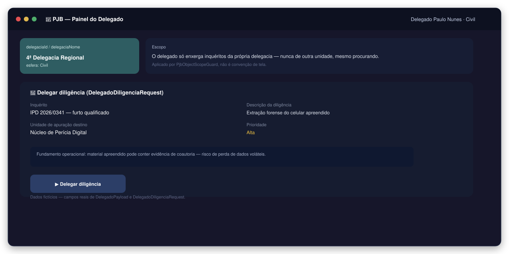

Um policial, por sua vez, só enxerga e atua no que pertence à própria unidade — nunca no inquérito de outra circunscrição, mesmo que quisesse procurar.

[⬆ Voltar ao topo deste guia](#sumário)

---

## A base que todo painel profissional compartilha

Aqui está uma coisa que eu só percebi com clareza revisando o próprio código: mais de 15 perfis profissionais têm painel próprio no PJB, e **todos nascem da mesma base de 6 blocos**, antes de ganhar qualquer campo específico da função. Isso não é coincidência de arquitetura — é uma escolha deliberada de segurança.

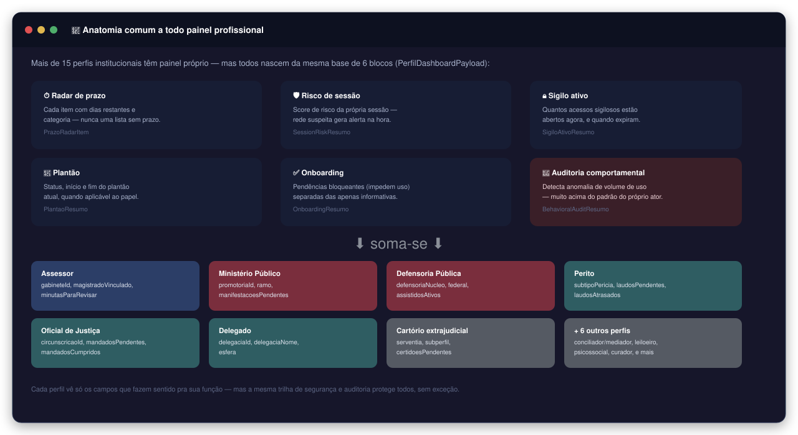

Todo painel — seja de assessor, perito, delegado ou promotor — carrega: radar de prazo (nada fica numa lista sem dizer quantos dias faltam), risco de sessão (se a rede de acesso parece suspeita, o sistema já avisa ali), sigilo ativo com expiração (quantos acessos sigilosos aquela pessoa tem abertos agora, e quando expiram — ninguém fica com acesso sigiloso esquecido pra sempre), plantão, onboarding e auditoria comportamental (se o volume de ações de alguém foge muito do padrão dela mesma, isso vira sinal de anomalia, não só um número). Só depois disso é que entram os campos que fazem sentido pra cada função — que eu vou mostrar um por um ao longo deste guia, no momento em que cada perfil realmente entra na história.

[⬆ Voltar ao topo deste guia](#sumário)

---

## Passo 1 — Quem pode ajuizar uma ação, e como

Tudo começa aqui. Quem pode ajuizar depende do rito: normalmente é o advogado, mas em Juizado Especial Cível, Federal e na Justiça do Trabalho a lei permite que o próprio cidadão entre sozinho — o *jus postulandi*. O PJB já sabe disso: quando é o cidadão peticionando, o sistema libera o fluxo sem cobrar procuração e sem travar por falta de OAB, porque não faria sentido nenhum exigir isso de quem a lei dispensou.

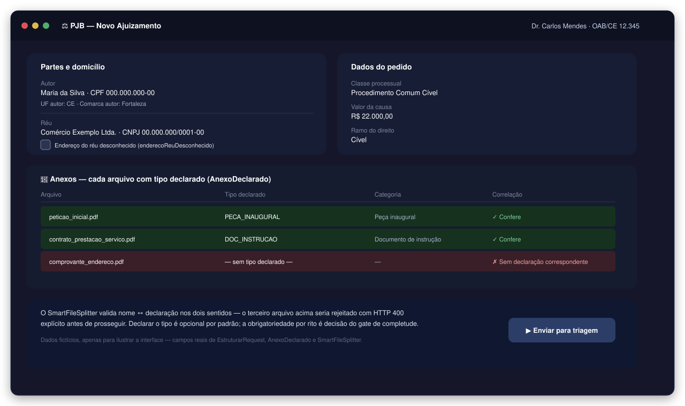

Repara no que acontece na tela: o advogado (ou o cidadão) preenche dados de autor e réu, inclusive o domicílio de cada um — e se o endereço do réu for desconhecido, tem uma flag específica pra isso, porque isso é comum de verdade e o sistema não trava por causa disso. E cada anexo já entra com um **tipo declarado** — não é só "anexar arquivo", é dizer que aquele arquivo é a peça inaugural, ou um documento de instrução, e por aí vai. Um validador confere se o nome do arquivo bate com o que foi declarado nos dois sentidos, e recusa na hora se não bater — isso evita a maior dor de cabeça de qualquer sistema antigo, que é "anexei um monte de PDF e ninguém sabe o que é o quê".

[⬆ Voltar ao topo deste guia](#sumário)

---

## Passo 2 — A triagem organiza e separa cada processo no lugar certo

Antes de qualquer petição virar processo de verdade, ela passa pela **Triagem Nacional** — um motor de IA totalmente separado da Laiane (não confunde os dois: a triagem faz esse trabalho de entrada, a Laiane entra depois, já dentro do processo em andamento).

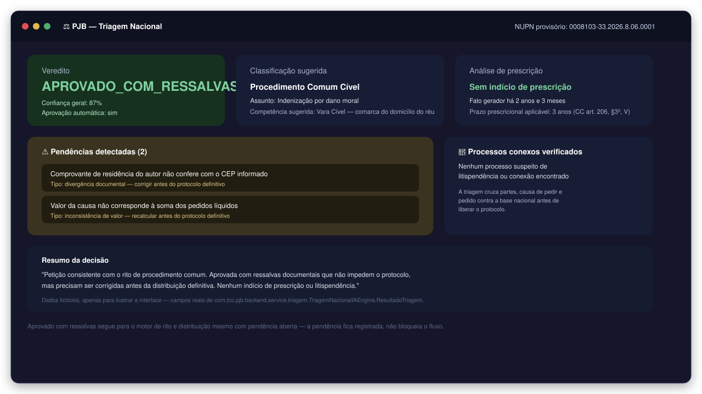

E sim — a triagem faz exatamente o que parece mais óbvio de se esperar, mas que poucos sistemas fazem de verdade: ela classifica o rito certo, sugere a competência certa, checa se já existe prescrição, e cruza contra a base nacional pra ver se aquele processo já tem algo conexo rodando em outro lugar (pra não duplicar caso nem deixar passar despercebido uma coincidência suspeita). O veredito não é um "sim ou não" burro — são cinco possibilidades (aprovado, aprovado com ressalva, pendente de correção, bloqueado, ou precisa de revisão humana), e cada uma delas leva o processo por um caminho diferente. Quando é limítrofe, o sistema não decide sozinho — ele explicitamente pede revisão humana antes de ir pra frente. Essa é a mesma filosofia que rege a Laiane lá na frente.

[⬆ Voltar ao topo deste guia](#sumário)

---

## Passo 3 — Pra onde o processo vai: o fórum local recebe

Depois de aprovado na triagem e resolvido o rito e a competência, o processo é distribuído — e chega na vara certa já autuado e classificado. É aqui que a secretaria do fórum entra na história, e é aqui que está uma das partes que eu mais gosto de mostrar do sistema.

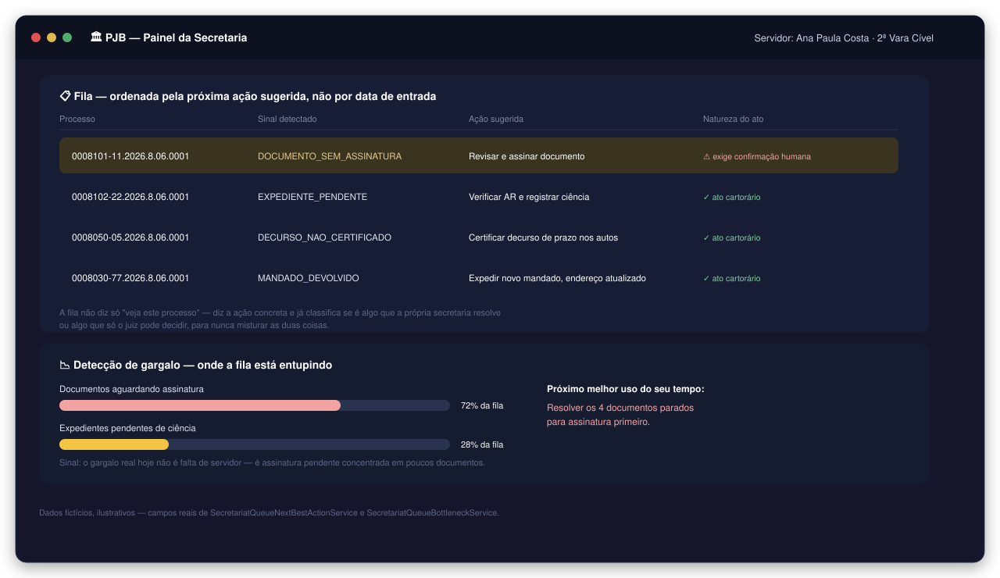

Repara que a fila da secretaria não é uma lista comum ordenada por data de chegada — é ordenada pela **próxima ação concreta** que cada processo precisa. O sistema lê sinais do próprio processo (expediente pendente, prazo vencido sem certificar, documento esperando assinatura, mandado que voltou) e já diz exatamente o que fazer: "verificar AR e registrar ciência", "certificar decurso de prazo", "revisar e assinar" (esse último sempre exige confirmação humana explícita — nunca acontece sozinho), "expedir novo mandado com endereço atualizado". E cada sugestão já vem marcada se é um ato que a própria secretaria resolve ou se é um ato que só o juiz pode praticar — o sistema nunca deixa essas duas coisas se confundirem. Soma a isso um painel de detecção de gargalo, que mostra onde a fila realmente está entupindo — às vezes não é falta de gente, é um monte de documento parado esperando assinatura, por exemplo.

[⬆ Voltar ao topo deste guia](#sumário)

---

## Passo 4 — Como a comunicação processual funciona: citação e intimação

Um processo não anda sozinho — em algum momento o réu precisa ser citado (chamado pra se defender pela primeira vez) e as partes precisam ser intimadas (avisadas de cada ato relevante que aconteceu). O PJB trata isso como **notificação multicanal**: em vez de depender de um único canal que pode falhar (o Diário da Justiça tradicional, por exemplo), o sistema despacha a comunicação por mais de um canal ao mesmo tempo, pro ato produzir efeito de verdade e não ficar reféns de um único caminho que pode não chegar.

Isso é o que resolve um problema que existe hoje nos sistemas antigos: perder prazo porque a intimação "saiu no diário" mas ninguém viu. Aqui, cada tentativa de comunicação fica registrada — quem foi intimado, por qual canal, quando, e se confirmou o recebimento — e isso vira parte do histórico auditável do processo, não um detalhe perdido.

[⬆ Voltar ao topo deste guia](#sumário)

---

## Passo 5 — O processo tramitando: o painel de cada perfil envolvido

A partir daqui, o processo está "vivo" e cada perfil profissional que participa dele vê e faz coisas diferentes — sempre em cima da mesma base de segurança que eu mostrei lá atrás, mas com o recorte certo pra função de cada um.

**O advogado** enxerga a carteira inteira dos casos do escritório, não só o processo isolado:

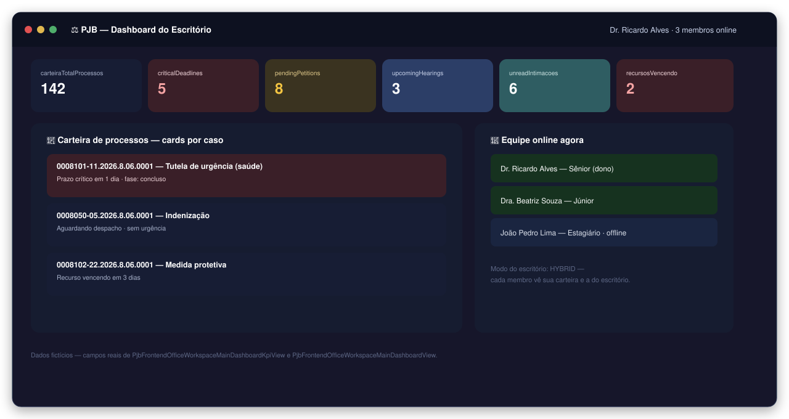

Prazo crítico, petição pendente, audiência chegando, intimação não lida, recurso vencendo — tudo isso é KPI de verdade calculado pelo sistema, não uma lista que o advogado tem que montar de cabeça. E se o escritório tem mais de um advogado, o dono não precisa ficar emprestando o próprio certificado digital pra ninguém: ele manda um **convite de afiliação com escopo definido** — define o papel de quem entra, quais áreas do direito a pessoa pode tocar (Penal, Execução Penal, Militar e Infância/Juventude ficam sempre bloqueadas por padrão, exigindo liberação explícita à parte), se os casos pessoais do convidado ficam de fora, e a confiança mínima exigida pra ação automática.

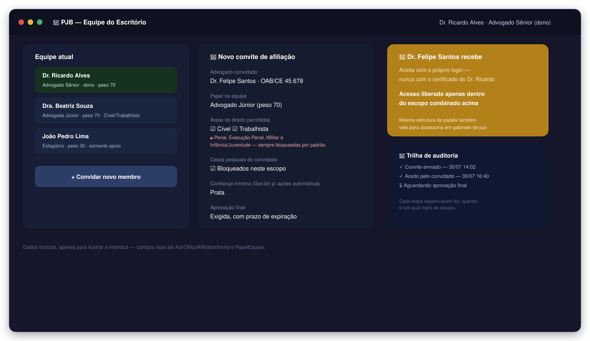

O convidado aceita e passa a atuar dentro daquele escopo — mas sempre com a própria identidade e o próprio certificado, nunca o do chefe. Essa mesma estrutura de papéis com peso também vale dentro do gabinete de um juiz, entre o magistrado titular e os assessores.

É esse mesmo advogado, ainda antes de peticionar ou já negociando um acordo, que usa a **calculadora judicial** — não uma calculadora genérica, mas motores especializados por área do direito (custas, trabalhista, previdenciário/CJF, fazendário), cada um com tabela oficial, regra de atualização e fundamento legal citado linha por linha:

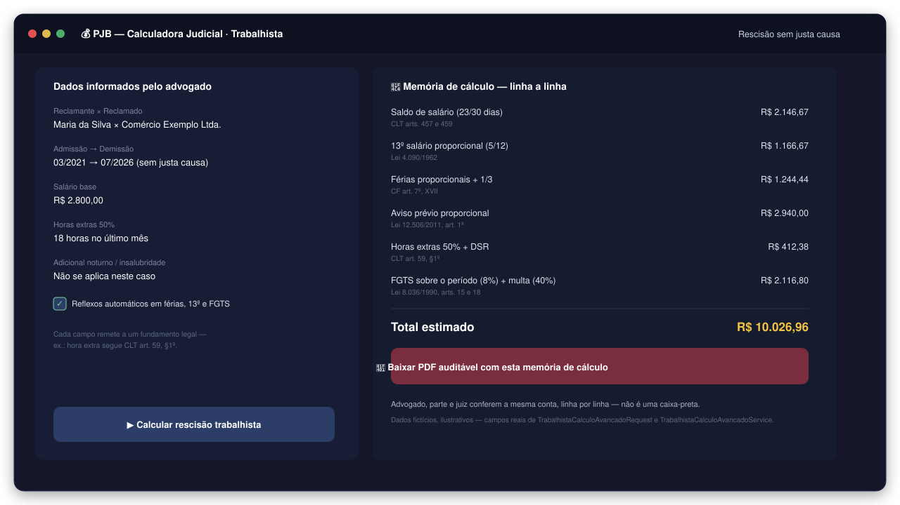

No exemplo trabalhista, o advogado informa data de admissão, data de desligamento, salário, se houve adicional noturno ou de periculosidade — e a calculadora devolve cada verba separada (saldo de salário, 13º proporcional, férias mais o terço, aviso prévio, FGTS e a multa de 40%), **cada uma com a lei por trás dela**, não só um número solto. No final sai um PDF com essa mesma trilha de cálculo, pra que a parte contrária, o advogado dela e o juiz consigam conferir a conta sem precisar confiar de olho fechado.

Abrindo um processo específico, o advogado encontra um conjunto de ferramentas que resolvem coisas que antes exigiam sair do sistema ou fazer conta de cabeça:

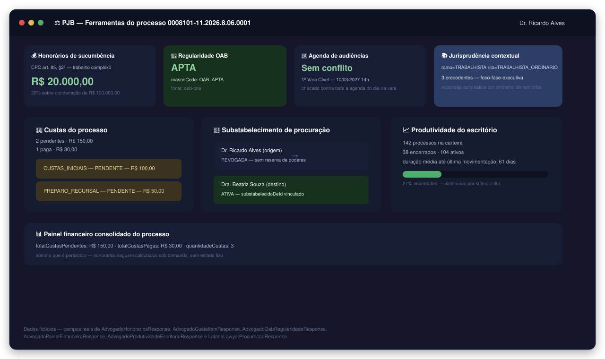

O **cálculo de honorários de sucumbência** aplica o CPC art. 85 direto — percentual mínimo ou máximo conforme a complexidade do trabalho, faixa própria quando a Fazenda Pública é vencida, ou o percentual que o próprio magistrado já fixou, sem o advogado ter que decorar qual regra vale pra cada situação. A **regularidade da OAB** vira uma consulta simples, não só um bloqueio que aparece na hora de protocolar — o advogado confere a própria situação antes de precisar dela. Marcar uma audiência agora **detecta conflito de horário** de verdade: o sistema olha toda a agenda daquela vara no dia antes de aceitar o novo horário, então dois processos não competem pelo mesmo juiz ao mesmo tempo sem ninguém perceber. E a **busca de jurisprudência** deixou de exigir que o advogado soubesse de cabeça o ramo e o rito do processo pra pesquisar — o sistema já resolve isso a partir do processo aberto na tela.

Quando o advogado precisa repassar poderes pra outro colega — saindo de férias, mudando de comarca, ou simplesmente dividindo a carga — o **substabelecimento** virou uma ação de verdade dentro do sistema, com ou sem reserva de poderes: sem reserva, quem repassa perde a própria procuração daquele processo; com reserva, os dois continuam habilitados. As **custas do processo** aparecem consolidadas — pendente, paga, por tipo — junto com um **painel financeiro** que soma os totais, sem o advogado ter que abrir cada guia isolada pra saber quanto ainda falta pagar. E quando o problema é agenda apertada em vários processos ao mesmo tempo, dá pra **pedir prorrogação de prazo em lote** — o sistema protocola a petição em cada processo da lista, isolando o que falhar sem travar o resto do lote.

Por fim, o **relatório de produtividade do escritório** mostra a carteira inteira por status e por rito, com a duração média dos processos já encerrados — sem inventar uma taxa de êxito que o sistema não tem como calcular de verdade, já que resultado de mérito não é um dado estruturado em nenhum tribunal do Brasil hoje.

**O juiz**, quando o processo chega pra ele, vê uma pauta ordenada por urgência de verdade — não por ordem de chegada:

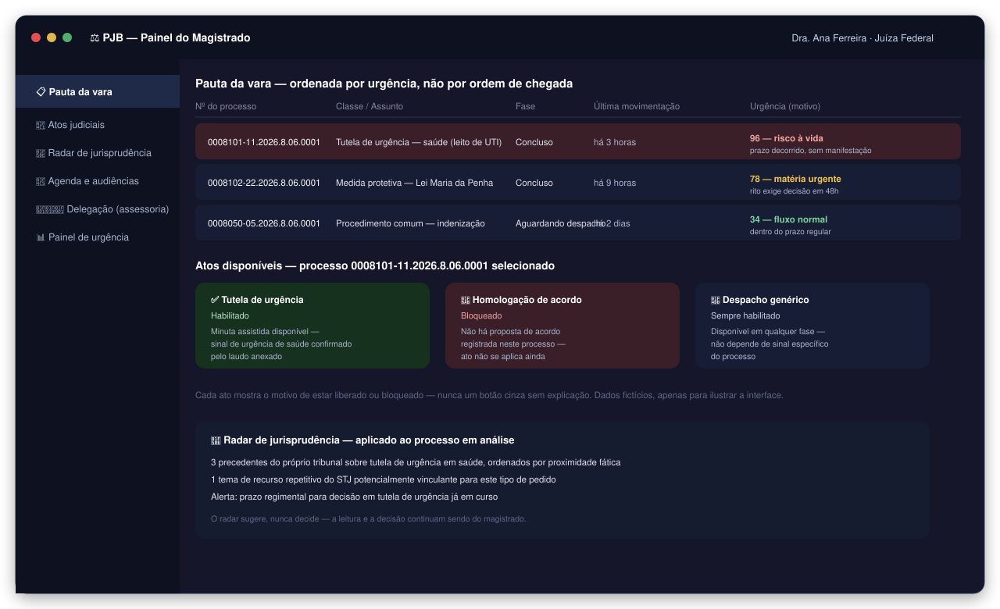

Cada item da pauta mostra um score de urgência com o motivo explícito ("risco à vida", "rito exige decisão em 48h"), não um número solto. E quando o juiz seleciona um processo, o sistema mostra exatamente quais atos judiciais estão habilitados pra aquele momento específico — e por quê. Se não há proposta de acordo registrada, o botão de homologar acordo aparece bloqueado, com o motivo explícito na tela, não escondido ou cinza sem explicação. O radar de jurisprudência já entra aqui também, trazendo precedentes do próprio tribunal e temas de recurso repetitivo relevantes pro caso em análise — o radar sugere, nunca decide.

Quando o juiz precisa efetivamente escrever um despacho ou uma decisão, é a Laiane quem entra pra ajudar (eu explico o papel dela inteiro mais pra frente) — mas sempre como minuta assistida, travada até revisão humana.

**Assessor de gabinete** — não é uma versão "menor" do juiz, é um escopo completamente travado ao gabinete específico do magistrado dele:

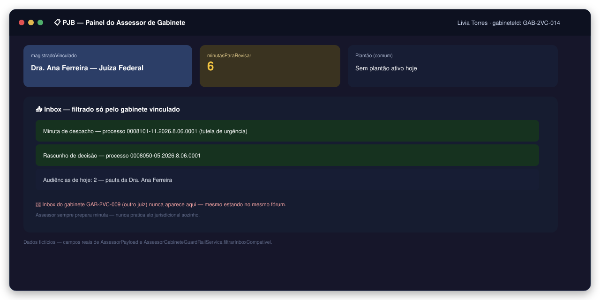

Um assessor do gabinete do Juiz A nunca vê o inbox do gabinete do Juiz B, mesmo estando no mesmo fórum — isso é verificado no próprio código, não é regra de conduta. E o assessor só prepara minuta, nunca pratica ato jurisdicional sozinho.

**Ministério Público, Defensoria e Procuradoria** compartilham a mesma base de ferramentas de petição e prazo, mas o problema estratégico de cada um é diferente:

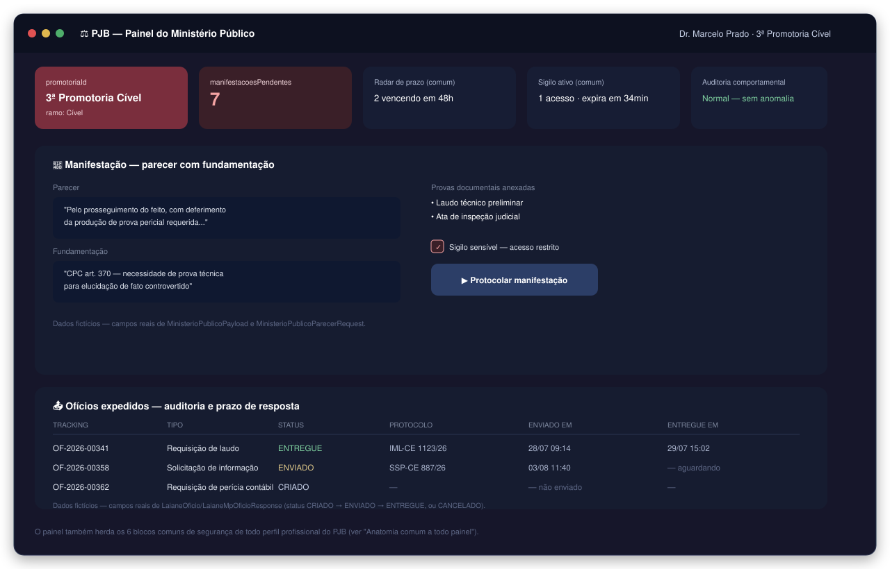

O **promotor** tem fila e painel próprios, com auditoria de ofício expedido e prazo de resposta — ele não precisa perguntar "isso já foi respondido?", o painel já mostra.

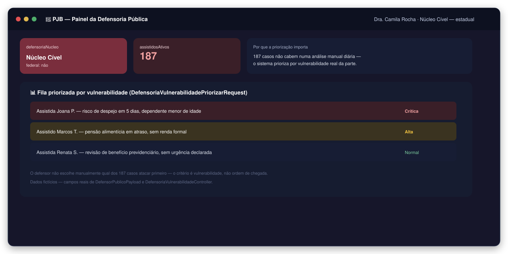

O **defensor público** normalmente carrega um volume de casos muito maior do que um escritório privado — por isso a Defensoria tem uma ferramenta que o advogado comum não tem: **priorização por vulnerabilidade**. O defensor não escolhe manualmente qual dos 187 casos atacar primeiro; o sistema prioriza com base na vulnerabilidade real da parte, pra que o caso mais urgente humanamente não se perca no volume.

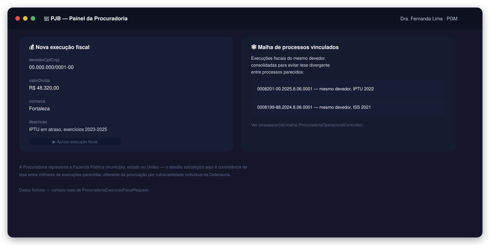

Já o **procurador**, que representa a Fazenda Pública (município, estado ou União), lida com outro problema: consistência de tese entre milhares de execuções fiscais parecidas — por isso o painel dele mostra a malha de processos do mesmo devedor, pra nunca dar tratamento divergente ao mesmo caso em processos diferentes.

**Cidadão**, quando é ele mesmo peticionando (jus postulandi) ou só acompanhando o próprio processo:

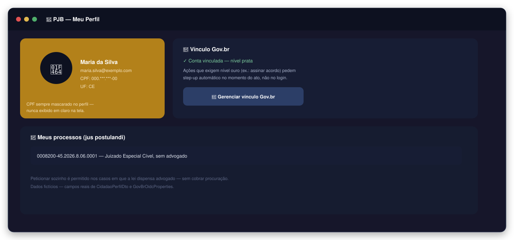

O CPF aparece sempre mascarado na tela, nunca em claro. E o vínculo com o Gov.br mostra o nível de confiança atual (bronze, prata, ouro) — ações que exigem nível mais alto (como assinar um acordo) pedem o step-up automaticamente no momento do ato, não obrigam a pessoa a já entrar logada num nível mais alto do que precisa pra simplesmente consultar o processo.

[⬆ Voltar ao topo deste guia](#sumário)

---

## Passo 6 — Perícia e mandados: quem executa o meio do caminho

Muito processo precisa de gente de fora do quadro de servidor pra avançar — perito pra emitir laudo técnico, oficial de justiça pra cumprir mandado. Isso também tem painel próprio, real, específico.

**O perito** recebe a nomeação, informa se está disponível, e envia o laudo direto no processo — sem e-mail, sem protocolo físico:

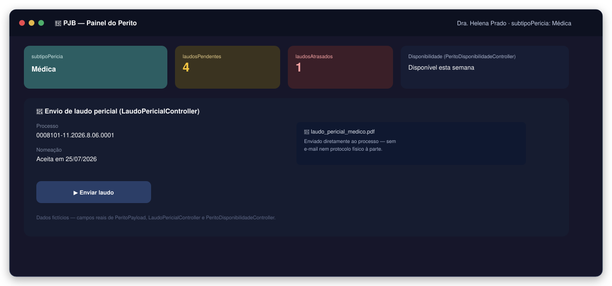

O painel mostra quantos laudos estão pendentes e quantos já passaram do prazo, separados por subtipo de perícia (médica, contábil, digital, ambiental, entre outras) — porque o volume e a urgência mudam muito conforme o tipo.

**O oficial de justiça** vê os mandados pendentes da própria circunscrição, priorizados por urgência:

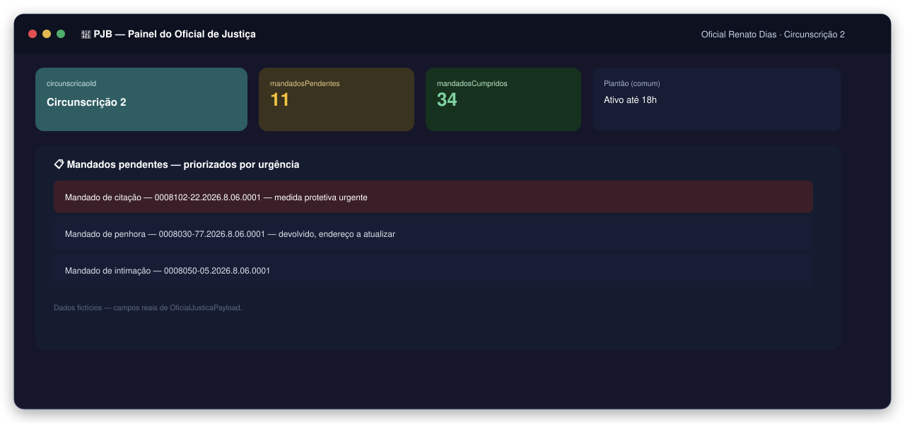

Quando um mandado volta sem cumprimento (endereço não encontrado, por exemplo), o sistema já sinaliza que é preciso expedir um novo mandado com endereço atualizado — não fica esperando alguém perceber manualmente.

[⬆ Voltar ao topo deste guia](#sumário)

---

## Passo 7 — Audiência

Quando o processo chega numa audiência, o PJB tem sala virtual de verdade — não é um link de videochamada qualquer colado por fora.

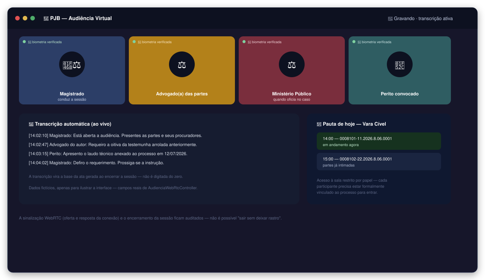

Antes de a sessão começar, tem **verificação biométrica** de quem está entrando — não é só digitar senha. A sessão roda em WebRTC com **transcrição automática** da fala, e quando encerra, a ata sai direto dessa transcrição — não é digitada do zero depois. O acesso é restrito por papel: cada participante (magistrado, servidor, advogado, MP, Defensoria, perito convocado) precisa estar formalmente vinculado àquele processo pra entrar na sala, e tanto a conexão quanto o encerramento ficam auditados.

[⬆ Voltar ao topo deste guia](#sumário)

---

## Passo 8 — Sentença, recursos e as instâncias superiores

Depois da instrução, vem a sentença — e se alguma das partes recorrer, o processo sobe de instância. Aqui o painel muda de novo, porque o que um desembargador e um ministro fazem não é só "a mesma coisa que o juiz, só que mais alto".

**Desembargador** julga em colegiado, não sozinho:

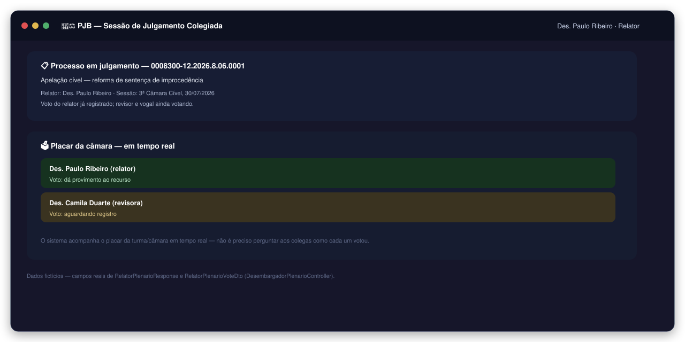

O painel mostra o placar da câmara ou turma em tempo real — o relator já votou, o revisor está votando agora — sem precisar perguntar aos colegas como cada um se posicionou.

**Ministro**, além do painel de plenário, tem três ferramentas que não existem em nenhum outro grau de jurisdição do PJB:

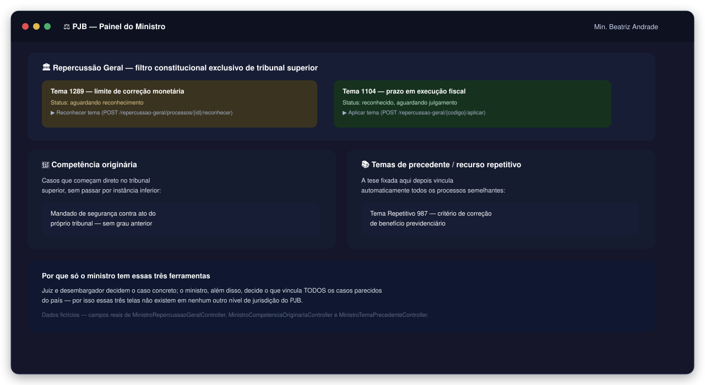

**Competência originária** — casos que começam direto no tribunal superior, sem passar por instância inferior nenhuma. **Repercussão geral** — o filtro constitucional que decide se um recurso extraordinário sequer vai ser julgado. E **temas de recurso repetitivo** — a tese que, uma vez fixada, passa a vincular automaticamente todos os processos parecidos do país inteiro. A razão de essas telas existirem só aqui é simples: juiz e desembargador decidem o caso concreto; o ministro, além disso, decide o que vincula todos os casos parecidos do Brasil.

[⬆ Voltar ao topo deste guia](#sumário)

---

## Passo 9 — Quando cabe acordo

Em qualquer momento do processo — não só no fim — as partes podem negociar. O PJB tem uma sala digital pra isso, com um ciclo de vida bem definido: nenhum acordo pula etapa, e nenhuma proposta rascunhada por IA vira acordo válido sem revisão humana.

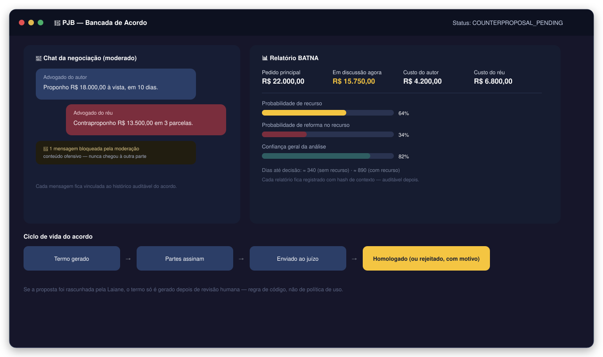

O chat da negociação tem moderação automática de conteúdo — mensagem ofensiva nunca chega até a outra parte. E o relatório BATNA (a melhor alternativa fora do acordo) mostra pra cada lado, com números de verdade: quanto custa continuar litigando, qual a chance de recurso, qual a chance de a decisão ser reformada. É isso que ajuda cada parte a decidir com informação, não no escuro. Se o termo foi gerado a partir de uma proposta da Laiane, ele só é liberado depois de revisão humana — regra de código, não de política de uso.

[⬆ Voltar ao topo deste guia](#sumário)

---

## Outros perfis de apoio que também têm painel próprio

Nem todo processo passa pelos mesmos figurantes — tem casos que envolvem conciliação, registro extrajudicial, leilão de bem penhorado, avaliação psicossocial ou curadoria de réu ausente. Todos esses perfis têm painel real e dedicado no PJB, cada um com o campo que faz sentido pra função:

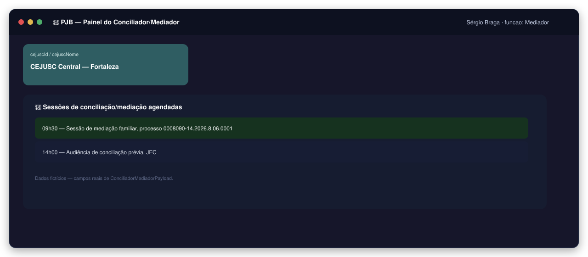

O **conciliador ou mediador** atua vinculado a um CEJUSC específico, com a função que exerce naquele centro já identificada no próprio painel.

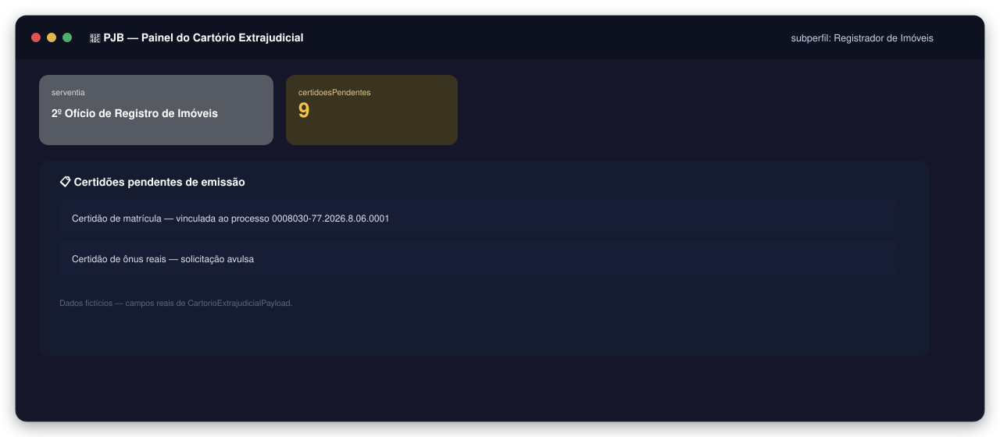

O **tabelião, registrador de imóveis ou escrevente** vê a serventia à qual está vinculado e a fila de certidões pendentes de emissão.

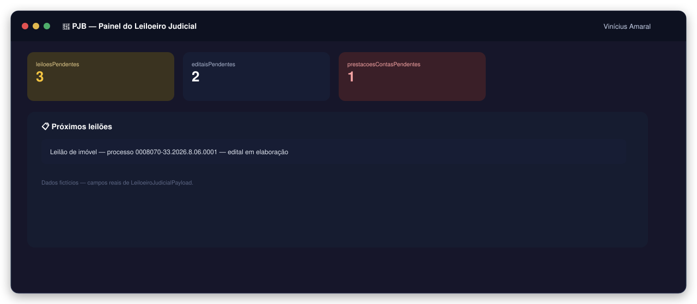

O **leiloeiro judicial** acompanha leilões pendentes, editais que ainda precisam ser publicados e prestações de conta que ainda faltam apresentar depois de arrematado o bem.

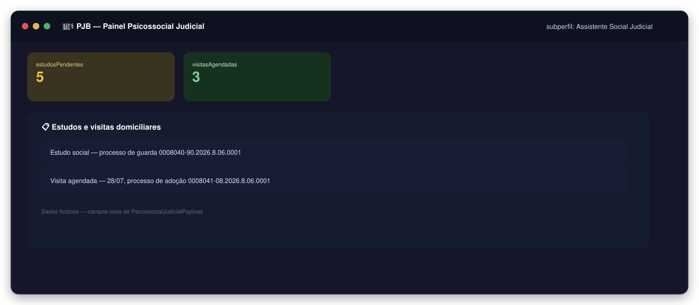

O **psicólogo ou assistente social judicial** organiza estudos sociais pendentes e visitas já agendadas — ferramenta central em vara de família e infância.

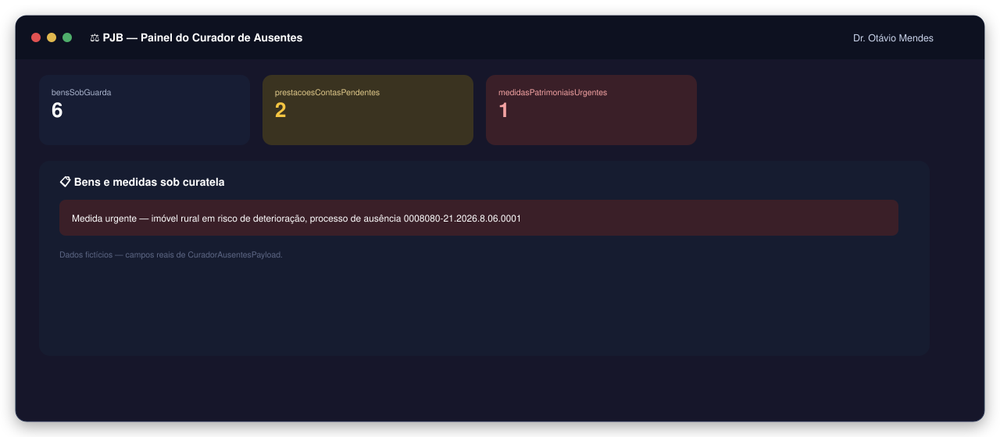

O **curador de ausentes**, que representa réu que não pôde ser localizado ou identificado, acompanha os bens sob guarda, prestações de conta pendentes e medidas patrimoniais urgentes daquele processo.

[⬆ Voltar ao topo deste guia](#sumário)

---

## Passo 10 — Trânsito em julgado e arquivamento

Quando não cabe mais recurso, o processo transita em julgado — e aí entra em cumprimento de sentença, se for o caso, antes de finalmente ser arquivado. O PJB não trata isso como "clicar em arquivar": existe um motor dedicado que checa pendência antes de liberar o arquivamento (tem execução em aberto? tem valor a pagar ainda?), e só depois disso o processo entra no estado final.

Mesmo depois de arquivado, o processo não vira um arquivo morto qualquer — ele mantém uma política de visibilidade própria (quem pode consultar um processo já arquivado, e o quê) e uma política de retenção de dado sensível a longo prazo. Arquivar não é apagar — é fechar o ciclo mantendo o histórico auditável de tudo que aconteceu, do primeiro peticionamento até aqui.

[⬆ Voltar ao topo deste guia](#sumário)

---

## Como cada rito muda essa história

Tudo que eu contei até aqui é a espinha dorsal — mas o PJB não trata todo processo com o mesmo molde. O rito muda partes inteiras dessa jornada:

- **Procedimento comum cível**: segue exatamente a jornada que eu descrevi passo a passo, sem atalho nenhum.
- **Juizado Especial Cível**: cidadão pode entrar sozinho (jus postulandi), sem custas de primeiro grau, com Turma Recursal própria e teto de alçada — o recurso, inclusive, já é tratado diferente: embargos de declaração no JEC continuam autorreptesentáveis, mas o recurso inominado pra Turma Recursal já exige advogado.
- **Justiça do Trabalho**: mesmo jus postulandi do JEC, mas com base legal diferente (CLT, não Lei 9.099/95) — por isso o sistema usa um instrumento de legitimidade separado pra cada base, em vez de misturar as duas.
- **Processo Penal**: passa por autuação e composição de partes bem diferente (ACUSACAO/ACUSADO em vez de AUTOR/REU), com prazo e comunicação regidos por lógica própria — e no caso de flagrante, existe até audiência de custódia com prazo específico.
- **Recuperação Judicial e Falência**: tem rito próprio inteiro, incluindo assembleia de credores e habilitação de crédito, que não existe em nenhum outro tipo de processo.

O motor por trás disso tudo (`PoloCompositionPolicy` + `PoloRoleMappingTable`, o mesmo que decide quem é ACUSACAO ou RECLAMANTE) é único — ele é a única fonte de verdade sobre quem são as partes e o que é exigido documentalmente, pra qualquer rito, em qualquer canal de entrada (REST, Laiane, MNI, marketplace de integradores).

[⬆ Voltar ao topo deste guia](#sumário)

---

## Laiane — presente do início ao fim, sem nunca decidir

Ao longo de toda essa jornada — do ajuizamento ao arquivamento — a Laiane aparece em pontos específicos, sempre do mesmo jeito: sugerindo, nunca decidindo.

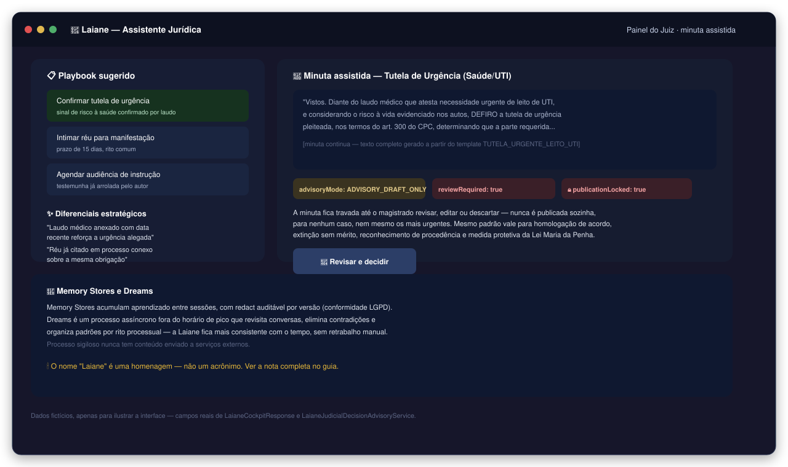

Pro **advogado**, ela ajuda a montar minuta de petição inicial, tese, validação de anexo, gestão de procuração e delegação de prazo. Pro **juiz**, ela sugere radar de jurisprudência, checklist de saneamento, e minutas assistidas de decisão pra situações recorrentes já reconhecidas pelo sistema — homologação de acordo, extinção sem mérito, reconhecimento de procedência, e até medidas urgentes sensíveis como tutela de saúde pra leito de UTI e medida protetiva da Lei Maria da Penha. Pro **Ministério Público**, fila e auditoria de ofício. Em todos os casos, a resposta já nasce travada (`ADVISORY_DRAFT_ONLY`, `reviewRequired`, `publicationLocked`) até um humano revisar, editar ou descartar — essas três travas não são configuráveis por usuário nem por caso, é política de segurança fixada no próprio código, a mesma pra todo mundo, sempre.

> 🕯️ **Por que o nome "Laiane"**
>
> Não é um nome escolhido por acaso, nem um acrônimo disfarçado. É uma homenagem à minha irmã, **Laiane Rabelo Saboia**, que nos deixou em 11 de janeiro de 2026, num acidente automobilístico.
>
> Da mesma forma que ela sempre esteve por perto pra ajudar, a Laiane do PJB existe pra isso — apoiar quem passa por esse sistema, seja cidadão, advogado ou magistrado, sem nunca decidir por ninguém e sem nunca ocupar o lugar de uma pessoa. Um cuidado presente, em segundo plano, o tempo todo.

[⬆ Voltar ao topo deste guia](#sumário)

---

## 📓 A história real por trás do PJB

*Uma nota pessoal minha, fora do tom técnico do resto deste guia.*

O PJB começou em 2024.2 — mas não foi um caminho reto do início ao fim. Depois da largada, o projeto teve uma pausa; foi só em 2025 que ele de fato andou pra valer.

A maior dificuldade nunca foi só técnica: foi nunca ter tido acesso real ao PJe, e-SAJ, eProc, Creta ou Projudi pra estudar de perto o que já existe e apontar, com precisão, onde cada um falha. Sem esse acesso, cada melhoria proposta aqui, cada decisão de arquitetura, cada rito coberto — tudo saiu da minha própria cabeça, ao lado do grupo de pesquisa, sem um sistema real do outro lado da mesa pra comparar ou copiar.

[⬆ Voltar ao topo deste guia](#sumário)

---

[⬆ Voltar ao README principal](../../README.md)
