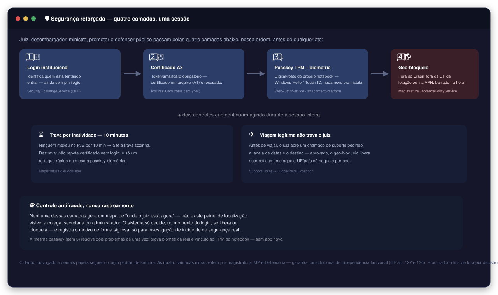
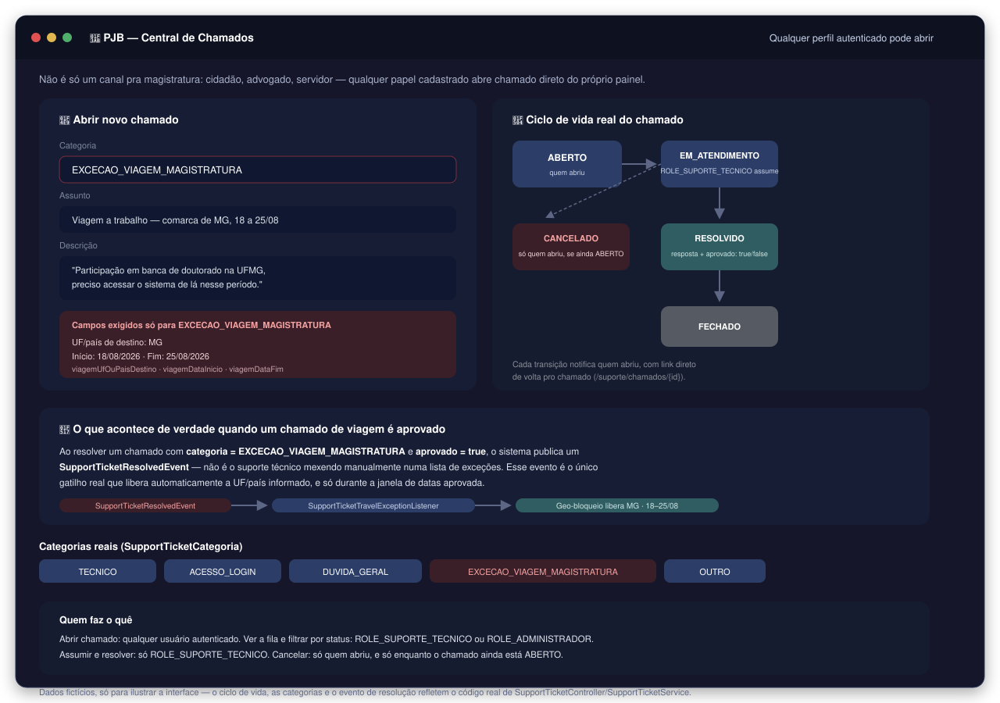
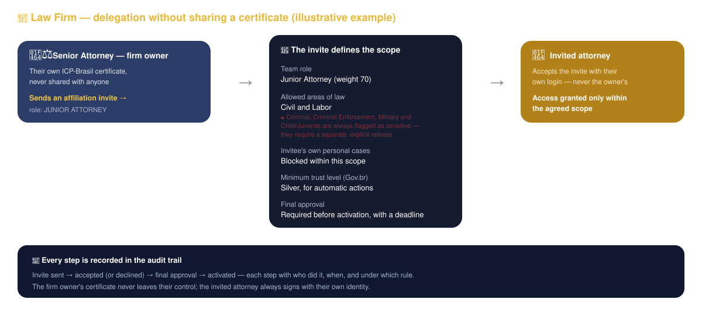
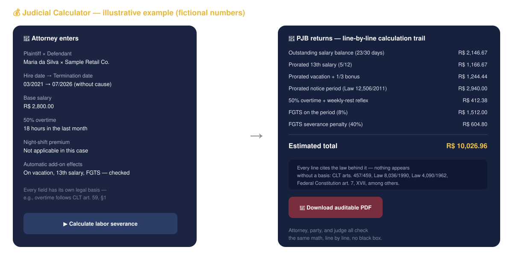
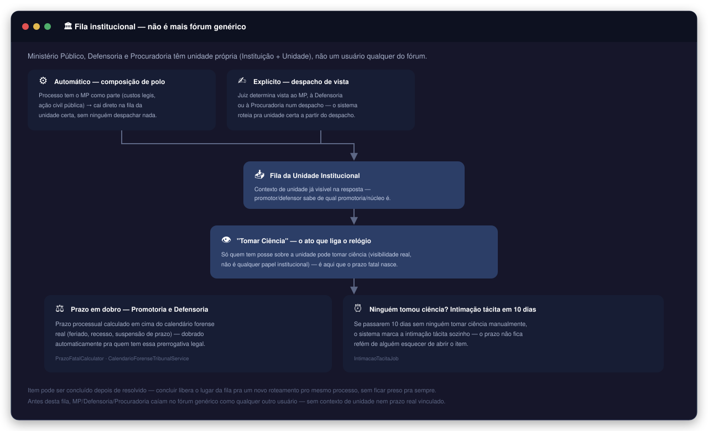
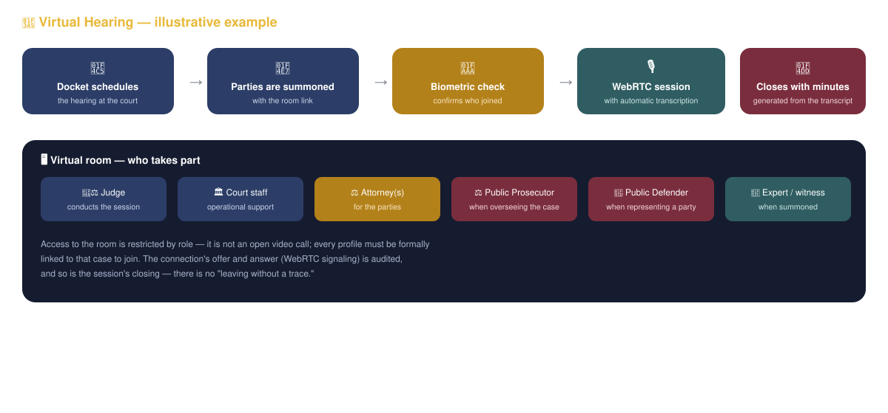
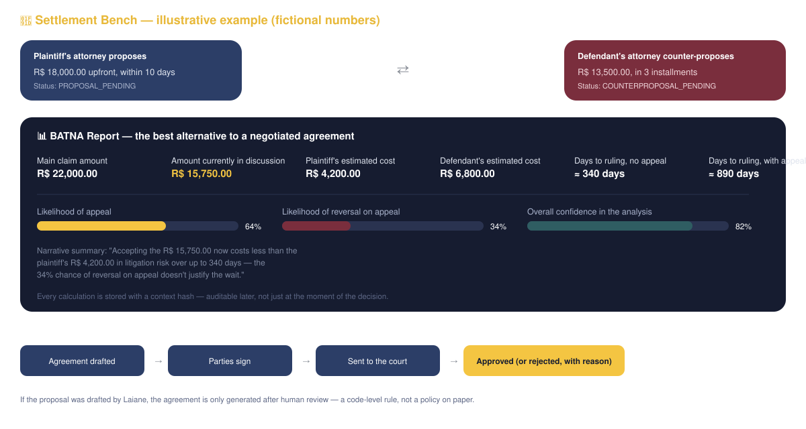

# Interactive Visual Guide — How PJB Actually Works

> This guide is different from the technical README. Here I want to walk you through PJB the way I think about it — following one real case's full path, from the first click to archival, explaining what each person involved sees and does at every step. Every image reflects real system behavior, grounded directly in the code — nothing here is a proposal or a loose idea. Since PJB serves the Brazilian judiciary, the panel mockups below show the system's actual interface, which is in Portuguese — the same way a real screenshot would look.

## Table of Contents

- [Who Enters PJB, and How](#who-enters-pjb-and-how)
- [Enhanced Security for Whoever Decides a Case](#enhanced-security-for-whoever-decides-a-case)
- [Support Ticket Center — When Someone Gets Stuck, There's Somewhere to Go](#support-ticket-center--when-someone-gets-stuck-theres-somewhere-to-go)
- [The Base Every Professional Panel Shares](#the-base-every-professional-panel-shares)
- [Step 1 — Who Can File a Lawsuit, and How](#step-1--who-can-file-a-lawsuit-and-how)
- [Step 2 — Intake Sorts Every Case Into Its Rightful Place](#step-2--intake-sorts-every-case-into-its-rightful-place)
- [Step 3 — Where the Case Goes: the Local Court Receives It](#step-3--where-the-case-goes-the-local-court-receives-it)
- [Step 4 — How Procedural Communication Works: Service of Process and Notice](#step-4--how-procedural-communication-works-service-of-process-and-notice)
- [Step 5 — The Case in Motion: Every Involved Profile's Panel](#step-5--the-case-in-motion-every-involved-profiles-panel)
- [Step 6 — Expert Reports and Court Orders: Who Executes the Middle Stretch](#step-6--expert-reports-and-court-orders-who-executes-the-middle-stretch)
- [Step 7 — The Hearing](#step-7--the-hearing)
- [Step 8 — Judgment, Appeals, and the Higher Courts](#step-8--judgment-appeals-and-the-higher-courts)
- [Step 9 — When a Settlement Fits](#step-9--when-a-settlement-fits)
- [Other Support Profiles With Their Own Panel](#other-support-profiles-with-their-own-panel)
- [Step 10 — Final Judgment and Archival](#step-10--final-judgment-and-archival)
- [How Each Procedural Type Changes This Story](#how-each-procedural-type-changes-this-story)
- [Laiane — Present From Start to Finish, Never Deciding](#laiane--present-from-start-to-finish-never-deciding)
- [The Real Story Behind PJB](#-the-real-story-behind-pjb)

[⬆ Back to the main README](../../README.en.md)

---

## Who Enters PJB, and How

Before any case exists, someone has to enter the system — and every profile walks through a different door, proving who they are in a different way. There is no single "front door" in PJB, because the identity guarantees a citizen needs are not the same ones a judge needs before rendering judgment.

The system recognizes more than 50 distinct roles, but they group into 10 categories that actually matter for understanding the flow: citizen, attorneys, the judiciary (trial judge, appellate judge, justice), chambers staff, the Public Prosecutor's Office, the Public Defender's Office, the Government Attorney's Office, court auxiliaries (expert witness, bailiff, and a dozen more support functions), law enforcement, and the administrator.

Two security details worth understanding up front: **ICP-Brasil certificate login** (used by attorneys and the judiciary) isn't picking a certificate from a menu — the server issues a cryptographic challenge, the certificate signs it, and only after the entire trust chain validates does access unlock. And the **judiciary goes through an extra layer**: a mandatory A3 certificate (token/smartcard, not a file) and a passkey bound to the notebook's own TPM — the same fingerprint or face unlock that already powers Windows Hello or Touch ID, nothing new to install. A judge who steps outside their assigned state, shows up behind a VPN, or leaves the system untouched for 10 minutes also gets blocked or locked out automatically — with an escape valve for a legitimate trip, approved in advance through a support ticket.

**The police chief**, in more detail: they don't need to personally carry out every step of an investigation — they can **delegate a specific investigative task** from an inquiry to the responsible investigative unit, with a description, an operational justification, and a priority, always tied to that specific inquiry and case. Their panel reflects exactly that:

A police officer, in turn, only sees and acts on what belongs to their own precinct — never another precinct's inquiry, even if they wanted to look for it.

[⬆ Back to top of this guide](#table-of-contents)

---

## Enhanced Security for Whoever Decides a Case

Trial judges, appellate judges, and justices go through four layers before any act — it isn't redundancy, it's proportional to the weight of signing a judgment or an appellate ruling.

The order matters: institutional login identifies who is trying to get in; the ICP-Brasil **A3** certificate (a physical token, not a file) proves formal identity; the **passkey bound to the notebook's own TPM** — the same fingerprint or face unlock that already powers Windows Hello or Touch ID — delivers real biometrics with nothing new to install; and **geo-blocking** instantly denies any attempt from outside Brazil, outside the judge's assigned state, or from behind a VPN/datacenter. Two more things keep watching through the entire session: 10 minutes without touching the system locks the screen (unlocking is just a fresh tap on the same passkey, not the whole flow again), and a legitimate trip never leaves the judge locked out of their own work — just open a **support ticket** ahead of time requesting the date window and destination.

These same four layers aren't limited to judges. Prosecutors and public defenders carry a constitutional guarantee of functional independence analogous to the judiciary's (Brazilian Constitution art. 127 and 134) — so the A3 certificate, TPM-bound passkey, inactivity lock, and geo-blocking apply exactly the same way to whoever serves in the Public Prosecutor's Office and the Public Defender's Office. The Government Attorney's Office is deliberately left out of this extra layer: not every career essential to the justice system carries the same constitutional independence guarantee that the judiciary, the Public Prosecutor's Office, and the Public Defender's Office have.

This support channel, by the way, isn't exclusive to the judiciary — **any registered profile** (citizen, attorney, staff, everyone) can open a technical ticket right from their own panel, without having to leave the system to find an IT contact. I show how this channel actually works, under the hood, in the next section.

One point I want to make explicit: none of these layers turns into a map of "where the judge is right now." There's no location panel for a colleague, a clerk's office, or an administrator to see — the system only decides, at the instant of login, whether to allow or block, and stores the reason confidentially, only for real incident investigation. It's antifraud control, not surveillance.

[⬆ Back to top of this guide](#table-of-contents)

---

## Support Ticket Center — When Someone Gets Stuck, There's Somewhere to Go

I didn't want to leave this channel as just a passing mention above, because it solves a real problem and has its own logic behind it — it isn't a generic contact form tucked into a corner of the system.

Any authenticated person — citizen, attorney, staff, judge, any role — opens a ticket by picking a category (technical, access/login, general question, judiciary travel exception, or other), a subject, and a description. When the category is the travel exception, three extra fields show up, only there: destination state or country, start date, and end date.

The lifecycle is simple to follow: a ticket is born **open**, support staff **claim** it, and then **resolve** it — with a response and an approval flag. Only whoever opened it can cancel, and only while it's still open; once claimed, canceling stops being an option. Every status change notifies whoever opened the ticket, with a direct link back to that same ticket.

The part I find most interesting to show is what actually happens when a travel ticket gets approved: the system publishes a resolution event, and it's that event — not a person manually editing a list of exceptions — that releases the judiciary's geo-blocking for that state or country, only during the approved date window. Outside that window, the rule reverts to normal on its own.

[⬆ Back to top of this guide](#table-of-contents)

---

## The Base Every Professional Panel Shares

Here's something that only became clear to me while reviewing the code itself: more than 15 professional profiles have their own panel in PJB, and **all of them are born from the same 6-block base**, before gaining any field specific to their function. That isn't an architectural coincidence — it's a deliberate security choice.

Every panel — whether it belongs to a chambers clerk, an expert witness, a police chief, or a prosecutor — carries: a deadline radar (nothing sits in a list without saying how many days are left), a session-risk indicator (if the access network looks suspicious, the system flags it right there), active confidential access with expiration (how many sealed-access grants that person currently holds, and when they expire — no one keeps sealed access open forever by accident), on-duty status, onboarding, and behavioral audit (if someone's action volume strays far from their own baseline, that becomes an anomaly signal, not just a raw number). Only after that do the fields specific to each function come in — which I'll show one by one at the exact point in this guide where each profile actually enters the story.

[⬆ Back to top of this guide](#table-of-contents)

---

## Step 1 — Who Can File a Lawsuit, and How

Everything starts here. Who can file depends on the procedural type: normally it's the attorney, but in Civil and Federal Small Claims Courts and in Labor Court, the law lets the citizen file alone — *jus postulandi*. PJB already knows this: when it's the citizen petitioning, the system opens the flow without demanding a power of attorney and without blocking for a missing OAB registration, because there'd be no point requiring something the law itself waives.

Notice what happens on screen: the attorney (or the citizen) fills in the plaintiff's and defendant's data, including each party's domicile — and if the defendant's address is unknown, there's a specific flag for that, because it's a genuinely common situation and the system doesn't choke on it. And every attachment already carries a **declared type** — it isn't just "attach a file," it's declaring that this particular file is the initial pleading, or a supporting document, and so on. A validator checks whether the file name matches what was declared, both ways, and rejects on the spot if it doesn't — which solves the biggest headache of any older system: "I attached a pile of PDFs and nobody knows what's what."

[⬆ Back to top of this guide](#table-of-contents)

---

## Step 2 — Intake Sorts Every Case Into Its Rightful Place

Before any petition becomes a real case, it goes through **National Intake Screening** — an AI engine that is completely separate from Laiane (don't confuse the two: Intake does this front-door work, Laiane comes in afterward, once the case is already under way).

And yes — Intake does exactly what seems most obvious to expect, but what few systems actually deliver: it classifies the correct procedural type, suggests the correct competent court, checks whether the statute of limitations has already run, and cross-references the national database to see whether that case already has something related running elsewhere (so no case gets duplicated and no suspicious coincidence slips by unnoticed). The verdict isn't a blunt yes-or-no — there are five possible outcomes (approved, approved with caveats, pending correction, blocked, or requires human review), and each one sends the case down a different path. When it's borderline, the system doesn't decide on its own — it explicitly asks for human review before moving forward. That's the same philosophy that governs Laiane further down the line.

[⬆ Back to top of this guide](#table-of-contents)

---

## Step 3 — Where the Case Goes: the Local Court Receives It

Once approved at Intake, with procedural type and competence resolved, the case is distributed — and arrives at the right court already docketed and classified. This is where the court clerk's office enters the story, and it's one of the parts of the system I most enjoy showing.

Notice that the clerk's queue isn't an ordinary list sorted by arrival date — it's sorted by the **concrete next action** each case needs. The system reads signals straight from the case itself (pending correspondence, an uncertified expired deadline, a document waiting on a signature, a returned court order) and already states exactly what to do: "check the return receipt and log acknowledgment," "certify the elapsed deadline," "review and sign" (this one always requires explicit human confirmation — it never happens by itself), "issue a new order with the updated address." Each suggestion already comes flagged as either something the clerk's office itself can resolve, or something only the judge can perform — the system never lets those two blur together. On top of that, there's a bottleneck-detection panel, showing exactly where the queue is actually clogging — sometimes it isn't a staffing shortage, it's a pile of documents stuck waiting on a signature, for instance.

[⬆ Back to top of this guide](#table-of-contents)

---

## Step 4 — How Procedural Communication Works: Service of Process and Notice

A case doesn't move on its own — at some point the defendant needs to be served (summoned to answer for the first time) and the parties need to be notified of every relevant act that happened. PJB treats this as **multichannel notification**: instead of relying on a single channel that can fail (the traditional official gazette, for instance), the system dispatches the communication through more than one channel at the same time, so the act actually takes legal effect instead of being hostage to one path that might not arrive.

This is exactly what solves a problem that plagues today's older systems: missing a deadline because the notice "went out in the gazette" but nobody saw it. Here, every attempt at communication is logged — who was notified, through which channel, when, and whether receipt was confirmed — and that becomes part of the case's auditable history, not a detail that gets lost.

[⬆ Back to top of this guide](#table-of-contents)

---

## Step 5 — The Case in Motion: Every Involved Profile's Panel

From here on, the case is "alive," and every professional profile involved sees and does different things — always on top of the same security base I showed earlier, but scoped to fit each function.

**The attorney** sees the firm's entire case portfolio, not just an isolated case:

Critical deadline, pending petition, an approaching hearing, an unread notice, an expiring appeal window — all of it is a real KPI computed by the system, not a list the attorney has to piece together from memory. And if the firm has more than one attorney, the owner doesn't need to keep lending out their own digital certificate: they send a **scoped affiliation invite** — defining the invitee's team role, which areas of law the person can touch (Criminal, Criminal Enforcement, Military, and Child/Juvenile stay blocked by default, requiring a separate explicit release), whether the invitee's personal cases stay out of scope, and the minimum trust level required for automatic action.

The invitee accepts and starts operating within that scope — but always under their own identity and their own certificate, never the owner's. This same weighted-role structure also governs a judge's chambers, between the sitting judge and their clerks.

That same attorney, before ever filing or while already negotiating a settlement, is who uses the **judicial calculator** — not a generic calculator, but engines specialized per area of law (court costs, labor, social security/CJF, treasury/tax), each with its own official table, update rule, and legal basis cited line by line:

In the labor example, the attorney enters the hire date, termination date, salary, and whether there was a night-shift premium or hazard pay — and the calculator returns each item separately (outstanding salary balance, prorated 13th salary, vacation pay plus its 1/3 bonus, notice period, FGTS, and the 40% penalty), **each one with the law behind it**, not just a bare number. At the end, it produces a PDF with that same calculation trail, so the other party, their attorney, and the judge can all check the math without having to take it on faith.

**The judge**, once the case reaches them, sees a docket sorted by real urgency — not by arrival order:

Every docket item shows an urgency score with an explicit reason ("risk to life," "this procedural type requires a ruling within 48h"), never a bare number. And when the judge selects a case, the system shows exactly which judicial acts are enabled for that specific moment — and why. If no settlement proposal is on record, the button to approve a settlement shows up disabled, with the reason stated on screen, not hidden or simply greyed out. The case-law radar also lives here, surfacing precedents from the judge's own court and relevant repetitive-appeal themes for the case under review — the radar only suggests, it never decides.

When the judge actually needs to draft an order or a ruling, that's where Laiane comes in to help (I cover her role in full further down) — always as an assisted draft, locked until human review.

**Chambers clerk** — not a "lesser" version of the judge, but a scope completely locked to that specific judge's own chambers:

A clerk assigned to Judge A's chambers never sees Judge B's inbox, even within the same courthouse — that's verified in the code itself, not just a rule of conduct. And the clerk only prepares drafts, never performs a judicial act alone.

**The Public Prosecutor's Office, the Public Defender's Office, and the Government Attorney's Office** share the same base toolkit for filing and deadlines, but each one faces a different strategic problem:

The **prosecutor** has their own queue and dashboard, with an audit trail of issued official letters and response deadlines — they never need to ask "was this already answered?"; the panel already shows it.

The **public defender** typically carries a much larger caseload than a private firm — which is why the Public Defender's Office has a tool no private attorney has: **vulnerability-based prioritization**. The defender doesn't manually pick which of 187 cases to tackle first; the system prioritizes based on the party's actual vulnerability, so the most humanly urgent case never gets lost in the volume.

The **government attorney**, representing the public treasury (a municipality, a state, or the federal union), faces a different problem: keeping legal theory consistent across thousands of similar tax-enforcement cases — which is why their panel shows the same debtor's linked case mesh, so the same case never gets divergent treatment across different filings.

All three share one more thing I think is worth showing: an **institutional queue of their own**, separate from the generic court queue any user falls into.

A case reaches the right queue in one of two ways — automatically, when the Public Prosecutor's Office is a party to the case (as a mandatory reviewing party, or in a public civil action), or explicitly, when the judge orders that a party be given notice in a ruling — and it always arrives with the right unit context already attached (the specific prosecutor's office, the specific Public Defender's Office branch, the specific government attorney's office), not a generic item waiting for someone to guess where it belongs. The **"Acknowledge"** act is what starts the deadline clock, and only someone with real standing over that unit can perform it. If nobody acknowledges it manually, the system doesn't leave the deadline hostage to forgetfulness: after 10 days, it marks **tacit notice** on its own. And the deadline itself respects a real legal privilege — the Public Prosecutor's Office and the Public Defender's Office get a **doubled deadline**, computed against the real court calendar (holidays, recess, deadline suspensions), not a generic counter.

**Citizen**, when petitioning alone (*jus postulandi*) or simply following their own case:

The CPF (tax ID) always appears masked on screen, never in the clear. And the Gov.br link shows the current trust level (bronze, silver, gold) — actions that require a higher level (like signing a settlement) trigger the step-up automatically at the moment of the act, instead of forcing the person to already be logged in at a higher level than they need just to check on their case.

[⬆ Back to top of this guide](#table-of-contents)

---

## Step 6 — Expert Reports and Court Orders: Who Executes the Middle Stretch

Many cases need people outside the court staff to move forward — an expert witness to issue a technical report, a bailiff to execute a court order. These also have their own real, dedicated panels.

**The expert witness** receives the appointment, reports availability, and submits the report directly in the case — no email, no physical filing:

The panel shows how many reports are pending and how many are already past deadline, broken down by expertise subtype (medical, accounting, digital, environmental, and others) — because volume and urgency vary a lot depending on the type.

**The bailiff** sees pending court orders for their own jurisdiction, prioritized by urgency:

When an order comes back unfulfilled (address not found, for instance), the system already flags that a new order needs to be issued with an updated address — it doesn't wait for someone to notice manually.

[⬆ Back to top of this guide](#table-of-contents)

---

## Step 7 — The Hearing

When a case reaches a hearing, PJB has a real virtual hearing room — not a generic video-call link bolted on from outside.

Before the session starts, there's a **biometric check** of who's joining — not just a password. The session runs on WebRTC with **automatic speech transcription**, and when it closes, the minutes come straight out of that transcript — they aren't typed up afterward from scratch. Access is restricted by role: every participant (judge, court staff, attorney, Public Prosecutor's Office, Public Defender's Office, a summoned expert witness) must be formally linked to that case to join the room, and both the connection and the closing are audited.

[⬆ Back to top of this guide](#table-of-contents)

---

## Step 8 — Judgment, Appeals, and the Higher Courts

After the evidentiary phase comes the ruling — and if either party appeals, the case moves up an instance. The panel changes again here, because what an appellate judge and a justice do isn't just "the same thing as the trial judge, only higher up."

**The appellate judge** rules as part of a panel, not alone:

The panel shows the chamber's live vote tally — the reporting judge already voted, the reviewing judge is voting now — without needing to ask colleagues how each one stands.

**The justice**, besides the panel dashboard, has three tools that don't exist at any other level of jurisdiction in PJB:

**Original jurisdiction** — cases that start directly at the superior court, without passing through any lower instance. **General repercussion** — the constitutional filter that decides whether an extraordinary appeal will even be heard. And **repetitive-appeal themes** — the thesis that, once fixed, automatically binds every similar case nationwide. The reason these screens only exist here is simple: a trial judge and an appellate judge decide the concrete case; a justice, beyond that, decides what binds every similar case in the country.

[⬆ Back to top of this guide](#table-of-contents)

---

## Step 9 — When a Settlement Fits

At any point during a case — not just at the end — the parties can negotiate. PJB has a digital room for this, with a well-defined lifecycle: no settlement skips a step, and no AI-drafted proposal becomes a binding agreement without human review.

The negotiation chat has automatic content moderation — an offensive message never reaches the other party. And the BATNA report (best alternative to a negotiated agreement) shows each side, with real numbers: how much it costs to keep litigating, the odds of an appeal, the odds of the ruling being reversed. That's what helps each side decide with information, not in the dark. If the settlement text was generated from a Laiane proposal, it's only released after human review — a code-level rule, not a usage policy.

[⬆ Back to top of this guide](#table-of-contents)

---

## Other Support Profiles With Their Own Panel

Not every case involves the same cast — some cases involve conciliation, extrajudicial registry acts, auctioning off a seized asset, a psychosocial evaluation, or guardianship for an absent defendant. All of these profiles have a real, dedicated panel in PJB, each with the fields that fit its function:

The **conciliator or mediator** operates tied to a specific CEJUSC (Brazil's judicial conciliation/mediation center), with the function they perform at that center already identified right on the panel.

The **notary, land registrar, or registry clerk** sees the registry office they're tied to and the queue of certificates still pending issuance.

The **judicial auctioneer** tracks pending auctions, notices still awaiting publication, and accountings still owed after an asset has been sold at auction.

The **judicial psychologist or social worker** organizes pending social studies and already-scheduled home visits — a central tool in family and juvenile court.

The **guardian for absent parties**, who represents a defendant who could not be located or identified, tracks assets under guardianship, pending accountings, and urgent asset-protection measures for that case.

[⬆ Back to top of this guide](#table-of-contents)

---

## Step 10 — Final Judgment and Archival

Once no appeal remains available, the case reaches final judgment — and then, if applicable, moves into judgment enforcement before finally being archived. PJB doesn't treat this as "click to archive": there's a dedicated engine that checks for pending items before releasing the archival (is there an open enforcement? is there a balance still owed?), and only then does the case enter its final state.

Even after being archived, a case doesn't turn into just any dead file — it keeps its own visibility policy (who can look up an archived case, and what they can see) and a long-term sensitive-data retention policy. Archiving isn't erasing — it's closing the cycle while keeping the auditable history of everything that happened, from the first petition all the way to here.

[⬆ Back to top of this guide](#table-of-contents)

---

## How Each Procedural Type Changes This Story

Everything I've described so far is the backbone — but PJB doesn't handle every case with the same mold. The procedural type changes entire stretches of this journey:

- **Ordinary civil procedure**: follows exactly the step-by-step journey described above, with no shortcut.
- **Civil Small Claims Court**: a citizen can file alone (*jus postulandi*), with no first-instance court costs, its own Appellate Panel, and a value ceiling — even the appeal is handled differently: a motion for clarification in Small Claims still allows self-representation, but the *recurso inominado* to the Appellate Panel already requires an attorney.
- **Labor Court**: the same *jus postulandi* as Small Claims, but on a different legal basis (the CLT labor code, not Law 9.099/95) — which is why the system uses a separate standing-to-sue instrument for each basis, instead of blending the two.
- **Criminal procedure**: goes through a very different docketing and party-composition process (PROSECUTION/DEFENDANT instead of PLAINTIFF/DEFENDANT), with deadlines and communication governed by their own logic — and in the case of an arrest in the act, there's even a custody hearing with its own specific deadline.
- **Judicial Reorganization and Bankruptcy**: has its own entire procedural type, including a creditors' meeting and claim admission, that doesn't exist in any other case type.

The engine behind all of this (`PoloCompositionPolicy` + `PoloRoleMappingTable`, the same one that decides who is PROSECUTION or PLAINTIFF) is a single source of truth — it's the only place that decides who the parties are and what's required documentally, for any procedural type, through any filing channel (REST, Laiane, MNI, or the integrator marketplace).

[⬆ Back to top of this guide](#table-of-contents)

---

## Laiane — Present From Start to Finish, Never Deciding

Throughout this entire journey — from filing to archival — Laiane shows up at specific points, always the same way: suggesting, never deciding.

For the **attorney**, she helps draft the initial petition, build a legal thesis, validate attachments, manage powers of attorney, and delegate deadlines. For the **judge**, she suggests case-law radar hits, a sanitation checklist, and assisted draft rulings for recurring situations the system already recognizes — settlement approval, dismissal without a merits ruling, and even sensitive urgent measures like ICU-bed health relief and a protective order under Brazil's Maria da Penha domestic-violence law. For the **Public Prosecutor's Office**, an official-letter queue and audit trail. In every one of these cases, the response is born locked (`ADVISORY_DRAFT_ONLY`, `reviewRequired`, `publicationLocked`) until a human reviews, edits, or discards it — these three safeguards aren't configurable per user or per case, they're a fixed security policy in the code itself, the same for everyone, always.

> 🕯️ **Why the name "Laiane"**
>
> It isn't a name chosen at random, nor a disguised acronym. It is a tribute to my sister, **Laiane Rabelo Saboia**, who passed away on January 11, 2026, in a car accident.
>
> Just as she was always there to help, PJB's Laiane exists for exactly that — supporting whoever comes through this system, whether citizen, attorney, or judge, without ever deciding for anyone and without ever taking a person's place. A quiet presence, in the background, all the time.

[⬆ Back to top of this guide](#table-of-contents)

---

## 📓 The Real Story Behind PJB

*A personal note from me, outside the technical tone of the rest of this guide.*

PJB started in the second half of 2024 — but it wasn't a straight path from start to finish. After the initial push, the project went through a pause; it was only in 2025 that it truly moved forward.

The biggest difficulty was never purely technical: it was never having real access to PJe, e-SAJ, eProc, Creta, or Projudi to study them up close and pinpoint, with precision, where each one falls short. Without that access, every improvement proposed here, every architectural decision, every procedural type covered — all of it came out of my own head, alongside the research group, with no real system on the other side of the table to compare against or copy from.

[⬆ Back to top of this guide](#table-of-contents)

---

[⬆ Back to the main README](../../README.en.md)
